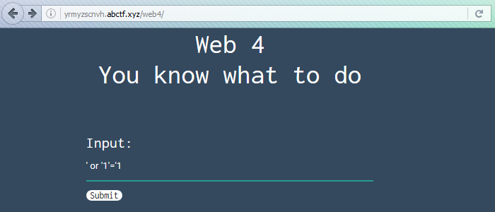

_[<<< Return to ABCTF 2016 tasks and writeups](/2016-abctf)_
# Get 'Em All (Web Exploitation, 80 points)

>I think one of the users data fields holds a flag. If only you could find the username. [Link](http://yrmyzscnvh.abctf.xyz/web4/)

Like the other Web challenges, we are given a link to a website,
which only contains a password field and a "submit" button.

The challenge's title and the description suggest that it may be a SQL injection.



Let's assume that the SQL statement is: 
```sql
SELECT name, data FROM table WHERE name = '$parameter'
```

which gives us all the details about a given user stored in the database ($parameter is the user-supplied data).

If a malicious user sends ```' OR '1'='1``` as $parameter then the SQL statement becomes:

```sql
SELECT name, data FROM table WHERE name = '' OR '1'='1'
```

which is always true and shows all the database records.


