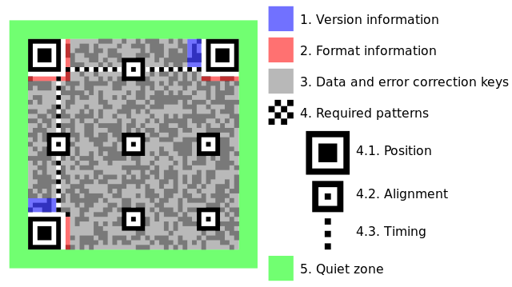

_[<<< Return to ABCTF 2016 tasks and writeups](/2016-abctf)_
# Yummi (Cryptography, 60 points)

>Well [this image](baconian.bmp) means something and we need you to figure it out!

Il s'agit de l'une de mes épreuves préférées de ce Capture The Flag.

Nous disposons d'une image 9x10 au format bitmap, "baconian.bmp", ainsi que d'un indice, "Water -> Fish, Mud -> ???".

Ce dernier ne m'inspire absolument pas, et le nom du fichier ne m'évoque que 
[le chiffre de Francis Bacon](http://www.apprendre-en-ligne.net/crypto/stegano/bilitere.html),
appelé alphabet bilitère. Mais étant donné que le fichier à étudier est une image bitmap de 9x10 pixels noirs
et blancs, cela me semble être une fausse piste.

Pour la suite du write-up, voici une représentation de l'image, avec pour notation : B pour pixel blanc, N pour pixel noir.

```
NNNNNNNNN
NNNBNNNBN
NNBBBNNBN
NBNBNNBNN
NNBNNBNBN
NBNBBNNNN
NNBNNNBBB
NNNBNNBNB
NBBNBNBNN
BBBBNNNNB
```

Essayons de trouver de quoi il s'agit.

## Est-ce un véritable fichier image, et rien d'autre ?

Oui.

```console
root@blinils:~/ABCTF# file baconian.bmp
baconian.bmp: PC bitmap, Windows 3.x format, 9 x -10 x 24

root@blinils:~/ABCTF# hachoir-subfile baconian.bmp
[+] Start search on 334 bytes (334 bytes)
[+] File at 0 size=334 (334 bytes): Microsoft Bitmap version 3
[+] End of search -- offset=334 (334 bytes)

root@blinils:~/ABCTF# binwalk baconian.bmp
DECIMAL       HEXADECIMAL     DESCRIPTION
--------------------------------------------------------------------------------

```

## Est-ce un mini code QR ?

Non, fausse piste.

Il ne respecte pas les spécifications de la norme
[ISO/CEI 18004](http://www.swisseduc.ch/informatik/theoretische_informatik/qr_codes/docs/qr_standard.pdf) sur les QR codes.
Par exemple, la taille de l'image est trop petite pour qu'il s'agisse d'un code QR
(le plus petit format possible est 21x21 pixels). Après vérifications, il ne s'agit pas non plus
d'un autre type de code-barres en 2D, tels que [Datamatrix](https://fr.wikipedia.org/wiki/Datamatrix),
[Semacode](https://en.wikipedia.org/wiki/Semacode) ou le [code Aztec](https://fr.wikipedia.org/wiki/Code_Aztec).



By Bobmath [CC BY-SA 3.0], via Wikimedia Commons.
 
## Est-ce du code morse ?

Malheureusement non. Après tout, pourquoi pas, il y a bien eu une épreuve de ce genre à la NDH 2015.
Un challenge de stéganographie mémorable (write-up à venir) ! Pour cette épreuve, il n'y a pas de séparateur,
et les quelques essais n'ont rien montré de concluant.

```
N N N N N N N N N N N N B N N N B N N N B B B N N B N N B N B N N B N N N N B N N B N B N
N B N B B N N N N N N B N N N B B B N N N B N N B N B N B B N B N B N N B B B B N N N N B
```

Si l'on remplace les pixels noirs par des impulsions courtes (un point) 
et les blancs par une impulsion longue (un trait)...

```
. . . . . . . . . . . . _ . . . _ . . . _ _ _ . . _ . . _ . _ . . _ . . . . _ . . _ . _ .
. _ . _ _ . . . . . . _ . . . _ _ _ . . . _ . . _ . _ . _ _ . _ . _ . . _ _ _ _ . . . . _
```

Et si les espacements entre chaque mot sont à la discrétion des participants, cela peut donner par exemple ceci...

```
. . . (S) . . . .  (H) . (E) . . . (S) . _ (A) . . .  (S) _ . (N) . . _ (U) _ _ . (G)
_ (T) . (E) . (E) _ . (N) _ . . (D) _ (U) . . . (S) . _ . (K) . _ (A) . _ . (R) ._ (A) . _ _ (W)
. . . . (H) . . (I) _ . . (D) . (E) _ _ _ (O) . . (I) . _ . . (L) _ . _ (K) . _ _ (W) ._ (A) ._. (K) . (E)
_ _ _ (O) _ ... (B) . (E) _ (T)
```

Soit un message codé en anglais, qui suit : _she's a snug teen dusk a raw hide oil 'k wake or bet_

On raconte qu'à ce jour, les équipes de cryptographie de la NSA se cassent encore les dents sur ce message !

Ce ne doit pas être la solution, poursuivons...

 
## Est-ce du code binaire ?

Non plus.

Idem, même en remplaçant les pixels blancs par 0 et les noirs par 1, et inversement, ce n'est pas probant.

```
N N N N N N N N N N N N B N N N B N N N B B B N N B N N B N B N N B N N N N B N N B N B N
N B N B B N N N N N N B N N N B B B N N N B N N B N B N B B N B N B N N B B B B N N N N B
```

```
0 0 0 0 0 0 0 0 0 0 0 0 1 0 0 0 1 0 0 0 1 1 1 0 0 1 0 0 1 0 1 0 0 1 0 0 0 0 1 0 0 1 0 1 0
0 1 0 1 1 0 0 0 0 0 0 1 0 0 0 1 1 1 0 0 0 1 0 0 1 0 1 0 1 1 0 1 0 1 0 0 1 1 1 1 0 0 0 0 1
```
 
```
1 1 1 1 1 1 1 1 1 1 1 1 0 1 1 1 0 1 1 1 0 0 0 1 1 0 1 1 0 1 0 1 1 0 1 1 1 1 0 1 1 0 1 0 1
1 0 1 0 0 1 1 1 1 1 1 0 1 1 1 0 0 0 1 1 1 0 1 1 0 1 0 1 0 0 1 0 1 0 1 1 0 0 0 0 1 1 1 1 0
```

La transformation binaire - ASCII ou binaire - hexadécimal ne donne rien.

 
## Est-ce du code braille obtenu à partir du code binaire ?

Il ne faut pas exagérer, quand même.

En braille, un caractère est représenté [dans une matrice de six points](https://fr.wikipedia.org/wiki/Braille)
sur deux colonnes, or il y a 90 caractères dans le code secret. Le but sera donc ici d'agencer le code binaire
ci-dessus sur trois lignes, en remplaçant les 1 par un point et les 0 par un espace. Oui, c'est tordu.

```
0 0    0 0    0 0    0 0    0 0    0 0    1 0    0 0    1 0    0 0    1 1    1 0    0 1    0 0    1 0
1 0    0 1    0 0    0 0    1 0    0 1    0 1    0 0    1 0    1 1    0 0    0 0    0 0    1 0    0 0
1 1    1 0    0 0    1 0    0 1    0 1    0 1    1 0    1 0    1 0    0 1    1 1    1 0    0 0    0 1
```

Malheureusement, nous obtenons des signes de ponctuation, et aucune trace de la chaîne de caractères abctf.

De toute façon, il n'y avait pas assez de caractères pour obtenir un flag suffisamment long, mais il fallait essayer.

 
## Est-ce une [variante du jeu d'échecs](https://fr.wikipedia.org/wiki/Variante_du_jeu_d'%C3%A9checs) ou encore un mini-labyrinthe ?

Non et non.

## Faut-il multiplier l'abscisse et l'ordonnée de chaque pixel blanc, et transformer le résultat modulo 25 pour avoir la position de chaque lettre du flag tant convoité ?

Non, non, non, non et non.

La solution m'est finalement apparue quelques jours avant la fin du CTF, au détour d'une conversation sur IRC.
Simplement en expliquant mes recherches à quelqu'un. Aucune aide, aucune indication ne m'a été donnée, pas même un indice.
La [méthode du canard en plastique](https://fr.wikipedia.org/wiki/M%C3%A9thode_du_canard_en_plastique) a
une nouvelle fois fait ses preuves.

C'était effectivement ma première hypothèse qui était la bonne,
à savoir [le chiffre de Francis Bacon](http://www.apprendre-en-ligne.net/crypto/stegano/bilitere.html),
appelé alphabet bilitère.

L'indice "Water -> Fish, Mud -> ???" devait faire penser à un porc,
à un cochon, et faisait écho au titre du fichier de départ, "baconian.bmp" : le bacon, bien sûr.
Le chiffre de Francis Bacon [consiste à remplacer chaque lettre d'un message par
un groupe de cinq lettres](https://en.wikipedia.org/wiki/Bacon's_cipher#Cipher_details),
qui sont A ou B (AABAA par exemple).

```
a  AAAAA       g    AABBA       n  ABBAA       t    BAABA
b  AAAAB       h    AABBB       o  ABBAB       u-v  BAABB
c  AAABA       i-j  ABAAA       p  ABBBA       w    BABAA
d  AAABB       k    ABAAB       q  ABBBB       x    BABAB
e  AABAA       l    ABABA       r  BAAAA       y    BABBA
f  AABAB       m    ABABB       s  BAAAB       z    BABBB
```

L'astuce ici, c'est de comprendre que non seulement les pixels noirs et blancs représentent les lettres A et B,
mais surtout que le flag se lit verticalement ! En effet, l'image bitmap mesure 10 pixels de haut et 9 pixels de large.
Nous obtenons donc, en lisant les pixels verticalement, de gauche à droite (et par transformations successives) :

```
NNNNN NNNNB NNNBN BNNBB NNBNB NBNBB NBBBN BNBNB NNBNN BNNBN NNNNB NNNNN NNNBN NBBBN NBBNB NBNNN NNNNN NBBNB
AAAAA AAAAB AAABA BAABB AABAB ABABB ABBBA BABAB AABAA BAABA AAAAB AAAAA AAABA ABBBA ABBAB ABAAA AAAAA ABBAB
    A     B     C     U     F     M     P     X     E     T     B     A     C     P     O     I     A     O
```
 

Ce qui donne (presque) le flag : abcufmpxetbacpoiao. 
On reconnaît ce qui doit être le début du flag, abctf, et le mot baconian à la fin.
Il y a un décalage d'une lettre à chaque fois, ce qui veut dire que le tableau
de correspondances utilisé ici doit être différent de celui du challenge.

Si à chaque lettre correspond un unique ensemble de cinq lettres A-B, alors le tableau devient :

```
a  AAAAA       g    AABBA       m  ABBAA       s    BAABA       y    BBAAA
b  AAAAB       h    AABBB       n  ABBAB       t    BAABB       z    BBAAB
c  AAABA       i    ABAAA       o  ABBBA       u    BABAA
d  AAABB       j    ABAAB       p  ABBBB       v    BABAB
e  AABAA       k    ABABA       q  BAAAA       w    BABBA
f  AABAB       l    ABABB       r  BAAAB       x    BABBB
```
 
```
NNNNN NNNNB NNNBN BNNBB NNBNB NBNBB NBBBN BNBNB NNBNN BNNBN NNNNB NNNNN NNNBN NBBBN NBBNB NBNNN NNNNN NBBNB
AAAAA AAAAB AAABA BAABB AABAB ABABB ABBBA BABAB AABAA BAABA AAAAB AAAAA AAABA ABBBA ABBAB ABAAA AAAAA ABBAB
    A     B     C     T     F     L     O     V     E     S     B     A     C     O     N     I     A     N
```
 
Solution : abctf{lovesbaconian}

