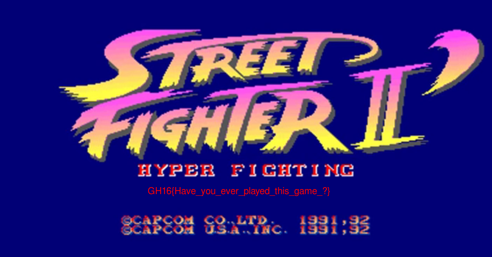

_[<<< Return to GreHack CTF 2016 tasks and writeups](/2016-grehack-ctf)_
# Ryu vs Chun Li (Stego, 50 points)

>Stegano ! round one !

>Flag format : GH16{...}

>sha1sum : 3599af92747cb5952cae507c3fdeb18f1ad6460f

This was the first out of five steganography challenges:
we had to find a flag in [this audio file](sf2.wav).

## Analysis of sf2.wav with Audacity

```console
root@blinils:~/GH16# file sf2.wav
sf2.wav: RIFF (little-endian) data, WAVE audio, Microsoft PCM, 16 bit, mono 44100 Hz
```

Usually, secrets such as flags or passwords are hidden in the frequency spectrogram. Let's look at it with Audacity!


I found nothing at first sight, which made me lose time because it was there!

It just took two right clicks on the vertical bar, in order to modify the audible frequency range.


## Analysis of sf2.wav with Binwalk

This seems to be a real WAV sound. But is there hidden data in it?

```console
root@blinils:~/GH16# binwalk -e sf2.wav

DECIMAL   HEXADECIMAL  DESCRIPTION
-------------------------------------------------------------------------
513180    0x7D49C      MySQL MISAM index file Version 1
8713264   0x84F430     MySQL MISAM index file Version 1
14711420  0xE07A7C     MySQL MISAM compressed data file Version 1
15974444  0xF3C02C     Zip archive data, encrypted at least v2.0 to extract,
                       compressed size: 519562, uncompressed size: 522667, name: sf2.png
16494164  0xFBAE54     End of Zip archive
```

```console
root@blinils:~/GH16# ls _sf2.wav.extracted
F3C02C.zip  sf2.png
```

## Analysis of sf2.zip

Unfortunately, the resulting ZIP file was protected by a password. Having not found the password
in Audacity when I got this ZIP file with binwalk, I tried a lot of things, such as dictionary attacks
or a [known-plaintext attack](https://www.hackthis.co.uk/articles/known-plaintext-attack-cracking-zip-files)
with a googled Street Fighter picture which would fit.

With the password, it was really much easier!

```console
root@blinils:~/GH16# echo "<<< %s(un='%s') = %u" > pass.txt
```

```console
root@blinils:~/GH16# unzip -P "$(< pass.txt)"  F3C02C.zip
Archive:  F3C02C.zip
  inflating: sf2.png
```

```console
root@blinils:~/GH16# feh sf2.png
```



