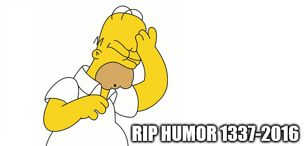

_[<<< Return to GreHack CTF 2016 tasks and writeups](/2016-grehack-ctf)_
# Sam Sepiol's pizzas (Crypto, 100 points)

> How much do you love pizza?

> Remarks: "there are some guessing..."

I guess I'm fond of pizza. Especially the Margherita.. yeah the cheesy one... maybe.. with ham in it.. I guess...

100 points. Easy one.



This challenge's goal was to find a flag in a picture, except that it is not a steganography task.
Indeed, "Sam Sepiol's pizzas" is a crypto one! On the dinner menu, there was the
[Colosseum](https://en.wikipedia.org/wiki/Colosseum) in the background, with a big reversed Italian
flag covering up it, but also the GreHack logo standing in the bottom center of the menu, below nine pizza recipes.


There are the prices and ~~guessings~~ dressings:

```
1. Napolitana (14€) - tomato, cheese, anchovies, olives, oregano
2. Chicken (15€) - tomato, chicken, mushrooms, olives
3. Capricciosa (13€) - tomato, cheese, ham, mushrooms, olives
4. Pepperoni (15€) - tomato, cheese, hot salami, pepperoni, olives
5. Margherita (12€) - tomato, cheese, olivez, oregano
6. Marinara (15€) - tomato, cheese, mixed seafood, herbs & garlic
7. Special (16€) - tomato, cheese, ham, mUshrooms, hot salami, capsicum, onion, olives
8. Vegetariana (14€) - tomato, cheese, mushrooms, onion, capsicum
9. Vegan (14€) - tomato, mushrooms, onion, capsicum, herbs & garlic
```

Still, it seems that someone wrote strange letters and numbers on the menu, with a blue marker pen.

```
unirlb hz nq rl bh ep ub vp r?

1.11 - 7.24 - 1.0 - 6.0 - Ø123

6.29 - 9.5 - 9.26 - 5.26 - Ø48

1.0 - 2.3 - 5.0 - 2.22 - 9.15 - 5.2 - 1.7

8.20 - 1.5 - Ø125
```

First of all, for the letters, we quickly found that it was a question encrypted
with a [substitution cipher](http://practicalcryptography.com/ciphers/simple-substitution-cipher/),
actually [ROT13](https://en.wikipedia.org/wiki/ROT13).

```
unirlb hz nq rl bh ep ub vp r?
vojsmc ia or sm ci fq vc wq s?
...... .. .. .. .. .. .. .. ..
haveyo um ad ey ou rc ho ic e?
```

Then, for the numbers, a few things came to mind:
+ Some numbers are greater than 26 (letters in the alphabet), Ø123 / 29 / Ø48 / Ø125
+ 123 and 125 are the [decimal representations](https://en.wikipedia.org/wiki/ASCII)
of [braces](https://en.wikipedia.org/wiki/Bracket) { } in ASCII, so 48 may stand for 0 (zero).
+ The flag format is GH16{...} so...

```
1.11 - 7.24 - 1.0 - 6.0 - Ø123 - 6.29 - 9.5 - 9.26 - 5.26
   G      H     1     6      {

Ø48 - 1.0 - 2.3 - 5.0 - 2.22 - 9.15 - 5.2 - 1.7 - 8.20 - 1.5 - Ø125
  0                                                               }
```

+ Let's assume that the X.0 duet (1.0 5.0 or 6.0) stands for X.
+ Each first number is between 1 and 9, and there are nine pizza recipes.
+ Each number after the dot is neither a decimal representation of ASCII characters nor positions down the alphabet.
+ So maybe it is a variant of the [Book cipher](https://en.wikipedia.org/wiki/Book_cipher): the Menu cipher,
in which the first number stands for the menu, whereas the second one indicates the letter's position. For instance,
the letter 7.24 would be in fact the seventh menu's twenty-fourth letter: U in "mUshrooms" which by chance is in capital...
hint or mistake?

```
1.11 - 7.24 - 1.0 - 6.0 - Ø123 - 6.29 - 9.5 - 9.26 - 5.26
   t      u     1     6      {      f     n      c      v

Ø48 - 1.0 - 2.3 - 5.0 - 2.22 - 9.15 - 5.2 - 1.7 - 8.20 - 1.5 - Ø125
  0     1     i     5      u      h     a     t      e     l      }
```

tu16{fncv01i5uhatel} is quite a weird ~~pizza name~~ flag but we retrieved the good format GH16{...} with ROT13.

P.S. big up to the organization team, and thanks for the pizzas which strengthened us during the CTF! :)
