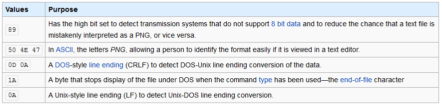

_[<<< Return to IceCTF 2016 tasks and writeups](/CTF-Jeopardy/2016-icectf)_
# Corrupt Transmission (Forensics, 50 points)

>We intercepted
[this image](https://play.icec.tf/problem-static/corrupt_92cee405924ad39fb513e3ef910699b79bb6d45cc5046c051eb9aab3546e22c3.png),
but it must have gotten corrupted during the transmission. Can you try and fix it?

We are given a link to a file which is supposed to be an image and which name is "[corrupted.png](corrupted.png)".

If it is really a PNG file, it really seems corrupted because it doesn't let us upload and display it on this "post".

First of all, and as usual, let's see what kind of stegano we have to deal with here.

```console
root@blinils:~/ICECTF# file corrupted.png
corrupted.png: data

root@blinils:~/ICECTF# head -n2 corrupted.png
�PNG
IHDR �  �� � bKGD�������    pHYs
                                    
                                       �� tIME�   ��et IDATx�T�َlYz��[� b��LU]
                                       ]�ͦ� M ��aZ�u�'1�+��Ed?��a 2
                        � T� H�`�k��3d�̌�aOk���>�$ �ر� ��?l���U)��s��D)QQ_Hr���1Ҡ��\
                        �#�f�g��h-�%�� Y � � 9G�� k� RH�(
                                     R�(�0B��$�H
                                                �  ��)!�DJI)�R
```

Assuming that is a real PNG file — due to the presence
of [keywords such as IHDR, IDAT or tIME](http://www.libpng.org/pub/png/spec/1.2/PNG-Chunks.html) — something went wrong.

While [pngcheck](http://www.libpng.org/pub/png/apps/pngcheck.html) verifies the integrity of PNG files,
[exiftool](https://exiftool.org/) checks the meta information: we've already used
it for the MoonWalk challenge. But once more, no further information is given, except that it is
CORRUPTED ERRORS DETECTED FILE FORMAT ERROR FBI GET ON THE GROUND!

```console
root@blinils:~/ICECTF# pngcheck -f -v corrupted.png
File: corrupted.png (469363 bytes)
  File is CORRUPTED.  It seems to have suffered EOL conversion.
  It was probably transmitted in text mode.
ERRORS DETECTED in corrupted.png


root@blinils:~/ICECTF# exiftool corrupted.png
ExifTool Version Number         : 10.23
File Name                       : corrupted.png
Directory                       : .
File Size                       : 458 kB
File Modification Date/Time     : 2016:08:18 18:18:18+02:00
File Access Date/Time           : 2016:08:18 18:18:18+02:00
File Inode Change Date/Time     : 2016:08:18 18:18:18+02:00
File Permissions                : rwxrwx---
Error                           : File format error
```

The file command does not recognize the file as a picture,
maybe because [the PNG file signature](http://www.libpng.org/pub/png/spec/1.2/PNG-Rationale.html#R.PNG-file-signature)
has been distorted.

```
The first eight bytes of a PNG file always contain the following values:

   (decimal)              137  80  78  71  13  10  26  10
   
   (hexadecimal)           89  50  4e  47  0d  0a  1a  0a
   
   (ASCII C notation)    \211   P   N   G  \r  \n \032 \n
```

Let's check this with the xxd command, which creates an hex dump of a given file or standard input.

```console
root@blinils:~/ICECTF# xxd -l8 corrupted.png

00000000: 9050 4e47 0e1a 0a1b                      .PNG....
```

That's it! The first eight bytes of the file do not meet the PNG specifications, hence the file is corrupted.

Wikipedia brings a lot of technical details too, about the PNG signature...



[Contenu soumis à la licence CC-BY-SA](https://creativecommons.org/licenses/by-sa/3.0/deed.fr). Source : Article [Portable Network Graphics](https://en.wikipedia.org/wiki/Portable_Network_Graphics#File_header) de [Wikipédia en anglais](https://en.wikipedia.org) - [auteurs](https://fr.wikipedia.org/w/index.php?title=Portable_Network_Graphics&action=history)

What we have to do is modify the first eight bytes of the PNG file.

It's easier to make it with an hex editor, but really much funnier to do it with a line command!

```console
# xxd -l8 corrupted.png
00000000: 9050 4e47 0e1a 0a1b                      .PNG....

# printf '\x89\x50\x4e\x47\x0d\x0a\x1a\x0a' | dd of=corrupted.png bs=1 seek=0 conv=notrunc
8+0 records in
8+0 records out
8 bytes copied, 0,000368607 s, 21,7 kB/s

# xxd -l8 corrupted.png
00000000: 8950 4e47 0d0a 1a0a                      .PNG....
```

The "new" file is repaired......... almost repaired!

```console
root@blinils:~/ICECTF# pngcheck corrupted.png
corrupted.png  additional data after IEND chunk
ERROR: corrupted.png
```

But who cares? We can display the PNG and retrieve the flag!


