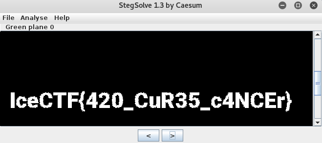

_[<<< Return to IceCTF 2016 tasks and writeups](/CTF-Jeopardy/2016-icectf)_
# Vape Nation (Stego, 50 points)

>Go Green! [vape_nation.png](https://play.icec.tf/problem-static/vape_nation_7d550b3069428e39775f31e7299cd354c721459043cf1a077bb388f4f531d459.png)

We are given a link to a file which name is "vape_nation.png".

```console
root@blinils:~/ICECTF# file vape_nation.png
vape_nation.png: PNG image data, 640 x 640, 8-bit/color RGB, non-interlaced
```

The hint says "Go green!", so we will use a fabulous tool for stegano challenges : Stegsolve.jar.

It will perform [analysis of the file structure as well as allow each bit plane](http://www.caesum.com/handbook/stego.htm) to be viewed on its own.

So let's go on the green plane!



_TIL that "420, 4:20, or 4/20 is a code-term that refers to the consumption of cannabis."_

[Contenu soumis à la licence CC-BY-SA](https://creativecommons.org/licenses/by-sa/3.0/deed.fr).
Source : Article [420 (cannabis)](https://en.wikipedia.org/wiki/420_%28cannabis_culture%29)
de [Wikipédia en anglais](https://en.wikipedia.org) 
([auteurs](https://en.wikipedia.org/w/index.php?title=420_%28cannabis_culture%29&action=history))
