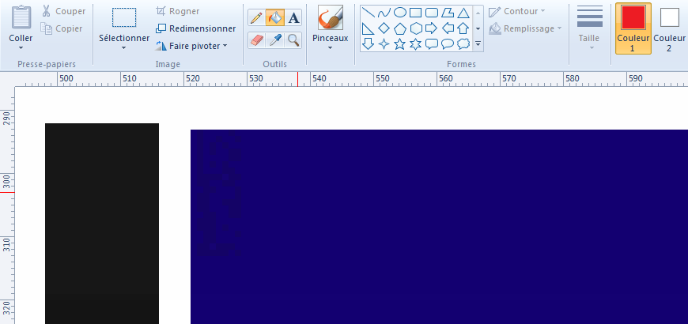

_[<<< Return to BitsCTF 2017 tasks and writeups](/CTF-Jeopardy/2017-bitsctf)_
# flagception (Forensics, 30 points)

>Yo dawg, I heard you like flags

>So I put a flag in your flag

>Flag format: BITSCTF{a1phanum3r1c_w0rds}

Unlike the other challenges, there is no other clue: neither a website nor a file to deal with.

So we have to find a flag.. in a flag... wait... does the CTF platform have a flag in their logo?


Pretty nice [ambigram](https://en.wikipedia.org/wiki/Ambigram), by the way. If we zoom in the logo, in order to look more closely to the flag, we can see some darker blue pixels in its top-left corner. It is more obvious if we change the colours. The BITSCTF{} flag may be concealed in these pixels.



If a dark pixel stands for 1, and a light one for 0, we have:

```
01000010 B
01001001 I
01010100 T
01010011 S
01000011 C
01010100 T
01000110 F
01111011 {
01100110 f
00110001 1
01100001 a
01100111 g
01100011 c
00110011 3
01110000 p
01110100 t
00110001 1
00110000 0
01101110 n
01111101 }
```
