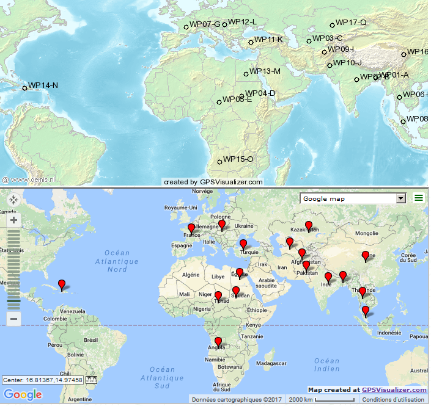

_[<<< Return to BitsCTF 2017 tasks and writeups](/2017-bitsctf)_
# Labour (Misc, 20 points)

>Follow your heart, for it leads you straight to the answer.

This challenge consists in [a list of GPS coordinates](DoSomethingWithThis), which is named "DoSomethingWithThis".

```console
root@blinils:~/bitsctf-2017# file DoSomethingWithThis
DoSomethingWithThis: XML 1.0 document, ASCII text, with CRLF, LF line terminators

root@blinils:~/bitsctf-2017# head -n4 DoSomethingWithThis
<?xml version="1.0" encoding="UTF-8" standalone="no" ?>
<gpx version="1.1" creator="BITSCTF" xmlns:xsi="http://www.w3.org/2001/XMLSchema-instance" xmlns="http://www.topografix.com/GPX/1/1" xsi:schemaLocation="http://www.topografix.com/GPX/1/1 http://www.topografix.com/GPX/1/1/gpx.xsd">

<!--Use appropriate brackets and underscores to separate words if you succeed-->
```

It is a [GPX file](https://en.wikipedia.org/wiki/GPS_Exchange_Format) which can be handled online, [with a few tools](https://www.qwant.com/?q=gpx) online such as GPS Visualizer or VisuGPX.



Picking the first letter of each country gives the following string:

```
WP01-A - (B)angladesh
WP02-B - (I)ndia
WP03-C - (T)urkmenistan
WP04-D - (S)udan
WP05-E - (C)had
WP06-F - (T)hailand
WP07-G - (F)rance
WP08-H - (M)alaysia
WP09-I - (A)fghanistan
WP10-J - (P)akistan
WP11-K - (T)urkey
WP12-L - (H)ungary
WP13-M - (E)gypt
WP14-N - (H)aiti
WP15-O - (A)ngola
WP16-P - (C)hina
WP17-Q - (K)azakhstan
```

By the way, in French, WP05-E refers to "Tchad", but BITSTTF doesn't make any sense.

So the flag, after using appropriate brackets and underscores, is: BITSCTF{MAP_THE_HACK}
