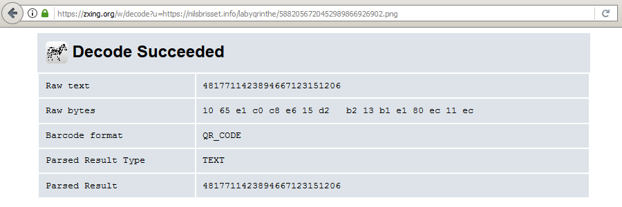

_[<<< Return to Dev Test Days 2017 tasks and writeups](/CTF-Jeopardy/2017-devtestdays)_
# Labyqrinthe (Prog, 400 points)

>Parviendrez-vous à sortir de ce tunnel ?

>https://nilsbrisset.info/labyqrinthe/5882056720452989866926902.png

L'URL fournie renvoie un [code QR](https://fr.wikipedia.org/wiki/Code_QR) qui, une fois décodé avec un outil en ligne [par exemple](https://zxing.org/w/decode?u=https://nilsbrisset.info/labyqrinthe/5882056720452989866926902.png), donne le résultat suivant : 4817711423894667123151206. Il s'agit d'une suite de chiffres similaire à celle du nom du premier fichier PNG, que l'on suppose être le code QR suivant.



L'analyse du code QR [4817711423894667123151206.png](https://nilsbrisset.info/labyqrinthe/4817711423894667123151206.png) renvoie 3146132124114095167976056, et ainsi de suite. Une résolution manuelle de l'épreuve semble particulièrement fastidieuse ; voici donc une proposition de résolution de cette épreuve à l'aide du [script Python](solution_labyqrinthe.py) suivant.

```python
import urllib, qrtools

IMG = "temp.png"
URL = "https://nilsbrisset.info/labyqrinthe/"
EXT = ".png"

qr = qrtools.QR()
ID = "5882056720452989866926902"

for i in range(0, 200) :
	print "#", i, "[+] Retrieving:", URL+ID+EXT
	urllib.urlretrieve(URL+ID+EXT, IMG)
	qr.decode(IMG)
	print "#", i, "[+] Decoding:", qr.data
	ID = qr.data
```

Après quelques secondes et 150 analyses de codes QR, on obtient finalement le flag tant convoité.

```console
root@kali:~/labyqrinthe-400# python solution_labyqrinthe.py
# 0 [+] Retrieving: https://nilsbrisset.info/labyqrinthe/5882056720452989866926902.png
# 0 [+] Decoding: 4817711423894667123151206
# 1 [+] Retrieving: https://nilsbrisset.info/labyqrinthe/4817711423894667123151206.png
# 1 [+] Decoding: 3146132124114095167976056
# 2 [+] Retrieving: https://nilsbrisset.info/labyqrinthe/3146132124114095167976056.png
# 2 [+] Decoding: 4070511236107946241556758
# 3 [+] Retrieving: https://nilsbrisset.info/labyqrinthe/4070511236107946241556758.png
# 3 [+] Decoding: 6602761458266045926034459
# 4 [+] Retrieving: https://nilsbrisset.info/labyqrinthe/6602761458266045926034459.png
# 4 [+] Decoding: 1243333551229960365472873
# 5 [+] Retrieving: https://nilsbrisset.info/labyqrinthe/1243333551229960365472873.png
# 5 [+] Decoding: 3793971296289056910829217
# 6 [+] Retrieving: https://nilsbrisset.info/labyqrinthe/3793971296289056910829217.png
# 6 [+] Decoding: 7878143446057280022093793
[...]
# 146 [+] Retrieving: https://nilsbrisset.info/labyqrinthe/6469971573610321490482243.png
# 146 [+] Decoding: 0253372018476310790602443
# 147 [+] Retrieving: https://nilsbrisset.info/labyqrinthe/0253372018476310790602443.png
# 147 [+] Decoding: 1874148238503249026713331
# 148 [+] Retrieving: https://nilsbrisset.info/labyqrinthe/1874148238503249026713331.png
# 148 [+] Decoding: 9167256182633450620879561
# 149 [+] Retrieving: https://nilsbrisset.info/labyqrinthe/9167256182633450620879561.png
# 149 [+] Decoding: DevTestDays{congratz_for_qrlooping!}
# 150 [+] Retrieving: https://nilsbrisset.info/labyqrinthe/DevTestDays{congratz_for_qrlooping!}.png
Traceback (most recent call last):
  File "solution_labyqrinthe.py", line 13, in <module>
    qr.decode(IMG)
  File "/usr/lib/python2.7/dist-packages/qrtools.py", line 197, in decode
    pil = Image.open(self.filename).convert('L')
  File "/usr/lib/python2.7/dist-packages/PIL/Image.py", line 2572, in open
    % (filename if filename else fp))
IOError: cannot identify image file 'temp.png'
[1]+  Done                    gedit README.md
```

Et en bonus, voici le [script Bash](makingof_labyqrinthe.sh) qui a permis de générer la suite de codes QR !
