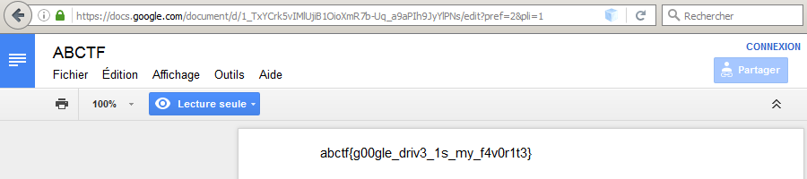

_[<<< Return to ABCTF 2016 tasks and writeups](/abctf-2016)_
# Drive Home (Reconaissance, 50 points)

>We found this link scribbled on a piece of paper:

>document/1_TxYCrk5vIMlUjiB1OioXmR7b-Uq_a9aPIh9JyYlPNs/edit?usp=sharing.

>It is broken but we need you to fix it!

Il s'agit vraisemblablement d'une URL tronquée,
et une simple recherche avec les mots-clés "edit?usp=sharing" nous donne la solution.
Un lien vers Google Drive se présente sous la forme suivante :
_(https://)docs.google.com/document/d/_ suivi d'une suite de caractères aléatoires — correspondant à l'id du document — et,
facultativement, de _/edit?usp=sharing_.

Nous pouvons alors reconstituer le lien donné dans l'énoncé :

https://docs.google.com/document/d/1_TxYCrk5vIMlUjiB1OioXmR7b-Uq_a9aPIh9JyYlPNs/edit?usp=sharing

Solution : abctf{g00gle_driv3_1s_my_f4v0r1t3}

PS : épreuve résolue en écoutant
[la magnifique chanson éponyme](https://www.youtube.com/watch?v=ycYewhiaVBk&list=PLZoGSO9LdNPXRgH95hNDkIij1zzmu6Dez)
de Steven Wilson.

