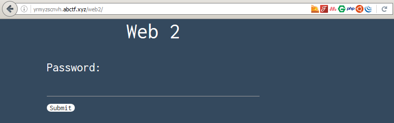

_[<<< Return to ABCTF 2016 tasks and writeups](/abctf-2016)_
# The Flash (Web Exploitation, 35 points)

>Can you somehow get the flag from this website? [Link](http://yrmyzscnvh.abctf.xyz/web2/)

Like the [Elemental](/abctf-2016/elemental-10) challenge, we are given
a link to a website, which only contains a password field and a "submit" button.



Within the source code of the page, the expected password can be seen as a comment. How awful!

```html
<div class="row">
<div class="col l4 push-l4" id="response-wrong">
</div>
</div>

</body>

<!-- c3RvcHRoYXRqcw== -->

<script type="text/javascript" src="fade.js"></script>

</html>
```

But this time, the password has been encoded
in [base64](https://tools.ietf.org/html/rfc4648), which can easily be decoded.

```console
root@blinils:~/abctf-2016# echo "c3RvcHRoYXRqcw==" | base64 -d
stopthatjs
```

With this password, the flag appears but quickly disappears (because of fade.js).

Nevertheless, it can be found in the source code (Ctrl+U in Firefox).

```html
<div class="row">
<div class="col l4 push-l4" id="response">
ABCTF{no(d3)_js_is_s3cur3_dasjkhadbkjfbjfdjbfsdajfasdl}
</div>
</div>
```

