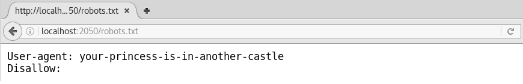

_[<<< Return to GreHack CTF 2016 tasks and writeups](https://github.com/nbrisset/CTF/tree/master/grehack-ctf-2016)_
# robots.txt is not the only one


> Get information

This was the first out of four Web challenges: we had to find a flag on a website.

Because this challenge is now offline, I will use the
[Docker image](https://github.com/GreHack/CTF-challs/tree/master/2016/Web/050%20-%20robots.txt%20is%20not%20the%20only%20one)
kindly made available by the organizers.


As the title says, the file robots.txt is a wrong track. Let's find somewhere else.



All we ~~goat~~ got is a goat and two numbers: 5785 & 7033. Looking for these numbers on Google
gives us answers: [an article written by Stéphane Bortzmeyer](http://www.bortzmeyer.org/7033.html)
about the RFC 7033: WebFinger, and [the RFC itself](https://tools.ietf.org/html/rfc7033) published
in the Internet Engineering Task Force (IETF) website.

Quoting the RFC 7033:

```
"This specification defines the WebFinger protocol, which can be used to
discover information about people or other entities on the Internet using
standard HTTP methods. WebFinger discovers information for a URI that might
not be usable as a locator otherwise, such as account or email URIs."
```

Quoting Stéphane Bortzmeyer:

```
"La requête WebFinger va utiliser un chemin qui utilise le préfixe .well-known
du RFC 5785 et le suffixe webfinger (désormais enregistré dans les noms bien connus)."
```

Quoting the CTF team: ["Cheers!"](https://www.chartreuse.fr/)

```
root@blinils:~/GH16# curl "http://localhost:2050/.well-known/webfinger"
Some endpoints can be discovered through Well-Known URIs.
https://www.iana.org/assignments/well-known-uris/well-known-uris.xhtml

GH16{keep_data_hidden}
```
