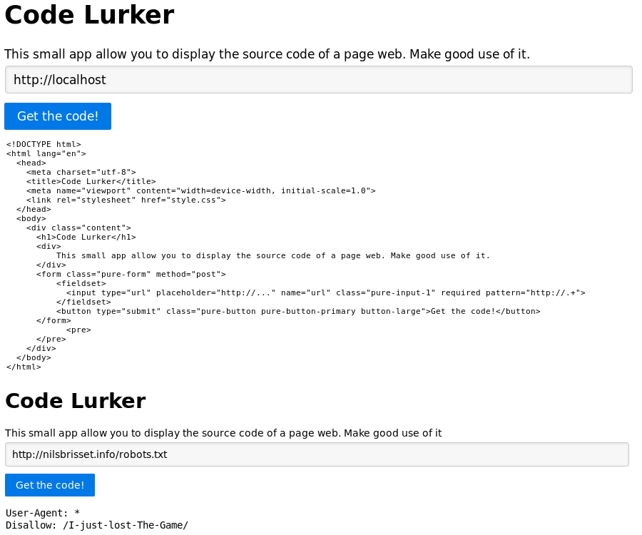
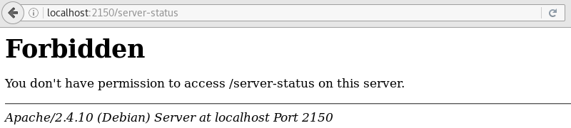
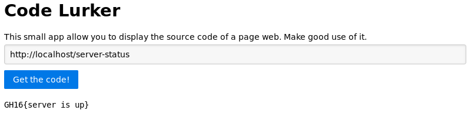

_[<<< Return to GreHack CTF 2016 tasks and writeups](/grehack-ctf-2016)_
# Server status (Web, 150 points)

> Sometimes data that should be kept private can become public

This was the second out of four Web challenges: we had to find a flag on a website.

Because this challenge — [as the first one](/grehack-ctf-2016/robots.txt-50) — is now offline, I will use the
[Docker image](https://github.com/GreHack/CTF-challs/tree/master/2016/Web/150%20-%20Server%20status) available on Github.

This small app seems to display the source code of a page web. Let's try it!



The challenge's name is "Server status", so maybe we have to call
[the Apache module mod_status](https://httpd.apache.org/docs/current/en/mod/mod_status.html) (server-status).

Quoting:

```
"The Status module allows a server administrator to find out how well their server is
performing [...] by using a Web browser to access the page http://your.server.name/server-status"
```

It doesn't work this way, probably because of
some [.htaccess](https://httpd.apache.org/docs/2.2/en/howto/htaccess.html) protection.



But if we make good use of Code Lurker, it works!



